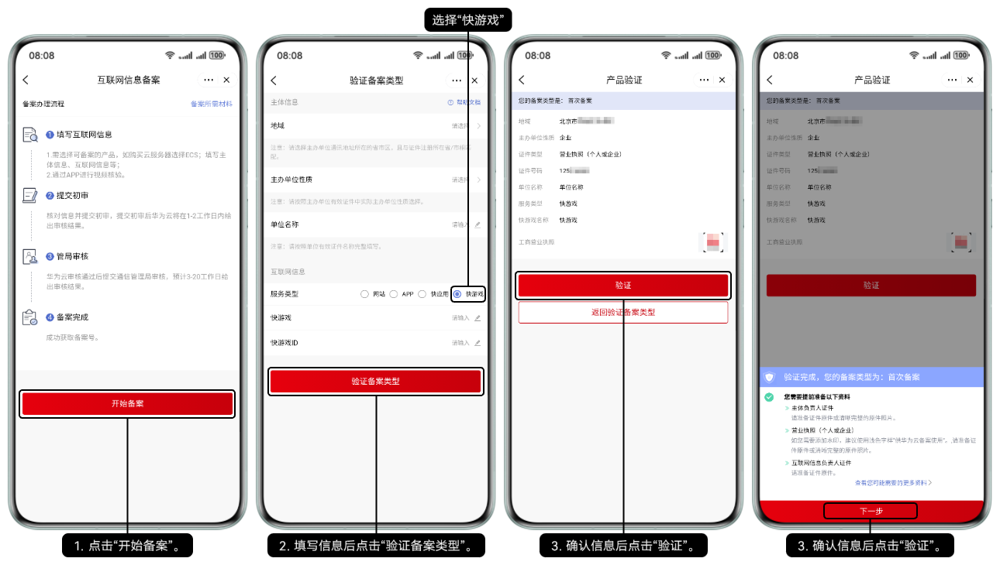
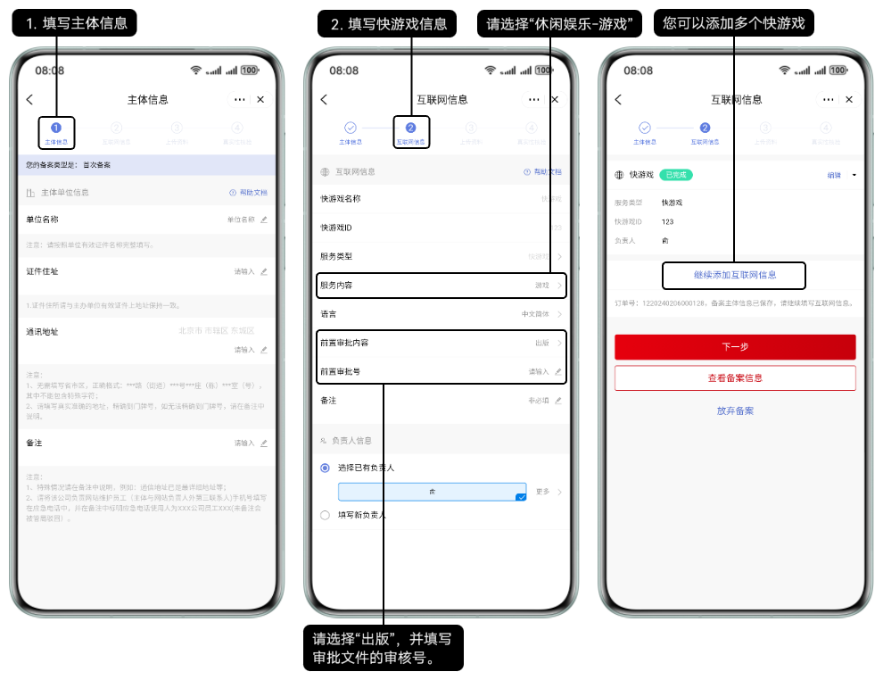
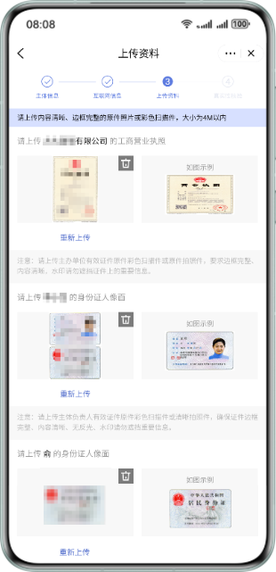

## 前提条件

已前往应用市场下载最新版本的华为云App。

## 操作步骤

1. 打开华为云App，搜索并点击“ICP备案”。

   
2. 填写主办单位和快游戏的基本信息。

   
3. 填写主办单位和快游戏的详细信息。

   
4. 根据提示上传提前准备好的附件材料。

   
5. 互联网信息负责人人脸核验通过后提交初审。

   
6. 华为工作人员将在3~5个工作日内进行审核，将以短信或邮件形式通知审核结果，请耐心等待，且保持手机通畅。若需要修改核准（备案）信息，将以邮件形式通知。
7. 在华为平台通过人工初审后，需前往工信部网站核验短信验证码，详情请参见[工信部核验核验（备案）短信](/docs/dev/game-dev/quickgame-filing-sms-verify-0000001818117885)。
