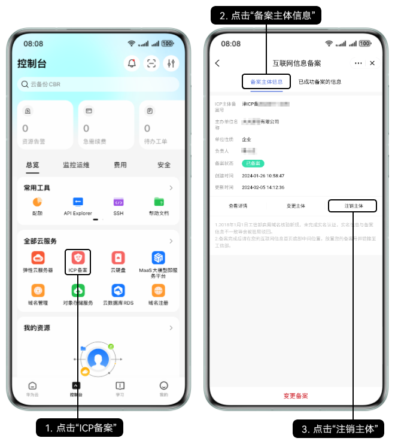
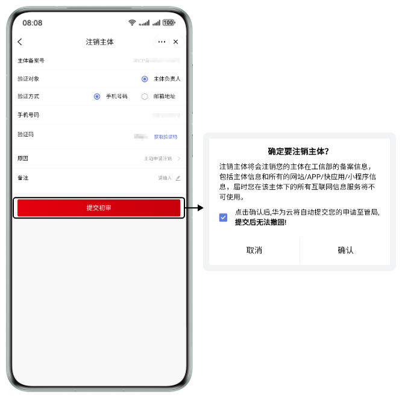
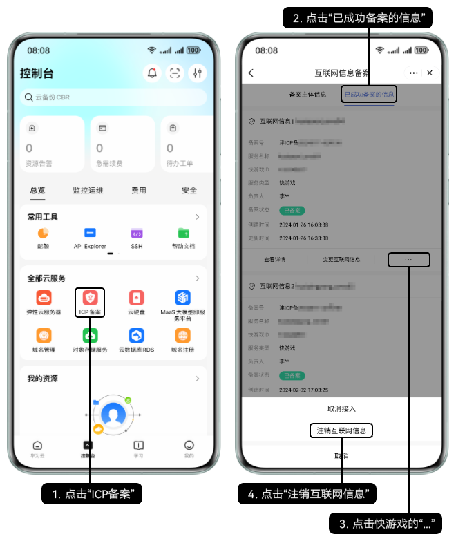
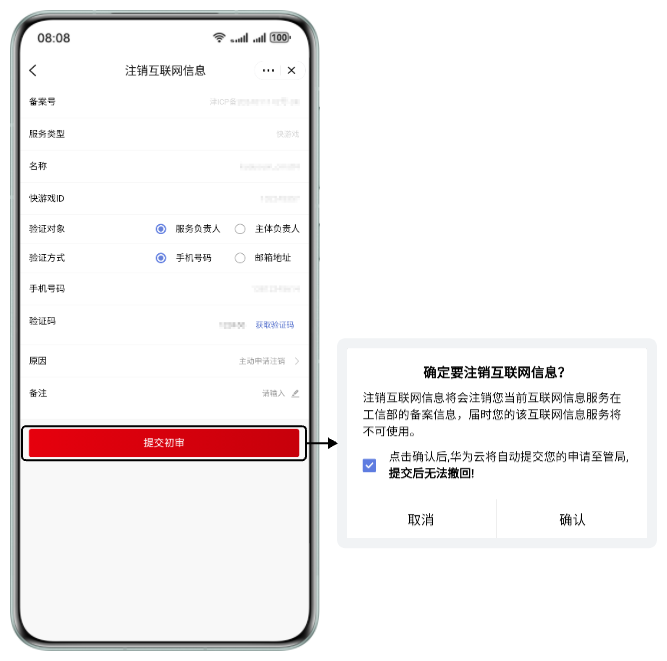

## 前提条件

已前往应用市场下载最新版本的华为云App。

## 注销主体

1. 在华为云App的“ICP备案”界面注销主体。

   
2. 验证负责人的手机/邮箱，并选择注销原因后点击“提交初审”，在弹出的“确定要注销主体”窗口点击“确认”。

   
3. 提交申请后，华为平台将自动审核您的申请。您需前往工信部网站核验短信验证码，详情请参见[工信部核验核准（备案）短信](/docs/dev/game-dev/quickgame-filing-sms-verify-0000001818117885)。

## 注销互联网信息

1. 在华为云App的“ICP备案”界面注销快游戏。

   
2. 验证负责人的手机/邮箱，选择注销原因后点击“提交初审”，在弹出的“确定要注销互联网信息”窗口点击“确认”。

   
3. 提交申请后，华为平台将自动审核您的申请。您需前往工信部网站核验短信验证码，详情请参见[工信部核验核准（备案）短信](/docs/dev/game-dev/quickgame-filing-sms-verify-0000001818117885)。
