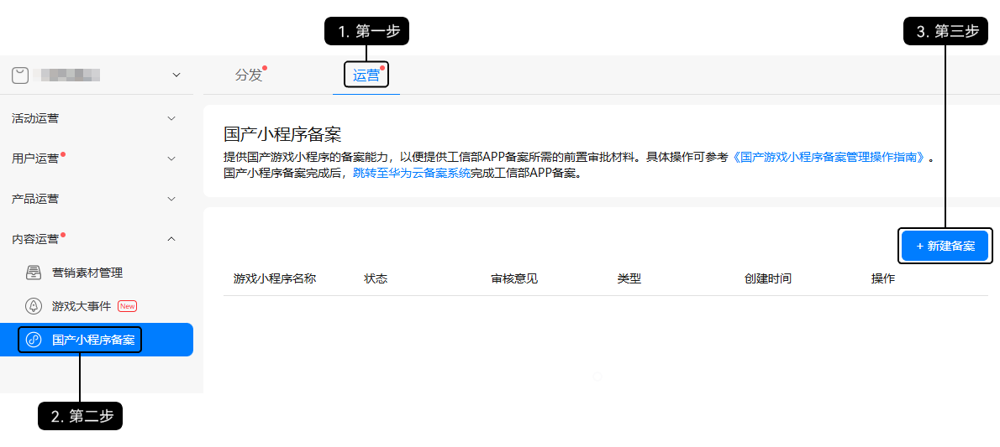
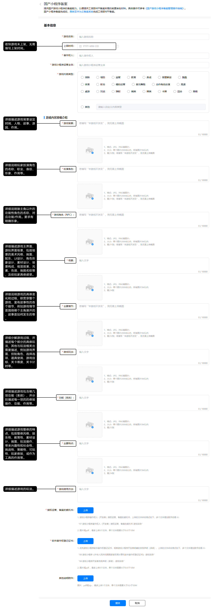
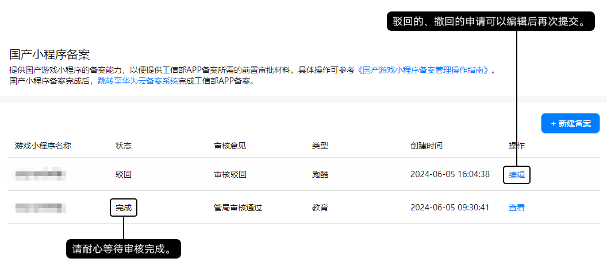

国产游戏小程序是指纯广告变现快游戏（IAA），若这类快游戏未注册在江苏省，且在履行核准（备案）手续前没有拿到国家/省份相关主管部门审核同意的前置审批文件，例如游戏版号、国家/省级新闻出版广电总局关于\*\*\*\*游戏的批复文件、省级新闻出版部门出具的游戏核准（备案）批复文件，需要前往AGC控制台申请前置审批文件。在AGC控制台为国产游戏小程序申请前置审批文件的操作步骤如下。

1. 下载模板文件，并根据实际情况进行填写。

   | 模板文件下载 |
   | --- |
   | [游戏小程序著作权人（开发者）授权运营、核准（备案）委托书.docx](https://alliance-communityfile-drcn.dbankcdn.com/FileServer/getFile/cmtyPub/011/111/111/0000000000011111111.20260323192532.25555323577049376820622639441596%3A20260603111007%3A2800%3AE3714FA02F15669D865E7BEA48834939D5B9C24F276068A2C4805A4BABEF786D.docx?needInitFileName=true) |
   | [游戏小程序开发者著作权自我声明.docx](https://alliance-communityfile-drcn.dbankcdn.com/FileServer/getFile/cmtyPub/011/111/111/0000000000011111111.20260323192532.49929667491734814998847790596456%3A20260603111007%3A2800%3A5B7DA32ECF2801F5D87E1CBFD3B5CEBEECEBC451AF881EC9C8D3F97C3951301A.docx?needInitFileName=true) |
   | [广东省国产游戏小程序核准（备案）表.docx](https://alliance-communityfile-drcn.dbankcdn.com/FileServer/getFile/cmtyPub/011/111/111/0000000000011111111.20260323192532.32016491358030759754832693664458%3A20260603111007%3A2800%3A0605BEF79A79223B47ABBD61228628204D73A90168C283870AAC85C157606028.docx?needInitFileName=true) |
2. 登录[AppGallery Connect](https://developer.huawei.com/consumer/cn/service/josp/agc/index.html)，为快游戏新建核准（备案）。

   
3. 在“国产小程序备案”页面填写信息，完成后点击“提交”。

   
4. 您提交的申请需华为工作人员与管局共同审批，完成审批大概需要20~30个工作日，请耐心等待。

   

   

   仅能有一条正在审批中的申请。
5. 完成审批后，请前往AGC控制台，在快游戏核准（备案）详情页最底部下载管局签署的准予核准（备案）通知书。
