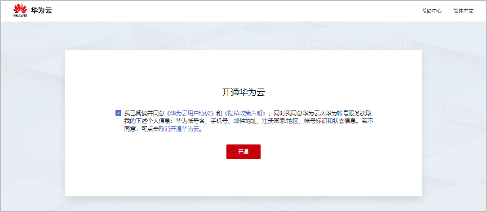

在“华为云核准（备案）系统”或“华为云App”提交快游戏核准（备案）申请前，需要做好核准（备案）准备工作。

## 注册账号与实名认证

若在华为云核准（备案）系统中核准（备案）过网站、APP、快应用，您无需注册新的华为云账号，请继续使用以前的华为云账号核准（备案）快游戏信息。若首次在华为云核准（备案）系统中进行核准（备案），或同时核准（备案）多个主体信息，或转移主体及主体下的互联网信息，您需要注册新的华为云账号并完成实名认证。步骤如下：

1. 注册账号。个人或企业注册华为云账号的操作指导请参见[注册华为云账号并开通华为云服务](https://support.huaweicloud.com/usermanual-account/account_id_001.html)。

   
2. 实名认证。个人或企业实名认证华为云账号的操作指导请参见[实名认证](https://support.huaweicloud.com/usermanual-account/account_auth_00001.html)。

## 获取APP ID

APP ID是快游戏的唯一标识，在AGC控制台创建快游戏后生成。APP ID将在填写互联网信息时使用，您需提前记录下APP ID。获取快游戏APP ID的操作指导请参见[获取APP ID](https://developer.huawei.com/consumer/cn/doc/quickApp-Guides/quickgame-enable-account-kit-0000001159772367#section1148753814717)。

## 办理前置审批文件

审批文件是指快游戏在履行核准（备案）手续前，经国家/省份相关主管部门审核同意的文件，例如游戏版号许可证、游戏核准（备案）批复文件。快游戏核准（备案）在“前置审批内容”必须选择“**出版**”分类。

| 分类 | 前置审批文件种类 | 不同省份的说明 |
| --- | --- | --- |
| 出版 | **有版号**的快游戏以下三选一：   * 网络出版物号核发单。 * 国家/省级新闻出版广电总局关于\*\*\*\*游戏的批复文件。 * 省级新闻出版部门出具的游戏核准（备案）批复文件。 | * **广东**、**河南**、**浙江**的核准（备案）主体同时不具备这三类文件时：   + 若有任一文件的授权，可以提供文件原件及授权书。   + 若任一文件是经过多级授权的，除了提供文件原件、完整链路的授权书，还需额外准备一份《[情况说明](https://alliance-communityfile-drcn.dbankcdn.com/FileServer/getFile/cmtyPub/011/111/111/0000000000011111111.20260323192524.58159487805955071144411936981464%3A20260603111005%3A2800%3A40325C53F48750A4C433DD62594E4130BF55A407557A3E0109E777465F9230BD.docx?needInitFileName=true)》文件，该文件需描述审批文件的完整授权链情况、承诺独家运营该快游戏、承诺授权文件发生变化会及时履行变更/注销核准（备案）手续。 * **天津**的核准（备案）主体同时不具备这三类文件时：   + 若有任一文件的授权，可以提供文件原件及授权书。   + 若无任一文件的授权，无需提供前置审批文件，直接申请快游戏核准（备案）即可，后续获得审批文件后，必须第一时间变更核准（备案）信息。 * **其它省/市**的核准（备案）主体同时不具备这三类文件时，若有任一文件的授权，可提供文件原件及授权书。 |
| **无版号**的快游戏需要准备《广东省国产游戏小程序准予核准（备案）通知书》。  说明：  前往AGC控制台申请通知书的具体步骤请参见[国产游戏小程序核准（备案）准备](https://developer.huawei.com/consumer/cn/doc/games-guides/quickgame-filing-chinese-preparation-0000001979934858)。 | - |

## 准备附件材料

### 证件材料

| 材料名称 | 要求 |
| --- | --- |
| 营业执照或其它证件。 | 电子版文件要求如下：   * 必须扫描/拍摄证件原件。 * 大小：大于100KB，小于4MB。 * 分辨率：不低于1100px\*1500px。 * 格式：png、jpg。 |
| 主体负责人居民身份证正、反面。 | 电子版文件要求如下：   * 必须扫描/拍摄居民身份证的原件。 * 大小：大于100KB，不超过200KB。 * 分辨率：不低于1280px\*720px。 * 格式：png、jpg。 |
| 互联网信息负责人居民身份证正、反面。 |
| 前置审批文件 | 电子版文件要求如下：   * 必须扫描/拍摄前置审批文件的原件。 * 大小：大于100KB，不超过200KB。 * 格式：png、jpg。 |

### 文件材料

| 材料名称 | 文件模板下载 | 要求 |
| --- | --- | --- |
| 《主体负责人授权书》 | * 天津、内蒙古、陕西、宁夏、新疆、湖北、湖南、河南、上海、浙江、江西、贵州、重庆、云南、西藏、广西、广东、福建、黑龙江、河北、山东、青海地区的主体负责人必须是法人。 * 北京、海南、辽宁地区的主体负责人可以不是法人，也无需提供授权书。 * 吉林、山西、甘肃、江苏、安徽、四川（个体工商户不允许授权）地区的主体负责人可以不是法人，但必须提供授权书。授权书模板[主体负责人授权书](https://alliance-communityfile-drcn.dbankcdn.com/FileServer/getFile/cmtyPub/011/111/111/0000000000011111111.20260323192524.97257324296575948107164805760551%3A20260603111005%3A2800%3A9C013FAE6FB4B5E0074DD8B90FCD2E2D141A260B2F306724156D0D8D84CF6BD5.doc?needInitFileName=true)。   说明：  若主体负责人不是法人，则该负责人的手机号、邮箱等联系方式仅能为**当前主体**核准（备案）使用，不能与其它主体负责人/互联网信息负责人的联系方式重复。 | * 文件填写要求如下：   + 盖章必须是单位公章，不接受合同章、项目章等。   + 法人签名必须手写正楷签名，可用签名章，不接受连笔签。   + 授权书日期应与提交核准（备案）日期保持一致，或小于1个月。 * 电子版文件要求如下：   + 必须扫描/拍摄文件的原件。   + 大小：大于100KB，不超过200KB。   + 格式：png、jpg。 |
| 《快应用负责人授权书》 | * 北京、河北、山西、内蒙古、辽宁、吉林、浙江、江西、山东、河南、广东、广西、海南、云南、西藏、甘肃、新疆的快应用负责人不是法人无需提供授权书。 * 天津、黑龙江、上海、江苏、安徽、福建、湖北、湖南、重庆、四川、贵州、陕西、青海、宁夏的快应用负责人不是法人必须提供授权书。授权书模板如下：   + 上海市：[快应用负责人授权书（上海市）.docx](https://alliance-communityfile-drcn.dbankcdn.com/FileServer/getFile/cmtyPub/011/111/111/0000000000011111111.20260323192524.21922808328685432015404103436410%3A20260603111005%3A2800%3A3531E0155A3FA82DE7404E0F576C2E83C957B18CDF7B7E64A463EF7BFAEAB170.docx?needInitFileName=true)   + 其它省/市：[快应用负责人授权书（普通版）.docx](https://alliance-communityfile-drcn.dbankcdn.com/FileServer/getFile/cmtyPub/011/111/111/0000000000011111111.20260323192524.51550852214549138327921475897610%3A20260603111005%3A2800%3AF0F54542986CEECF3BC0F10A701DF6F7D2C17F9014516C9DBF0795DF495EB466.docx?needInitFileName=true) |
| 《互联网信息服务核准（备案）承诺书》 | * 广东省：[互联网信息服务核准承诺书模版（广东管局）.docx](https://alliance-communityfile-drcn.dbankcdn.com/FileServer/getFile/cmtyPub/011/111/111/0000000000011111111.20260323192524.55797412713794439495209283322244%3A20260603111005%3A2800%3A7571E33D54695E15FBC0216DF51EA74616D52D047486FFB44CBDE30B5ACDDD87.docx?needInitFileName=true) * 新疆维吾尔自治区：[互联网信息服务核准（备案）承诺书（新疆维吾尔自治区）.docx](https://alliance-communityfile-drcn.dbankcdn.com/FileServer/getFile/cmtyPub/011/111/111/0000000000011111111.20260323192524.45601292653406081195366286736194%3A20260603111005%3A2800%3AA725A57EAB25AF60F17AE730EB5B1FB5A72944D29C2C7D7AA9C25D910F56E194.docx?needInitFileName=true) * 其它省/市不需要。   说明：  承诺书模板有企业模板和个人模板，请根据核准（备案）主体性质对应选择模板。 |
| 《不涉及前置审批的承诺书》 | 单位名称、工商经营范围等涉及“文化、金融、教育培训、宗教、网络预约车”等需要前置审批材料的业务，实际快游戏提供的服务不涉及相关内容，需上传签字盖章的《不涉及前置审批的承诺书》，模板：[不涉及前置审批的承诺书.docx](https://alliance-communityfile-drcn.dbankcdn.com/FileServer/getFile/cmtyPub/011/111/111/0000000000011111111.20260323192524.79841029397434149228224939615136%3A20260603111005%3A2800%3AFF0685C43FAE90DF4103E67F7625BB75C5249726018CA495EB7CDF5BA4CD9B91.docx?needInitFileName=true)。 |
