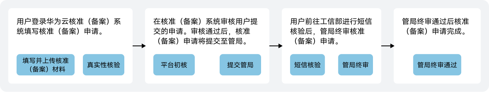

根据《中华人民共和国反电信网络诈骗法》第二十三条、《互联网信息服务管理办法》第四条、第五条，以及《非经营性互联网信息服务备案管理办法》第五条、第十一条、第十三条，互联网信息主办者应按照国家法律法规要求，向电信主管部门履行备案手续，未履行备案手续的，不得从事互联网信息服务，否则属于违法行为。已上架的互联网信息必须在**2024年3月31日**前完成核准（备案），全新的互联网信息必须完成核准（备案）后才能上架，工信部将在**2024年4月~6月**开启互联网信息核准（备案）检查工作，未完成核准（备案）的互联网信息将会按照相应要求进行处理。

## 核准（备案）类型

快游戏核准（备案）类型分为如下几种：

| 核准（备案）类型 | | 描述 | 操作指南 |
| --- | --- | --- | --- |
| 首次核准（备案） | | 主体信息和快游戏信息均未在任何接入商核准（备案）。 | 华为云核准（备案）系统的操作步骤请参见[首次核准（备案）](https://developer.huawei.com/consumer/cn/doc/games-guides/quickgame-filing-pc-first-0000001761656100)。 |
| 新增互联网信息 | | 主体信息已在华为接入商核准（备案）成功，且快游戏信息未在其它任何接入商核准（备案）。 | 华为云核准（备案）系统的操作详情请参见[新增互联网信息](https://developer.huawei.com/consumer/cn/doc/games-guides/quickgame-filing-pc-addition-0000001808815505)。 |
| 新增接入 | | 主体信息已在华为接入商核准（备案）成功，且快游戏信息已在其它接入商核准（备案）成功。 | 华为云核准（备案）系统的操作步骤请参见[新增接入](https://developer.huawei.com/consumer/cn/doc/games-guides/quickgame-filing-pc-admission-0000001817858181)。 |
| 新增接入（补录） | | 主体信息已在华为接入商核准（备案）成功，且快游戏信息已在华为原核准（备案）系统核准（备案）成功。 |
| 认领核准（备案） | | 主体信息和快游戏信息均已在华为原核准（备案）系统核准（备案）成功。 | 华为云核准（备案）系统的操作步骤请参见[认领核准（备案）](https://developer.huawei.com/consumer/cn/doc/games-guides/quickgame-filing-pc-claim-0000001887387029)。 |
| 转移核准（备案） | | 将主体信息及主体下的快游戏信息全部转移到目标账号下，且同时满足：   * 初始账号没有正在核准（备案）的申请。 * 目标账号没有正在核准（备案）的申请，同时没有已核准（备案）成功的主体信息。 | 华为云核准（备案）系统的操作步骤请参见[转移核准（备案）](https://developer.huawei.com/consumer/cn/doc/games-guides/quickgame-filing-pc-transfer-0000001802102070)。 |
| 变更核准（备案） | 变更核准（备案） | 同时变更主体信息和快游戏信息。 | 华为云核准（备案）系统的操作步骤请参见[变更核准（备案）](https://developer.huawei.com/consumer/cn/doc/games-guides/quickgame-filing-pc-change-0000001761815056#section684319599410)。 |
| 变更主体 | 变更主体信息。 | 华为云核准（备案）系统的操作步骤请参见[变更主体](https://developer.huawei.com/consumer/cn/doc/games-guides/quickgame-filing-pc-change-0000001761815056#section10803627193919)。 |
| 变更互联网信息 | 变更快游戏信息。 | 华为云核准（备案）系统的操作步骤请参见[变更互联网信息](https://developer.huawei.com/consumer/cn/doc/games-guides/quickgame-filing-pc-change-0000001761815056#section1445983116397)。 |
| 注销核准（备案） | 注销主体 | 删除主体信息及主体下的互联网信息在工信部的核准（备案）。注销成功后，主体信息及主体下的互联网信息将成为未核准（备案）信息，主办单位不可再对外提供任何互联网信息服务。 | 华为云核准（备案）系统的操作步骤请参见[注销主体](https://developer.huawei.com/consumer/cn/doc/games-guides/quickgame-filing-pc-terminate-0000001761919188#section142891715161813)。 |
| 注销互联网信息 | 删除快游戏信息在工信部的核准（备案）。注销成功后，快游戏信息将成为未核准（备案）信息，不可再对外提供互联网信息服务。 | 华为云核准（备案）系统的操作步骤请参见[注销互联网信息](https://developer.huawei.com/consumer/cn/doc/games-guides/quickgame-filing-pc-terminate-0000001761919188#section112908214187)。 |
| 取消接入 | | 删除快游戏信息在华为接入商的核准（备案）：   * 若在其它接入商也有核准（备案），快游戏不受影响。 * 若在其它接入商没有核准（备案），快游戏可能会被清理。 | 华为云核准（备案）系统的操作步骤请参见[取消接入](https://developer.huawei.com/consumer/cn/doc/games-guides/quickgame-filing-pc-cancel-0000001801205680)。 |

在华为云App核准（备案）的操作步骤请参见[华为云App核准（备案）](https://developer.huawei.com/consumer/cn/doc/games-guides/quickgame-filing-app-system-0000001759525732)。

## 核准（备案）流程

核准（备案）申请的整体流程如下图所示：

您需要做的核准（备案）步骤如下：

| 序号 | 步骤 | 说明 |
| --- | --- | --- |
| 1 | [核准（备案）准备](https://developer.huawei.com/consumer/cn/doc/games-guides/quickgame-filing-cloud-preparation-0000002017567589) | 正式提交核准（备案）申请前，您需要先完成核准（备案）准备工作。 |
| 2 | 提交核准（备案）申请 | 支持在华为云核准（备案）系统提交核准（备案）申请，具体操作流程请参考[在华为云核准（备案）系统核准（备案）](https://developer.huawei.com/consumer/cn/doc/games-guides/quickgame-filing-pc-first-0000001761656100)。 |
| 3 | [工信部核验核准（备案）短信](https://developer.huawei.com/consumer/cn/doc/games-guides/quickgame-filing-sms-verify-0000001818117885) | 除了转移核准（备案）、认领核准（备案）、取消接入，其它核准（备案）类型请前往工信部网站进行短信核验。 |

## 相关概念

| 常用名称 | 说明 |
| --- | --- |
| ICP | 网络内容提供商（Internet Content Provider, ICP），向广大用户提供互联网信息业务和增值业务。 |
| 核准（备案） | 核准（备案）是中国大陆的一项法规，提供互联网信息服务需要依法履行核准（备案）手续。 |
| 通管局 | 通信管理局。按照核准（备案）法律法规，互联网信息服务提供者需要向属地通信管理局履行核准（备案）手续。 |
| 接入商 | 接入商是提供互联网信息服务、协助办理核准（备案）的公司或组织。 |
| 主体名称 | 核准（备案）的单位名称/个人姓名，即核准（备案）主体与互联网信息必须对应一致，例如个人的快游戏，核准（备案）主体是个人，若超出个人范围的快游戏内容，核准（备案）主体应为企业/团体组织/单位。 |
| 主体负责人 | 核准（备案）系统中主体信息的负责人。部分地区的企业/团体组织/单位核准（备案）要求主体负责人必须是法定代表人。 |
| 主体核准（备案）号 | 首次核准（备案）成功后，工信部会为主体下发一个核准（备案）号，格式为“省简称+ICP备\*\*\*\*\*\*\*\*号”，例如粤ICP备00000000号。 |
| 核准（备案）号 | 核准（备案）号用以区分主体下不同的互联网信息，格式是主体核准（备案）号后带序号。例如主体下的快游戏的核准（备案）号是“粤ICP备00000000号-1K”。 |
