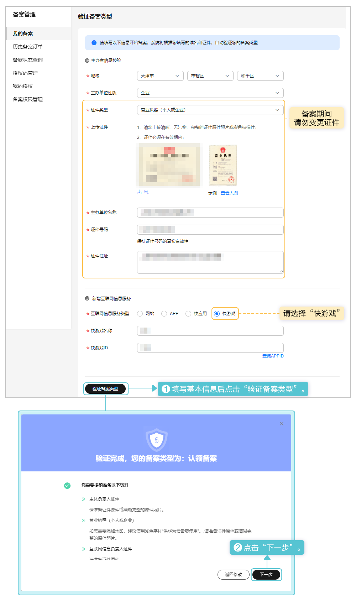
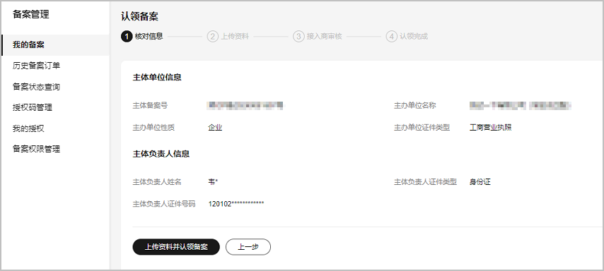
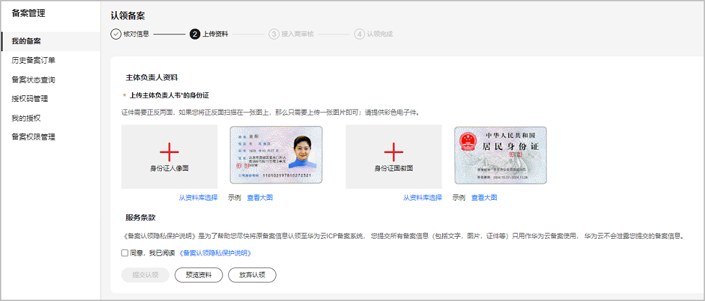
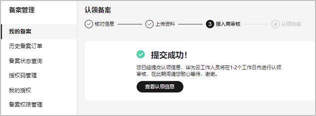

在华为云核准（备案）系统中认领华为原核准（备案）系统核准（备案）的主体信息和快游戏信息。操作步骤如下：

1. 登录[华为云核准（备案）系统](https://beian.huaweicloud.com/?utm_source=HUAWEI%2BDeveloper&utm_adplace=AdPlace099034)，填写主办单位信息、互联网信息，完成后点击“验证备案类型”。在弹出的窗口中点击“下一步”。

   
2. 在“认领备案”页面核对信息，完成后点击“上传资料并认领备案”。

   
3. 根据提示上传附件信息，完成后点击“提交认领”。

   
4. 华为工作人员将在1~2个工作日内完成审核，审核结果将以短信或邮件形式通知，在此期间请耐心等待。

   
