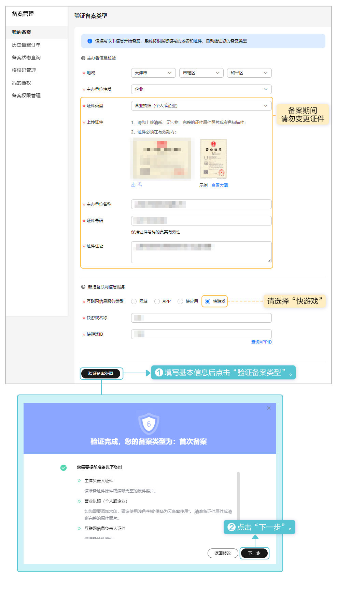
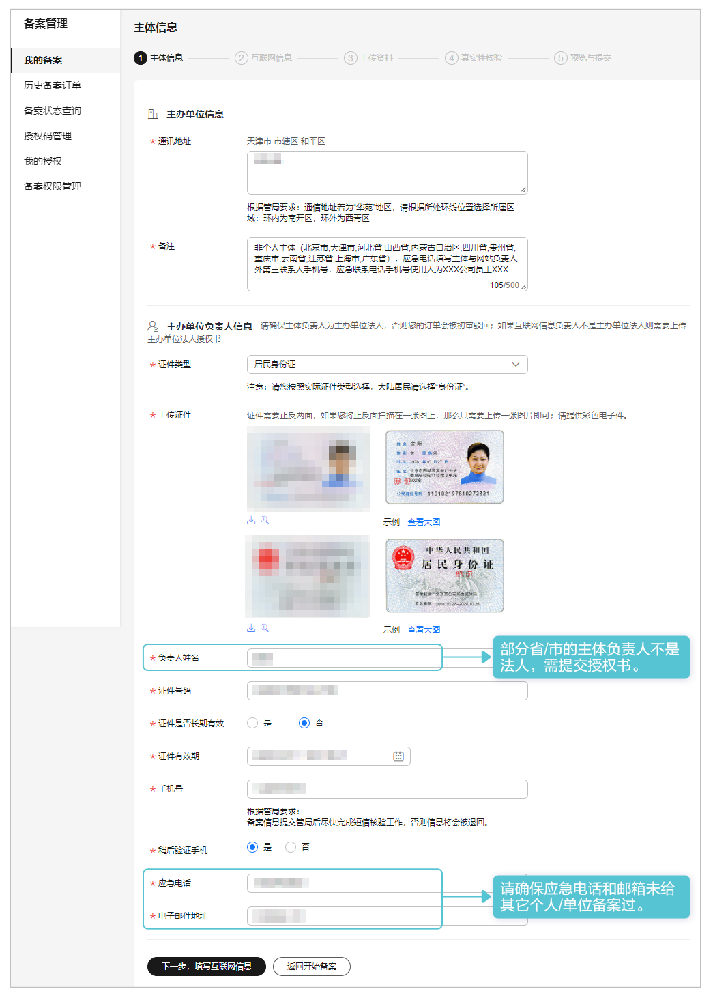
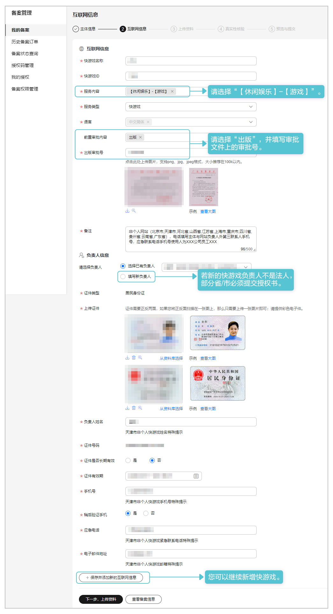
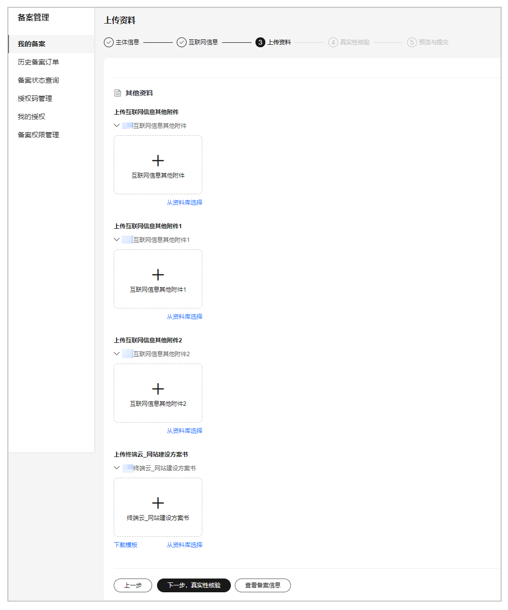
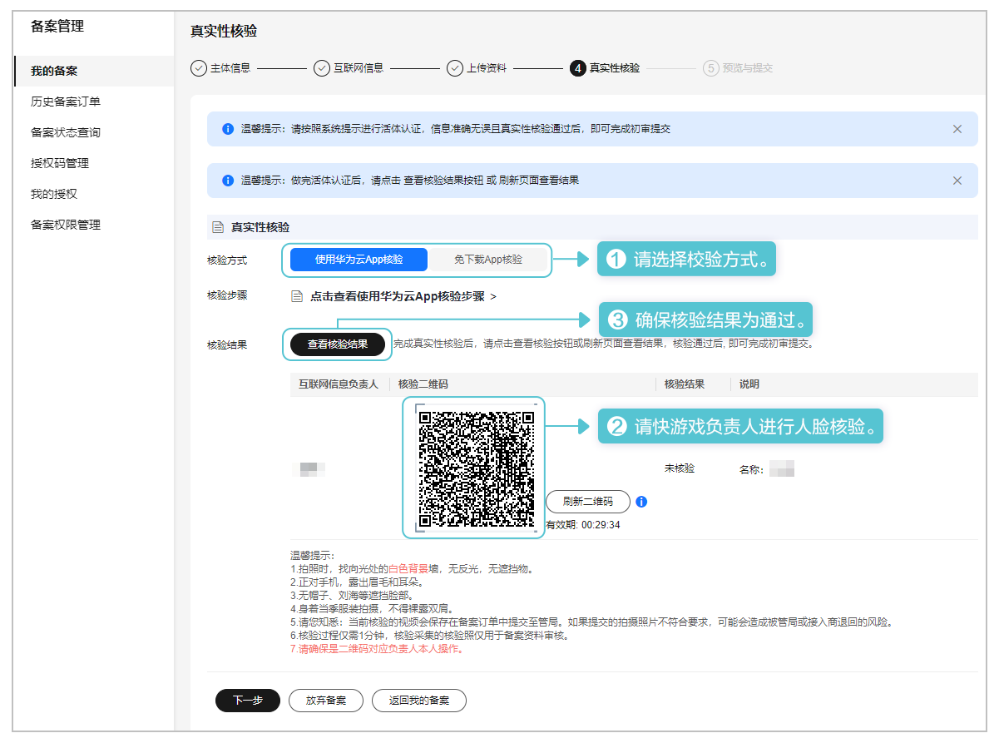
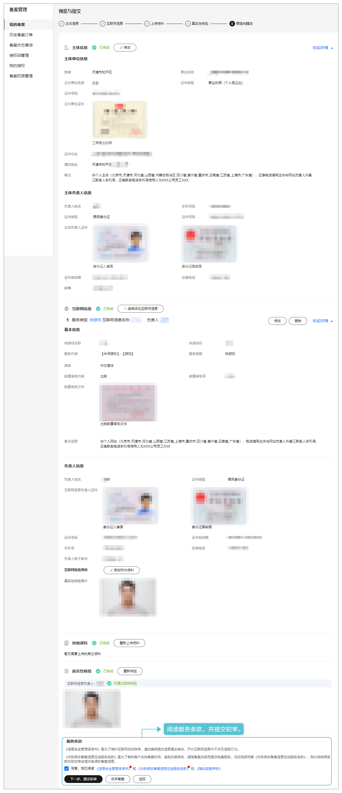
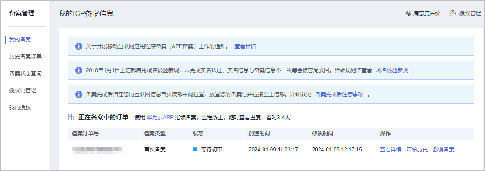
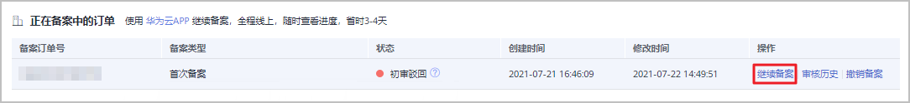

在华为云核准（备案）系统中首次核准（备案）主体信息和快游戏信息。操作步骤如下：

1. 登录[华为云核准（备案）系统](https://beian.huaweicloud.com/?utm_source=HUAWEI%2BDeveloper&utm_adplace=AdPlace099034)，填写主办单位信息、互联网信息，完成后点击“验证备案类型”。在弹出的窗口中点击“下一步”。

   
2. 在“主体信息”页面填写主办单位信息、负责人信息，完成后点击“下一步，填写互联网信息”。

   
3. 在“互联网信息”页面填写互联网信息、负责人信息，完成后点击“下一步，上传资料”。

   
4. 在“上传资料”页面根据提示上传提前准备的附件材料，完成后点击“下一步，真实性核验”。

   
5. 在“真实性核验”页面由互联网信息负责人进行人脸视频核验，完成后点击“下一步”。

   
6. 在“预览资料”页面核对填写的信息，完成后提交初审。

   
7. 华为工作人员将在3~5个工作日内进行审核，将以短信或邮件形式通知审核结果，请耐心等待，且保持手机通畅。若需要修改核准（备案）信息，将以邮件形式通知。

   
8. 华为平台人工初审通过后，请前往工信部网站核验短信验证码，详情请参见[工信部核验核准（备案）短信](https://developer.huawei.com/consumer/cn/doc/games-guides/quickgame-filing-sms-verify-0000001818117885)。若初审被驳回，请点击“继续备案”修改信息后重新提交审核。

   
