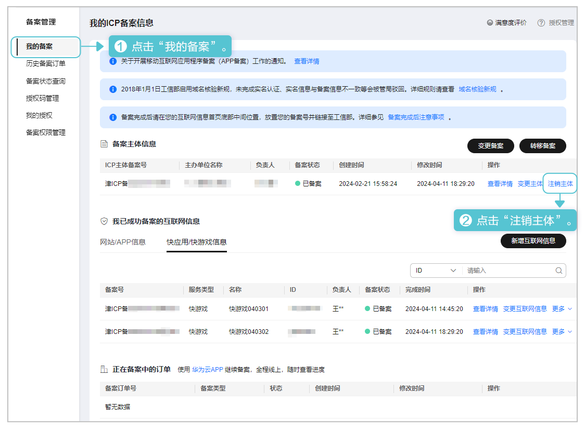
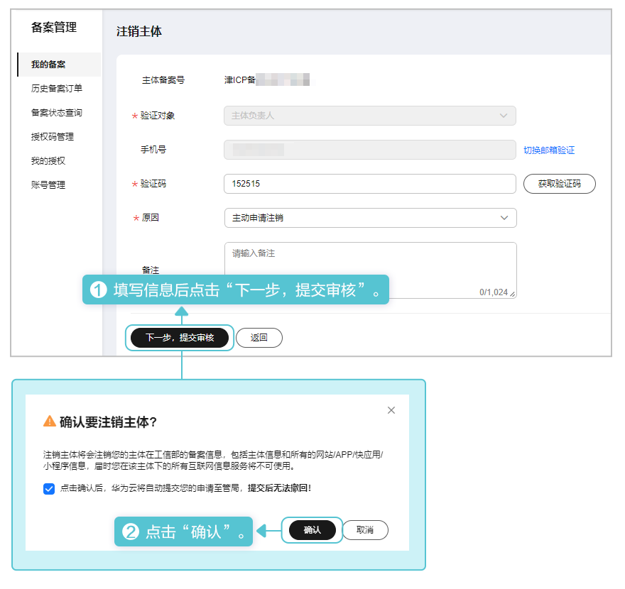
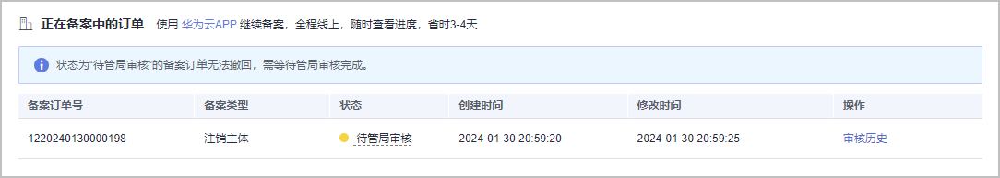
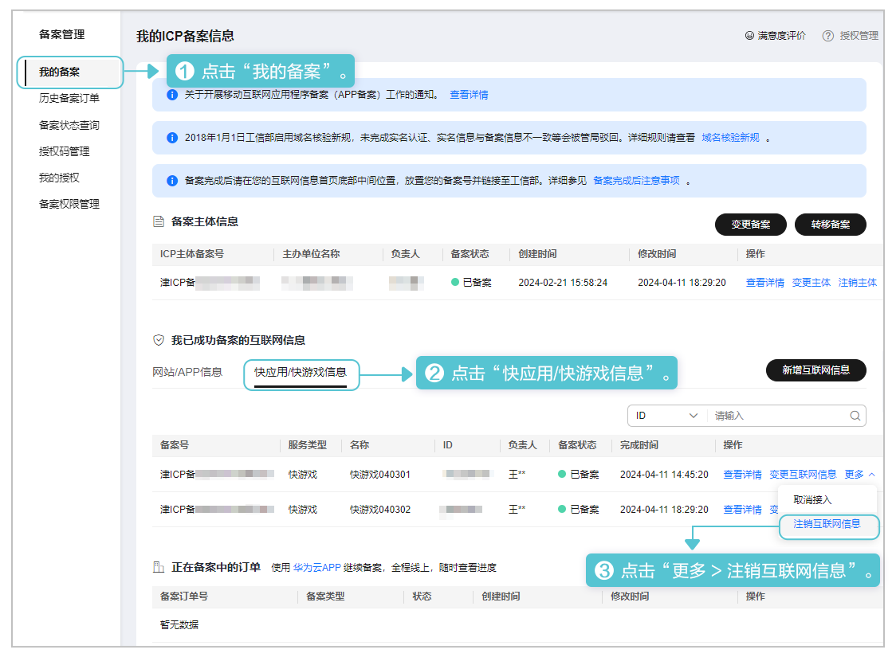
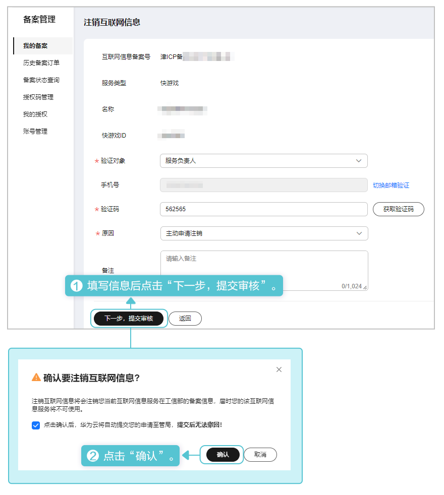
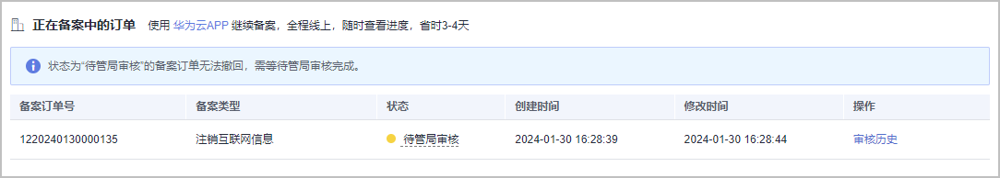

## 注销主体

注销主体将在工信部删除主体及主体下的网站/APP/快应用/快游戏的核准（备案）信息，届时互联网信息服务将不可使用。操作步骤如下：

1. 登录[华为云核准（备案）系统](https://beian.huaweicloud.com/?utm_source=HUAWEI%2BDeveloper&utm_adplace=AdPlace099034)，左侧菜单栏点击“我的备案”，右侧页面点击“注销主体”。

   
2. 在“注销主体”页面填写负责人的手机/邮箱，且选择注销原因后点击“下一步，提交审核”，在弹出的“确认要注销主体”窗口点击“确认”。

   
3. 提交申请后，华为平台将自动审核您的申请。您需前往工信部网站核验短信验证码，详情请参见[工信部核验核准（备案）短信](https://developer.huawei.com/consumer/cn/doc/games-guides/quickgame-filing-sms-verify-0000001818117885)。

   

## 注销互联网信息

注销互联网信息将在工信部删除主体下快游戏的核准（备案）信息，届时该互联网信息服务将不可使用。操作步骤如下：

1. 使用华为云账号登录[华为云核准（备案）系统](https://beian.huaweicloud.com/?utm_source=HUAWEI%2BDeveloper&utm_adplace=AdPlace099034)，左侧菜单栏选择“我的备案”，右侧页面选择“更多 &gt; 注销互联网信息”。

   
2. 在“注销互联网信息”页面填写负责人的手机/邮箱，选择注销原因后点击“下一步，提交审核”，在弹出的“确认要注销互联网信息”窗口点击“确认”。

   
3. 提交申请后，华为平台将自动审核您的申请。您需前往工信部网站核验短信验证码，详情请参见[工信部核验核准（备案）短信](https://developer.huawei.com/consumer/cn/doc/games-guides/quickgame-filing-sms-verify-0000001818117885)。

   
