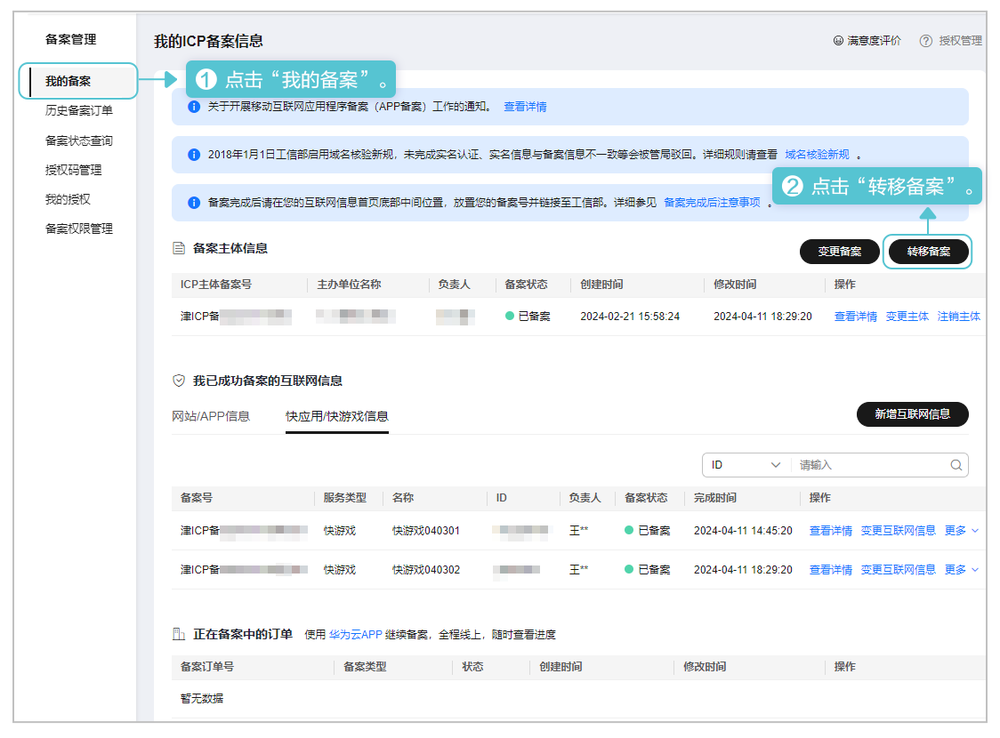
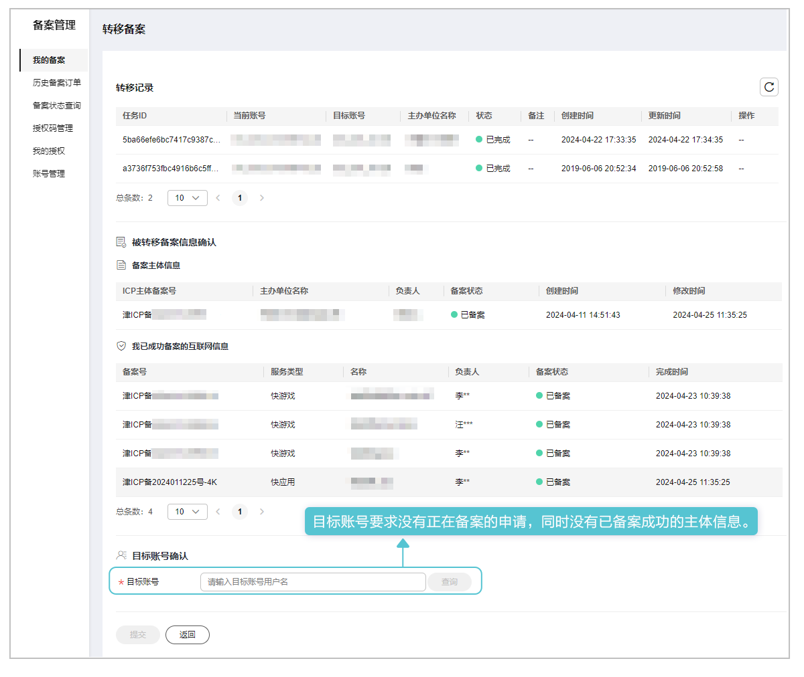

若主账号[开启“账号管理功能”开关](/docs/dev/game-dev/quickgame-filing-account-0000001885962814#ZH-CN_TOPIC_0000001885962814__li1536716016483)，该核准（备案）方式仅限在主账号下操作。

在华为云核准（备案）系统中将主体及主体下的互联网信息全部转移到目标账号下。操作步骤如下：

1. 登录[华为云核准（备案）系统](https://beian.huaweicloud.com/?utm_source=HUAWEI%2BDeveloper&utm_adplace=AdPlace099034)，左侧菜单栏点击“我的备案”，右侧页面点击“转移备案”。

   
2. 在“转移备案”填写目标账号后，点击“提交”。

   
3. 提交转移申请后需要几分钟才能转移成功，请耐心等待。
