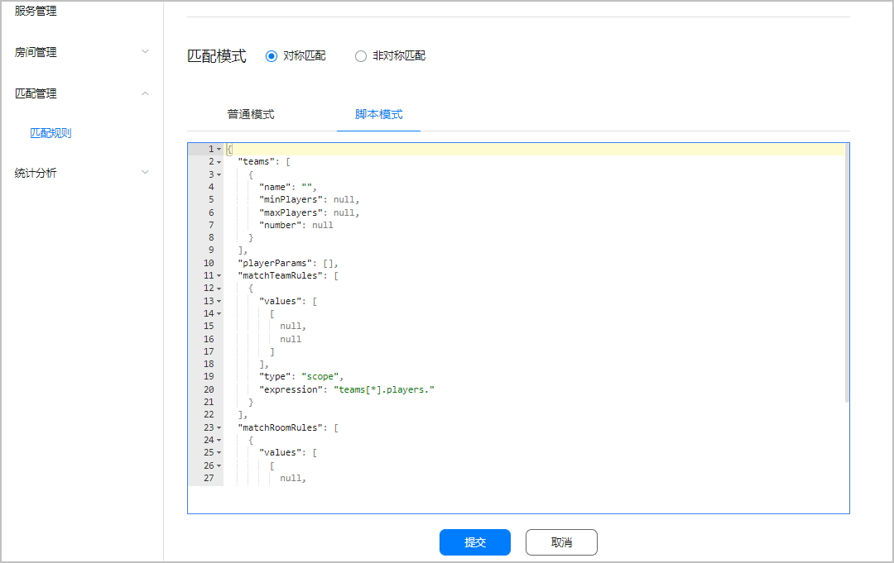

在“脚本模式”中，您可通过脚本设计配置规则集的方式来设置匹配规则。


“脚本模式”下的配置应为JSON格式，最大可编辑1000个字符。如存在脚本格式错误或格式字段不正确等问题，将无法提交保存。



| 匹配类型 | 配置信息 | |
| --- | --- | --- |
| 对称匹配 | 队伍信息 | teams：队伍名称、个数以及人数。 |
| 玩家属性 | playerParams：用于组队、组房规则的玩家属性。 |
| 组队规则 | matchTeamRules：属性分组类型、值、表达式以及放宽条件。 |
| 组房规则 | matchRoomRules：属性分组类型、值、表达式以及放宽条件。 |
| 整体超时时间 | matchTimeOut：匹配过程的整体超时时间。 |
| 非对称匹配 | 队伍信息 | * teams：队伍名称、个数以及人数。 * teamParams：队伍编号属性。 * selectTeamRules：各队伍的编号属性和编号值。 |
| 玩家属性 | playerParams：用于组队、组房规则中的玩家属性。 |
| 组队规则 | matchTeamRules：属性分组类型、值、表达式以及放宽条件。 |
| 组房规则 | matchRoomRules：属性分组类型、值、表达式以及放宽条件。 |
| 整体超时时间 | matchTimeOut：匹配过程的整体超时时间。 |

## 配置步骤

1. 设置队伍信息。
   * 对称匹配

     ```
     {
       "teams": [
         {
           "name": "5V5",
           "minPlayers": 5,
           "maxPlayers": 5,
           "number": 2
         }
       ]
     }
     ```

     | 字段 | 类型 | 必填/选填 | 说明 |
     | --- | --- | --- | --- |
     | name | string | 必填 | 队伍名称，要求1~32个字符，支持大小写字母（A-Z, a-z）、数字（0-9）和下划线（\_）。 |
     | minPlayers | number | 必填 | 队伍最少人数，要求“队伍最少人数”等于“[队伍最多人数](#ZH-CN_TOPIC_0000002395190665__p183541244165614)”。 |
     | maxPlayers | number | 必填 | 队伍最多人数，要求“队伍最多人数\*[队伍个数](#ZH-CN_TOPIC_0000002395190665__p013512547231)≤100”。 |
     | number | number | 必填 | 队伍个数，取值范围为[1, 100]，要求“[队伍最多人数](#ZH-CN_TOPIC_0000002395190665__p183541244165614)\*队伍个数≤100”。 |
   * 非对称匹配
     + 队伍名称、个数以及个队伍人数

       ```
       {
         "teams": [
           {
             "name": "King",
             "minPlayers": 1,
             "maxPlayers": 1,
             "number": 1
           },
           {
             "name": "Soldier",
             "minPlayers": 3,
             "maxPlayers": 3,
             "number": 1
           }
         ]
       }
       ```

       | 字段 | 类型 | 必填/选填 | 说明 |
       | --- | --- | --- | --- |
       | name | string | 必填 | 队伍名称，要求1~32个字符，支持大小写字母(A-Z, a-z)、数字 (0-9)和下划线（\_）。 |
       | minPlayers | number | 必填 | 队伍最少人数，要求“队伍最少人数”等于“[队伍最多人数](#ZH-CN_TOPIC_0000002395190665__p11691163125517)”。 |
       | maxPlayers | number | 必填 | 队伍最多人数，要求“队伍最多人数\*[队伍个数](#ZH-CN_TOPIC_0000002395190665__p1069119315554)≤100”。 |
       | number | number | 必填 | 队伍个数，取值范围为[1, 10]，要求“[队伍最多人数](#ZH-CN_TOPIC_0000002395190665__p11691163125517)\*队伍个数≤100”。 |

       

       在“非对称匹配”匹配类型中，至少同时存在两个队伍。
     + 队伍编号属性

       ```
       {
         "teamParams": [
           {
             "name": "teamNumber",
             "type": "number"
           }
         ]
       }
       ```

       | 字段 | 类型 | 必填/选填 | 说明 |
       | --- | --- | --- | --- |
       | name | string | 必填 | 队伍编号属性，固定为“teamNumber”。 |
       | type | string | 必填 | 队伍编号属性的数值类型，固定为“number”。 |
     + 不同队伍中的编号属性和编号值

       ```
       {
         "selectTeamRules": [
           {
             "type": "scope",
             "expression": "teams[King].players.teamNumber",
             "values": [
               [
                 1,
                 1
               ]
             ]
           },
           {
             "type": "scope",
             "expression": "teams[Soldier].players.teamNumber",
             "values": [
               [
                 2,
                 2
               ]
             ]
           }
         ]
       }
       ```

       | 字段 | 类型 | 必填/选填 | 说明 |
       | --- | --- | --- | --- |
       | type | string | 必填 | 队伍编号值的分组类型，目前支持scope类型。 |
       | expression | string | 必填 | 指定队伍类型的表达式，固定格式：teams[teamname].players.teamNumber，其中“teamname”为“队伍名称”，“teamNumber”为“队伍编号属性”。 |
       | values | 二维数组 | 必填 | 队伍编号值，取值范围为[1, 127]。 |
2. 设置玩家属性。

   ```
   {
     "playerParams": [
       {
         "name": "level",
         "type": "number"
       },
       {
         "name": "score",
         "type": "number"
       }
     ]
   }
   ```

   | 字段 | 类型 | 必填/选填 | 说明 |
   | --- | --- | --- | --- |
   | name | string | 必填 | 玩家属性，例如：level（等级）、score（分数）、skill（技能点）等。  说明：  在组队和组房规则中，总共最多可设置5个不同的玩家属性。 |
   | type | string | 必填 | 玩家属性的数值类型，目前支持number类型。 |
3. 配置组队规则。

   ```
   {
     "matchTeamRules": [
       {
         "values": [
           [
             1,
             10
           ],
           [
             11,
             20
           ],
           [
             21,
             30
           ],
           [
             31,
             40
           ]
         ],
         "type": "scope",
         "expression": "teams[*].players.level",
         "waitRules": [
           {
             "waitSeconds": 20,
             "values": [
               [
                 1,
                 20
               ],
               [
                 21,
                 40
               ]
             ]
           }
         ]
       }
     ]
   }
   ```

   | 字段 | | 类型 | 必填/选填 | 说明 |
   | --- | --- | --- | --- | --- |
   | value/values | | number/二维数组 | 必填 | 用于组队匹配的玩家属性分组条件，即玩家属性值差或分组区间。  * 当玩家属性的分组类型为variance（差值）时，该字段为value，字段类型为number类型，取值范围为[0, 100000]。 * 当玩家属性的分组类型为scope（区间）时，该字段为values，字段类型为二维数组类型，最多可设置10组数组，每组数组中的数组长度为2，取值范围为[0, 100000]。 |
   | type | | string | 必填 | 玩家属性的分组类型，支持variance（差值）和scope（区间）类型。  说明：  一条组队匹配规则中，最多可设置1组variance（差值）类型的组队规则。 |
   | expression | | string | 必填 | 玩家属性的计算表达式，固定格式：teams[\*].players.attribute，其中“attribute”为“玩家属性”。  说明：  一条组队规则中，不支持重复设置某一玩家属性的匹配规则。 |
   | waitRules | waitSeconds | number | 选填 | 放宽条件的待生效时间，即超过该时间后，玩家将根据[设置的放宽条件](#ZH-CN_TOPIC_0000002395190665__p1563416371773)进行组队匹配，取值范围为[5, 300]。 |
   | value/values | number/二维数组 | 选填 | 超过[放宽条件的待生效时间](#ZH-CN_TOPIC_0000002395190665__p551519401276)后，用于玩家继续组队匹配的放宽条件。  * 当放宽条件中玩家属性的分组类型为variance（差值）时，该字段为value，字段类型为number类型，取值范围为[0, 100000]。 说明：  使用“脚本模式”配置对称匹配规则时，当“放宽属性区间”中玩家属性的分组类型为variance（差值）时，waitRules下最多可支持设置5组放宽条件。 * 当放宽条件中玩家属性的分组类型为scope（区间）时，该字段为values，字段类型为二维数组类型，最多可设置10组数组，每组数组中的数组长度为2，取值范围为[0, 100000]。 |
4. 配置组房规则。

   ```
   {
     "matchRoomRules": [
       {
         "value": 5,
         "type": "variance",
         "expression": "avg(teams[*].players.score)",
         "waitRules": [
           {
             "waitSeconds": 30,
             "value": 10
           }
         ]
       }
     ]
   }
   ```

   | 字段 | | 类型 | 必填/选填 | 说明 |
   | --- | --- | --- | --- | --- |
   | value/values | | number/二维数组 | 必填 | 用于组房匹配的玩家属性分组条件，即每个组房队伍中玩家属性平均值的差值或分组区间。  * 当玩家属性的分组类型为variance（差值）时，该字段为value，字段类型为number类型，取值范围为[0, 100000]。 * 当玩家属性的分组类型为scope（区间）时，该字段为values，字段类型为二维数组类型，最多设置10组数组，每组数组中的数组长度为2，取值范围为[0, 100000]。 |
   | type | | string | 必填 | 玩家属性的分组类型，支持variance（差值）和scope（区间）类型。  说明：  一条组房匹配规则中，最多可设置1组variance（差值）类型的组房规则。 |
   | expression | | string | 必填 | 玩家属性的计算表达式，固定格式：avg(teams[\*].players.attribute)，其中“attribute”为“玩家属性”。  说明：  一条组房规则中，不支持重复设置某一玩家属性的匹配规则。 |
   | waitRules | waitSeconds | number | 选填 | 放宽条件的待生效时间，即超过该时间后，队伍将根据[设置的放宽条件](#ZH-CN_TOPIC_0000002395190665__p105451291372)进行组房匹配，取值范围为[5,300]。 |
   | value/values | number/二维数组 | 选填 | 超过[放宽条件的待生效时间](#ZH-CN_TOPIC_0000002395190665__p95451493713)后，用于队伍继续组房匹配的放宽条件。  * 当放宽条件中玩家属性的分组类型为variance（差值）时，该字段为value，字段类型为number类型，取值范围为[0, 100000]。 说明：  使用“脚本模式”配置对称匹配规则时，当“放宽属性区间”中玩家属性的分组类型为variance（差值）时，waitRules下最多可支持设置5组放宽条件。 * 当放宽条件中玩家属性的分组类型为scope（区间）时，该字段为values，字段类型为二维数组类型，最多设置10组数组，每组数组中的数组长度为2，取值范围为[0, 100000]。 |
5. 设置整体超时时间。

   ```
   {
     "matchTimeOut": 80
   }
   ```

   | 字段 | | 类型 | 必填/选填 | 说明 |
   | --- | --- | --- | --- | --- |
   | matchTimeOut | | number | 必填 | 玩家匹配过程的整体超时时间，应大于[玩家组队匹配放宽条件的待生效时间](#ZH-CN_TOPIC_0000002395190665__p551519401276)和[队伍组房匹配放宽条件的待生效时间](#ZH-CN_TOPIC_0000002395190665__p95451493713)之和，取值范围为[5,300]。 |

## 脚本示例

* 对称匹配示例规则

  在一局5V5的比赛中，等级在同一区间（1~10、11~20、21~30、31~40）的组成一队，如果匹配等待时间超过20秒，则扩大匹配范围（1~20、21~40）进行组队匹配。成功组队的队伍可以继续组房匹配，两支不同队伍的平均得分相差5以内，则可以进行组建房间。如果组房匹配等待时间超过30秒，则扩大匹配范围（队伍的平均得分相差10以内）进行组房匹配。玩家匹配过程的整体超时时间不超过80秒，超过则匹配结束。

  脚本设计如下：

  ```
  {
    "teams": [
      {
        "name": "5V5",
        "minPlayers": 5,
        "maxPlayers": 5,
        "number": 2
      }
    ],
    "playerParams": [
      {
        "name": "level",
        "type": "number"
      },
      {
        "name": "score",
        "type": "number"
      }
    ],
    "matchTeamRules": [
      {
        "values": [
          [
            1,
            10
          ],
          [
            11,
            20
          ],
          [
            21,
            30
          ],
          [
            31,
            40
          ]
        ],
        "type": "scope",
        "expression": "teams[*].players.level",
        "waitRules": [
          {
            "waitSeconds": 20,
            "values": [
              [
                1,
                20
              ],
              [
                21,
                40
              ]
            ]
          }
        ]
      }
    ],
    "matchRoomRules": [
      {
        "value": 5,
        "type": "variance",
        "expression": "avg(teams[*].players.score)",
        "waitRules": [
          {
            "waitSeconds": 30,
            "value": 10
          }
        ]
      }
    ],
    "matchTimeOut": 80
  }
  ```
* 非对称匹配示例规则

  在一局比赛中，一支King队伍，队伍人数为1人。一支Soldier队伍，每个队伍人数3人。在Soldier队伍中，等级值（skill）在同一区间的组成一队。如果匹配等待时间超过20秒，则扩大匹配范围进行组队匹配。成功组队的队伍可以继续组房匹配，两支不同队伍的能量值（power）平均值差在5以内，则可以进行组建房间。如果组房匹配等待时间超过30秒，则扩大匹配范围（队伍的power平均值差在10以内）进行组房匹配。玩家匹配过程的整体超时时间不超过100秒，超过则匹配结束。

  脚本设计如下：

  ```
  {
    "teams": [
      {
        "name": "King",
        "minPlayers": 1,
        "maxPlayers": 1,
        "number": 1
      },
      {
        "name": "Soldier",
        "minPlayers": 3,
        "maxPlayers": 3,
        "number": 1
      }
    ],
    "teamParams": [
      {
        "name": "teamNumber",
        "type": "number"
      }
    ],
    "selectTeamRules": [
      {
        "type": "scope",
        "expression": "teams[King].players.teamNumber",
        "values": [
          [
            1,
            1
          ]
        ]
      },
      {
        "type": "scope",
        "expression": "teams[Soldier].players.teamNumber",
        "values": [
          [
            2,
            2
          ]
        ]
      }
    ],
    "playerParams": [
      {
        "name": "level",
        "type": "number"
      },
      {
        "name": "power",
        "type": "number"
      }
    ],
    "matchTeamRules": [
      {
        "values": [
          [
            10,
            20
          ]
        ],
        "type": "scope",
        "expression": "teams[*].players.level",
        "waitRules": [
          {
            "waitSeconds": 20,
            "values": [
              [
                1,
                30
              ]
            ]
          }
        ]
      }
    ],
    "matchRoomRules": [
      {
        "value": 5,
        "type": "variance",
        "expression": "avg(teams[*].players.power)",
        "waitRules": [
          {
            "waitSeconds": 30,
            "value": 10
          }
        ]
      }
    ],
    "matchTimeOut": 100
  }
  ```
