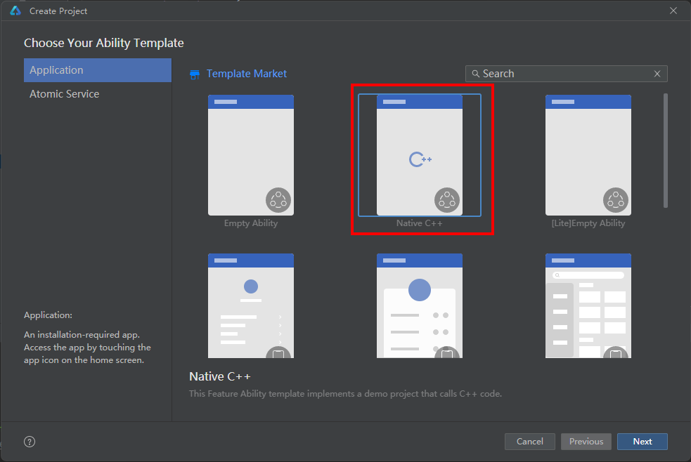

## еңәжҷҜд»Ӣз»Қ

ејҖеҸ‘иҖ…еҸҜд»ҘйҖҡиҝҮжң¬жҢҮеҜјдәҶи§ЈеңЁHarmonyOSеә”з”ЁдёӯпјҢеҰӮдҪ•дҪҝз”ЁNative BundleжҺҘеҸЈиҺ·еҸ–еә”з”ЁиҮӘиә«зӣёе…ідҝЎжҒҜгҖӮ

## жҺҘеҸЈиҜҙжҳҺ

еёёз”ЁжҺҘеҸЈеҰӮдёӢиЎЁжүҖзӨәпјҢе…·дҪ“APIиҜҙжҳҺиҜҰи§Ғ[Native\_Bundle](https://developer.huawei.com/consumer/cn/doc/harmonyos-references/capi-native-bundle)гҖӮ

| жҺҘеҸЈеҗҚ | жҸҸиҝ° |
| --- | --- |
| [OH\_NativeBundle\_GetCurrentApplicationInfo](https://developer.huawei.com/consumer/cn/doc/harmonyos-references/capi-native-interface-bundle-h#oh_nativebundle_getcurrentapplicationinfo) | иҺ·еҸ–еә”з”ЁиҮӘиә«зӣёе…ідҝЎжҒҜгҖӮ |
| [OH\_NativeBundle\_GetAppId](https://developer.huawei.com/consumer/cn/doc/harmonyos-references/capi-native-interface-bundle-h#oh_nativebundle_getappid) | иҺ·еҸ–иҮӘиә«еә”з”Ёзҡ„appIdдҝЎжҒҜгҖӮ |
| [OH\_NativeBundle\_GetAppIdentifier](https://developer.huawei.com/consumer/cn/doc/harmonyos-references/capi-native-interface-bundle-h#oh_nativebundle_getappidentifier) | иҺ·еҸ–иҮӘиә«еә”з”Ёзҡ„appIdentifierдҝЎжҒҜгҖӮ |
| [OH\_NativeBundle\_GetMainElementName](https://developer.huawei.com/consumer/cn/doc/harmonyos-references/capi-native-interface-bundle-h#oh_nativebundle_getmainelementname) | иҺ·еҸ–иҮӘиә«еә”з”Ёе…ҘеҸЈзҡ„дҝЎжҒҜгҖӮ |
| [OH\_NativeBundle\_GetCompatibleDeviceType](https://developer.huawei.com/consumer/cn/doc/harmonyos-references/capi-native-interface-bundle-h#oh_nativebundle_getcompatibledevicetype) | иҺ·еҸ–иҮӘиә«еә”з”ЁйҖӮз”Ёзҡ„и®ҫеӨҮзұ»еһӢгҖӮ |
| [OH\_NativeBundle\_IsDebugMode](https://developer.huawei.com/consumer/cn/doc/harmonyos-references/capi-native-interface-bundle-h#oh_nativebundle_isdebugmode) | жҹҘиҜўеҪ“еүҚеә”з”Ёзҡ„и°ғиҜ•жЁЎејҸгҖӮд»ҺAPI version 20ејҖе§Ӣж”ҜжҢҒгҖӮ |
| [OH\_NativeBundle\_GetModuleMetadata](https://developer.huawei.com/consumer/cn/doc/harmonyos-references/capi-native-interface-bundle-h#oh_nativebundle_getmodulemetadata) | иҺ·еҸ–еҪ“еүҚеә”з”Ёзҡ„е…ғж•°жҚ®дҝЎжҒҜгҖӮд»ҺAPI version 20ејҖе§Ӣж”ҜжҢҒгҖӮ |
| [OH\_NativeBundle\_GetAbilityResourceInfo](https://developer.huawei.com/consumer/cn/doc/harmonyos-references/capi-native-interface-bundle-h#oh_nativebundle_getabilityresourceinfo) | иҺ·еҸ–ж”ҜжҢҒжү“ејҖзү№е®ҡж–Ү件зұ»еһӢзҡ„组件иө„жәҗдҝЎжҒҜеҲ—иЎЁгҖӮд»ҺAPI version 21ејҖе§Ӣж”ҜжҢҒгҖӮ |

## ејҖеҸ‘жӯҘйӘӨ

**1. еҲӣе»әе·ҘзЁӢ**



**2. ж·»еҠ дҫқиө–**

еҲӣе»әе®ҢжҲҗеҗҺпјҢDevEco StudioдјҡеңЁе·ҘзЁӢз”ҹжҲҗcppзӣ®еҪ•пјҢзӣ®еҪ•дёӯеҢ…еҗ«types/libentry/index.d.tsгҖҒnapi\_init.cppгҖҒCMakeLists.txtзӯүж–Ү件гҖӮ

1. жү“ејҖsrc/main/cpp/CMakeLists.txtпјҢеңЁtarget\_link\_librariesдҫқиө–дёӯж·»еҠ еҢ…з®ЎзҗҶзҡ„libbundle\_ndk.soгҖӮ

   ```
   target_link_libraries(entry PUBLIC libace_napi.z.so libbundle_ndk.so)
   ```
2. жү“ејҖsrc/main/cpp/napi\_init.cppж–Ү件пјҢж·»еҠ еӨҙж–Ү件гҖӮ

   ```
   // napiдҫқиө–еӨҙж–Ү件
   #include "napi/native_api.h"
   // nativeжҺҘеҸЈдҫқиө–еӨҙж–Ү件
   #include "bundle/ability_resource_info.h"
   #include "bundle/native_interface_bundle.h"
   // free()еҮҪж•°дҫқиө–зҡ„еҹәзЎҖеә“
   #include <cstdlib>
   ```

**3. дҝ®ж”№жәҗж–Ү件**

1. жү“ејҖsrc/main/cpp/napi\_init.cppж–Ү件пјҢж–Ү件InitдјҡеҜ№еҪ“еүҚж–№жі•иҝӣиЎҢеҲқе§ӢеҢ–жҳ е°„пјҢиҝҷйҮҢе®ҡд№үеҜ№еӨ–зҡ„жҺҘеҸЈгҖӮ

   ```
   EXTERN_C_START
   static napi_value Init(napi_env env, napi_value exports)
   {
       napi_property_descriptor desc[] = {
           { "add", nullptr, Add, nullptr, nullptr, nullptr, napi_default, nullptr },
           // ж–°еўһж–№жі•getCurrentApplicationInfo
           { "getCurrentApplicationInfo", nullptr, GetCurrentApplicationInfo, nullptr,
               nullptr, nullptr, napi_default, nullptr},
           // ж–°еўһж–№жі•getAppId
           { "getAppId", nullptr, GetAppId, nullptr, nullptr, nullptr, napi_default, nullptr},
           // ж–°еўһж–№жі•getAppIdentifier
           { "getAppIdentifier", nullptr, GetAppIdentifier, nullptr, nullptr, nullptr, napi_default, nullptr},
           // ж–°еўһж–№жі•getMainElementName
           { "getMainElementName", nullptr, GetMainElementName, nullptr, nullptr, nullptr, napi_default, nullptr},
           // ж–°еўһж–№жі•getCompatibleDeviceType
           { "getCompatibleDeviceType", nullptr, GetCompatibleDeviceType, nullptr,
               nullptr, nullptr, napi_default, nullptr},
           // ж–°еўһж–№жі•isDebugMode
           { "isDebugMode", nullptr, IsDebugMode, nullptr, nullptr, nullptr, napi_default, nullptr},
           // ж–°еўһж–№жі•getModuleMetadata
           { "getModuleMetadata", nullptr, GetModuleMetadata, nullptr, nullptr, nullptr, napi_default, nullptr},
           // ж–°еўһж–№жі•getAbilityResourceInfo
           { "getAbilityResourceInfo", nullptr, GetAbilityResourceInfo, nullptr, nullptr, nullptr, napi_default, nullptr}
       };
       napi_define_properties(env, exports, sizeof(desc) / sizeof(desc[0]), desc);
       return exports;
   }
   EXTERN_C_END
   ```
2. еңЁsrc/main/cpp/napi\_init.cppж–Ү件дёӯиҺ·еҸ–Nativeзҡ„еҢ…дҝЎжҒҜеҜ№иұЎпјҢ并иҪ¬дёәjsзҡ„еҢ…дҝЎжҒҜеҜ№иұЎпјҢеҚіеҸҜеңЁjsдҫ§иҺ·еҸ–еә”з”Ёзҡ„дҝЎжҒҜпјҡ

   ```
   static napi_value GetCurrentApplicationInfo(napi_env env, napi_callback_info info)
   {
       // и°ғз”ЁNativeжҺҘеҸЈиҺ·еҸ–еә”з”ЁдҝЎжҒҜ
       OH_NativeBundle_ApplicationInfo nativeApplicationInfo = OH_NativeBundle_GetCurrentApplicationInfo();
       napi_value result = nullptr;
       napi_create_object(env, &result);
       // NativeжҺҘеҸЈиҺ·еҸ–зҡ„еә”з”ЁеҢ…еҗҚиҪ¬дёәjsеҜ№иұЎйҮҢзҡ„bundleNameеұһжҖ§
       napi_value bundleName;
       napi_create_string_utf8(env, nativeApplicationInfo.bundleName, NAPI_AUTO_LENGTH, &bundleName);
       napi_set_named_property(env, result, "bundleName", bundleName);
       // NativeжҺҘеҸЈиҺ·еҸ–зҡ„жҢҮзә№дҝЎжҒҜиҪ¬дёәjsеҜ№иұЎйҮҢзҡ„fingerprintеұһжҖ§
       napi_value fingerprint;
       napi_create_string_utf8(env, nativeApplicationInfo.fingerprint, NAPI_AUTO_LENGTH, &fingerprint);
       napi_set_named_property(env, result, "fingerprint", fingerprint);
       // жңҖеҗҺдёәдәҶйҳІжӯўеҶ…еӯҳжі„жјҸпјҢжүӢеҠЁйҮҠж”ҫ
       free(nativeApplicationInfo.bundleName);
       free(nativeApplicationInfo.fingerprint);
       return result;
   }

   static napi_value GetAppId(napi_env env, napi_callback_info info)
   {
       // и°ғз”ЁNativeжҺҘеҸЈиҺ·еҸ–еә”з”ЁappId
       char* appId = OH_NativeBundle_GetAppId();
       // NativeжҺҘеҸЈиҪ¬жҲҗnAppIdиҝ”еӣһ
       napi_value nAppId;
       napi_create_string_utf8(env, appId, NAPI_AUTO_LENGTH, &nAppId);
       // жңҖеҗҺдёәдәҶйҳІжӯўеҶ…еӯҳжі„жјҸпјҢжүӢеҠЁйҮҠж”ҫ
       free(appId);
       return nAppId;
   }

   static napi_value GetAppIdentifier(napi_env env, napi_callback_info info)
   {
       // и°ғз”ЁNativeжҺҘеҸЈиҺ·еҸ–еә”з”ЁappIdentifier
       char* appIdentifier = OH_NativeBundle_GetAppIdentifier();
       // NativeжҺҘеҸЈиҪ¬жҲҗnAppIdentifierиҝ”еӣһ
       napi_value nAppIdentifier;
       napi_create_string_utf8(env, appIdentifier, NAPI_AUTO_LENGTH, &nAppIdentifier);
       // жңҖеҗҺдёәдәҶйҳІжӯўеҶ…еӯҳжі„жјҸпјҢжүӢеҠЁйҮҠж”ҫ
       free(appIdentifier);
       return nAppIdentifier;
   }

   static napi_value GetMainElementName(napi_env env, napi_callback_info info)
   {
       // и°ғз”ЁNativeжҺҘеҸЈиҺ·еҸ–еә”з”Ёе…ҘеҸЈзҡ„дҝЎжҒҜ
       OH_NativeBundle_ElementName elementName = OH_NativeBundle_GetMainElementName();
       napi_value result = nullptr;
       napi_create_object(env, &result);
       // NativeжҺҘеҸЈиҺ·еҸ–зҡ„еә”з”ЁеҢ…еҗҚиҪ¬дёәjsеҜ№иұЎйҮҢзҡ„bundleNameеұһжҖ§
       napi_value bundleName;
       napi_create_string_utf8(env, elementName.bundleName, NAPI_AUTO_LENGTH, &bundleName);
       napi_set_named_property(env, result, "bundleName", bundleName);
       // NativeжҺҘеҸЈиҺ·еҸ–зҡ„жЁЎеқ—еҗҚз§°иҪ¬дёәjsеҜ№иұЎйҮҢзҡ„moduleNameеұһжҖ§
       napi_value moduleName;
       napi_create_string_utf8(env, elementName.moduleName, NAPI_AUTO_LENGTH, &moduleName);
       napi_set_named_property(env, result, "moduleName", moduleName);
       // NativeжҺҘеҸЈиҺ·еҸ–зҡ„abilityеҗҚз§°иҪ¬дёәjsеҜ№иұЎйҮҢзҡ„abilityNameеұһжҖ§
       napi_value abilityName;
       napi_create_string_utf8(env, elementName.abilityName, NAPI_AUTO_LENGTH, &abilityName);
       napi_set_named_property(env, result, "abilityName", abilityName);
       // жңҖеҗҺдёәдәҶйҳІжӯўеҶ…еӯҳжі„жјҸпјҢжүӢеҠЁйҮҠж”ҫ
       free(elementName.bundleName);
       free(elementName.moduleName);
       free(elementName.abilityName);
       return result;
   }

   static napi_value GetCompatibleDeviceType(napi_env env, napi_callback_info info)
   {
       // и°ғз”ЁNativeжҺҘеҸЈиҺ·еҸ–еә”з”ЁdeviceType
       char* deviceType = OH_NativeBundle_GetCompatibleDeviceType();
       // NativeжҺҘеҸЈиҪ¬жҲҗnDeviceTypeиҝ”еӣһ
       napi_value nDeviceType;
       napi_create_string_utf8(env, deviceType, NAPI_AUTO_LENGTH, &nDeviceType);
       // жңҖеҗҺдёәдәҶйҳІжӯўеҶ…еӯҳжі„жјҸпјҢжүӢеҠЁйҮҠж”ҫ
       free(deviceType);
       return nDeviceType;
   }

   static napi_value IsDebugMode(napi_env env, napi_callback_info info)
   {
       bool isDebug = false;
       // и°ғз”ЁNativeжҺҘеҸЈиҺ·еҸ–еә”з”ЁDebugModeзҡ„дҝЎжҒҜпјҢиҜҘжҺҘеҸЈд»ҺAPI version 20ејҖе§Ӣж”ҜжҢҒ
       bool isSuccess = OH_NativeBundle_IsDebugMode(&isDebug);
       // и°ғз”ЁNativeжҺҘеҸЈеӨұиҙҘжҠӣеҮәејӮеёё
       if (isSuccess == false) {
           napi_throw_error(env, nullptr, "call failed");
           return nullptr;
       }
       // NativeжҺҘеҸЈиҪ¬жҲҗdebugиҝ”еӣһ
       napi_value debug;
       napi_get_boolean(env, isDebug, &debug);
       return debug;
   }

   static napi_value GetModuleMetadata(napi_env env, napi_callback_info info)
   {
       size_t moduleCount = 0;
       // и°ғз”ЁNativeжҺҘеҸЈиҺ·еҸ–еә”з”Ёе…ғж•°жҚ®зҡ„дҝЎжҒҜпјҢиҜҘжҺҘеҸЈд»ҺAPI version 20ејҖе§Ӣж”ҜжҢҒ
       OH_NativeBundle_ModuleMetadata* modules = OH_NativeBundle_GetModuleMetadata(&moduleCount);
       if (modules == nullptr || moduleCount == 0) {
           napi_throw_error(env, nullptr, "no metadata found");
           return nullptr;
       }
       napi_value result;
       napi_create_array(env, &result);
       for (size_t i = 0; i < moduleCount; i++) {
           napi_value moduleObj;
           napi_create_object(env, &moduleObj);
           // NativeжҺҘеҸЈиҺ·еҸ–зҡ„жЁЎеқ—еҗҚиҪ¬дёәjsеҜ№иұЎйҮҢзҡ„moduleNameеұһжҖ§
           napi_value moduleName;
           napi_create_string_utf8(env, modules[i].moduleName, NAPI_AUTO_LENGTH, &moduleName);
           napi_set_named_property(env, moduleObj, "moduleName", moduleName);
           napi_value metadataArray;
           napi_create_array(env, &metadataArray);
           for (size_t j = 0; j < modules[i].metadataArraySize; j++) {
               napi_value metadataObj;
               napi_create_object(env, &metadataObj);
               napi_value name;
               napi_value value;
               napi_value resource;
               napi_create_string_utf8(env, modules[i].metadataArray[j].name, NAPI_AUTO_LENGTH, &name);
               napi_create_string_utf8(env, modules[i].metadataArray[j].value, NAPI_AUTO_LENGTH, &value);
               napi_create_string_utf8(env, modules[i].metadataArray[j].resource, NAPI_AUTO_LENGTH, &resource);
               // NativeжҺҘеҸЈиҺ·еҸ–зҡ„е…ғж•°жҚ®еҗҚз§°иҪ¬дёәjsеҜ№иұЎйҮҢзҡ„nameеұһжҖ§
               napi_set_named_property(env, metadataObj, "name", name);
               // NativeжҺҘеҸЈиҺ·еҸ–зҡ„е…ғж•°жҚ®еҖјеҗҚз§°иҪ¬дёәjsеҜ№иұЎйҮҢзҡ„valueеұһжҖ§
               napi_set_named_property(env, metadataObj, "value", value);
               // NativeжҺҘеҸЈиҺ·еҸ–зҡ„е…ғж•°жҚ®иө„жәҗиҪ¬дёәjsеҜ№иұЎйҮҢзҡ„resourceеұһжҖ§
               napi_set_named_property(env, metadataObj, "resource", resource);
               napi_set_element(env, metadataArray, j, metadataObj);
           }
           napi_set_named_property(env, moduleObj, "metadata", metadataArray);
           napi_set_element(env, result, i, moduleObj);
       }
       // жңҖеҗҺдёәдәҶйҳІжӯўеҶ…еӯҳжі„жјҸпјҢжүӢеҠЁйҮҠж”ҫ
       for (size_t i = 0; i < moduleCount; i++) {
           free(modules[i].moduleName);
           for (size_t j = 0; j < modules[i].metadataArraySize; j++) {
               free(modules[i].metadataArray[j].name);
               free(modules[i].metadataArray[j].value);
               free(modules[i].metadataArray[j].resource);
           }
           free(modules[i].metadataArray);
       }
       free(modules);
       return result;
   }
   ```

   ```
   static void AddDefaultApp(napi_env env,
       napi_value &infoObj,
       OH_NativeBundle_AbilityResourceInfo* temp)
   {
       bool isDefaultApp = true;
       // иҜҘжҺҘеҸЈд»ҺAPI version 21ејҖе§Ӣж”ҜжҢҒ
       OH_NativeBundle_CheckDefaultApp(temp, &isDefaultApp);
       napi_value defaultAppValue;
       napi_get_boolean(env, isDefaultApp, &defaultAppValue);
       napi_set_named_property(env, infoObj, "isDefaultApp", defaultAppValue);
   }

   static void AddAppIndex(napi_env env,
       napi_value &infoObj,
       OH_NativeBundle_AbilityResourceInfo* temp)
   {
       int appIndex = -1;
       // иҜҘжҺҘеҸЈд»ҺAPI version 21ејҖе§Ӣж”ҜжҢҒ
       OH_NativeBundle_GetAppIndex(temp, &appIndex);
       napi_value appIndexValue;
       napi_create_int32(env, appIndex, &appIndexValue);
       napi_set_named_property(env, infoObj, "appIndex", appIndexValue);
   }

   static void AddLabel(napi_env env,
       napi_value &infoObj,
       OH_NativeBundle_AbilityResourceInfo* temp)
   {
       char *label = nullptr;
       // иҜҘжҺҘеҸЈд»ҺAPI version 21ејҖе§Ӣж”ҜжҢҒ
       OH_NativeBundle_GetLabel(temp, &label);
       napi_value labelValue;
       if (label) {
           napi_create_string_utf8(env, label, NAPI_AUTO_LENGTH, &labelValue);
           free(label);
       } else {
           napi_get_null(env, &labelValue);
       }
       napi_set_named_property(env, infoObj, "label", labelValue);
   }

   static void AddBundleName(napi_env env,
       napi_value &infoObj,
       OH_NativeBundle_AbilityResourceInfo* temp)
   {
       char *bundleName = nullptr;
       // иҜҘжҺҘеҸЈд»ҺAPI version 21ејҖе§Ӣж”ҜжҢҒ
       OH_NativeBundle_GetBundleName(temp, &bundleName);
       napi_value bundleNameValue;
       if (bundleName) {
           napi_create_string_utf8(env, bundleName, NAPI_AUTO_LENGTH, &bundleNameValue);
           free(bundleName);
       } else {
           napi_get_null(env, &bundleNameValue);
       }
       napi_set_named_property(env, infoObj, "bundleName", bundleNameValue);
   }

   static void AddModuleName(napi_env env,
       napi_value &infoObj,
       OH_NativeBundle_AbilityResourceInfo* temp)
   {
       char *moduleName = nullptr;
       // иҜҘжҺҘеҸЈд»ҺAPI version 21ејҖе§Ӣж”ҜжҢҒ
       OH_NativeBundle_GetModuleName(temp, &moduleName);
       napi_value moduleNameValue;
       if (moduleName) {
           napi_create_string_utf8(env, moduleName, NAPI_AUTO_LENGTH, &moduleNameValue);
           free(moduleName);
       } else {
           napi_get_null(env, &moduleNameValue);
       }
       napi_set_named_property(env, infoObj, "moduleName", moduleNameValue);
   }

   static void AddAbilityName(napi_env env,
       napi_value &infoObj,
       OH_NativeBundle_AbilityResourceInfo* temp)
   {
       char *abilityName = nullptr;
       // иҜҘжҺҘеҸЈд»ҺAPI version 21ејҖе§Ӣж”ҜжҢҒ
       OH_NativeBundle_GetAbilityName(temp, &abilityName);
       napi_value abilityNameValue;
       if (abilityName) {
           napi_create_string_utf8(env, abilityName, NAPI_AUTO_LENGTH, &abilityNameValue);
           free(abilityName);
       } else {
           napi_get_null(env, &abilityNameValue);
       }
       napi_set_named_property(env, infoObj, "abilityName", abilityNameValue);
   }

   static void GetDrawableDescriptor(
       OH_NativeBundle_AbilityResourceInfo* temp)
   {
       ArkUI_DrawableDescriptor *rawDrawable = nullptr;
       // иҜҘжҺҘеҸЈд»ҺAPI version 21ејҖе§Ӣж”ҜжҢҒ
       OH_NativeBundle_GetDrawableDescriptor(temp, &rawDrawable);
       if (rawDrawable) {
           // дҪҝз”ЁArkUI_DrawableDescriptorеҜ№иұЎз»ҳеҲ¶еӣҫж Ү
       }
   }

   static void AssemblyAbilityResourceInfo(napi_env env,
       napi_value &infoObj,
       OH_NativeBundle_AbilityResourceInfo* temp)
   {
       // 1. ж·»еҠ Default App
       AddDefaultApp(env, infoObj, temp);
       // 2. ж·»еҠ App Index
       AddAppIndex(env, infoObj, temp);
       // 3. ж·»еҠ Label
       AddLabel(env, infoObj, temp);
       // 4. ж·»еҠ Bundle Name
       AddBundleName(env, infoObj, temp);
       // 5. ж·»еҠ Module Name
       AddModuleName(env, infoObj, temp);
       // 6. ж·»еҠ Ability Name
       AddAbilityName(env, infoObj, temp);
       // 7. иҺ·еҸ–ArkUI_DrawableDescriptorеҜ№иұЎ
       GetDrawableDescriptor(temp);
   }

   static napi_value GetAbilityResourceInfo(napi_env env, napi_callback_info info)
   {
       size_t argc = 1;
       napi_value args[1];
       napi_status status;
       // иҺ·еҸ–дј е…Ҙзҡ„еҸӮж•°
       status = napi_get_cb_info(env, info, &argc, args, nullptr, nullptr);
       if (status != napi_ok || argc < 1) {
           napi_throw_error(env, nullptr, "Invalid arguments. Expected fileType string.");
           return nullptr;
       }
       // жЈҖжҹҘеҸӮж•°зұ»еһӢжҳҜеҗҰдёәеӯ—з¬ҰдёІ
       napi_valuetype valuetype;
       status = napi_typeof(env, args[0], &valuetype);
       if (status != napi_ok || valuetype != napi_string) {
           napi_throw_error(env, nullptr, "Argument must be a string");
           return nullptr;
       }
       // иҺ·еҸ–еӯ—з¬ҰдёІеҸӮж•°
       char fileType[256] = {0}; // еҒҮи®ҫж–Ү件зұ»еһӢдёҚдјҡи¶…иҝҮ255дёӘеӯ—з¬Ұ
       size_t strLen;
       status = napi_get_value_string_utf8(env, args[0], fileType, sizeof(fileType) - 1, &strLen);
       if (status != napi_ok) {
           napi_throw_error(env, nullptr, "Failed to get fileType string");
           return nullptr;
       }
       size_t infosCount = 0;
       OH_NativeBundle_AbilityResourceInfo *infos = nullptr;
       // и°ғз”ЁNativeжҺҘеҸЈиҺ·еҸ–组件иө„жәҗдҝЎжҒҜпјҢдҪҝз”Ёдј е…Ҙзҡ„fileTypeпјҢиҜҘжҺҘеҸЈд»ҺAPI version 21ејҖе§Ӣж”ҜжҢҒ
       BundleManager_ErrorCode ret = OH_NativeBundle_GetAbilityResourceInfo(fileType, &infos, &infosCount);
       if (ret == BUNDLE_MANAGER_ERROR_CODE_PERMISSION_DENIED) {
           napi_throw_error(env, nullptr, "BUNDLE_MANAGER_ERROR_CODE_PERMISSION_DENIED");
           return nullptr;
       }
       if (infos == nullptr || infosCount == 0) {
           napi_throw_error(env, nullptr, "no metadata found");
           return nullptr;
       }
       napi_value result;
       napi_create_array(env, &result);
       for (size_t i = 0; i < infosCount; i++) {
           auto temp = (OH_NativeBundle_AbilityResourceInfo *)((char *)infos + OH_NativeBundle_GetSize() * i);
           napi_value infoObj;
           napi_create_object(env, &infoObj);
           AssemblyAbilityResourceInfo(env, infoObj, temp);
           napi_set_element(env, result, i, infoObj);
       }
       // йҮҠж”ҫеҶ…еӯҳпјҢиҜҘжҺҘеҸЈд»ҺAPI version 21ејҖе§Ӣж”ҜжҢҒ
       OH_AbilityResourceInfo_Destroy(infos, infosCount);
       return result;
   }
   ```

**4. жҺҘеҸЈжҡҙйңІ**

1. еңЁsrc/main/cpp/types/libentry/Index.d.tsж–Ү件дёӯпјҢеЈ°жҳҺжҡҙйңІжҺҘеҸЈгҖӮ

   ```
   export const add: (a: number, b: number) => number;
   export const getCurrentApplicationInfo: () => object;   // ж–°еўһжҡҙйңІж–№жі• getCurrentApplicationInfo
   export const getAppId: () => string;                    // ж–°еўһжҡҙйңІж–№жі• getAppId
   export const getAppIdentifier: () => string;            // ж–°еўһжҡҙйңІж–№жі• getAppIdentifier
   export const getMainElementName: () => object;          // ж–°еўһжҡҙйңІж–№жі• getMainElementName
   export const getCompatibleDeviceType: () => string;     // ж–°еўһжҡҙйңІж–№жі• getCompatibleDeviceType
   export const isDebugMode: () => boolean;                // ж–°еўһжҡҙйңІж–№жі• isDebugMode
   export const getModuleMetadata: () => object;           // ж–°еўһжҡҙйңІж–№жі• getModuleMetadata
   export const getAbilityResourceInfo: (fileType: string) => object;      // ж–°еўһжҡҙйңІж–№жі• getAbilityResourceInfo
   ```

**5. jsдҫ§и°ғз”Ё**

1. жү“ејҖsrc/main/ets/pages/Index.etsпјҢеҜје…Ҙ"libentry.so"пјҢи°ғз”ЁNativeжҺҘеҸЈжү“еҚ°еҮәиҺ·еҸ–зҡ„дҝЎжҒҜеҶ…е®№гҖӮзӨәдҫӢеҰӮдёӢпјҡ

   ```
   import { hilog } from '@kit.PerformanceAnalysisKit';
   import testNapi from 'libentry.so';

   const DOMAIN = 0x0000;

   @Entry
   @Component
   struct Index {
     @State message: string = 'Hello World';

     build() {
       Row() {
         Column() {
           Text(this.message)
             .fontSize($r('app.float.page_text_font_size'))
             .fontWeight(FontWeight.Bold)
             .onClick(() => {
               this.message = 'Welcome';
               hilog.info(DOMAIN, 'testTag', 'Test NAPI 2 + 3 = %{public}d', testNapi.add(2, 3));
               let appInfo = testNapi.getCurrentApplicationInfo();
               console.info("bundleNative getCurrentApplicationInfo success, data is " + JSON.stringify(appInfo));
               let appId = testNapi.getAppId();
               console.info("bundleNative getAppId success, appId is " + appId);
               let appIdentifier = testNapi.getAppIdentifier();
               console.info("bundleNative getAppIdentifier success, appIdentifier is " + appIdentifier);
               let mainElement = testNapi.getMainElementName();
               console.info("bundleNative getMainElementName success, data is " + JSON.stringify(mainElement));
               let deviceType = testNapi.getCompatibleDeviceType();
               console.info("bundleNative getCompatibleDeviceType success, deviceType is " + deviceType);
               let isDebugMode = testNapi.isDebugMode();
               console.info("bundleNative isDebugMode success, isDebugMode is " + isDebugMode);
               let moduleMetadata = testNapi.getModuleMetadata();
               console.info("bundleNative getModuleMetadata success, data is " + JSON.stringify(moduleMetadata));
               let fileType: string = '.png';
               let abilityResourceInfo = testNapi.getAbilityResourceInfo(fileType);
               console.info("bundleNative getAbilityResourceInfo success, data is " + JSON.stringify(abilityResourceInfo));
             })
         }
         .width('100%')
       }
       .height('100%')
     }
   }
   ```

е…ідәҺеҢ…з®ЎзҗҶNDKжҺҘеҸЈиҜҙжҳҺпјҢеҸҜеҸӮиҖғ[Native\_BundleжЁЎеқ—д»Ӣз»Қ](https://developer.huawei.com/consumer/cn/doc/harmonyos-references/capi-native-bundle)гҖӮ
