     1|---
     2|title: "GN构建工程配置HarmonyOS编译工具链"
     3|original_url: https://developer.huawei.com/consumer/cn/doc/harmonyos-guides/toolchain-gn-build-project
     4|---
     5|
     6|## 概述
     7|
     8|本文将介绍如何在GN工程中配置HarmonyOS工具链，然后通过HarmonyOS工具链编译出可以在HarmonyOS环境下使用的三方库。
     9|
    10|HarmonyOS编译子系统是以GN和Ninja构建为基座，对构建和配置粒度进行部件化抽象、对内建模块进行功能增强、对业务模块进行功能扩展的系统，该系统提供以下基本功能：
    11|
    12|* 以部件为最小粒度拼装产品和独立编译。
    13|* 支持轻量、小型、标准三种系统的解决方案级版本构建，以及用于支撑应用开发者使用DevEco Studio开发的SDK开发套件的构建。
    14|* 支持芯片解决方案厂商的灵活定制和独立编译。
    15|
    16|**Ninja：** 是一个专注于快速编译的小型构建系统。
    17|
    18|**GN：** Generate Ninja的缩写，用于产生Ninja文件。
    19|
    20|## 编译环境配置
    21|
    22|1. Linux编译环境搭建（如果已有对应版本的Linux开发环境，可跳过Linux环境搭建过程）：详细指导见以下链接。
    23|
    24|   [使用 WSL 在 Windows 上安装 Linux](https://learn.microsoft.com/zh-cn/windows/wsl/install)。
    25|
    26|   [Ubuntu分发版本获取及安装说明](https://learn.microsoft.com/zh-cn/windows/wsl/install-manual)。
    27|
    28|   编译环境目前主要支持Ubuntu18.04和Ubuntu20.04。
    29|2. HarmonyOS SDK镜像下载：
    30|
    31|   从HarmonyOS官网门户选择Linux版本的Command Line Tools下载即可。
    32|
    33|   [下载链接](https://developer.huawei.com/consumer/cn/download/)。
    34|3. 安装构建工具depot\_tools并添加到环境变量。
    35|
    36|   任意位置创建工作目录depot\_tools，cd到自己创建的目录，拉取工具（需要网络环境）：
    37|
    38|   ```
    39|   mkdir depot_tools
    40|   cd depot_tools
    41|   git clone https://chromium.googlesource.com/chromium/tools/depot_tools.git
    42|   ```
    43|
    44|   将depot\_tools的路径加到环境变量中：
    45|
    46|   编辑.bashrc文件将depot\_tools路径信息加到最后一行。
    47|
    48|   ```
    49|   vi ~/.bashrc
    50|   ```
    51|
    52|   在.bashrc文件的最后添加下面一行代码。
    53|
    54|   
    55|
    56|   ```
    57|   export PATH="$PATH:/xxx/depot_tools"
    58|   ```
    59|
    60|   此处需配置绝对路径信息，例如这里创建的本地路径是/mnt/d/my\_code/depot\_tools，故此处配置如上图。
    61|
    62|   刷新环境变量使其生效：
    63|
    64|   ```
    65|   source ~/.bashrc
    66|   ```
    67|4. 使用GN需要Python环境，安装Python环境。
    68|
    69|   ```
    70|   sudo apt update
    71|   sudo apt install python
    72|   ```
    73|
    74|   直接输入指令sudo apt install python可能会安装失败，需要先输入sudo apt update更新一下可用包的最新列表。
    75|
    76|   
    77|
    78|   判断python是否安装成功：
    79|
    80|   输入python显示python版本即可。
    81|
    82|   
    83|
    84|## GN构建工程适配流程
    85|
    86|
    87|
    88|1. 新增HarmonyOS平台的宏定义。
    89|2. 配置HarmonyOS平台的工具链核心信息，涵盖clang工具链路径，sysroot系统根目录以及clang版本等关键参数。
    90|3. 在toolchain目录下，为各架构分别配置对应的ohos\_clang\_toolchain。
    91|4. 扩充gcc\_toolchain模版功能，补充HarmonyOS启动引导程序所需的.o文件相关配置。
    92|5. 设置HarmonyOS编译参数，重点配置基础编译选项、宏定义等核心内容。
    93|6. 在BUILD.gn文件的各架构平台分支逻辑中，新增HarmonyOS平台对应的分支配置；对于暂未适配HarmonyOS的三方库，可暂时沿用Linux分支的编译配置。
    94|
    95|## webRTC适配案例
    96|
    97|本文将通过webRTC的GN构建工程案例来对上一章节的流程进行实操讲解。WebRTC (Web Real-Time Communications) 是一项实时通讯技术，它允许网络应用或者站点，在不借助中间媒介的情况下，建立浏览器之间点对点（Peer-to-Peer）的连接，实现视频流和（或）音频流或者其他任意数据的传输。下面了解下如何通过GN构建工程将webRTC适配到HarmonyOS系统上。
    98|
    99|三方库获取地址：[下载链接](https://gitee.com/openharmony/build)。
   100|
   101|### 适配流程
   102|
   103|1. **添加HarmonyOS平台宏定义**
   104|
   105|   这里主要在build/config/BUILDCONFIG.gn文件中适配HarmonyOS的default\_compiler\_configs和\_default\_toolchain。在GN工程里面，BUILDCONFIG.gn是第一位被解析的，里面定义的变量相当于全局变量，可以被后续所有的.gn文件使用。编译过程中可能会配置一些编译选项以及一些头文件搜索路径。default\_compiler\_configs指向的文件里面会包括一些默认的编译选项以及头文件搜索路径等等。\_default\_toolchain指向了一个工具链相关的函数。具体修改点如下：
   106|
   107|   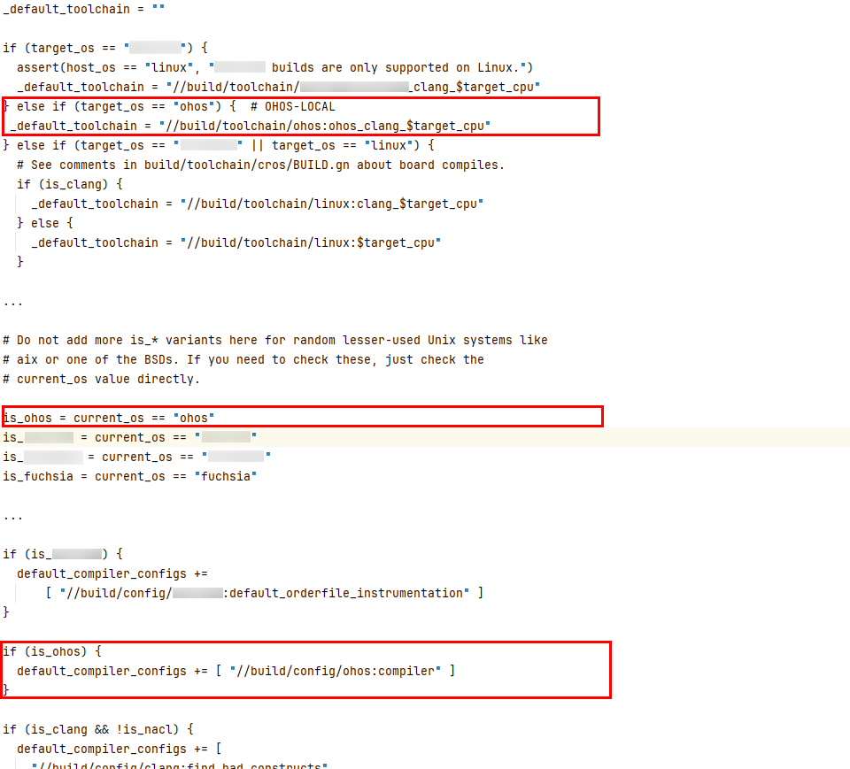
   108|2. **设置HarmonyOS平台clang工具链相关路径**
   109|
   110|   不同平台的工具链会有一些差别，所以需要使用HarmonyOS的工具链。这里主要修改config/clang/clang.gni文件。.gni文件类似于GN的头文件，会被import到各个.gn文件中使用其定义的一些变量。该文件中的核心修改点在于配置指向HarmonyOS SDK的工具链路径。另外还需修改clang\_use\_chrome\_plugins的值为false，HarmonyOS中默认clang\_use\_chrome\_plugins值为false，不设置可能会报错find-bad-constructs文件找不到。
   111|
   112|   此处ohos\_sdk\_native\_root的值需要对应修改为自己本地HarmonyOS SDK中的native的路径。具体修改点如下：
   113|
   114|   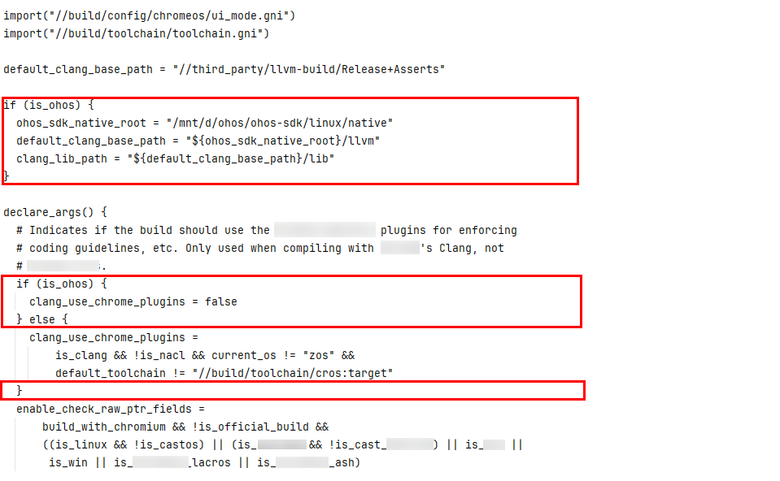
   115|3. **设置HarmonyOS平台sysroot路径**
   116|
   117|   这里主要修改build/config/sysroot.gni文件，sysroot里面包含了许多头文件搜索路径，配置了sysroot之后，编译过程中会去该目录下搜索需要的头文件。SDK里面会提供大量的头文件，这些头文件都会放在sysroot目录下，所以需要引入HarmonyOS对应的sysroot。具体修改点如下：
   118|
   119|   
   120|4. **修改HarmonyOS平台clang版本**
   121|
   122|   这里主要修改build/toolchain/toolchain.gni文件，在该文件中配置HarmonyOS对应的clang版本号。具体修改点如下：
   123|
   124|   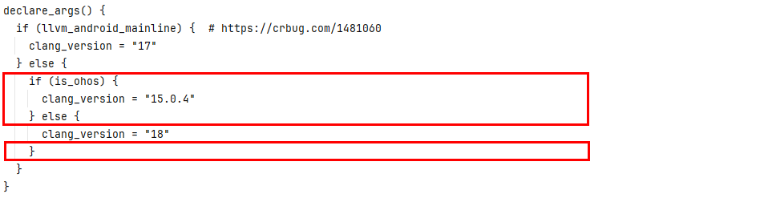
   125|5. **设置各个架构的ohos\_clang\_toolchain**
   126|
   127|   这里主要是在build/toolchain路径下新建一个ohos/BUILD.gn文件，用于配置ohos\_clang\_toolchain，里面主要配置了HarmonyOS用于启动引导程序的.o文件。同时设置HarmonyOS不同架构(主要包括ohos\_clang\_arm、ohos\_clang\_arm64、ohos\_clang\_x86\_64)的ohos\_clang\_toolchain配置信息。具体添加内容如下：
   128|
   129|   ```
   130|   import("//build/config/sysroot.gni")
   131|   import("//build/toolchain/gcc_toolchain.gni")
   132|
   133|   declare_args() &#123;
   134|     # Whether unstripped binaries, i.e. compiled with debug symbols, should be
   135|     # considered runtime_deps rather than stripped ones.
   136|     ohos_unstripped_runtime_outputs = true
   137|     ohos_extra_cflags = ""
   138|     ohos_extra_cppflags = ""
   139|     ohos_extra_cxxflags = ""
   140|     ohos_extra_asmflags = ""
   141|     ohos_extra_ldflags = ""
   142|   &#125;
   143|
   144|   # The ohos clang toolchains share most of the same parameters, so we have this
   145|   # wrapper around gcc_toolchain to avoid duplication of logic.
   146|   #
   147|   # Parameters:
   148|   #  - toolchain_root
   149|   #      Path to cpu-specific toolchain within the ndk.
   150|   #  - sysroot
   151|   #      Sysroot for this architecture.
   152|   #  - lib_dir
   153|   #      Subdirectory inside of sysroot where libs go.
   154|   #  - binary_prefix
   155|   #      Prefix of compiler executables.
   156|   template("ohos_clang_toolchain") &#123;
   157|     gcc_toolchain(target_name) &#123;
   158|       assert(defined(invoker.toolchain_args),
   159|              "toolchain_args must be defined for ohos_clang_toolchain()")
   160|       toolchain_args = invoker.toolchain_args
   161|       toolchain_args.current_os = "ohos"
   162|
   163|       # Output linker map files for binary size analysis.
   164|       enable_linker_map = true
   165|
   166|       ohos_libc_dir =
   167|           rebase_path(invoker.sysroot + "/" + invoker.lib_dir, root_build_dir)
   168|       libs_section_prefix = "$&#123;ohos_libc_dir&#125;/Scrt1.o"
   169|       libs_section_prefix += " $&#123;ohos_libc_dir&#125;/crti.o"
   170|       libs_section_postfix = "$&#123;ohos_libc_dir&#125;/crtn.o"
   171|
   172|       if (invoker.target_name == "ohos_clang_arm") &#123;
   173|         abi_target = "arm-linux-ohos"
   174|       &#125; else if (invoker.target_name == "ohos_clang_arm64") &#123;
   175|         abi_target = "aarch64-linux-ohos"
   176|       &#125; else if (invoker.target_name == "ohos_clang_x86_64") &#123;
   177|         abi_target = "x86_64-linux-ohos"
   178|       &#125;
   179|
   180|       clang_rt_dir =
   181|           rebase_path("$&#123;clang_lib_path&#125;/$&#123;abi_target&#125;/nanlegacy",
   182|                       root_build_dir)
   183|       print("ohos_libc_dir :", ohos_libc_dir)
   184|       print("clang_rt_dir :", clang_rt_dir)
   185|       solink_libs_section_prefix = "$&#123;ohos_libc_dir&#125;/crti.o"
   186|       solink_libs_section_prefix += " $&#123;clang_rt_dir&#125;/clang_rt.crtbegin.o"
   187|       solink_libs_section_postfix = "$&#123;ohos_libc_dir&#125;/crtn.o"
   188|       solink_libs_section_postfix += " $&#123;clang_rt_dir&#125;/clang_rt.crtend.o"
   189|
   190|       _prefix = rebase_path("$&#123;clang_base_path&#125;/bin", root_build_dir)
   191|       cc = "$&#123;_prefix&#125;/clang"
   192|       cxx = "$&#123;_prefix&#125;/clang++"
   193|       ar = "$&#123;_prefix&#125;/llvm-ar"
   194|       ld = cxx
   195|       readelf = "$&#123;_prefix&#125;/llvm-readobj"
   196|       nm = "$&#123;_prefix&#125;/llvm-nm"
   197|       if (!is_debug) &#123;
   198|         strip = rebase_path("$&#123;clang_base_path&#125;/bin/llvm-strip", root_build_dir)
   199|         use_unstripped_as_runtime_outputs = ohos_unstripped_runtime_outputs
   200|       &#125;
   201|       extra_cflags = ohos_extra_cflags
   202|       extra_cppflags = ohos_extra_cppflags
   203|       extra_cxxflags = ohos_extra_cxxflags
   204|       extra_asmflags = ohos_extra_asmflags
   205|       extra_ldflags = ohos_extra_ldflags
   206|     &#125;
   207|   &#125;
   208|
   209|   ohos_clang_toolchain("ohos_clang_arm") &#123;
   210|     sysroot = "$&#123;sysroot&#125;"
   211|     lib_dir = "usr/lib/arm-linux-ohos"
   212|     toolchain_args = &#123;
   213|       current_cpu = "arm"
   214|     &#125;
   215|   &#125;
   216|
   217|   ohos_clang_toolchain("ohos_clang_arm64") &#123;
   218|     sysroot = "$&#123;sysroot&#125;"
   219|     lib_dir = "usr/lib/aarch64-linux-ohos"
   220|     toolchain_args = &#123;
   221|       current_cpu = "arm64"
   222|     &#125;
   223|   &#125;
   224|
   225|   ohos_clang_toolchain("ohos_clang_x86_64") &#123;
   226|     sysroot = "$&#123;sysroot&#125;"
   227|     lib_dir = "usr/lib/x86_64-linux-ohos"
   228|     toolchain_args = &#123;
   229|       current_cpu = "x86_64"
   230|     &#125;
   231|   &#125;
   232|   ```
   233|6. **扩充原本的gcc\_toolchain模版功能**
   234|
   235|   主要修改/build/toolchain/gcc\_toolchain.gni文件。GN工程里面默认会配置gcc\_toolchain，里面会包括一些tool，例如tool("cc")、tool("cxx")、tool("tolink")等等，编译不同的内容时调用其对应的配置项。这里主要是需要修改tool("solink")、tool("solink\_module")中的rspfile\_content配置以及tool("link")中的link\_comand配置。需要在gcc\_toolchain.gni中template("gcc\_toolchain")下添加几个参数（libs\_section\_prefix、libs\_section\_postfix 、solink\_libs\_section\_prefix、solink\_libs\_section\_postfix ）的识别。这几个参数是指向了上一步骤中配置的用于启动引导程序的.o文件。这些参数会在需要修改的rspfile\_content、link\_comand参数中用到。具体修改如下：
   236|
   237|   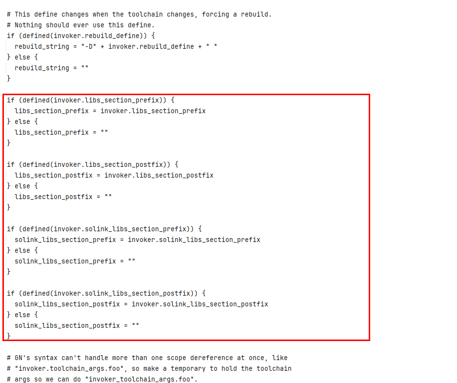
   238|
   239|   修改tool("solink")和tool("solink\_module")中的rspfile\_content为rspfile\_content = "-Wl,--whole-archive `{\{inputs\}}` `{\{solibs\}}` -Wl,--no-whole-archive $solink\_libs\_section\_prefix `{\{libs\}}` $solink\_libs\_section\_postfix"，这里需要用到刚刚定义的参数信息。具体修改如下：
   240|
   241|   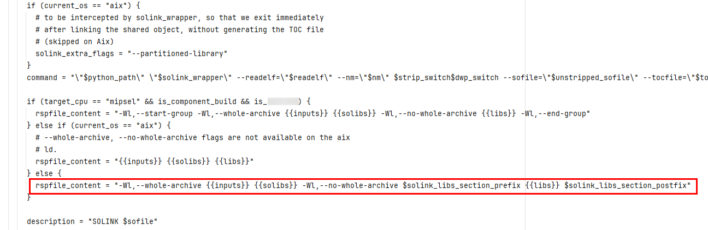
   242|
   243|   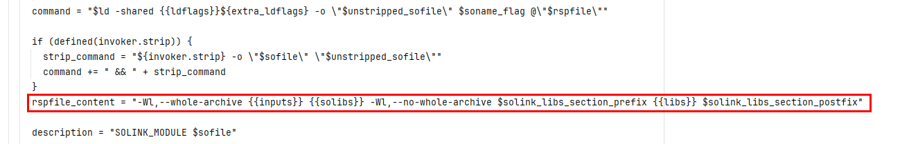
   244|
   245|   修改tool("link")中link\_command为link\_command = "$ld &#123;\&#123;ldflags\&#125;&#125;$\&#123;extra\_ldflags\&#125; -o \"$unstripped\_outfile\" $libs\_section\_prefix $start\_group\_flag @\"$rspfile\" `{\{solibs\}}` `{\{libs\}}` $end\_group\_flag $libs\_section\_postfix"，这里需要用到刚刚定义的参数信息。
   246|
   247|   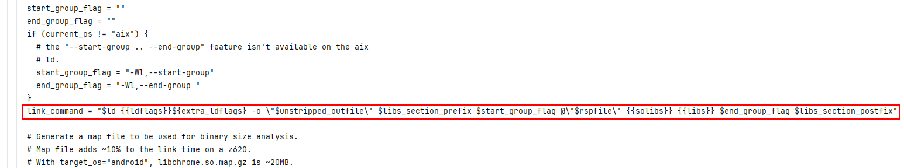
   248|7. **设置HarmonyOS的一些编译参数，将其加入到BUILDCONFIG.gn中**
   249|
   250|   这里需要在build/config路径下新建一个ohos/BUILD.gn文件，该文件主要是定义了一个config("compiler")，该config会被注册到所有的编译目标，该config里面主要设置了基础的编译选项、宏定义等。
   251|
   252|   此处ohos\_clang\_base\_path 的值需要对应修改为自己本地HarmonyOS SDK中的llvm的路径。具体添加内容如下：
   253|
   254|   ```
   255|   import("//build/config/sysroot.gni")
   256|   assert(is_ohos)
   257|
   258|   ohos_clang_base_path = "/mnt/d/ohos/ohos-sdk/linux/native/llvm"
   259|   ohos_clang_version = "15.0.4"
   260|
   261|   if (is_ohos) &#123;
   262|     if (current_cpu == "arm") &#123;
   263|       abi_target = "arm-linux-ohos"
   264|     &#125; else if (current_cpu == "x86") &#123;
   265|       abi_target = ""
   266|     &#125; else if (current_cpu == "arm64") &#123;
   267|       abi_target = "aarch64-linux-ohos"
   268|     &#125; else if (current_cpu == "x86_64") &#123;
   269|       abi_target = "x86_64-linux-ohos"
   270|     &#125; else &#123;
   271|       assert(false, "Architecture not supported")
   272|     &#125;
   273|   &#125;
   274|
   275|   config("compiler") &#123;
   276|     cflags = [
   277|       "-ffunction-sections",
   278|       "-fno-short-enums",
   279|       "-fno-addrsig",
   280|     ]
   281|
   282|     cflags += [
   283|       "-Wno-unknown-warning-option",
   284|       "-Wno-int-conversion",
   285|       "-Wno-unused-variable",
   286|       "-Wno-misleading-indentation",
   287|       "-Wno-missing-field-initializers",
   288|       "-Wno-unused-parameter",
   289|       "-Wno-c++11-narrowing",
   290|       "-Wno-unneeded-internal-declaration",
   291|       "-Wno-undefined-var-template",
   292|       "-Wno-implicit-int-float-conversion",
   293|     ]
   294|     defines = [
   295|       # The NDK has these things, but doesn't define the constants to say that it
   296|       # does. Define them here instead.
   297|       "HAVE_SYS_UIO_H",
   298|     ]
   299|
   300|     defines += [
   301|       "OHOS",
   302|       "__MUSL__",
   303|       "_LIBCPP_HAS_MUSL_LIBC",
   304|       "__BUILD_LINUX_WITH_CLANG",
   305|       "__GNU_SOURCE",
   306|       "_GNU_SOURCE",
   307|     ]
   308|
   309|     ldflags = [
   310|       "-Wl,--no-undefined",
   311|       "-Wl,--exclude-libs=libunwind_llvm.a",
   312|       "-Wl,--exclude-libs=libc++_static.a",
   313|
   314|       # Don't allow visible symbols from libraries that contain
   315|       # assembly code with symbols that aren't hidden properly.
   316|       # http://crbug.com/448386
   317|       "-Wl,--exclude-libs=libvpx_assembly_arm.a",
   318|     ]
   319|
   320|     cflags += [ "--target=$abi_target" ]
   321|     include_dirs = [
   322|       "$&#123;sysroot&#125;/usr/include/$&#123;abi_target&#125;",
   323|       "$&#123;ohos_clang_base_path&#125;/lib/clang/$&#123;ohos_clang_version&#125;/include",
   324|     ]
   325|
   326|     ldflags += [ "--target=$abi_target" ]
   327|
   328|     # Assign any flags set for the C compiler to asmflags so that they are sent
   329|     # to the assembler.
   330|     asmflags = cflags
   331|   &#125;
   332|   ```
   333|8. **build/config/compiler/BUILD.gn中增加对is\_ohos的判断**
   334|
   335|   保证可以正确走HarmonyOS支持的编译分支。这里主要是为了防止clang版本号校验失败导致异常。具体修改如下：
   336|
   337|   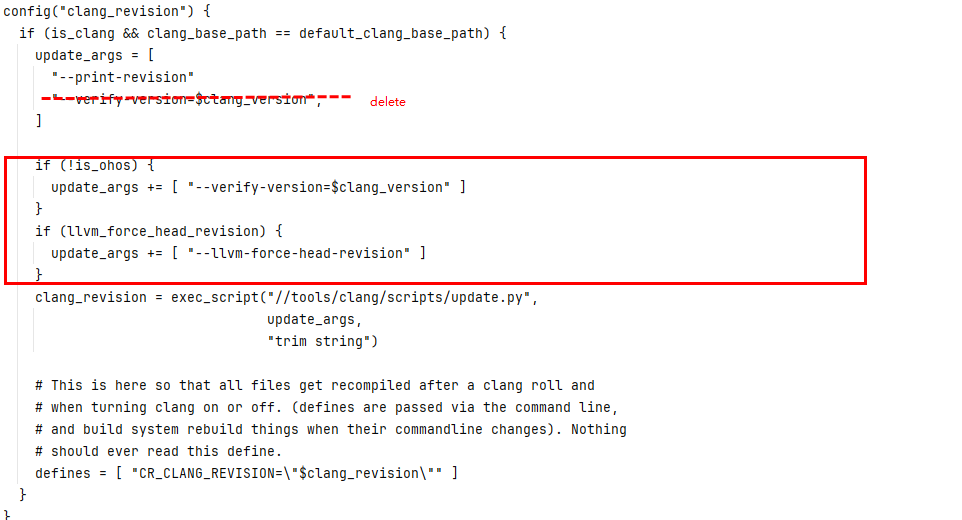
   338|9. **未适配HarmonyOS的三方库走linux编译配置**
   339|
   340|   当前部分三方库还未适配HarmonyOS，涉及到时可以先走linux的编译配置，例如：需要获取config.h文件时。
   341|
   342|   修改modules/video\_capture的BUILD.gn。具体修改如下：
   343|
   344|   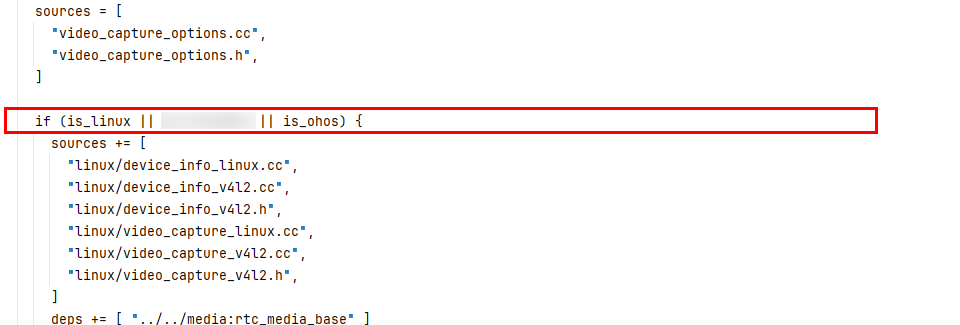
   345|
   346|   修改third\_party/zlib的BUILD.gn。具体修改如下：
   347|
   348|   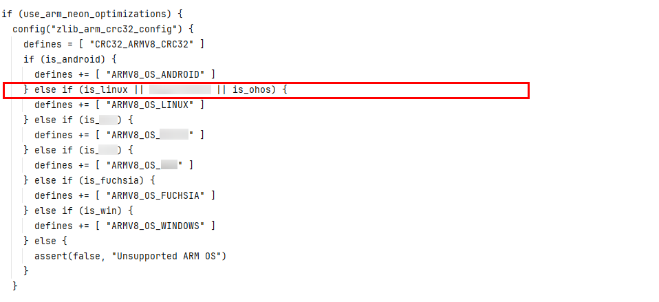
   349|
   350|   修改third\_party/libevent中的BUILD.gn。HarmonyOS SDK中没有queue.h头文件，需要使用compat dir目录下的queue.h头文件。具体修改如下：
   351|
   352|   
   353|10. **编译**
   354|
   355|    先通过GN命令生成对应的ninja文件，然后使用ninja编译命令进行编译。
   356|
   357|    ```
   358|    gn gen ../out/xxx --args='is_clang=true target_os="ohos" target_cpu="arm64" xxx'
   359|    ninja -v -C ../out/xxx $&#123;target_name&#125; -j16
   360|    ```
   361|
   362|    可以根据需要在编译指令中添加对应参数信息。
   363|
   364|    查看具体编译命令：
   365|
   366|    可以在gn gen命令中添加--ninja-args="-v -dkeeprsp"用于查看具体编译命令，这个命令将会在编译过程中打印详细的编译命令，并且保留编译过程中生成的rsp文件。
   367|
   368|    查看一个目标被谁依赖：
   369|
   370|    例如gn refs out/intermediate/arm64\_72 //pc:rtc\_pc\_base。这个命令将显示与目标//pc:rtc\_pc\_base相关的所有依赖项并列出所有引用了该目标的其他目标或文件。
   371|
   372|### 常见问题总结
   373|
   374|在对webRTC的GN工程进行HarmonyOS工具链适配过程中，遇到了一些常见问题场景。下面针对这些问题做一个具体分析。
   375|
   376|1. **Assertion failed. Unsupported ARM OS**
   377|
   378|   **问题详情：**
   379|
   380|   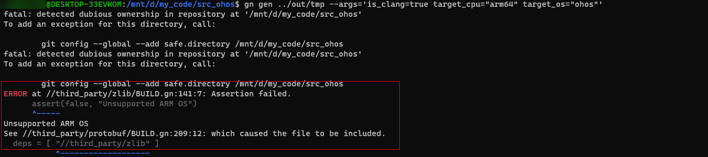
   381|
   382|   **问题原因/解决措施：**
   383|
   384|   三方库内部没有做对is\_ohos的判断，导致走到错误分支。当前很多业务模块还未适配HarmonyOS，暂时可以走linux分支以保证正常编译。
   385|
   386|   **具体修改：**
   387|
   388|   修改third\_party/zlib的BUILD.gn文件。
   389|
   390|   
   391|2. **python找不到pkg-config文件：No such file or directory: 'pkg-config'**
   392|
   393|   **问题详情：**
   394|
   395|   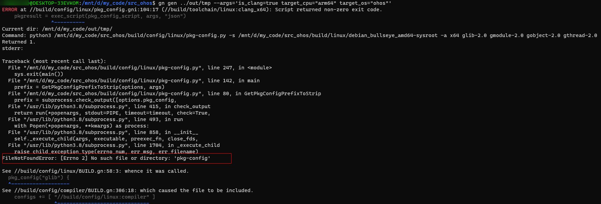
   396|
   397|   **问题原因/解决措施：**
   398|
   399|   缺少pkg-config插件，安装该插件。
   400|
   401|   **具体指令：**
   402|
   403|   ```
   404|   sudo apt-get install pkg-config
   405|   ```
   406|3. **Unknown command line argument '-split-threshold-for-reg-with-hint=0'**
   407|
   408|   **问题详情：**
   409|
   410|   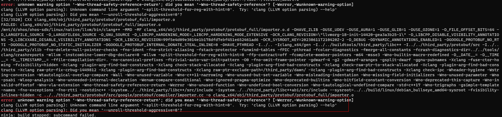
   411|
   412|   **问题原因/解决措施：**
   413|
   414|   编译过程中会提示部分配置不识别，需要将这些配置项删除。
   415|
   416|   **具体修改：**
   417|
   418|   在build/config/compiler/BUILD.gn中删除以下配置。
   419|
   420|   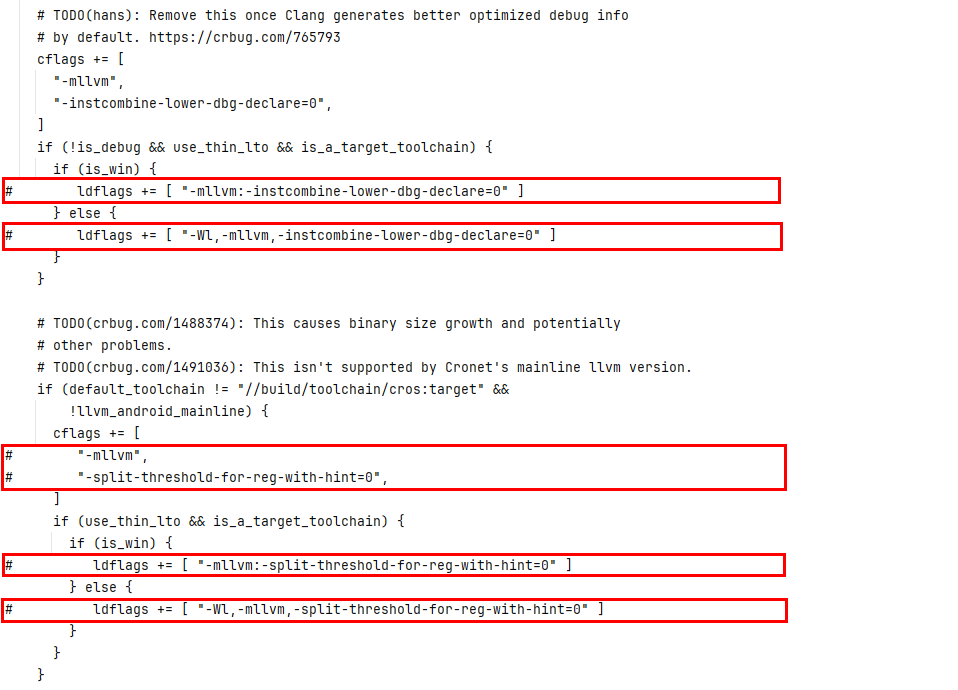
   421|4. **WARN类型导致的ERROR**
   422|
   423|   **问题详情：**
   424|
   425|   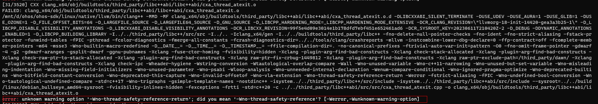
   426|
   427|   **问题原因/解决措施：**
   428|
   429|   编译器驱动程序有时（很少）会在调用之前发出警告。实际的链接器需要确保这些警告是否也被视为致命错误。为了避免编译中出现因警告而造成出错，可以添加编译参数treat\_warnings\_as\_errors = false，或者去除config(treat\_warnings\_as\_errors)中配置的“-Werror”，详情如下：
   430|
   431|   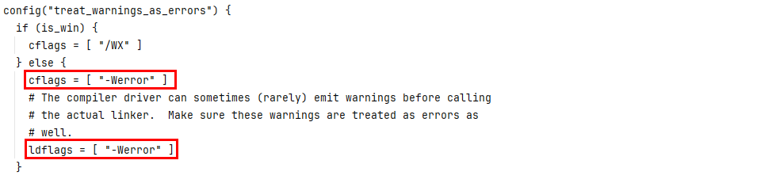
   432|
   433|   **具体修改：**
   434|
   435|   * 添加编译指令配置项treat\_warnings\_as\_errors （建议使用）
   436|
   437|     
   438|   * 修改源代码，在build/config/compiler/BUILD.gn中删除以下配置。
   439|
   440|     
   441|5. **error: reinterpret\_cast from 'pthread\_t' (aka 'unsigned long') to 'rtc::PlatformThreadId' (aka 'int') is not allowed**
   442|
   443|   **问题详情：**
   444|
   445|   
   446|
   447|   **问题原因/解决措施：**
   448|
   449|   rtc\_base/platform\_thread\_types.cc未识别到is\_ohos导致内部走错分支导致异常。目前HarmonyOS支持的接口是gettid()，rtc\_base/platform\_thread\_types.cc需要识别到is\_ohos然后调用gettid()。由于当前很多业务模块还未进行识别，暂时需要走linux分支，故需要保留linux的定义。
   450|
   451|   **具体修改：**
   452|
   453|   * 首先需要在根目录的BUILD.gn中配置识别HarmonyOS系统的变量is\_ohos：
   454|
   455|     
   456|   * 修改rtc\_base/platform\_thread\_types.cc业务代码：
   457|
   458|     
   459|6. **fatal error: 'config.h' file not found**
   460|
   461|   **fatal error: 'sys/queue.h' file not found**
   462|
   463|   **问题详情：**
   464|
   465|   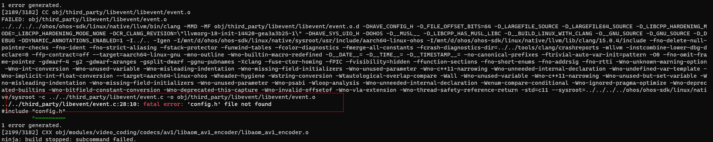
   466|
   467|   **问题原因/解决措施：**
   468|
   469|   找不到config.h头文件，libevent尚未适配HarmonyOS，需要添加is\_ohos的判断并走linux的文件路径寻找config.h。
   470|
   471|   找不到'sys/queue.h'文件，HarmonyOS SDK中没有queue.h头文件，需要使用compat dir目录下的queue.h头文件。
   472|
   473|   **具体修改：**
   474|
   475|   修改third\_party/libevent中的BUILD.gn。
   476|
   477|   
   478|