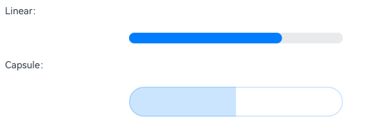
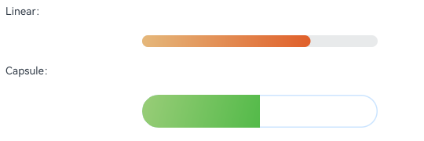

# HarmonyOS 6.1.0(23)

6.1.0(23)在6.0.2(22)的基础上，开发能力得到进一步增强：ArkUI新增自定义键盘切换接续、跑马灯间距配置、滚动组件模拟拖拽等能力；Ability Kit支持Native软件包独立签名及启动时间戳获取；ArkWeb新增模拟点击检测、首屏渲染时间统计、Cookies管理能力；Camera Kit支持HDR动态照片拍摄；Audio Kit新增变声效果和系统音效管理；Media Kit支持批量提取视频缩略图及HDR转SDR；Network Kit增强HTTP请求配置和DNS转码能力；Connectivity Kit的BLE支持自定义广播名称；UI Design Kit新增底部页签悬浮样式和沉浸式材质效果的设置；新增AR Engine人脸识别与骨骼跟踪、3D空间重建会话管理、营销组件等能力，等等。更多详情可参见[OS平台新增和增强特性](https://developer.huawei.com/consumer/cn/doc/harmonyos-releases/os-new-feature-610)。

DevEco Studio能力进一步增强：支持开发API 23工程；支持一键启动模拟器，运行调试应用；Hvigor支持可视化查看和执行任务；CodeGenie支持工程问答，支持添加和管理提示词库；API变更助手扫描结果支持快速智能问答；ArkUI Inspector支持查看窗口交互事件，帮助开发者定位窗口失焦、获焦、重绘等问题，等等。更多详情可参见[DevEco Studio新增和增强特性](https://developer.huawei.com/consumer/cn/doc/harmonyos-releases/deveco-studio-new-features-610)。

## 版本信息

> **注意：**

使用正确的配套关系进行应用开发可以获得更流畅的开发体验。

请在阅读版本更新和变更内容前，务必确认版本的配套关系是否与当前您所使用的开发套件是一致的。

### 6.1.0(23)开发者套件配套信息

| **软件包** | **发布类型** | **版本号** | **发布时间** |
| --- | --- | --- | --- |
| API版本 | Release | 6.1.0(23)  *\***注意**：设备系统支持的API能力范围请以**API版本****为准。* | 2026/04/20 |
| DevEco Studio | Release | DevEco Studio 6.1.0 Release（6.1.0.850）  （Patch版本） | 2026/05/18 |
| DevEco Studio | DevEco Studio 6.1.0 Release（6.1.0.830） | Release | 2026/04/20 |
| SDK | Release | 基于OpenHarmony SDK Ohos\_sdk\_public 6.1.0.105 (API 23 Release) | 2026/04/20 |

> **注意：**

* **API版本**请在设备的“设置”中点击设备名称，进入“**关于本机**”进行查询。

* DevEco Studio版本请从DevEco Studio界面菜单选择“Help > About DevEco Studio”进行查询。请[点击此处](https://developer.huawei.com/consumer/cn/deveco-studio/)获取最新的DevEco Studio软件版本。
* SDK内置在DevEco Studio，安装DevEco Studio时自动安装配套版本SDK。具体版本请从DevEco Studio界面菜单选择“Help > About HarmonyOS SDK”进行查询。

## 应用工程版本信息配置建议

应用工程中应当正确配置应用运行所依赖的SDK版本信息，以确保[应用在不同系统版本的设备上运行时的兼容性](https://developer.huawei.com/consumer/cn/doc/harmonyos-releases/app-compatibility)。

使用该版本开发的应用，其build-profile.json5配置项中关于版本的配置项建议如下：

| **build-profile.json5配置项** | **已开发应用** | | **新启动开发应用** |
| --- | --- | --- | --- |
| **build-profile.json5配置项** | **配置建议** | **配置示例** | **新启动开发应用** |
| compileSdkVersion | 无需显性配置，编译时默认使用配套的SDK版本，即默认为：  “compileSdkVersion”: “6.1.0(23)” | NA | 推荐使用[6.0.0(20)](https://developer.huawei.com/consumer/cn/doc/harmonyos-releases/overview-600)进行新应用的开发。 |
| compatibleSdkVersion | 建议与工程升级前的compatibleSdkVersion保持一致。 | 和升级前保持一致，如：  “compatibleSdkVersion”: “6.0.0(20)” | 推荐使用[6.0.0(20)](https://developer.huawei.com/consumer/cn/doc/harmonyos-releases/overview-600)进行新应用的开发。 |
| targetSdkVersion | 推荐您适配新版本的最新变更，然后配置为：“targetSdkVersion”: “6.1.0(23)”。  如果您期望延迟适配变更，可配置targetSdkVersion与工程升级前的targetSdkVersion一致。 | 1、应用适配变更，变更适配完成后配置为：  “targetSdkVersion”: “6.1.0(23)”  2、应用暂不适配变更，需配置为工程升级前的值，如：  “targetSdkVersion”: “6.0.0(20)” | 推荐使用[6.0.0(20)](https://developer.huawei.com/consumer/cn/doc/harmonyos-releases/overview-600)进行新应用的开发。 |

## 历史版本

### 6.1.0(23) Release配套信息

> **注意：**

该版本为受限发布的版本，未面向全网公开发布。

| **软件包** | **发布类型** | **版本号** | **发布时间** |
| --- | --- | --- | --- |
| ROM | Release | 6.0.0.328 (SP36) | 2026/03/20 |
| DevEco Studio | Release | DevEco Studio 6.1.0 Release（6.1.0.818） | 2026/03/20 |
| SDK | Release | 基于OpenHarmony SDK Ohos\_sdk\_public 6.1.0.105 (API 23 Release) | 2026/03/20 |

### 6.1.0(23) Beta2配套信息

> **注意：**

该版本为受限发布的版本，未面向全网公开发布。

| **软件包** | **发布类型** | **版本号** | **发布时间** |
| --- | --- | --- | --- |
| ROM | Beta | 6.0.0.328 (SP22) | 2026/03/09 |
| DevEco Studio | Beta | DevEco Studio 6.1.0 Beta2（6.1.0.816） | 2026/03/09 |
| SDK | Beta | 基于OpenHarmony SDK Ohos\_sdk\_public 6.1.0.31 (API 23 Beta2) | 2026/03/09 |

### 6.1.0(23) Beta1配套信息

> **注意：**

该版本为受限发布的版本，未面向全网公开发布。

| **软件包** | **发布类型** | **版本号** | **发布时间** |
| --- | --- | --- | --- |
| ROM | Beta | 6.0.0.328 | 2026/02/06 |
| DevEco Studio | Beta | DevEco Studio 6.1.0 Beta1（6.1.0.609） | 2026/02/06 |
| SDK | Beta | 基于OpenHarmony SDK Ohos\_sdk\_public 6.1.0.28 (API 23 Beta1) | 2026/02/06 |

## 6.1.0(23) Release新增关键特性

6.1.0(23) Release在Beta2版本基础上未引入新增特性。

## 6.1.0(23) Beta2新增关键特性

### Ability Kit

BundleInfo新增buildVersion。（[API参考](https://developer.huawei.com/consumer/cn/doc/harmonyos-references/js-apis-bundlemanager-bundleinfo#bundleinfo-1)）

### ArkUI

* 新增支持设置自定义键盘在输入框之间切换时是否接续（即不收回）。（[API参考](https://developer.huawei.com/consumer/cn/doc/harmonyos-references/arkts-apis-uicontext-uicontext#setcustomkeyboardcontinuefeature23)）
* 跑马灯ArkTS API的初始化参数新增两轮跑马灯之间的间距“spacing”和每次滚动的时间间隔“delay”。（[API参考](https://developer.huawei.com/consumer/cn/doc/harmonyos-references/ts-basic-components-marquee#marqueeoptions18对象说明)）
* 跑马灯C API新增[设置](https://developer.huawei.com/consumer/cn/doc/harmonyos-references/capi-native-type-h#oh_arkui_textmarqueeoptions_setspacing)和[获取](https://developer.huawei.com/consumer/cn/doc/harmonyos-references/capi-native-type-h#oh_arkui_textmarqueeoptions_getspacing)间距、[设置](https://developer.huawei.com/consumer/cn/doc/harmonyos-references/capi-native-type-h#oh_arkui_textmarqueeoptions_setloop)和[获取](https://developer.huawei.com/consumer/cn/doc/harmonyos-references/capi-native-type-h#oh_arkui_textmarqueeoptions_getloop)重复滚动次数、[设置](https://developer.huawei.com/consumer/cn/doc/harmonyos-references/capi-native-type-h#oh_arkui_textmarqueeoptions_setfromstart)和[获取](https://developer.huawei.com/consumer/cn/doc/harmonyos-references/capi-native-type-h#oh_arkui_textmarqueeoptions_getfromstart)运行方向、[设置](https://developer.huawei.com/consumer/cn/doc/harmonyos-references/capi-native-type-h#oh_arkui_textmarqueeoptions_setdelay)和[获取](https://developer.huawei.com/consumer/cn/doc/harmonyos-references/capi-native-type-h#oh_arkui_textmarqueeoptions_getdelay)滚动时间间隔的能力。
* 组件布局位置设置新增定义在相对容器中子组件在[水平方向](https://developer.huawei.com/consumer/cn/doc/harmonyos-references/ts-universal-attributes-location#horizontalalignparam23对象说明)和[垂直方向](https://developer.huawei.com/consumer/cn/doc/harmonyos-references/ts-universal-attributes-location#verticalalignparam23对象说明)上的对齐规则。
* 滚动组件新增模拟拖拽功能，支持开启/关闭模拟拖拽功能、设置模拟拖拽距离以及获取是否处于模拟拖拽状态的能力。（[ArkTS API参考](https://developer.huawei.com/consumer/cn/doc/harmonyos-references/ts-container-swiper#startfakedrag23)、[C API参考](https://developer.huawei.com/consumer/cn/doc/harmonyos-references/capi-native-node-h#oh_arkui_swiper_startfakedrag)）

### Basic Services Kit

* 新增用于消除API产生的告警的API注解能力。在源码用此注解后，编译时会根据配置的规则来抑制对应警告。（[API参考](https://developer.huawei.com/consumer/cn/doc/harmonyos-references/js-apis-annotation#suppresswarnings23)）
* 新增支持查询免打扰的相关功能的开启状态。（[API参考](https://developer.huawei.com/consumer/cn/doc/harmonyos-references/js-apis-intelligentscene)）

### Connectivity Kit

新增支持带有卡在位状态周期性检测的NFC Tag读卡事件订阅能力。（[API参考](https://developer.huawei.com/consumer/cn/doc/harmonyos-references/js-apis-nfctag#tagon23)）

### Graphics Accelerate Kit

游戏渲染加速服务新增支持TV设备（[指南](https://developer.huawei.com/consumer/cn/doc/harmonyos-guides/graphics-accelerate-introduction#支持的设备)）。

### Share Kit

新增支持阅读分享功能，即选中文本进行分享时，分享面板同时显示图片分享和文本分享，用户可选择图片或文本进行分享。（[API参考](https://developer.huawei.com/consumer/cn/doc/harmonyos-references/share-system-share#readingextendedsharerecorddata)）

### Spatial Recon Kit

3D空间重建场景下，新增支持空间重建会话管理、3DGS（3D Gaussian Splatting）场景建模、任务控制、进度查询以及三维模型文件导出功能。（[API参考](https://developer.huawei.com/consumer/cn/doc/harmonyos-references/capi-spatial-recon-interface-h)）

## 6.1.0(23) Beta1新增关键特性

开发套件Beta (基于API 23) 新增如下关键特性，开发者可通过新增的API调用相应特性的能力。完整的API新增请参见[API变更清单](https://developer.huawei.com/consumer/cn/doc/harmonyos-releases/apidiff-610)。

### Ability Kit

* 应用程序包管理新增支持对Native软件包（hnp）进行独立签名的能力。可通过module.json5配置文件的hnpPackages标签进行标识。（[指南](https://developer.huawei.com/consumer/cn/doc/harmonyos-guides/module-configuration-file#hnppackages标签)）
* 在启动参数中提供UIAbility开始启动的时间戳（launchUTCTime和launchUptime），应用获取后可用于计算启动时间。（[API参考](https://developer.huawei.com/consumer/cn/doc/harmonyos-references/js-apis-app-ability-abilityconstant#launchparam)）

### AppGallery Kit

应用归因服务新增支持PC/2in1、TV设备。（[指南](https://developer.huawei.com/consumer/cn/doc/harmonyos-guides/store-attribution-introduction#约束与限制)）

### App Linking Kit

* 新增支持配置应用链接跳转的优先级。（[指南](https://developer.huawei.com/consumer/cn/doc/harmonyos-guides/app-linking-startupapp#建立域名与应用关联关系)）
* 延迟链接新增支持PC/2in1设备。（[指南](https://developer.huawei.com/consumer/cn/doc/harmonyos-guides/applinking-deferredlink#约束与限制)）

### AR Engine

* 新增支持人脸识别与跟踪能力。（[指南-ArkTS](https://developer.huawei.com/consumer/cn/doc/harmonyos-guides/arengine-face)、[指南-C/C++](https://developer.huawei.com/consumer/cn/doc/harmonyos-guides/arengine-c-face)）
* 新增支持人体骨骼关键点识别与跟踪能力。（[指南-ArkTS](https://developer.huawei.com/consumer/cn/doc/harmonyos-guides/arengine-body)、[指南-C/C++](https://developer.huawei.com/consumer/cn/doc/harmonyos-guides/arengine-c-body)）

### ArkTS

util模块新增接口ArkTSVM.setMultithreadingDetectionEnabled，支持开启或关闭多线程检测能力。（[API参考](https://developer.huawei.com/consumer/cn/doc/harmonyos-references/js-apis-util#setmultithreadingdetectionenabled23)）

### ArkUI

* FrameNode提供查询节点是否在渲染树上的能力。（[API参考](https://developer.huawei.com/consumer/cn/doc/harmonyos-references/js-apis-arkui-framenode#isinrenderstate23)）
* 普通文本输入框（[API参考](https://developer.huawei.com/consumer/cn/doc/harmonyos-references/ts-universal-attributes-text-style#deletebackward23)）及RichEditor（[API参考](https://developer.huawei.com/consumer/cn/doc/harmonyos-references/ts-basic-components-richeditor#deletebackward23)）新增支持deleteBackward删除字符的能力。
* 普通文本新增支持行首标点符号压缩。（[API参考](https://developer.huawei.com/consumer/cn/doc/harmonyos-references/ts-basic-components-text#compressleadingpunctuation23)）
* TextController新增支持文本选择能力。（[API参考](https://developer.huawei.com/consumer/cn/doc/harmonyos-references/ts-basic-components-text#settextselection23)）
* Text跑马灯新增参数spacing，支持配置跑马灯间距。（[API参考](https://developer.huawei.com/consumer/cn/doc/harmonyos-references/ts-basic-components-text#textmarqueeoptions18对象说明)）
* PersistenceV2的globalConnect新增支持集合类型（Array、Map、Set、Date、collections.Array、collections.Map、collections.Set）的持久化。（[指南](https://developer.huawei.com/consumer/cn/doc/harmonyos-guides/arkts-new-persistencev2)）
* Navigation支持自定义双栏模式下分割线的颜色和间距。（[API参考](https://developer.huawei.com/consumer/cn/doc/harmonyos-references/ts-basic-components-navigation#divider23)）
* List组件或Grid组件下使用LazyForEach或带virtualScroll的Repeat时，新增支持不包含任何节点的空分支，空分支按大小为0的子节点处理。（[List组件ArkTS API参考](https://developer.huawei.com/consumer/cn/doc/harmonyos-references/ts-container-list#supportemptybranchinlazyloading23)、[Grid组件ArkTS API参考](https://developer.huawei.com/consumer/cn/doc/harmonyos-references/ts-container-grid#supportemptybranchinlazyloading23)、[C API参考](https://developer.huawei.com/consumer/cn/doc/harmonyos-references/capi-native-node-h#arkui_nodeattributetype)-ArkUI\_NodeAttributeType新增属性NODE\_LIST\_SUPPORT\_EMPTY\_BRANCH\_IN\_LAZY\_LOADING、NODE\_GRID\_SUPPORT\_EMPTY\_BRANCH\_IN\_LAZY\_LOADING）
* RichEditor新增支持单行模式。（[API参考](https://developer.huawei.com/consumer/cn/doc/harmonyos-references/ts-basic-components-richeditor#singleline23)）

### ArkWeb

* 新增支持Web应用模拟点击检测。（[指南](https://developer.huawei.com/consumer/cn/doc/harmonyos-guides/web-detect-simulated-click-risk-enhanced)）
* 新增支持禁用AI识图能力。（[API参考](https://developer.huawei.com/consumer/cn/doc/harmonyos-references/arkts-basic-components-web-attributes#enableimageanalyzer23)）
* 新增支持获取ConsoleMessage的日志来源。（[API参考](https://developer.huawei.com/consumer/cn/doc/harmonyos-references/arkts-basic-components-web-consolemessage#getsource23)）
* 新增支持Web首屏渲染时间统计的能力，用于衡量首屏网页加载渲染性能。（[API参考](https://developer.huawei.com/consumer/cn/doc/harmonyos-references/arkts-basic-components-web-events#onfirstscreenpaint23)）
* 新增支持获取所有存储的Cookies和Cookies的属性。（[API参考](https://developer.huawei.com/consumer/cn/doc/harmonyos-references/arkts-apis-webview-webcookiemanager#fetchallcookies23)）
* 新增白屏插帧接口，提供插帧信息回调和设置失效时间的能力。（[API参考](https://developer.huawei.com/consumer/cn/doc/harmonyos-references/arkts-apis-webview-webviewcontroller#setblanklessloadingwithparams23)）

### Audio Kit

* 新增C API，支持变声效果节点变声类型设置和设置结果查询。（[API参考](https://developer.huawei.com/consumer/cn/doc/harmonyos-references/capi-native-audio-suite-engine-h#oh_audiosuiteengine_setspacerenderpositionparams)）
* 系统音量变化回调中新增“上一音量值”字段，用于获取音量变化前的音量值。（[API参考](https://developer.huawei.com/consumer/cn/doc/harmonyos-references/arkts-apis-audio-i#streamvolumeevent20)）
* 新增系统音效管理和播放的API，提供管理系统声音的基础能力，包括对系统音效类型的定义、获取系统音效播放器等。（[指南](https://developer.huawei.com/consumer/cn/doc/harmonyos-guides/using-soundplayer-for-playback)、[API参考](https://developer.huawei.com/consumer/cn/doc/harmonyos-references/js-apis-systemsoundmanager)）
* 新增支持获取当前音频路由的预估时延。（[API参考](https://developer.huawei.com/consumer/cn/doc/harmonyos-references/arkts-apis-audio-audiorenderer#getlatency23)）

### AVCodec Kit

AVCodec新增支持AV1/VP9/VP8/RV30/RV40/WVC1/DVVIDEO/RAWVIDEO/MPEG1格式的视频软解码能力。（[指南](https://developer.huawei.com/consumer/cn/doc/harmonyos-guides/avcodec-support-formats#媒体编解码)）

### Basic Service Kit

上传下载的预下载模块新增支持获取对端IP地址。（[API参考](https://developer.huawei.com/consumer/cn/doc/harmonyos-references/js-apis-request-cachedownload#networkinfo20)）

### Call Service Kit

* 新增支持查询应用是否有企业来电显示权限以及获取陌生号码与信息识别开关状态、应用号码识别开关状态。（[API参考](https://developer.huawei.com/consumer/cn/doc/harmonyos-references/callservicekit-numberldentify)）
* 新增支持跳转陌生号码和信息识别设置页面能力。（[指南](https://developer.huawei.com/consumer/cn/doc/harmonyos-guides/callservice-enterprise-contact-display#应用跳转陌生号码和信息识别页面)）

### Camera Kit

* 新增支持获取全质量图和未压缩图的对象。（[API参考](https://developer.huawei.com/consumer/cn/doc/harmonyos-references/arkts-apis-camera-photooutput#oncapturephotoavailable23)）
* 新增支持HDR动态照片拍摄能力，即组成动态照片的静态图片与动态短视频均为高动态范围（HDR）内容。（[指南](https://developer.huawei.com/consumer/cn/doc/harmonyos-guides/camera-moving-photo#hdr动态照片)）
* 新增addMetadataObjectTypes、removeMetadataObjectTypes，用于针对检测类型进行实时增删。（[API参考](https://developer.huawei.com/consumer/cn/doc/harmonyos-references/arkts-apis-camera-metadataoutput#addmetadataobjecttypes23)）
* 新增C API，支持使用元数据对象类型数组创建元数据输出实例。（[API参考](https://developer.huawei.com/consumer/cn/doc/harmonyos-references/capi-camera-manager-h#oh_cameramanager_createmetadataoutputwithobjecttypes)）

### Cloud Foundation Kit

* 新增支持PC/2in1设备。（[指南](https://developer.huawei.com/consumer/cn/doc/harmonyos-guides/cloudfoundation-introduction#支持的设备)）
* 预加载模块新增支持跳链安装预加载类型。（[指南](https://developer.huawei.com/consumer/cn/doc/harmonyos-guides/cloudfoundation-prefetch-overview)、[API参考](https://developer.huawei.com/consumer/cn/doc/harmonyos-references/cloudfoundation-cloudresprefetch#prefetchmode)）

### Connectivity Kit

BLE广播报文数据AdvertiseData新增advertiseName，支持应用自定义BLE广播名称。（[API参考](https://developer.huawei.com/consumer/cn/doc/harmonyos-references/js-apis-bluetooth-ble#advertisedata)）

Wi-Fi的P2P连接方式新增支持通过指定群组频率创建群组的能力。（[API参考](https://developer.huawei.com/consumer/cn/doc/harmonyos-references/js-apis-wifimanager#wifip2pconfig)）

### Crypto Architecture Kit

新增支持通过私钥对象获取公钥对象的能力。（[API参考](https://developer.huawei.com/consumer/cn/doc/harmonyos-references/js-apis-cryptoframework#getpubkey23)）

### Enterprise Space Kit

空间管理场景下，新增支持企业账号认证、获取企业应用访问令牌、设置工作空间状态栏图标、设置工作空间本地名称功能。（[指南](https://developer.huawei.com/consumer/cn/doc/harmonyos-guides/enterprisespace-spacemanager-guide)）

### Form Kit

ArkTS卡片开发支持V2装饰器语法。（[指南](https://developer.huawei.com/consumer/cn/doc/harmonyos-guides/arkts-ui-widget-adapt-faq)）

### Game Service Kit

游戏近场快传新增支持安装包传输。（[指南](https://developer.huawei.com/consumer/cn/doc/harmonyos-guides/gameservice-nearbytransfer-installation-package)、[API参考](https://developer.huawei.com/consumer/cn/doc/harmonyos-references/gameservice-nearbytransfer#gamenearbytransferonremoteinstallationinfonotify)）

### Graphics Accelerate Kit

* 游戏资源加速服务AppDownloadProgress接口新增支持设置资源类型。（[API参考](https://developer.huawei.com/consumer/cn/doc/harmonyos-references/graphics-accelerate-assetdownloadmanager#appdownloadprogress)）
* 游戏启动加速服务新增支持PC/2in1设备。（[指南](https://developer.huawei.com/consumer/cn/doc/harmonyos-guides/graphics-accelerate-introduction#支持的设备)）

### IAP Kit

* 新增开票接口，实现在用户在购买数字商品场景下，申请开发票。（[指南](https://developer.huawei.com/consumer/cn/doc/harmonyos-guides/iap-after-sales)、[API参考](https://developer.huawei.com/consumer/cn/doc/harmonyos-references/iap-iap#iapshowmanagedinvoices)）
* 新增ArkTS嵌入式收银台组件，支持TV设备上的嵌入式收银台。（[API参考](https://developer.huawei.com/consumer/cn/doc/harmonyos-references/iap-arkts-component)）

### Image Kit

* 新增支持读取和批量修改图像源的元数据的能力。（[API参考](https://developer.huawei.com/consumer/cn/doc/harmonyos-references/arkts-apis-image-imagesource#readimagemetadata23)）
* PixelMap新增自动处理旋转角的能力。（[ArkTS API参考](https://developer.huawei.com/consumer/cn/doc/harmonyos-references/arkts-apis-image-f#imagecreatepixelmapfromsurfacewithtransformation23)、[C API参考](https://developer.huawei.com/consumer/cn/doc/harmonyos-references/capi-pixelmap-native-h#oh_pixelmapnative_createpixelmapfromsurfacewithtransformation)）

### Live View Kit

新增支持基于地理位置的实况窗提醒。（[API参考](https://developer.huawei.com/consumer/cn/doc/harmonyos-references/liveview-liveviewmanager#liveviewmanagerstartliveviewbytrigger)）

### Map Kit

* 新增3D地图城市灯光效果。（[指南](https://developer.huawei.com/consumer/cn/doc/harmonyos-guides/map-presenting#开启3d地球)、[API参考](https://developer.huawei.com/consumer/cn/doc/harmonyos-references/map-map-mapcomponentcontroller#setsphereenabled-2)）
* 新增支持在地图左下角设置审图号。（[指南](https://developer.huawei.com/consumer/cn/doc/harmonyos-guides/map-controls-and-interaction#审图号)、[API参考](https://developer.huawei.com/consumer/cn/doc/harmonyos-references/map-map-mapcomponentcontroller#setapprovenumberenabled)）
* 新增支持设置Marker碰撞优先级以及Marker最大、最小层级。（[API参考](https://developer.huawei.com/consumer/cn/doc/harmonyos-references/map-common#markeroptions)）

### NearLink Kit

新增查询当前设备是否支持NearLink Kit的能力。（[指南](https://developer.huawei.com/consumer/cn/doc/harmonyos-guides/nearlink-issupported)、[API参考](https://developer.huawei.com/consumer/cn/doc/harmonyos-references/nearlink-manager#isnearlinksupported)）

### MDM Kit

* 新增支持根据给定的bundleInfoGetFlag获取设备指定用户下已安装应用列表。（[API参考](https://developer.huawei.com/consumer/cn/doc/harmonyos-references/js-apis-enterprise-bundlemanager#bundlemanagergetinstalledbundlelist23)）
* 应用管理模块新增支持设置UIAbility组件禁用策略。（[API参考](https://developer.huawei.com/consumer/cn/doc/harmonyos-references/js-apis-enterprise-applicationmanager#applicationmanagersetabilitydisabled23)）
* MDM应用支持在后台访问context和启动应用的功能。（[API参考](https://developer.huawei.com/consumer/cn/doc/harmonyos-references/s-apis-application-enterpriseadminextensioncontext)）

### Media Kit

* 新增支持批量提取视频缩略图的能力，通过传入一个时间戳数组，可获取时间戳对应视频帧的缩略图。（[指南](https://developer.huawei.com/consumer/cn/doc/harmonyos-guides/avmetadataextractor)-详见步骤7、[API参考](https://developer.huawei.com/consumer/cn/doc/harmonyos-references/arkts-apis-media-avmetadataextractor#fetchframesbytimes23)）
* 支持将HDR VIVID/HLG/HDR10视频转换为SDR视频，以及SDR视频的转码。（[指南](https://developer.huawei.com/consumer/cn/doc/harmonyos-guides/media-kit-intro#支持的格式-4)）

### Media Library Kit

新增支持获取媒体库相册的虚拟路径。（[API参考](https://developer.huawei.com/consumer/cn/doc/harmonyos-references/arkts-apis-photoaccesshelper-e#albumkeys)）

### Network Kit

* HTTP请求新增多个可选配置信息（[API参考](https://developer.huawei.com/consumer/cn/doc/harmonyos-references/js-apis-http#httprequestoptions)）：
  + 新增配置参数customMethod支持自定义请求方法；
  + 新增配置参数maxRedirects支持针对HttpRequest指定最大跳转次数；
  + 新增配置参数sniHostName支持客户端通过配置SNI（Server Name Indication，服务器名称指示）在TLS握手阶段向服务器声明目标域名；
  + 新增配置参数pathPreference支持HTTP请求指定特定激活的网络。
* 新增接口支持VPN类应用获取数据包对应的UID。（[API参考](https://developer.huawei.com/consumer/cn/doc/harmonyos-references/js-apis-net-connection#connectiongetconnectowneruid23)）
* DNS解析能力支持转码，可将Unicode编码形式的主机名转换为ASCII编码形式（[API参考](https://developer.huawei.com/consumer/cn/doc/harmonyos-references/js-apis-net-connection#connectiongetdnsascii23)），也可将ASCII编码形式的主机名转换为Unicode编码形式（[API参考](https://developer.huawei.com/consumer/cn/doc/harmonyos-references/js-apis-net-connection#connectiongetdnsunicode23)）。（[指南](https://developer.huawei.com/consumer/cn/doc/harmonyos-guides/net-dns)）

### Notification Kit

* NotificationRequest中新增多个属性（[API参考](https://developer.huawei.com/consumer/cn/doc/harmonyos-references/js-apis-inner-notification-notificationrequest#notificationrequest-1)）：
  + 新增属性priorityNotificationType，支持设置通知优先显示。
  + 新增属性overlayIcon，支持设置重叠图标。
* NotificationFlags新增属性，支持应用调整通知是否在横幅和锁屏界面显示。（[API参考](https://developer.huawei.com/consumer/cn/doc/harmonyos-references/js-apis-inner-notification-notificationflags#notificationflags-1)）

### Payment Kit

新增营销组件，开发者可在应用内实现领券、选券能力。（[指南](https://developer.huawei.com/consumer/cn/doc/harmonyos-guides/payment-promotion-service)、[API参考](https://developer.huawei.com/consumer/cn/doc/harmonyos-references/payment-promotionservice)）

### PDF Kit

* 新增支持自定义页面视图的缩放范围。（[API参考](https://developer.huawei.com/consumer/cn/doc/harmonyos-references/pdf-arkts-pdfviewmanage#setmaxzoom)）
* 新增支持在PDF页面获取页面文本信息。（[API参考](https://developer.huawei.com/consumer/cn/doc/harmonyos-references/pdf-arkts-pdfservice#gettextcontent)）

### Pen Kit

新增禁用画布缩放能力、设置滚动位置ScrollTo及监听长画布滚动位置能力、自定义长画布最大高度能力。（[指南](https://developer.huawei.com/consumer/cn/doc/harmonyos-guides/pen-suite)、[API参考](https://developer.huawei.com/consumer/cn/doc/harmonyos-references/pen-handwritecomponent#handwritecomponent)）

### Performance Analysis Kit

HiappEvent新增ArkWeb抛滑触控操作丢帧检测能力。（[指南](https://developer.huawei.com/consumer/cn/doc/harmonyos-guides/hiappevent-watcher-web-fling-jank-events)）

HiDebug新增提供添加维测信息的接口，开发者可根据业务需要将维测信息添加到崩溃日志中，若程序发生崩溃，可在崩溃日志中找到该维测信息。（[指南](https://developer.huawei.com/consumer/cn/doc/harmonyos-guides/hidebug-guidelines#添加维测信息到崩溃日志中)、[API参考](https://developer.huawei.com/consumer/cn/doc/harmonyos-references/capi-hidebug-h#oh_hidebug_setcrashobj)）

AppFreeze日志中调用栈的堆栈信息增加线程状态信息。（[指南](https://developer.huawei.com/consumer/cn/doc/harmonyos-guides/appfreeze-guidelines#堆栈信息)）

### Preview Kit

新增C API，支持通用文件缓存加速功能，即通过缓存解码后的图片、视频等数据至磁盘，实现后续文件打开或浏览时的直接读取，减少重复解码耗时，提升用户操作流畅度。（[指南](https://developer.huawei.com/consumer/cn/doc/harmonyos-guides/preview-filecacheboost)）

### Remote Communication Kit

* 新增Response.toJSON接口，支持BigInt模式。（[API参考](https://developer.huawei.com/consumer/cn/doc/harmonyos-references/remote-communication-rcp#tojson-1)）
* 在网络请求的场景下，新增支持通过OnAuthenticationChallenge接口，实现认证挑战。（[API参考](https://developer.huawei.com/consumer/cn/doc/harmonyos-references/remote-communication-rcp#onauthenticationchallenge)）
* 在网络请求的场景下，新增支持获取本次请求的重定向次数。（[API参考](https://developer.huawei.com/consumer/cn/doc/harmonyos-references/remote-communication-rcp#debugevent)）
* 在网络请求的场景下，新增支持通过ConnectionReusePolicy接口，设置HTTP管道复用策略。（[API参考](https://developer.huawei.com/consumer/cn/doc/harmonyos-references/remote-communication-rcp#connectionreusepolicy)）
* 新增支持应用通过network\_config.json文件，配置HTTP明文请求禁用策略。（[指南](https://developer.huawei.com/consumer/cn/doc/harmonyos-guides/remote-communication-preparations#http明文设置)）
* 新增默认的通信会话，支持在不需要定制Session的配置场景下，便捷地发起网络请求。（[API参考](https://developer.huawei.com/consumer/cn/doc/harmonyos-references/remote-communication-rcp#defaultsession)）
* 在网络请求的场景下，新增支持通过CookieRepository管理cookie。（[API参考](https://developer.huawei.com/consumer/cn/doc/harmonyos-references/remote-communication-rcp#cookierepository)）

### Scan Kit

默认界面扫码能力、图像识码能力和自定义界面扫码能力支持带后置相机的Wearable。（[指南](https://developer.huawei.com/consumer/cn/doc/harmonyos-guides/scan-introduction#支持的设备)）

### Telephony Kit

新增VCard模块，提供电子名片的文件格式标准，支持将VCard文件导入联系人数据库和将联系人数据导出为VCard文件等。（[API参考](https://developer.huawei.com/consumer/cn/doc/harmonyos-references/js-apis-vcard)）

### UI Design Kit

* 新增底部页签悬浮样式以及迷你栏，支持迷你栏动态折叠展开。（[指南](https://developer.huawei.com/consumer/cn/doc/harmonyos-guides/ui-design-hds-tabs-bar-floating)、[API参考](https://developer.huawei.com/consumer/cn/doc/harmonyos-references/ui-design-hdstabs#hdstabsfloatingstyle)）
* 导航组件新增支持设置双栏模式下的分割线和右侧页面显示默认占位页。（[API参考-双栏分割线](https://developer.huawei.com/consumer/cn/doc/harmonyos-references/ui-design-hdsnavigation#divider)、[API参考-双栏默认占位页](https://developer.huawei.com/consumer/cn/doc/harmonyos-references/ui-design-hdsnavigation#splitplaceholder)）
* 导航组件新增支持设置标题字号、局部页面自定义主题等能力。（[API参考-标题字号](https://developer.huawei.com/consumer/cn/doc/harmonyos-references/ui-design-hdsnavigation#titlesize)、[API参考-局部自定义](https://developer.huawei.com/consumer/cn/doc/harmonyos-references/ui-design-hdsnavdestination#withtheme)）
* 底部页签和导航组件新增支持沉浸式材质效果。（[API参考-底部页签材质参数](https://developer.huawei.com/consumer/cn/doc/harmonyos-references/ui-design-hdstabs#systemmaterialparams)、[API参考-导航组件材质参数](https://developer.huawei.com/consumer/cn/doc/harmonyos-references/ui-design-hdsnavigation#systemmaterialparams)）
* 列表卡片新增支持无障碍相关能力，包括无障碍分组、聚合播报等。（[API参考](https://developer.huawei.com/consumer/cn/doc/harmonyos-references/ui-design-hdslistitemcard#accessibilitygroupoptions)）
* 新增支持设置列表的预览菜单样式、横滑删除触发类型以及拦截无障碍事件等能力。（[API参考](https://developer.huawei.com/consumer/cn/doc/harmonyos-references/ui-design-hdslistitem#menustyle)）
* 侧边栏新增支持通过横滑手势打开/关闭侧边栏。（[API参考](https://developer.huawei.com/consumer/cn/doc/harmonyos-references/ui-design-hdssidebar#接口)）
* 操作栏新增支持设置操作栏上下边距。（[API参考](https://developer.huawei.com/consumer/cn/doc/harmonyos-references/ui-design-hdsactionbar#actionbarstyle)）
* 即时消息栏新增支持高度随组件文本内容自适应变化。（[API参考](https://developer.huawei.com/consumer/cn/doc/harmonyos-references/ui-design-hdssnackbar#snackbarstyleoptions)）
* 新增材质模块，支持设置材质类型和等级，实现组件的沉浸式材质效果。（[API参考](https://developer.huawei.com/consumer/cn/doc/harmonyos-references/ui-design-hdsmaterial)）

### Universal Keystore Kit

HUKS新增支持群组密钥功能，针对同一开发者开发的多个HAP应用提供跨应用密钥共享能力。（[指南](https://developer.huawei.com/consumer/cn/doc/harmonyos-guides/huks-group-key-overview)）

### Weather Service Kit

* 新增支持根据精确位置查询天气信息。（[API参考](https://developer.huawei.com/consumer/cn/doc/harmonyos-references/weather-service-weatherservice#weatherrequest)）
* 新增支持根据位置信息，查询对应位置地点名称。（[API参考](https://developer.huawei.com/consumer/cn/doc/harmonyos-references/weather-service-weatherservice#city)）
* 新增支持TV设备。（[指南](https://developer.huawei.com/consumer/cn/doc/harmonyos-guides/weather-service-introduction#约束与限制)）

### 调测调优

打包工具打包hap/hsp时，支持传入已存在的hap/hsp（--exist-src-path）和指定要保留的目录（--lib-path-retain），要保留的目录会从已存在的hap/hsp中直接拷贝到目标包，不会从源文件中重新压缩打包。当前保留目录只支持--lib-path。（[指南](https://developer.huawei.com/consumer/cn/doc/harmonyos-guides/packing-tool)）

## 应用行为变更

| Kit | 变更描述 |
| --- | --- |
| ArkUI | [Progress组件color属性设置渐变色规格变更](https://developer.huawei.com/consumer/cn/doc/harmonyos-releases/changelogs-for-all-apps-6101#ch2025092048488) |
| ArkUI | [横屏悬浮窗尺寸优化](https://developer.huawei.com/consumer/cn/doc/harmonyos-releases/changelogs-for-all-apps-6101#ch2025121230160) |
| ArkGraphics 2D  （该变更同时涉及ArkUI） | [WordBreak.HYPHENATION移除以下六种语言连字符“-”断词换行能力的支持：捷克语、印度尼西亚语、拉脱维亚语、马其顿语、斯洛伐克语、塞尔维亚语](https://developer.huawei.com/consumer/cn/doc/harmonyos-releases/changelogs-for-all-apps-6101#ch2025112072187) |
| Localization Kit | [全球化接口与运行时接口本地化显示优化及换行能力增强](https://developer.huawei.com/consumer/cn/doc/harmonyos-releases/changelogs-for-all-apps-6101#ch2025121032586) |
| Performance Analysis Kit | [JS OOM异常崩溃栈形式变更](https://developer.huawei.com/consumer/cn/doc/harmonyos-releases/changelogs-for-all-apps-6101#ch2025110734134) |

## 变更公告

## ArkUI

### Progress组件color属性设置渐变色规格变更

**变更原因**

Progress的渐变色能力增强，新增支持通过color设置Linear和Capsule进度条前景色为渐变色。

**变更影响**

此变更涉及应用适配。

> **注意：**

此变更已做版本隔离，变更仅在应用的targetSdkVersion设置为大于等于6.1.0(23)时生效。

变更前：Progress进度条的Linear和Capsule样式通过color设置渐变色，设置后仅会显示为默认主题色。

变更后：Progress进度条的Linear和Capsule样式通过color设置渐变色，设置后会显示为指定的渐变色。

例如使用下面代码，通过color设置Linear和Capsule样式进度条的前景色为渐变色，变更前均显示为默认主题色蓝色，变更后可以显示为实际的设置效果。

```
// xxx.ets
@Entry
@Component
struct ProgressExample {
  private gradientColor: LinearGradient = new LinearGradient([{ color: "#E5B87B", offset: 0.5 },
    { color: "#E05F2A", offset: 1.0 }])
  public gradientColor2: LinearGradient = new LinearGradient([{ color: "#99CD78", offset: 0.5 },
    { color: "#53BA49", offset: 1.0 }])

  build() {
    Column({ space: 15 }) {
      Text('Linear：').fontSize(9).width('90%')
      Progress({ value: 70, total: 100, type: ProgressType.Linear })
        .width(200).style({ strokeWidth: 10 })
        .color(this.gradientColor)

      Text('Capsule：').fontSize(9).width('90%')
      Progress({ value: 50, total: 100, type: ProgressType.Capsule })
        .width(200).style({ strokeWidth: 40 })
        .color(this.gradientColor2)
    }.width('100%').padding({ top: 5 })
  }
}
```

| 变更前 | 变更后 |
| --- | --- |
|  |  |

**起始API Level**

7

**变更的接口/组件**

Progress组件的color属性。

**适配指导**

开发者需根据实际需求进行适配，如果期望进度条设置为单色，color中value参数的类型需为ResourceColor，参考示例如下。如果期望设置为渐变色，value参数的类型需为LinearGradient。

```
// xxx.ets
@Entry
@Component
struct ProgressExample {
  build() {
    Column({ space: 15 }) {
      Text('Linear Progress').fontSize(9).fontColor(0xCCCCCC).width('90%')
      Progress({ value: 20, total: 150, type: ProgressType.Linear }).color(Color.Grey).value(50).width(200)

      Text('Capsule Progress').fontSize(9).fontColor(0xCCCCCC).width('90%')
      Row({ space: 40 }) {
        Progress({ value: 20, total: 150, type: ProgressType.Capsule }).color(Color.Grey).value(50).width(100).height(50)
      }
    }.width('100%').margin({ top: 30 })
  }
}
```

### 横屏悬浮窗尺寸优化

**变更原因**

应用横屏布局尺寸按横屏屏幕大小布局，旧悬浮窗尺寸过小导致要额外适配显示布局。

**变更影响**

显示效果调整，横屏悬浮窗应用布局尺寸优化，仅改变应用布局尺寸，通过调整scale值保障用户界面看到的窗口大小不变。

以下场景可能需要应用适配：应用监听窗口size做了不同布局效果。

变更前：布局尺寸使用屏幕**宽度**作为横向应用布局宽度，高是宽的一定比例。

变更后：布局尺寸使用屏幕**高度**作为横向应用布局宽度，高是宽的一定比例。

**起始API Level**

6

**变更的接口/组件**

不涉及

**适配指导**

默认效果变更，开发者需审视此变更是否对自身相关业务代码逻辑产生影响，若有影响需根据自身业务代码进行对应适配。

### 新增状态管理V1校验报错

**变更原因**

自定义组件struct中使用状态管理V1的装饰器装饰Function类型的变量时，会出现运行时crash异常，提示开发者不支持装饰Function类型。为提升开发者运行时代码的稳定性，新增编译报错：如果自定义组件struct中使用状态管理V1的装饰器装饰Function类型的变量，则编译报错并中断编译。

**变更影响**

此变更涉及应用适配。

变更前：自定义组件struct中使用状态管理V1装饰器装饰Function类型的变量时，编译能通过，但运行时会出现crash，并提示不支持该装饰方式。

变更后：新增编译报错：如果自定义组件struct中使用状态管理V1的装饰器装饰Function类型的变量，则编译报错并中断编译，编译报错：The V1 decorator 'xxx' cannot be applied to a Function-type variable 'yyy'。

**起始 API Level**

不涉及API

**变更的接口/组件**

ArkUI状态管理V1装饰器：

@State, @Prop, @Link, @Provide, @Consume, @StorageLink, @LocalStorageLink, @StorageProp, @LocalStorageProp, @ObjectLink

**适配指导**

当被状态管理V1的装饰器装饰的变量类型为Function类型（如下示例为Function类型）时，可以将对应的状态管理V1的装饰器移除，使用常规变量声明修复编译与运行时异常。

编译报错示例：

```
@Entry
@Component
struct Index {
  @State func1: Function = () => {}; // 编译报错
  @State func2: (input: number) => void = (input: number) => {}; // 编译报错

  build() {
    // 业务代码
  }
}
```

将@State移除后可修复编译报错：

```
@Entry
@Component
struct Index {
  func1: Function = () => {};
  func2: (input: number) => void = (input: number) => {};

  build() {
    // 业务代码
  }
}
```

## ArkGraphics 2D（该变更同时涉及ArkUI）

### WordBreak.HYPHENATION移除以下六种语言连字符“-”断词换行能力的支持：捷克语、印度尼西亚语、拉脱维亚语、马其顿语、斯洛伐克语、塞尔维亚语

**变更原因**

Hyphen库将移除部分不兼容语种，这些语种的连字符“-”进行断词换行能力将会失效。

**变更影响**

变更前：针对捷克语、印度尼西亚语、拉脱维亚语、马其顿语、斯洛伐克语、塞尔维亚语的语言环境下，Hyphen断词模式下会有连字符“-”断词换行效果。

变更后：针对捷克语、印度尼西亚语、拉脱维亚语、马其顿语、斯洛伐克语、塞尔维亚语的语言环境下，Hyphen断词模式下连字符“-”断词换行效果不再生效，换行效果自动回落到以单词为单位进行换行。

**起始 API Level**

18

**变更的接口/组件**

* ArkUI：文本组件text.d.ts文件TextAttribute中wordBreak属性对应属性值：WordBreak.HYPHENATION
* ArkGraphics 2D：
  + ArkTS API：@ohos.graphics.text.d.ts文件interface ParagraphStyle中wordBreak属性对应属性值：WordBreak.BREAK\_HYPHEN
  + C API：drawing\_text\_typography.h文件enum OH\_Drawing\_WordBreakType中类型：WORD\_BREAK\_TYPE\_BREAK\_HYPHEN

**适配指导**

默认效果变更：接口默认效果变更，但开发者需审视此变更是否对自身相关业务展示效果产生影响，若有影响需根据自身业务代码进行对应适配。

## Localization Kit

### 全球化接口与运行时接口本地化显示优化及换行能力增强

**变更原因**

ICU版本已从72.1升级至74.2，本次升级基于[ICU 74.2数据](https://icu.unicode.org/download/74)，优化了本地化表达习惯，使部分全球化接口及运行时接口的行为更贴合各地区的语言使用规范，同时提升了系统的文本换行处理能力。

**变更影响**

此变更涉及应用适配。

具体接口行为变化详见**变更的接口/组件**，系统换行能力更新如下：

| 变更前 | 变更后 |
| --- | --- |
| 中日韩表意字符未包含 U+2EBF0 至 U+2EE5F 范围内的字符。 | 中日韩表意字符新增该范围内 622 个表意字符及 5 个具有特殊含义的表意字符。 |
| 缅甸语、泰语、老挝语、高棉语不支持正字法音节之间进行断行处理，例如在Text控件中，缅甸语文本“သော့换行点ခလောက်”会在“换行点”处断开。 | 缅甸语、泰语、老挝语、高棉语支持正字法音节之间进行断行处理，例如在Text控件中，缅甸语文本“换行点သော့ခလောက်”会在“换行点”处断开。 |

**起始API Level**

API 6

**变更的接口/组件**

| 接口 | 变更场景举例 | 变更前返回值 | 变更后返回值 |
| --- | --- | --- | --- |
| [intl.DateTimeFormat.format](https://developer.huawei.com/consumer/cn/doc/harmonyos-references/js-apis-intl#formatdeprecated) | 繁体中文下格式化2024年4月23日 | 2024年4月23日 | 2024 年 4 月 23 日 |
| [intl.DateTimeFormat.formatRange](https://developer.huawei.com/consumer/cn/doc/harmonyos-references/js-apis-intl#formatrangedeprecated) | 英式英语下格式化2020年12月20日至21日 | 20/12/2020 – 21/12/2020 | 20/12/2020 – 21/12/2020 （日期间连接符变更） |
| [intl.Locale.maximize](https://developer.huawei.com/consumer/cn/doc/harmonyos-references/js-apis-intl#maximizedeprecated) | 区域ID为hy-arevmda | hyw | hyw-Armn-AM |
| [intl.Locale.minimize](https://developer.huawei.com/consumer/cn/doc/harmonyos-references/js-apis-intl#minimizedeprecated) | 区域ID为und-150 | ru | en-150 |
| [intl.RelativeTimeFormat.format](https://developer.huawei.com/consumer/cn/doc/harmonyos-references/js-apis-intl#formatdeprecated-1) | 英文下显示在1季度内 | in 1 qtr. | in 1q |
| [i18n.System.getDisplayCountry](https://developer.huawei.com/consumer/cn/doc/harmonyos-references/js-apis-i18n#getdisplaycountry9) | 地区ID是AC，语言ID是es | Isla de la Ascensión | Isla Ascensión |
| [i18n.System.getDisplayLanguage](https://developer.huawei.com/consumer/cn/doc/harmonyos-references/js-apis-i18n#getdisplaylanguage9) | 中文下显示语言ID为yue的名称 | 粤文 | 粤语 |
| [i18n.Transliterator.transform](https://developer.huawei.com/consumer/cn/doc/harmonyos-references/js-apis-i18n#transform9) | 将꽇转换为拉丁文 | 꽇 | kē |
| [i18n.TimeZone.getDisplayName](https://developer.huawei.com/consumer/cn/doc/harmonyos-references/js-apis-i18n#getdisplayname) | Asia/Kamchatka时区在捷克语下的显示名称 | Petropavlovsko-kamčatský standardní čas | petropavlovsko-kamčatský standardní čas |
| [i18n.Calendar.getDisplayName](https://developer.huawei.com/consumer/cn/doc/harmonyos-references/js-apis-i18n#getdisplayname8) | type参数为islamic\_tbla的历法在中文下的显示名称 | 伊斯兰天文历 | islamic-tbla |
| [i18n.getSimpleDateTimeFormatBySkeleton](https://developer.huawei.com/consumer/cn/doc/harmonyos-references/js-apis-i18n#i18ngetsimpledatetimeformatbyskeleton20) | 框架字符串传入yMdhms在中文下格式化日期 | 13/12/2024 上午6:30:25 | 13/12/2024 上午 6:30:25 |
| Date.toLocaleDateString | 在阿拉伯语下格式化日期 | 'الخميس، ٢٠ ديسمبر ٢٠١٢' | 'الخميس، ٢٠ ديسمبر، ٢٠١٢' |
| Date.toLocaleString | 在英文下格式化日期 | 10/20/2022, 6:00:00 PM | 10/20/2022, 6:00:00 PM（PM前的空白字符变更） |
| Date.toLocaleTimeString | 在英文下格式化日期 | 6:00:00 PM | 6:00:00 PM（PM前的空白字符变更） |
| Intl.DateTimeFormat.format | 繁体中文下格式化2024年4月23日 | 2024年4月23日 | 2024 年 4 月 23 日 |
| Intl.DateTimeFormat.formatRange | 英式英语下格式化2020年12月20日至21日 | 20/12/2020 – 21/12/2020 | 20/12/2020 – 21/12/2020（日期间连接符变更） |
| Intl.DateTimeFormat.formatRangeToParts | 英语下格式化2020年12月20日至21日 | `{ type: "literal", value: " – " }` | `{"type":"literal","value":" – "}（value中空白字符变更）` |
| Intl.ListFormat.format | 在中文下格式化列表 | Motorcycle、Bus和Car | Motorcycle、Bus、Car |
| Intl.RelativeTimeFormat.format | 英文下显示在1季度内 | in 1 qtr. | in 1q |
| Intl.Locale.maximize | 区域ID为hy-arevmda | hyw | hyw-Armn-AM |
| Intl.Locale.minimize | 区域ID为und-150 | ru | en-150 |
| [ubrk\_next](https://developer.huawei.com/consumer/cn/doc/harmonyos-references/icu4c-symbol) | 对文本“service@baidu.com”进行分词解析 | @ 符号会与相邻字母粘连，“service@baidu.com”被识别为一个不可分割的整体。 | @ 符号两侧会被识别为单词边界，被识别为“service”、“@”、“baidu.com”三个部分。 |

**适配指导**

接口默认效果变更，但开发者需审视此变更是否对自身相关业务展示效果产生影响，若有影响需根据自身业务代码进行对应适配。

## Performance Analysis Kit

### JS OOM异常崩溃栈形式变更

**访问级别**

其他

**变更原因**

变更前应用发生JS OOM异常时，既可能产生JS Crash，也可能产生CPP Crash，影响三方生态应用对OOM异常的数据统计。

**变更影响**

此变更不涉及应用适配。

变更前：应用主线程堆发生JS OOM异常时产生JS Crash，worker/taskpool线程堆发生JS OOM异常时产生CPP Crash，共享堆发生JS OOM异常时，既可能产生JS Crash，也可能产生CPP Crash。

变更后：应用主线程堆、worker/taskpool线程堆以及共享堆发生js OOM异常时，仅会产生jscrash。

| 线程堆 | 变更前 | 变更后 |
| --- | --- | --- |
| 主线程堆 | JS Crash | JS Crash |
| Worker/TaskPool线程堆 | CPP Crash | JS Crash |
| 共享堆 | JS Crash/CPP Crash | JS Crash |

**起始 API Level**

API 12

**变更的接口/组件**

不涉及

**适配指导**

默认行为变更，开发者需审视此变更是否对自身相关业务代码逻辑产生影响，若有影响需根据自身业务代码进行对应适配。
