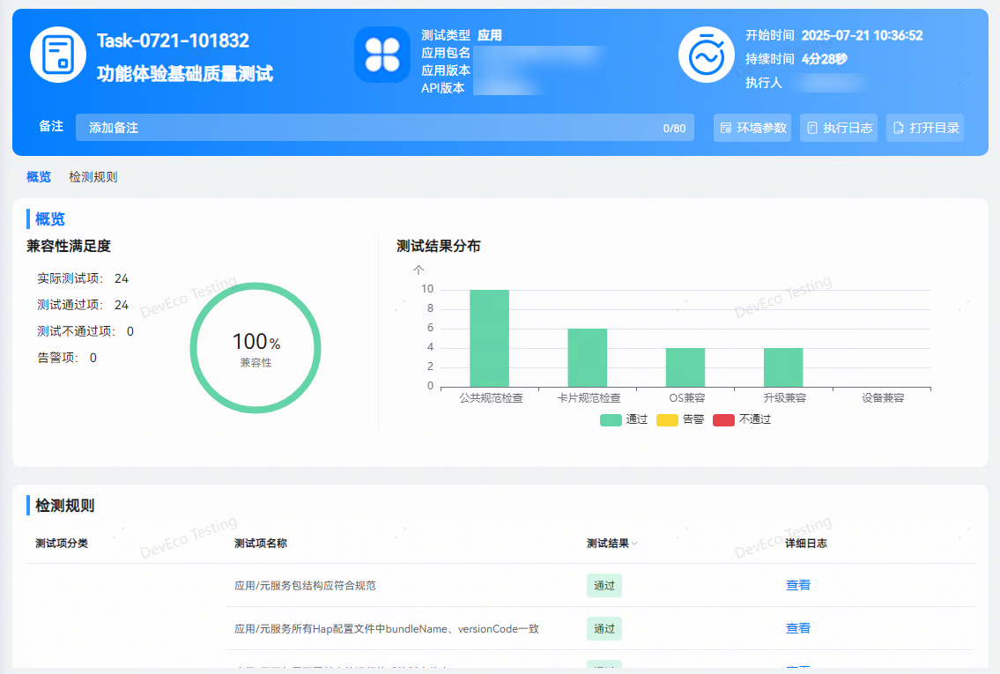

## 功能体验基础质量测试
**功能体验基础质量测试：**根据应用功能体验建议，检测应用在当前系统、设备及升级场景下运行是否存在兼容性问题。

测试完成后，自动生成测试报告。报告包含任务信息、执行结果、问题统计、检测规则。支持查看当前应用信息、任务执行时长及详细的环境参数，点击打开目录按钮可导出 html 格式报告。

检测不通过的规则项，点击查看按钮查看问题详情，包含执行设备信息、执行过程信息、测试截图、问题列表等。

了解更多测试服务详情，请前往DevEco Testing客户端->专项测试->功能体验基础质量测试->任务创建页->测试指南中查询。
