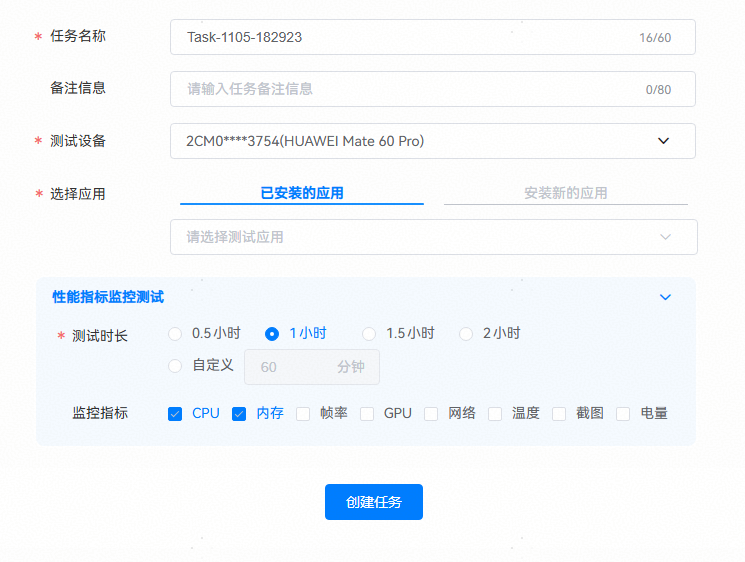
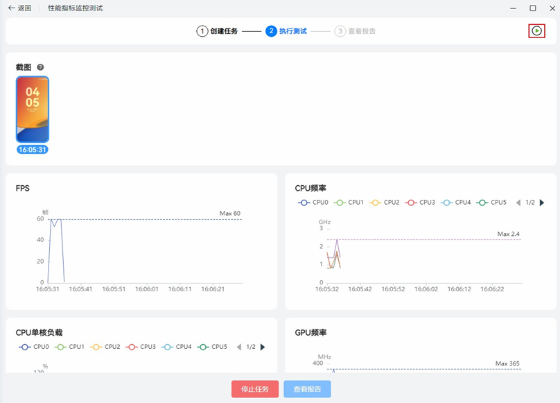
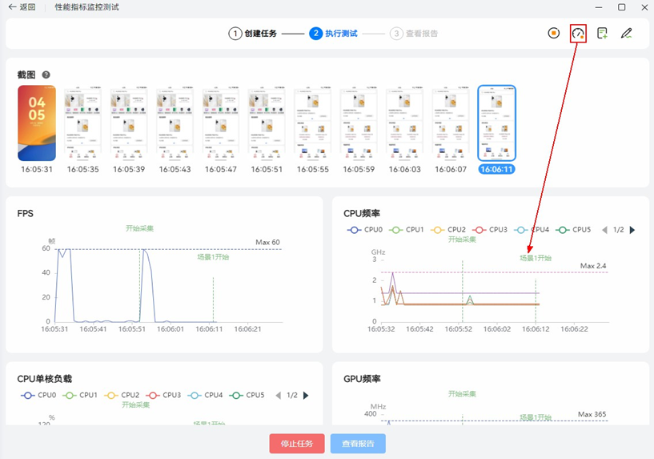
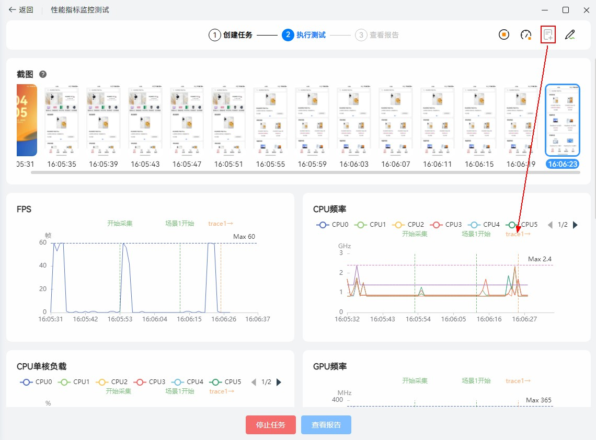
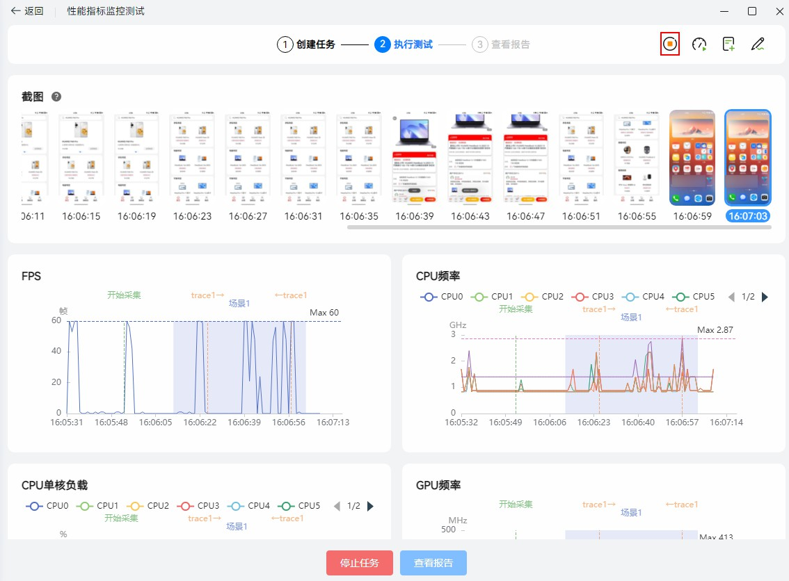
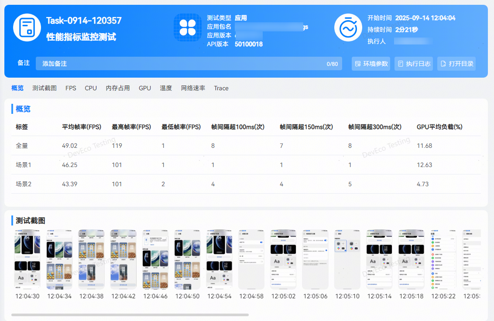

## 性能指标监控测试
**性能指标监控测试：**为用户提供指定业务场景性能测试能力，选择待测应用后手动操作应用，输出测试过程中应用和整机的性能指标数据。

**任务创建**

打开DevEco Testing客户端-专项测试-性能指标监控测试卡片，在任务创建界面按需配置任务参数，点击创建任务后开始测试。

任务名称：用于标识任务，根据时间生成默认任务名，支持自定义任务名称。

备注信息：按需填写任务备注信息，便于快速筛选报告。

测试设备：选择待测设备，待测设备的系统版本建议使用 HarmonyOS 5.0及以上版本。

选择应用：选择已安装在测试设备上的应用或安装新的应用。

指标监控：固定采集CPU和内存，用户自行选择是否采集其他指标项。

参数配置完成后，点击创建任务按钮开始测试。

**测试执行**

创建任务后，跳转到执行页，执行测试环境初始化操作。

等待测试环境初始化完成后，待测应用启动，自动跳转至监控页面，并启动监控，在手工测试场景准备好后，点击右上角的开始图标按钮，出现“开始采集”标识线，开始统计分析数据。

开始采集后，点击开始图标右侧的“记录”图标，可标识场景，并提示“场景开始”。待测场景结束后，再次点击，完成标识场景。概览中单独计算被标识的场景数据。

在测试过程中，可随时点击“采集 trace”按钮，采集连续30 秒的 trace 信息，单次任务只保留最近10 个 trace 文件。

结束采集。

**查看报告**

测试报告包括：基本信息、环境参数、执行日志，打开目录及指标数据。

指标数据：包括 FPS、设备 CPU/GPU 的频率、负载监控等信息。

指标数据介绍：

FPS：应用界面每秒刷新次数。

帧间隔：两帧画面刷新时间的间隔。帧间隔应保持稳定，并与应用帧率负相关。当帧间隔过大时， 设备会出现卡顿现象。

CPU 频率：各个 CPU 核心的实时频率。在 ARM 架构下，相同规格的核心实时频率一致（即大、中、小核分别具有不同的实时频率，但相同的核心的实时频率一致）。

内存占用：应用及整机的各个内存指标测试数据。

GPU 频率：GPU 核心的实时频率。

GPU 负载：GPU 的当前负载。

温度：设备的壳温，前壳温，后壳温，soc 温度。

网络速率：应用测试过程中的网络上下行速率。

Trace：可以通过报告底部的"打开Trace文件"按钮跳转到trace文件目录。

更多测试服务详情，请前往DevEco Testing客户端->专项测试->性能指标监控测试->任务创建页->测试指南中查询。
