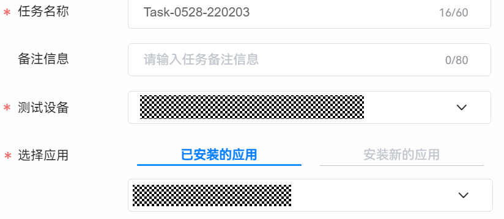
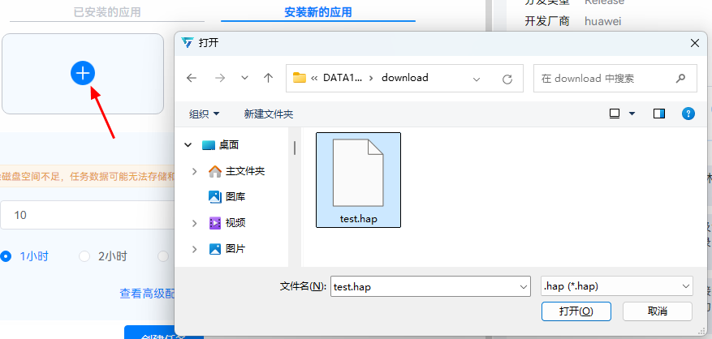
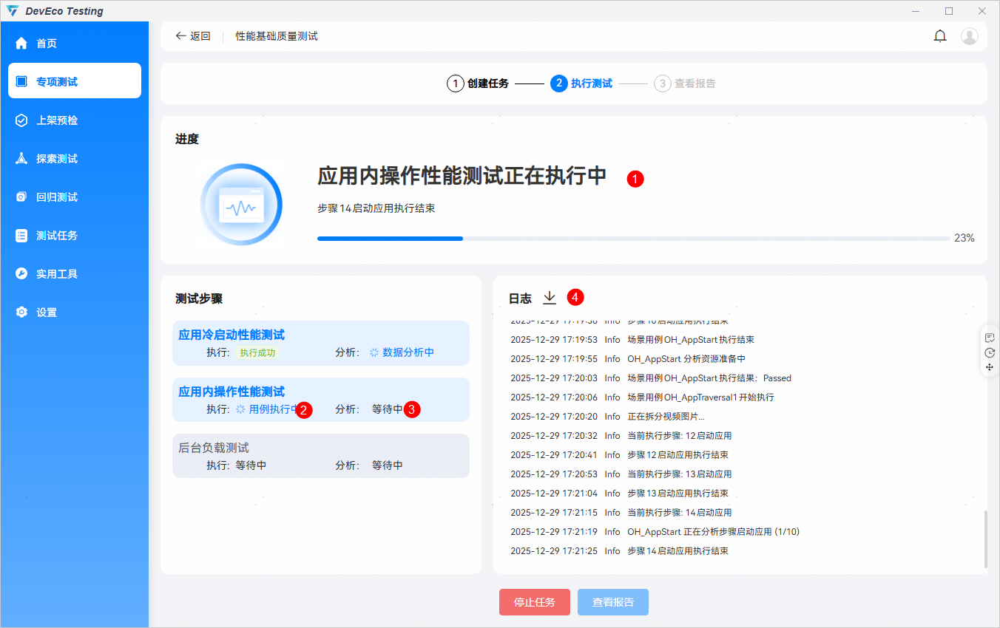
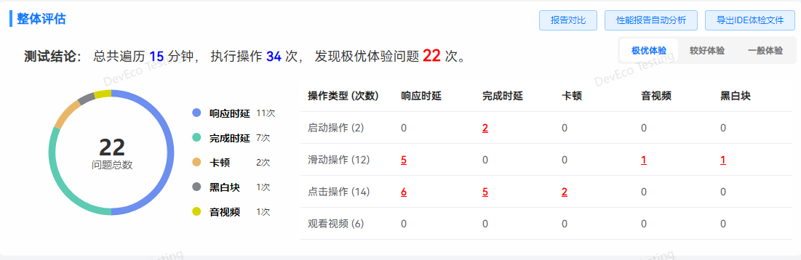
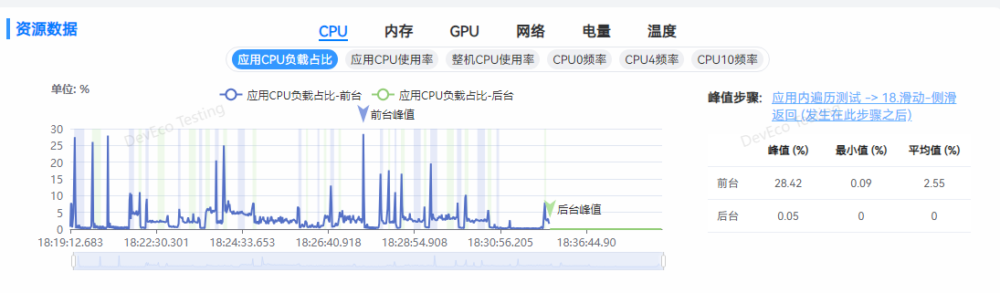
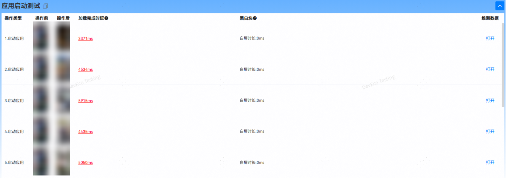
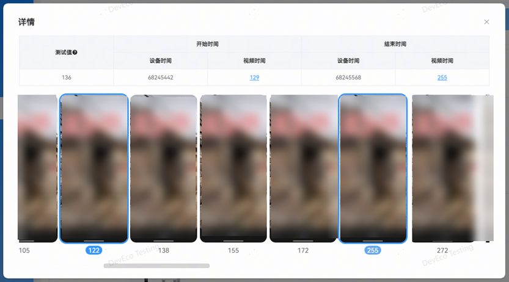
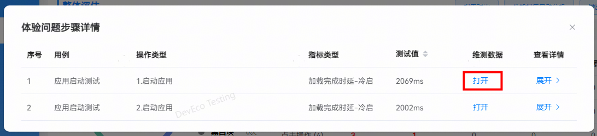
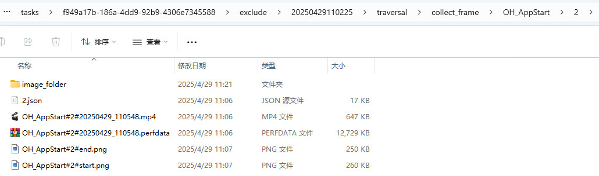
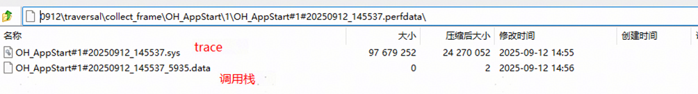

## 性能基础质量测试
**性能基础质量测试：**基于应用性能测试标准，提供了一套包含智能遍历算法和性能指标分析的解决方案，用于评估应用性能。该测试服务通过模拟用户操作行为，对应用进行长时间、高频次的页面遍历，实时采集性能数据，并生成全面、专业的测试报告。

应用的设计、开发及测试过程中推荐参考[应用性能体验建议](https://developer.huawei.com/consumer/cn/doc/harmonyos-guides/performance-experience-suggestions)。

**服务使用场景：**

用户在进行整包性能评估测试时，可以使用本服务通过指定应用启动次数与遍历操作时长，对应用进行性能测试。

**检测能力**：

性能基础质量测试提供了响应时延、完成时延、卡顿、音视频和黑白块五大类性能指标的检测能力，具体如下：

|  |  |  |  |
| --- | --- | --- | --- |
| **指标类型** | **指标名称** | **单位** | **指标说明** |
| 响应时延 | 点击响应时延 | 毫秒 | 时间起点：点击离手；  时间终点：界面发生变化。 |
| 响应时延 | 滑动响应时延 | 毫秒 | 时间起点：手指滑动；  时间终点：界面发生变化。 |
| 完成时延 | 加载完成时延 | 毫秒 | 时间起点：应用首页铺满全屏；  时间终点：应用首页所有占位符加载完成。 |
| 完成时延 | 点击完成时延 | 毫秒 | 时间起点：点击离手；  时间终点：转场页面所有占位符加载完成。 |
| 卡顿 | 最大丢帧 | 次 | 动效时间内，连续丢失的最大帧数。 |
| 卡顿 | 卡顿率 | 毫秒/秒 | 动效时间内，累计丢帧时间/动效时长。 |
| 音视频 | 起播时延 | 毫秒 | 时间起点：点击或滑动离手；  时间终点：视频播放首帧。 |
| 音视频 | 视频卡顿 | 次 | 视频播放过程中的卡顿情况，卡顿时长大于100ms视为1次卡顿。 |
| 黑白块 | 启动白屏时长 | 毫秒 | 时间起点：启动动效开始；  时间终点：启动过程中白屏消失。 |
| 黑白块 | 滑动占位符加载指数 | 毫秒/秒 | 页面滑动过程中占位符存在的累计时间。 |

**创建任务**

打开DevEco Testing客户端-专项测试-性能基础质量测试卡片，在任务创建界面按需配置任务参数，点击创建任务后开始测试。

性能基础质量测试支持选择已安装的应用，或选择待测应用的安装包后进行测试。

应用支持情况说明：

* 冷启动测试：支持所有应用。
* 应用内操作测试：遍历目前主要支持以下应用类型：
  + ArkUI原生控件（含ReactNative框架开发）应用。
  + 使用Flutter3.7.12及之后版本开发的应用。
  + 除以上支持的应用类型，其他三方自研框架的自定义控件暂不支持。

（1）已安装的应用

（2）安装新的应用

点击按钮，在弹窗中选择应用安装包，支持.hap、.zip格式安装包。

**启动测试次数**

执行冷启动操作的次数，自动化测试过程中会重复执行应用冷启动和退出操作，用来评估应用启动的性能。

**遍历时长**

应用内点击、滑动等操作的总执行时长，用户可根据需求自定义遍历时长，默认为1小时，最大支持120分钟。

**高级配置**

**检测标准**

检测基于用户体验分为三个标准，分别为：

* 极优体验：操作体验快速、流畅，发现更多的性能体验问题（磁盘空间占用会增加)，可选项。
* 较好体验：操作体验良好，发现可感知的性能体验问题，默认选项。
* 一般体验：操作体验较差，发现感知明显的性能体验问题，需重点关注，默认选项。

**指标监控**

自动化遍历执行过程中，被测设备的系统资源指标项采集，当前支持采集CPU、内存、温度、网络、GPU、存储和电量，固定采集CPU和内存，用户自行选择是否采集其他指标项。

**其他配置**

* 后台负载测试：开启后会在自动化遍历结束后，让应用进入后台，采集应用在后台状态下的CPU负载和内存占用，默认采集。
* 保存全部数据：开启后会保存自动化测试过程中产生的所有视频、trace、图片等数据，关闭后只保存影响体验操作的步骤数据。
* 生成IDE分析文件**：**开启后会将报告中的性能问题压缩打包，压缩包可导入 DevEco Studio 的体检工具，进行问题诊断并给出修改建议。

**测试执行**

**①：**实时显示任务的整体进度。

**②/③****：**实时显示每个用例的执行状态和分析状态。

**④：**实时打印任务执行时的日志。

**查看报告**

**基础信息**

* 任务数据：任务名称、开始时间、持续时间、执行人。
* 应用数据：应用包名、应用版本、API版本。
* 备注：备注信息支持自定义修改。
* 环境参数：支持查看任务下发的参数以及被测设备的详细信息。
* 执行日志：支持查看任务执行过程中的日志，支持日志级别的筛选。
* 打开目录：点击打开任务数据文件夹。

**整体评估**

整体评估报告部分会展示本次的测试结论，包括如下部分：

* 测试结论：描述本次测试的结论，包括遍历时长、执行操作次数、发现问题数。
* 报告对比：一键跳转到性能测试报告对比工具，从概览、指标达标率等多维度进行报告对比。
* 性能报告自动分析：一键跳转到性能报告自动分析服务，对该报告中发现的问题进行自动分析。
* 导出IDE体检文件：支持生成体检文件导入到DevEco Studio中进行问题分析定位。详细操作指导请查看[导入DevEco Testing的检测报告进行诊断](/docs/tools/coding-debug/ide-app-analyzer-testing)。
* 问题分布环形图：呈现本次任务发现的总问题数以及各指标性能问题的分布情况。
* 操作类型和问题表单：统计遍历过程中，启动、点击、滑动、观看的操作次数，以及对应指标发现的问题数。
* 一般体验：为了帮助提前识别可能影响应用日常使用的性能体验问题，将所有体验问题进行过滤，聚焦于明显影响用户体验的严重问题，问题数会比所有体验问题少。
* 较好体验和极优体验：为了追求极致性能体验，这两种体验问题的标准比一般体验的标准更严格，上报的问题也会更多，用户可以根据实际情况解决问题。

整体评估表格中的红色数字表示当前体验标准下的问题次数，支持点击查看问题步骤列表。

* 维测数据：点击打开按钮，自动打开该操作的数据文件夹，汇总当前操作的trace、视频、图片等维测数据，协助用户进行问题定位。
* 查看详情：点击展开按钮，呈现该操作的帧图片集，点击视频时间数字，能直接定位到具体的图片。

**遍历统计**

**遍历统计会展示应用遍历过程中的操作步骤信息，包括如下信息：**

* 遍历时长：用户在任务创建时指定的遍历时间。
* 启动次数：用户在任务创建时指定的启动测试次数。
* 点击次数：应用遍历过程中，点击操作的总次数。
* 滑动次数：应用遍历过程中，滑动操作的总次数。
* 观看视频：应用遍历过程中，观看视频操作的总次数。
* 图片列表：展示遍历的操作过程。

**资源数据**

资源数据报告部分呈现的是应用在遍历过程中的资源占用情况。

* CPU和内存占用是默认采集，GPU、网络、电量和温度为可选项，可在任务创建页面“高级配置”中勾选。
* 后台CPU和内存的测试需要在任务创建页面打开“后台负载测试”开关，检测应用在后台时，CPU和内存资源的占用情况。
* 峰值步骤：展示当前系统资源指标的最大值，点击可跳转至对应的步骤详情。

**操作详情**

操作详情展示遍历测试过程中的操作步骤信息，整体呈现内容如下所示：

* 应用启动测试：

展示应用启动测试的步骤信息，包括操作前后截图、测试数据以及维测数据。

操作前&操作后：展示该步骤操作前后的设备截图。

指标项：展示应用启动过程的指标检测结果信息，如果测试值超标，字体标红显示，支持点击查看问题详情。若不涉及，则显示”-”。

维测数据：点击打开按钮，自动打开该操作的数据文件夹，汇总当前操作的trace、视频、图片等维测数据，协助用户进行问题定位。若该步骤所有测试数据都达到标准，则不展示打开按钮。

* 应用内遍历测试：

展示应用内进行遍历操作的步骤信息，包括操作前后截图、测试数据以及维测数据。

操作前&操作后：展示该步骤操作前后的设备截图。

指标项：展示应用启动过程的指标检测结果信息，如果测试值超标，字体标红显示，支持点击查看问题详情。若不涉及，则显示”-”。

维测数据：点击打开按钮，自动打开该操作的数据文件夹，汇总当前操作的trace、视频、图片等维测数据，协助用户进行问题定位。若该步骤所有测试数据都达到标准，则不展示打开按钮。

* **异常指标信息查看：**

对于超标的检测结果，可以通过点击超标项，查看该步骤的详细信息，展示内容如下图所示（以响应时延为例）。

测试值：表示该步骤的响应时延测试值。

开始时间：表示用户从122这一帧开始操作。

结束时间：表示应用UI在255这一帧开始响应。

图片组：逐帧展示该步骤的操作视频。

**问题定位定界**

**维测数据**

点击打开按钮跳转到问题步骤对应的资源文件目录。

用户可查看步骤执行全过程的图片和视频，如下所示：

**perfdata数据**

可使用[DevEco Studio](https://developer.huawei.com/consumer/cn/download/deveco-studio) 5.0.3.300及以上版本中的场景化调优工具DevEco Profiler打开及查看该文件，内含步骤执行过程中的trace打点和调用栈信息，也可使用压缩软件解压为单个的trace文件和调用栈文件，解压后的文件可使用[SmartPerf](https://gitcode.com/openharmony/developtools_smartperf_host)工具打开。

更多测试服务详情，请前往DevEco Testing客户端->专项测试->性能基础质量测试->任务创建页->测试指南中查询。

更多应用性能优化建议及问题定位，请查阅：[应用性能体验建议](https://developer.huawei.com/consumer/cn/doc/harmonyos-guides/performance-experience-suggestions) 及 [最佳实践-性能-性能场景优化案例](/docs/quality/scenario-performance-optimization)。
