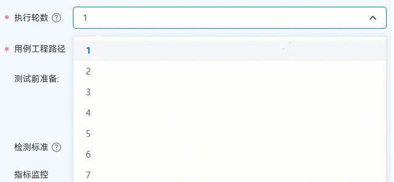
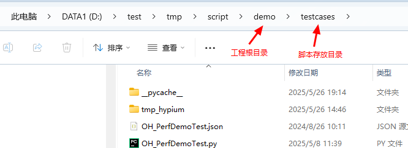
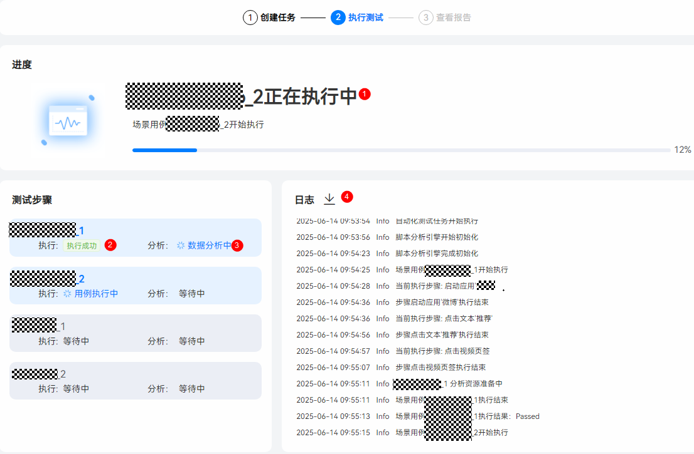
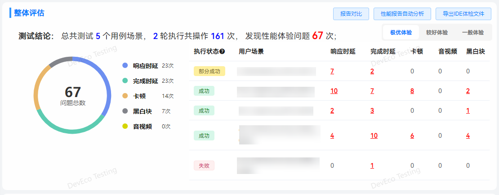
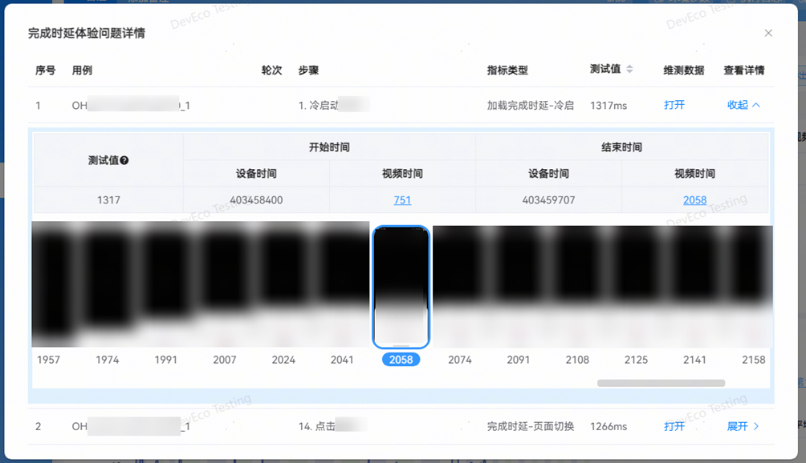
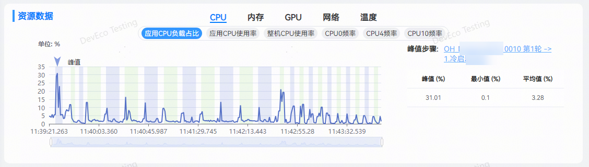
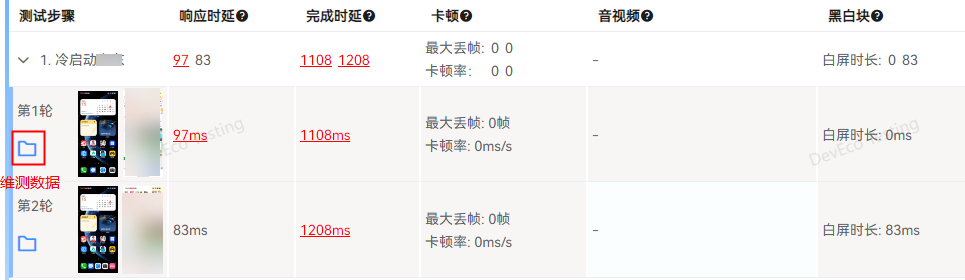
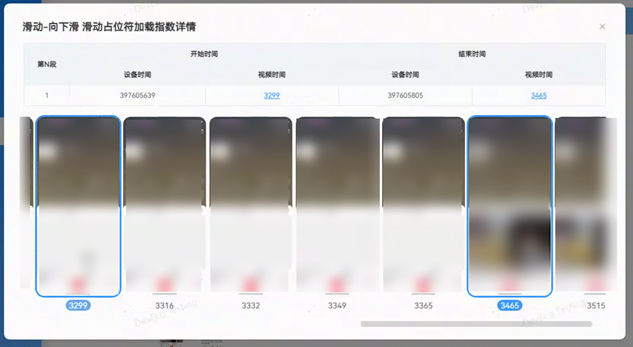
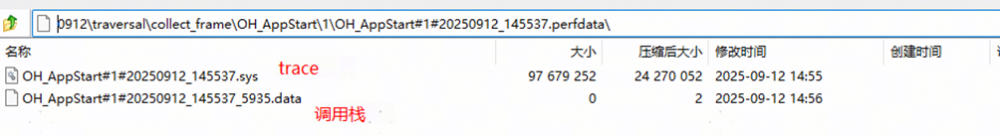

## 场景化性能测试
**服务说明**

场景化性能测试服务提供了一套包含自动化脚本执行和性能指标分析的解决方案，涵盖响应时延、完成时延、卡顿、音视频和黑白块五大类性能指标的检测。

应用的设计、开发及测试过程中推荐参考[应用性能体验建议](/docs/experience-suggestions/performance/performance-overview)。

**服务使用场景**

支持一键式测试应用的关键场景和核心路径的性能体验。通过任务报告，用户可查看关键场景上的多维度性能指标表现，精准识别性能体验问题。

**场景化性能测试的性能指标检测能力****与性能基础质量测试一致；详情请查看[性能基础质量测试](./performance-test)。**

**脚本写作**

请参考[自定义性能脚本测试（基于Python)](/docs/dev/testing/tools/hypium-perf-python-guidelines)。

**任务创建：**

打开DevEco Testing客户端-专项测试-场景化性能测试卡片，在任务创建界面按需配置任务参数，点击创建任务后开始测试。

**配置项说明**

**执行轮次**

用例可重复执行多轮提升测试结果的可靠性，最多测试10轮。

**用例工程路径**

存放自动化用例的工程路径。

如果已有用例脚本，可点击创建工程模板，将脚本文件存放到工程根目录的testcases目录下，用例工程路径请选择工程根目录。

**高级配置**

**检测标准、****指标监控**

与性能基础质量测试一致，可点击[性能基础质量测试](./performance-test)查看。

**其他配置**

保存全部数据：开启后会保存自动化测试过程中产生的所有视频、trace、图片等数据，关闭后只保存影响体验操作的步骤数据。

生成IDE分析文件：开启后会将报告中的性能问题压缩打包，压缩包可导入 DevEco Studio 的体检工具，进行问题诊断并给出修改建议。

**任务执行**

所有用例按照顺序和轮次依次执行，并行分析；任务完成后，会自动生成报告页面。

①：实时显示任务的整体进度。

②/③：实时显示每个用例的执行状态和分析状态。

④：实时打印任务执行时的日志。

**查看报告**

测试完成后，自动生成测试报告。报告包含基础信息、整体评估、资源数据、用例详情等。

**基础信息**

任务信息：任务名称、工程路径、开始时间、持续时间、执行人。

备注：备注信息支持自定义修改。

环境参数：支持查看任务下发的参数以及被测设备的详细信息。

执行日志：支持查看任务执行过程中的日志，支持日志级别的筛选。

打开目录：点击打开任务数据文件夹。

**整体评估**

整体评估包括如下部分：

* 测试结论：描述本次测试的结论，包括执行用例个数、轮数、操作次数及发现问题数。
* 报告对比：一键跳转到报告对比工具，从概览、指标优劣化、用例对比详情等多维度进行报告对比。
* 性能报告自动分析：一键跳转到性能报告自动分析服务，对该报告中发现的问题进行自动分析。
* 导出IDE体检文件：支持生成体检文件导入到DevEco Studio中进行问题分析定位。详细操作指导请查看[导入DevEco Testing的检测报告进行诊断](/docs/tools/coding-debug/ide-app-analyzer-testing)。
* 问题分布环形图：呈现本次任务发现的总问题数以及各指标性能问题的分布情况。
* 用户场景和问题分布表单：执行状态表示用例场景多轮执行的状态，用例场景展示的是脚本中定义的场景用例名称，后面几列为对应指标发现的问题数。
* 一般体验：为了帮助提前识别可能影响应用日常使用的性能体验问题，将所有体验问题进行过滤，聚焦于明显影响用户体验的严重问题，问题数会比所有体验问题少。
* 较好体验和极优体验：为了追求极致性能体验，这两种体验问题的标准比一般体验的标准更严格，上报的问题也会更多，用户可以根据实际情况对应用进行优化。

**执行状态共有如下几种：**

* 成功：用例所有轮次均执行成功。
* 部分成功：用例部分轮次执行成功，部分轮次失败或者未执行。
* 失败：用例无成功执行轮次。
* 未执行：用例未执行。

整体评估表格中的红色数字是当前体验标准下的问题次数，支持点击查看问题步骤列表：

展开后呈现问题的详细信息：

维测数据：点击打开按钮，自动打开该操作的数据文件夹，汇总当前操作的trace、视频、图片等维测数据，协助用户进行问题定位。

查看详情：点击展开按钮，呈现该操作的帧图片集，点击视频时间数字，能直接定位到具体的图片。

**资源数据**

资源数据报告部分呈现的是应用在遍历过程中的资源占用情况。

* CPU和内存占用是默认采集，GPU、网络、电量和温度为可选项，可在任务创建页面“高级配置”中勾选。
* 峰值步骤：展示的是当前系统资源指标的最大值，点击可跳转至对应的步骤详情。

**用例详情**

用例详情会展示用例的执行轮次和执行步骤的信息，整体呈现内容如下图所示：

OH\_XXXX：代表用例名称，由脚本进行指定。

用例资源数据： 统计该用例在执行过程中采集到的CPU，内存等资源数据，并针对改用例进行数据汇总计算。

测试步骤：展示用例的步骤信息，默认展示该步骤在多轮测试中的测试数据，对于超过标准的测试值，数据标红显示，支持点击查看问题详情。对于该操作不涉及的指标，显示“-”。

点击步骤左侧的箭头，展开该步骤的详细轮次信息，如下图所示：

操作前&操作后：展示该步骤操作前后的信息，用户可以通过前后截图了解操作的场景。

指标项：展示每轮的指标检测结果信息，如果测试值超标，字体标红显示，支持点击查看问题详情。若不涉及，则显示“-”。

维测数据：点击 按钮，自动打开该操作的数据文件夹，汇总当前操作的trace、视频、图片等维测数据，协助用户进行问题定位。若该步骤所有测试数据都达到标准，则不会出现该按钮。

对于超标的检测结果，可以通过点击超标项，查看该步骤的详细信息，展示内容如下图所示（以滑动占位符加载指数详情为例）：

开始时间：从3299这一帧开始，页面中出现占位符。

结束时间：在3465这一帧，占位符全部都加载完成。

图片组：逐帧展示该步骤的操作视频。

**问题定位定界**

**维测数据**

点击打开按钮可以跳转到问题步骤对应的资源文件目录。

测试步骤执行全过程的图片和视频如下：

**perfdata****数据**

可使用[DevEco Studio](https://developer.huawei.com/consumer/cn/download/deveco-studio) 5.0.3.300及以上版本中的场景化调优工具DevEco Profiler打开及查看该文件，内含步骤执行过程中的trace打点和调用栈信息，也可使用压缩软件解压为单个的trace文件和调用栈文件，解压后的文件可使用[SmartPerf](https://gitcode.com/openharmony/developtools_smartperf_host)工具打开。

更多场景化性能测试报告解读及常见问题，请前往DevEco Testing客户端->专项测试->场景化性能测试->任务创建页->测试指南中查询。

更多应用性能优化建议及问题定位，请查阅：[应用性能体验建议](https://developer.huawei.com/consumer/cn/doc/harmonyos-guides/performance-experience-suggestions) 及 [最佳实践-性能-性能场景优化案例](/docs/quality/scenario-performance-optimization)。
