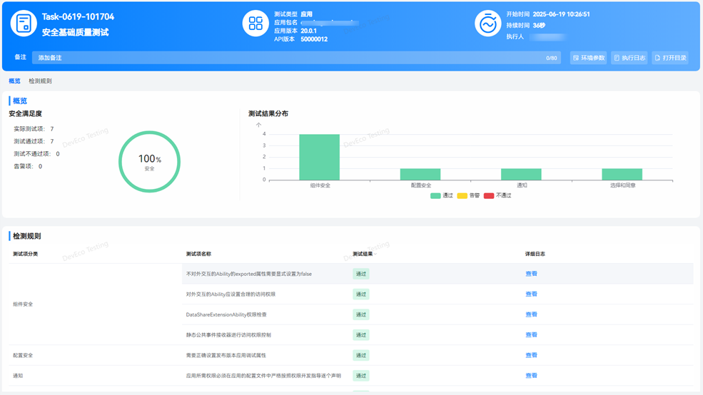
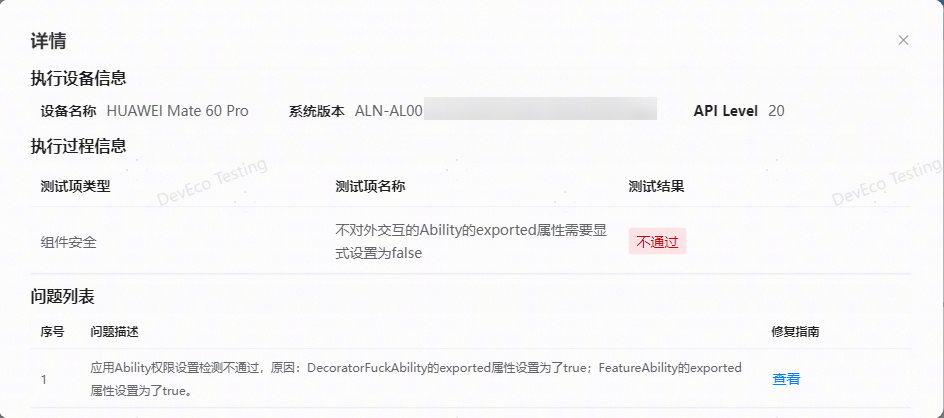

## 安全基础质量测试
**安全基础质量测试：**根据应用安全测试建议，评估应用基础安全，如组件安全、存储安全、配置安全、签名安全等。

测试完成后，会自动生成测试报告。报告包含任务信息、执行结果、问题统计、检测规则。任务信息中，可查看当前应用信息、任务执行时长以及详细的环境参数（配置信息及环境信息），支持导出 html 的报告文件。

安全基础质量测试报告如下：

在测试报告中，包含执行结果、问题统计及检测规则。用户可直观查看本次任务中的测试项检测结果。

对于检测不通过的规则项，点击查看详情即可查看异常问题详情，包含执行设备信息、执行过程信息和问题列表；问题列表中有序号、问题描述和修复指南。

更多测试服务详情，请前往DevEco Testing客户端->专项测试->安全基础质量测试->任务创建页->测试指南中查询。
