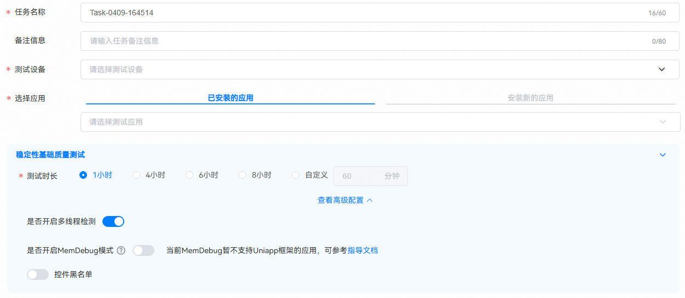
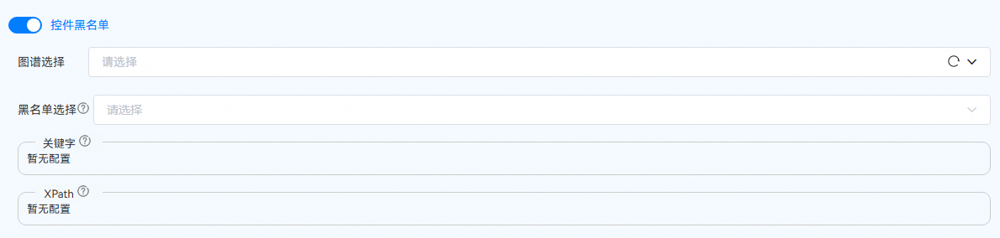
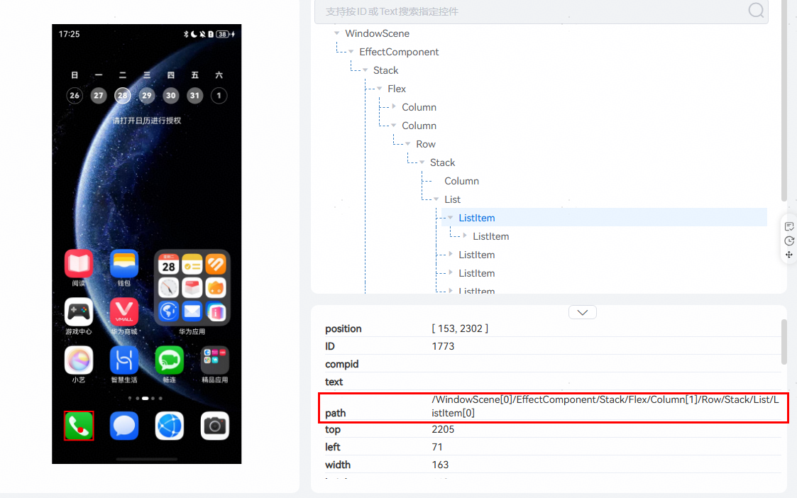
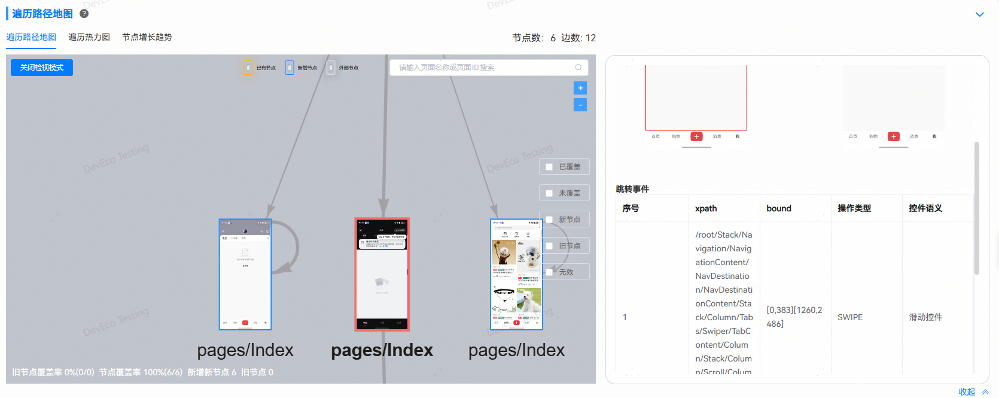
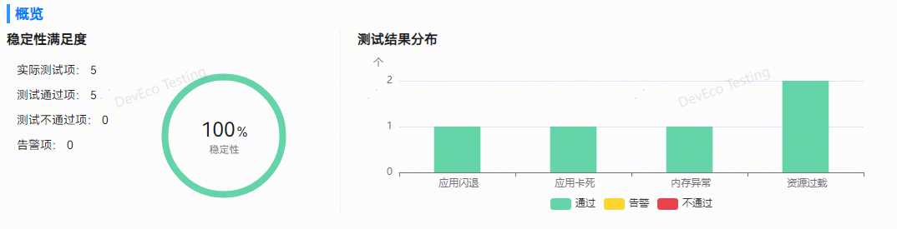
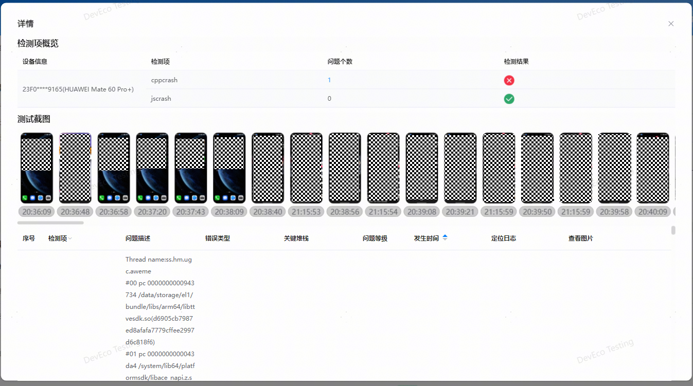

## 稳定性基础质量测试
**稳定性基础质量测试：**根据应用稳定性建议，检测应用运行过程中是否存在应用崩溃、资源过载、内存泄漏等异常情况。

**创建任务**

进入DevEco Testing客户端，在左侧菜单栏选择“专项测试”，点击“稳定性基础质量测试”服务卡片，即进入任务创建界面。用户按需配置任务参数，点击创建任务即开始测试。

任务名称：用于标识任务，工具会根据时间生成默认任务名，支持自定义修改。

备注信息：按需填写任务备注信息，便于快速筛选报告。

测试设备：选择一个待测设备和待测应用。系统版本支持 HarmonyOS 5.0及以上版本。

选择应用：可选择测试设备上已安装的应用；或安装新的应用，即在测试设备上安装新的应用包。

是否卸载应用：选择卸载应用后，测试时会进行卸载无残留检测，测试任务结束后将自动卸载被测应用。

是否开启多线程检测：打开后，系统支持检测应用多线程安全问题（例如：多个线程并发写入操作）。

是否开启[MemDebug](/docs/quality/stability-hwasan-detection#section10791454125320)模式：打开开关以后，会打开被测应用的内存越界检测开关，可以辅助发现和定位内存越界类问题。

**稳定性基础质量测试最佳测试时长建议设置为8****小时**。

**控件黑名单**

控件黑名单通过指定控件的关键字（控件感知语义或layout中控件text属性值）和控件Xpath进行正则匹配识别黑名单控件；黑名单控件在遍历中不会进行操作；屏蔽的黑名单控件在遍历过程中会在应用页面中置灰。

1、关键字：可以填写页面内可交互控件选框中的关键字，例如“购物车”、“我的订单”等。

2、XPath：可以通过Uiviewer工具或已有的遍历图谱文件获取控件的XPath。

**1、关于控件黑名单中“XPath”信息也可以通过探索测试报告中的遍历地图获取**：

点击遍历地图中的关联线条；即可在右侧查看该跳转事件详情。

**测试执行**

创建任务后，将会跳转到执行页，进入测试环境初始化阶段。待测试环境初始化完成，待测应用被启动。

测试过程中，在测试页面可以看到测试进度、检测状态、实时投屏及执行日志。

**查看报告**

测试完成后，自动生成测试报告。报告包含任务信息、结果统计、检测规则。

任务信息中，可查看当前应用信息、任务执行时长及详细的环境参数（配置信息及环境信息），点击打开目录按钮支持导出 html 的报告文件。

测试概览中，包含结果统计及检测规则，可直观查看本次任务中，测试项检测结果。

检测不通过或检测异常的规则项，点击查看详情即可查看异常问题详情，包含检测项概览、测试截图、问题列表。

点击查看按钮，支持查看测试过程中的日志，用户可结合问题描述及日志详情进一步分析。

更多测试服务详情，请前往DevEco Testing客户端->专项测试->稳定性基础质量测试->任务创建页->测试指南中查询。

更多应用稳定性体验优化建议及问题定位，请查阅：[应用稳定性体验建议](/docs/experience-suggestions/experience-suggestions-stability) 及 [CppCrash故障定位指导](https://developer.huawei.com/consumer/cn/doc/architecture-guides/common-v1_26-ts_c25-0000002324993158)
