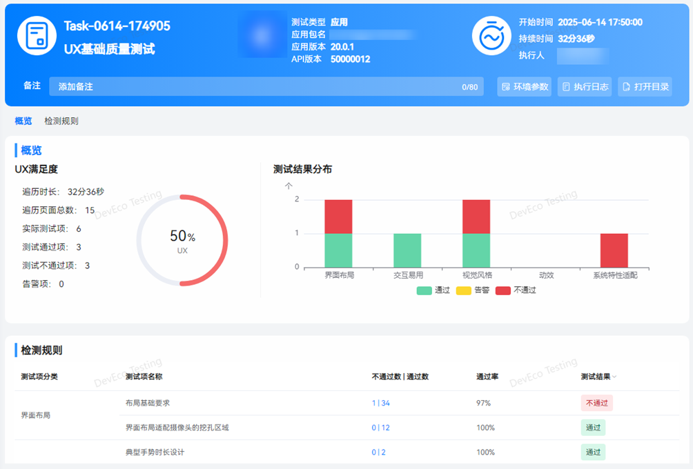
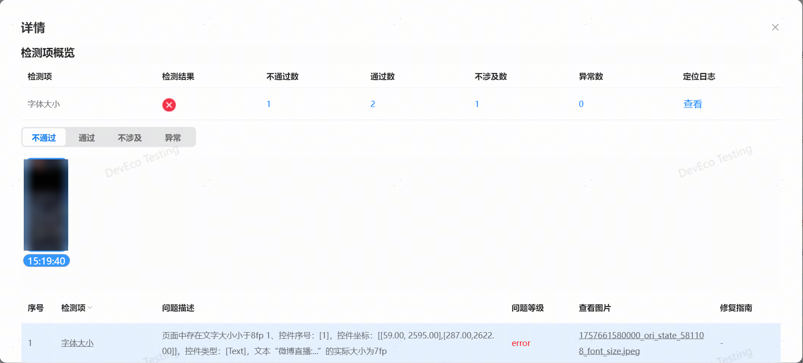

## UX基础质量测试
**UX基础质量测试：**根据应用UX建议，验证应用在基础体验、系统特性适配、控件布局等方面是否合理。

测试完成后，自动生成测试报告。UX基础质量测试报告如下：

报告包含任务信息、执行结果、检测规则。支持查看当前应用信息、任务执行时长，及详细的环境参数（配置信息及环境信息），支持导出 html 的报告文件。

对于检测不通过及检测异常的规则项，点击查看详情即可查看异常问题详情，包含检测项概览、测试截图、问题列表。对于异常问题，可根据测试截图、问题描述，针对性优化异常问题。

更多检测规则详情，请前往DevEco Testing客户端 ->专项测试 ->UX基础质量测试 ->任务创建页-测试指南中查询。
