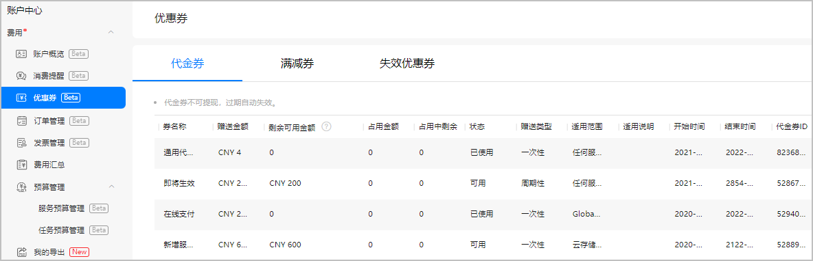
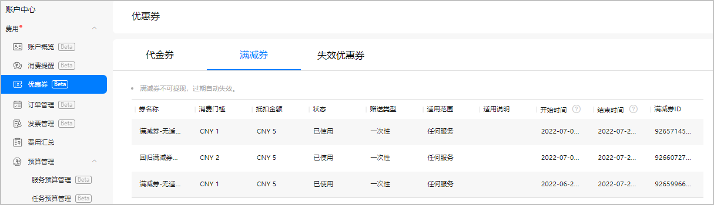
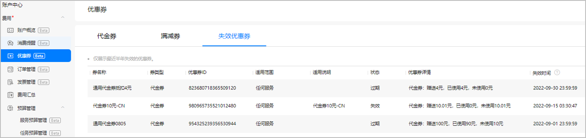
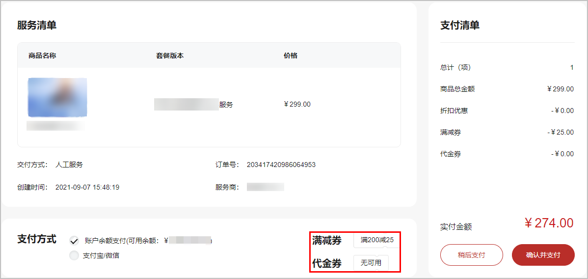

AppGallery Connect会不定期组织服务优惠活动，您在购买服务时可以领取代金券或满减券后支付。使用优惠券后，您能够以优惠后的价格购买商品。

#### 前提条件

* 您已[注册华为开发者账号](https://developer.huawei.com/consumer/cn/doc/start/registration-and-verification-0000001053628148)并[实名认证](https://developer.huawei.com/consumer/cn/doc/start/itrna-0000001076878172)。
* 您已[开通付费服务](https://developer.huawei.com/consumer/cn/doc/start/payment-service-0000001052865979)。

#### 领取优惠券

当前领取优惠券的方式主要分为以下几种：

* 当您使用AppGallery Connect时满足有奖激励活动，系统可能会弹框提示您获得对应的奖励。如果未领取，可以前往[互动中心](https://developer.huawei.com/consumer/cn/doc/app/agc-help-interaction-center-0000002276985946)领取对应的优惠券。
* 购买服务时，可在服务页面查看是否有优惠促销活动，如果该服务有优惠券活动，可在服务购买页面选择可使用的优惠券。
* 华为运营人员进行优惠促销活动时可能会主动给您赠送优惠券，并在[互动中心](https://developer.huawei.com/consumer/cn/doc/app/agc-help-interaction-center-0000002276985946)给您发送通知。

#### 查看优惠券

您可在“优惠券” 页面查看已领取但未使用的优惠券、以及最近半年内失效的优惠券信息。

1. 登录[AppGallery Connect](https://developer.huawei.com/consumer/cn/service/josp/agc/index.html)。
2. 在右上角账号旁的下拉框中选择“账户中心”。

   
3. 选择“费用 > 优惠券”，可分别查看已领取的代金券、满减券及最近半年内失效的优惠券详情。

   

   | 代金券信息 | 说明 |
   | --- | --- |
   | 券名称 | 代金券名称。 |
   | 赠送金额 | 代金券金额。 |
   | 剩余可用金额 | 剩余可用金额 = 赠送金额 – 占用金额 – 已消耗的代金券金额。 |
   | 占用金额 | 代金券被任务预算占用的金额。 |
   | 占用中剩余金额 | 占用金额中尚未使用的金额。 |
   | 状态 | * 可用：代金券已生效且未使用或未用尽。 * 不可用：代金券未生效。 * 已使用：代金券已用尽。 |
   | 赠送类型 | * 一次性：代金券一次性发放完。 * 周期性：指代金券为定期发放。 注意：  周期性代金券优先使用。 |
   | 适用范围 | 可使用代金券的服务。 |
   | 适用说明 | 代金券的适用规则。 |
   | 开始/结束时间 | 代金券的使用期限，为UTC时间。 |
   | 代金券ID | 代金券ID。 |

   

   | 满减券信息 | 说明 |
   | --- | --- |
   | 券名称 | 满减券名称。 |
   | 消费门槛 | 消费达到多少金额可使用满减券。 |
   | 抵扣金额 | 满减券可抵扣的金额。 |
   | 状态 | * 可用：满减券已生效且未使用。 * 不可用：满减券未生效。 * 已使用：满减券已使用。 |
   | 赠送类型 | * 一次性：满减券一次性发放完。 * 周期性：指满减券为定期发放。 注意：  周期性满减券优先使用。 |
   | 适用范围 | 可使用满减券的服务。 |
   | 适用说明 | 满减券的适用规则。 |
   | 开始/结束时间 | 满减券的使用期限，为UTC时间。 |
   | 满减券ID | 满减券ID。 |

   

   | 失效优惠券信息 | 说明 |
   | --- | --- |
   | 券名称 | 优惠券名称。 |
   | 券类型 | 当前优惠券为代金券还是满减券。 |
   | 优惠券ID | 优惠券ID。 |
   | 适用范围 | 优惠券适用的服务。 |
   | 适用说明 | 优惠券的适用规则。 |
   | 状态 | 优惠券的状态。  * 过期：优惠券可用时间已到期。 * 失效：优惠券已被AppGallery Connect运营手动失效。 |
   | 优惠券详情 | * 代金券详情包括赠送金额、已使用金额（占用金额中的已消耗金额+非占用金额中的已消耗金额）、未使用金额。 * 满减券详情包括满减券使用条件，如“满5元减1元”。 |
   | 失效时间 | 优惠券失效的时间。 |

#### 使用优惠券

优惠券不可提现，且到期后自动失效。领取优惠券后，您可以根据优惠券的“适用范围”在购买对应服务时使用。

您可以在服务购买页面选择您需要使用的满减券或代金券，满减券和代金券可以同时使用，代金券可叠加，满减券一次购买最多只能使用一张并且不可叠加。使用优惠券后最终支付金额为：商品原价-折扣优惠金额-代金券-满减券。

