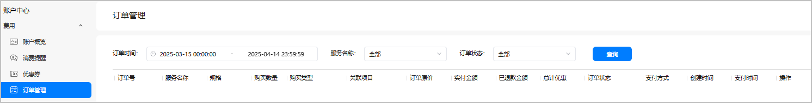
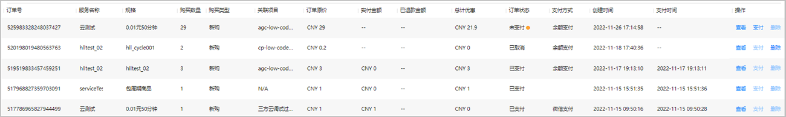
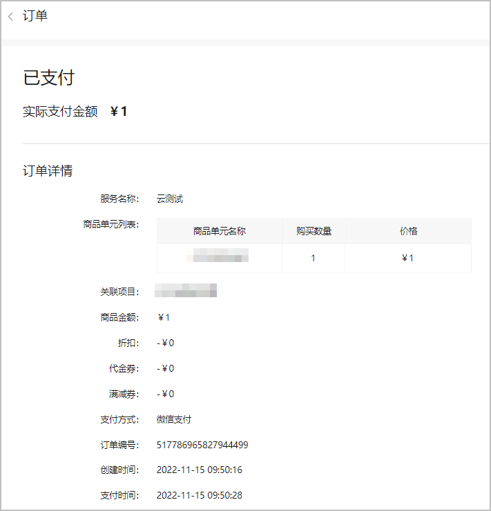
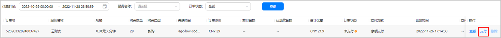
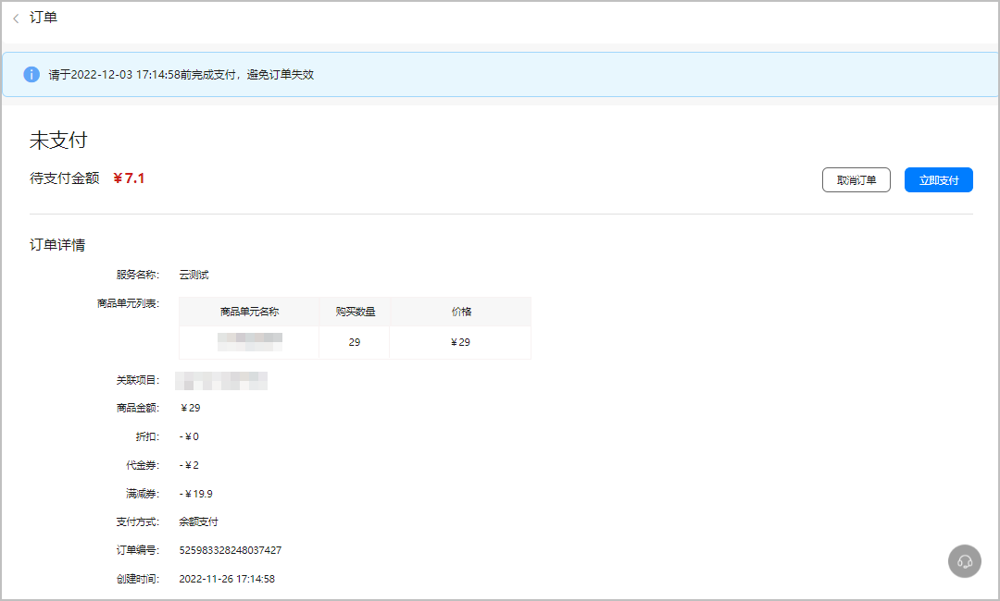
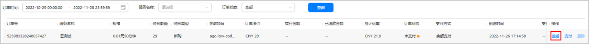
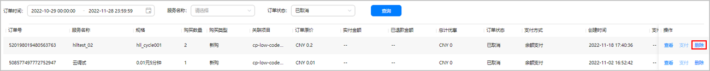

如您在AppGallery Connect购买了服务，可在“账户中心 > 费用 > 订单管理”页面进行服务订单管理，包括查询订单、支付未完成的订单、取消订单等。

#### 前提条件

* 您已[注册华为开发者账号](https://developer.huawei.com/consumer/cn/doc/start/registration-and-verification-0000001053628148)并[实名认证](https://developer.huawei.com/consumer/cn/doc/start/itrna-0000001076878172)。
* 您已[开通付费服务](https://developer.huawei.com/consumer/cn/doc/start/payment-service-0000001052865979)。

#### 查询订单

已支付或购买时选择了“稍后支付”的订单将会进入订单列表。您可在订单列表筛选出需要查看的订单。

1. 登录[AppGallery Connect](https://developer.huawei.com/consumer/cn/service/josp/agc/index.html#/)，鼠标悬停于右上角账号上，在弹出的下拉框中选择“账户中心”。

   
2. 选择“费用 > 订单管理”，设置筛选条件后，点击“查询”。

   

   | 筛选条件 | 说明 |
   | --- | --- |
   | 订单时间 | 订单的创建时间。 |
   | 服务名称 | 购买的服务名称。 |
   | 订单状态 | * 未支付：已购买但未完成支付的订单。您可以选择[支付订单](#section1978910437178)，也可以选择[取消订单](#section671521864116)。 * 已取消：已经取消的订单。 * 已支付：已完成支付的订单。 * 退款中：已申请退款但尚未完成退款的订单。 * 部分退款：已付款且已使用、但在有效期内申请退款的订单，订单的一部分钱款已被退回。 * 全额退款：已付款但在未使用时申请退款的订单，订单的全部钱款已被退回。 * 支付审核中：已完成线下支付、待华为运营审核的订单。 * 支付审核失败：已完成线下支付、但未通过运营审核的订单。 |
3. 查看筛选出的订单信息。

   

   | 订单信息 | 说明 |
   | --- | --- |
   | 订单号 | 订单编号。 |
   | 服务名称 | 订单中购买的服务名称。 |
   | 规格 | 购买的服务套餐规格。 |
   | 购买数量 | 购买的服务套餐数量。 |
   | 购买类型 | * 新购：首次购买该服务。 * 续费：服务即将到期或已经到期时的续费。 * 变更规格：已购买过该服务，本订单为变更服务规格。 |
   | 关联项目 | 购买服务的项目。 |
   | 订单原价 | 订单的原价。 |
   | 实付金额 | 根据应付金额，通过账户余额或线上支付渠道直接支付的金额。 |
   | 已退款金额 | 被退回的钱款金额。 |
   | 总计优惠 | 订单使用商品折扣、优惠券抵扣等产生的优惠金额。 |
   | 订单状态 | * 未支付：已购买但未完成支付的订单。您可以选择[支付订单](https://developer.huawei.com/consumer/cn/doc/app/agc-help-order-0000002277191077#section1978910437178)，也可以选择[取消订单](https://developer.huawei.com/consumer/cn/doc/app/agc-help-order-0000002277191077#section671521864116)。 * 已取消：已经取消的订单。 * 已支付：已完成支付的订单。 * 退款中：已申请退款但尚未完成退款的订单。 * 部分退款：已付款且已使用、但在有效期内申请退款的订单，订单的一部分钱款已被退回。 * 全额退款：已付款但在未使用时申请退款的订单，订单的全部钱款已被退回。 * 支付审核中：已完成线下支付、待华为运营审核的订单。 * 支付审核失败：已完成线下支付、但未通过运营审核的订单。 |
   | 支付方式 | 订单的支付方式，包括余额支付、支付宝、微信、企业网银、线下支付。 |
   | 创建时间 | 创建订单的时间。 |
   | 支付时间 | 支付订单的时间。 |

#### 查看订单详情

点击订单“操作”列的“查看”，可查看订单的详细信息，如商品单元名称、价格、折扣金额、代金券金额、满减券金额等。

#### 支付订单

在订单管理页，您可以支付在购买时选择了“稍后支付”的订单。

1. “订单状态”选择“未支付”，点击“查询”筛选出订单。
2. 您可采用以下任一方式进行支付：
   * 方式一：点击订单“操作”列的“支付”，完成支付。

     
   * 方式二：点击订单“操作”列的“查看”，进入订单支付页，点击右上角“立即支付”完成支付。

     

#### 取消订单

您可以取消未支付的订单。取消订单后无法恢复，订单内优惠券可退回，请注意在有效期内使用。

“支付审核中”的线下支付订单不支持取消。

1. 在订单管理页面，筛选出未支付订单后，点击“操作”列“查看”，进入订单详情页。

   
2. 点击右上角“取消订单”，在确认提示框中点击“确认”。

   

#### 删除订单

您可以删除已取消的订单。

在订单管理页面，筛选出已取消的订单后，点击“操作”列“删除”，在确认提示框中点击“确认”即可。

