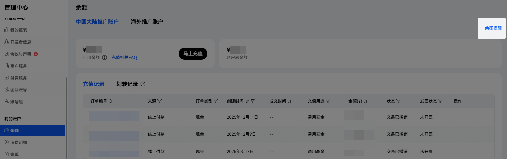
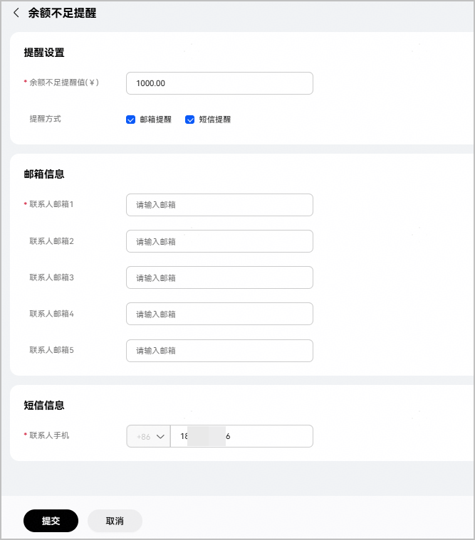

为防止您的账户余额不足而导致扣款失败，您可以设置账户余额不足提醒。

#### 前提条件

您已完成[账户充值](/docs/distribute/agc/agc-help-account-0000002270829385/agc-help-topup-0000002277191065)。

#### 操作步骤

1. 登录[华为开发者联盟官网](https://developer.huawei.com/consumer/cn/)，点击页面右上角“管理中心”。
2. 选择“我的账户 > 余额”，在“余额”页面点击“余额提醒”。

   
3. 在“余额不足提醒”弹窗中填写提醒信息，点击“提交”。

   

   | 参数 | 说明 |
   | --- | --- |
   | 余额不足提醒值 | 当账户余额减少到您设置的阈值后，系统将给您发送提醒。  请输入0~10000000范围内的数值，最多支持小数点后两位。 |
   | 提醒方式 | 可勾选“邮箱提醒”或“短信提醒”，支持多选。 |
   | 邮箱信息 | 如勾选“邮箱提醒”，请输入接收提醒的邮箱地址。最多输入5个邮箱地址。 |
   | 短信信息 | 如勾选“短信提醒”，请输入接收提醒的手机号码。 |
