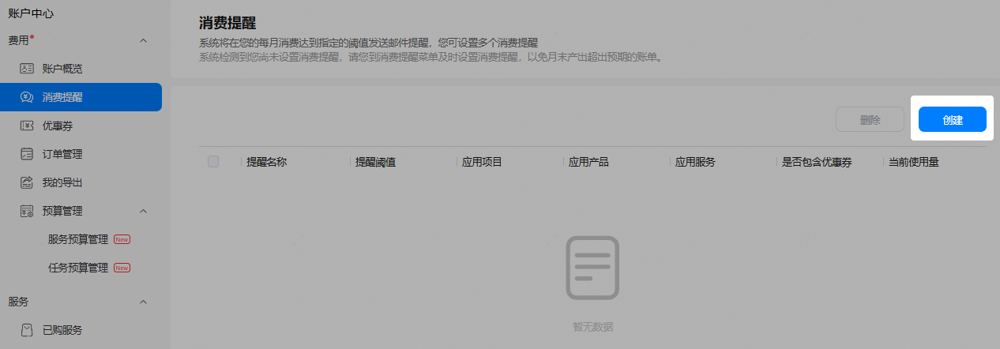
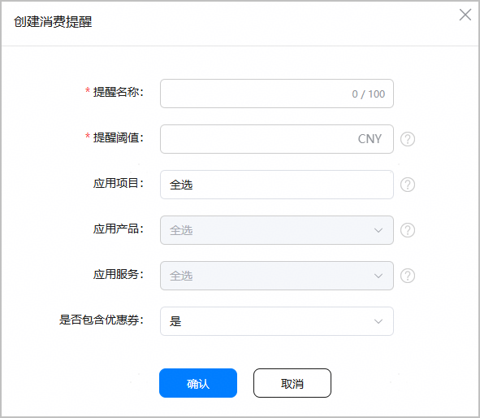

AppGallery Connect支持您设置消费提醒，以便在您每月的消费金额达到设定的阈值时给您发送邮件提醒，避免支出超过预算。

#### 前提条件

* 您已[注册华为开发者账号](https://developer.huawei.com/consumer/cn/doc/start/registration-and-verification-0000001053628148)并[实名认证](https://developer.huawei.com/consumer/cn/doc/start/itrna-0000001076878172)。
* 您已[开通付费服务](https://developer.huawei.com/consumer/cn/doc/start/payment-service-0000001052865979)。

#### 新增消费提醒

1. 登录[AppGallery Connect](https://developer.huawei.com/consumer/cn/service/josp/agc/index.html#/)。
2. 在右上角账号旁的下拉框中选择“账户中心”。

   
3. 选择“费用 > 消费提醒”，在右侧页面点击“创建”。

   

   您最多可设置100条消费提醒。

   
4. 在弹窗内设置消费提醒参数后，点击“确认”。

   

   | 参数 | 说明 |
   | --- | --- |
   | 提醒名称 | 必填。  输入消费提醒的名称，最多100字符。 |
   | 提醒阈值 | 必填。  当您的消费金额达到设置的阈值后，系统将给您发送提醒。例如，币种为人民币，阈值100表示消费超过100元后会发送提醒。  仅支持正整数。 |
   | 应用项目 | 可选项。  您可以选择对某个项目或所有项目设置消费提醒。如果选择“全选”，则“应用产品”和“应用服务”不可选。 |
   | 应用产品 | 可选项。  * 如果“应用项目”选择“全选”，则此选项不可选。 * 如果“应用项目”选择某指定项目：   + 在此处选择该项目下指定的产品，系统将针对该产品发送提醒。   + 在此处选择“全选”，系统将针对该项目的所有产品发送提醒，“应用服务”不可选。 |
   | 应用服务 | 可选项。  * 如果“应用产品”选择“全选”，则此选项不可选。 * 如果“应用产品”选择某指定产品：   + 在此处选择该产品下指定的服务，系统将针对该服务发送提醒。   + 在此处选择“全选”，系统将针对该产品的所有服务消费发送提醒。 |
   | 是否包含优惠券 | 可选项。  设置的提醒阈值是否包含优惠券消费金额。 |

#### 删除消费提醒

在“账户中心 > 费用 > 消费提醒”页面，勾选一条或多条需要删除的消费提醒，点击“删除”，弹出确认框后点击“确认”即可。
