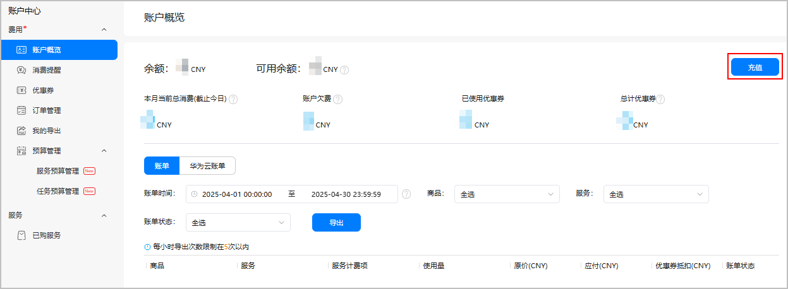
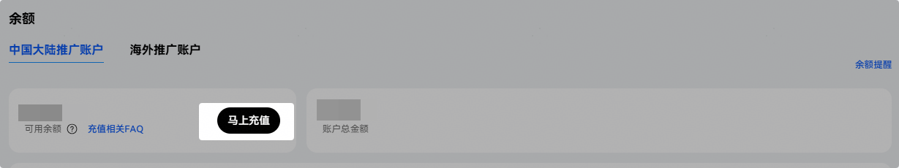
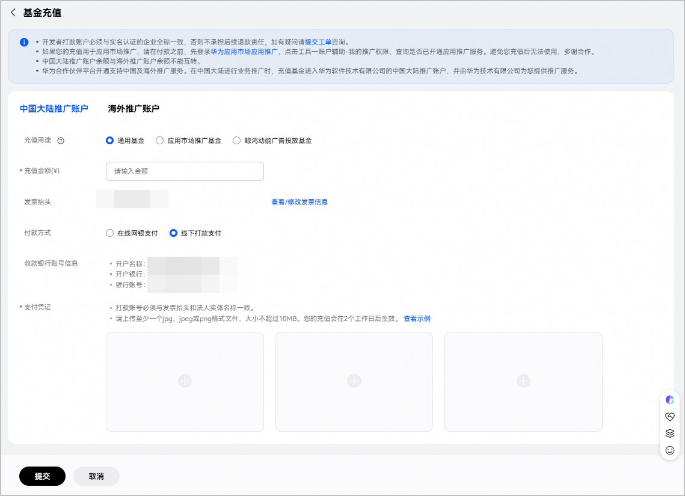
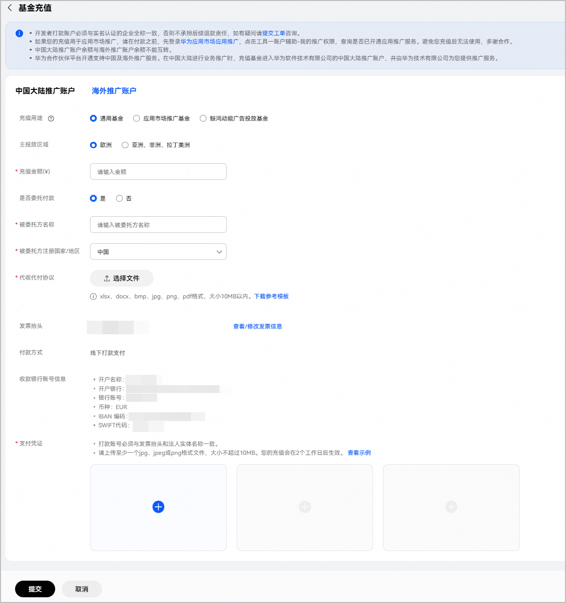

若使用AppGallery Connect的付费服务，开发者需提前在华为开发者联盟账号中进行充值。

#### 前提条件

您的账户首次充值需要[开通付费服务](https://developer.huawei.com/consumer/cn/doc/start/payment-service-0000001052865979)，付费服务成功开通后即可根据实际情况进行充值。目前只支持开发者预付费模式，在充值账户里扣款，不支持后付费模式。

* 企业开发者的开发者账户必须与实名认证的企业全称一致，否则无法进行充值。
* 企业开发者的银行支付账户必须与实名认证的企业全称一致，否则开发者联盟不承担后续退款责任。

#### 操作步骤

1. 进行充值有以下两种途径：
   * 您可以直接登录[华为开发者联盟官网](https://developer.huawei.com/consumer/cn/)，点击“管理中心”，左侧菜单选择“我的账户 > 余额”，进入联盟充值页面。
   * 您也可以登录[AppGallery Connect](https://developer.huawei.com/consumer/cn/service/josp/agc/index.html#/)，进入“账户中心 > 账户概览 ”页面，右上角点击“充值”即可跳转至联盟充值页面。

   

   

   如果是团队账号，只有账号持有者才能正常跳转至联盟充值页面，否则跳转失败。
2. 根据您的注册地，选择对应的充值账户，之后点击“马上充值”。若您的注册地是中国大陆，请选择“中国大陆推广账户”，否则请选择“海外推广账户”。

   

   * 两种充值账户的余额不能互转，请谨慎充值。
   * 两种充值账户的线下收款账号信息不一样，具体账号信息可在“收款银行账号信息”中查看。

   
3. 在“基金充值”窗口中，配置账户充值的相关信息。
   * 中国大陆推广账户

     

     | 参数 | 说明 |
     | --- | --- |
     | 充值用途 | 请选择“通用基金”。 |
     | 充值金额 | 请填写充值金额。 |
     | 发票抬头 | 自动填充实名认证的企业全称，不可更改。如需查看或修改发票信息，可点击“查看/修改发票信息”进行更改。 |
     | 付款方式 | 充值付款支持以下两种方式：  + 在线网银支付：线上充值，使用网银直接支付，充值款项即时到账。 + 线下打款支付：线下充值，使用线下银行转账，转账时请在备注栏里说明款项的业务及用途，例如：用于购买华为终端云服务，字数如有限制，优先填写开发者账号。若正确填写转账备注，充值款项可在2个工作日到账（如遇节假日请提前3个工作日充值）。 |
     | 收款银行账号信息 | 当付款方式选择“线下打款支付”时，界面会展示收款银行账号信息。 |
     | 支付凭证 | 当付款方式选择“线下打款支付”时，需要按界面要求上传打款凭证**。**  打款账号必须与发票抬头和法人实体名称一致。 |
   * 海外推广账户

     

     | 参数 | 说明 |
     | --- | --- |
     | 充值用途 | 请选择“通用基金”。 |
     | 主投放区域 | 请根据实际需求进行选择：  + 欧洲 + 亚洲、非洲、拉丁美洲 |
     | 充值金额 | 请填写充值金额。 |
     | 是否委托付款 | 请选择是否委托付款。 |
     | 被委托方名称 | 请填写被委托方名称。  “是否委托付款”选“是”时才需填写。 |
     | 被委托方注册国家/地区 | 请选择被委托方注册国家/地区。  “是否委托付款”选“是”时才需填写。 |
     | 代收代付协议 | 请按模板要求上传代收代付协议。  “是否委托付款”选“是”时才需填写。 |
     | 发票抬头 | 自动填充实名认证的企业全称，不可更改。如需查看或修改发票信息，可点击“查看/修改发票信息”进行更改。 |
     | 付款方式 | 线下打款支付：线下充值，使用线下银行转账，转账时请在备注栏里说明款项的业务及用途，例如：用于购买华为终端云服务，字数如有限制，优先填写开发者账号。若正确填写转账备注，充值款项可在2个工作日到账（如遇节假日请提前3个工作日充值）。 |
     | 收款银行账号信息 | 收款银行账号信息。 |
     | 支付凭证 | 按界面要求，上传打款凭证**。**  打款账号必须与发票抬头和法人实体名称一致。 |
4. 点击“提交”。
5. （可选）如选择的是“在线网银支付”，还需在弹出的“Web支付”页面选择网上支付银行，点击“下一步”。完成支付后，即完成充值的申请。

   若您无法找到您的银行信息，表示支付平台暂未支持您使用银行的在线支付业务，您可以选择线下打款方式。
