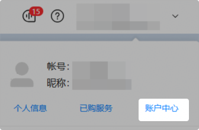
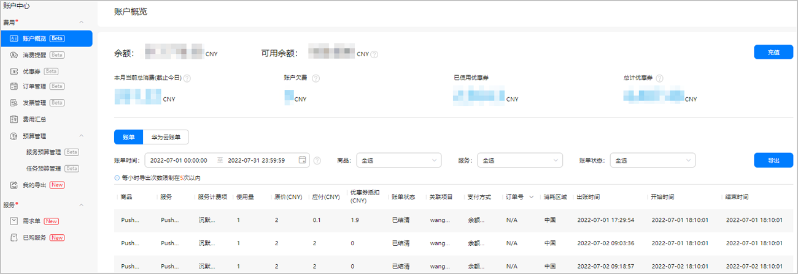
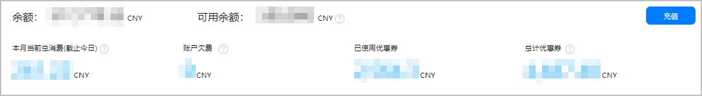
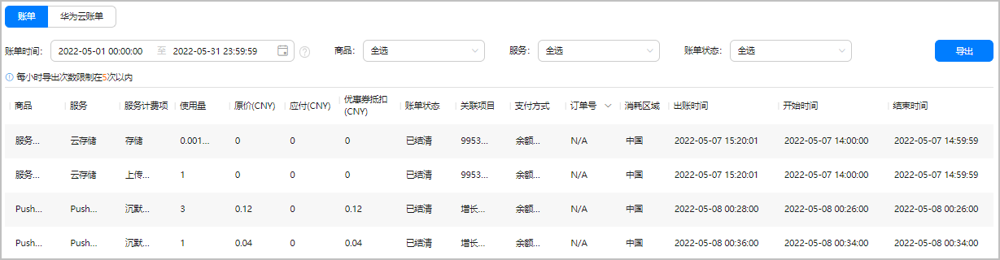
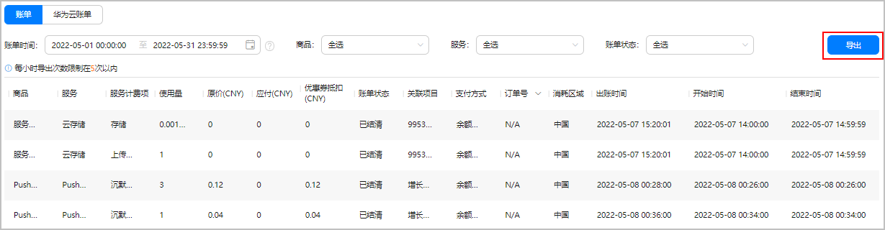
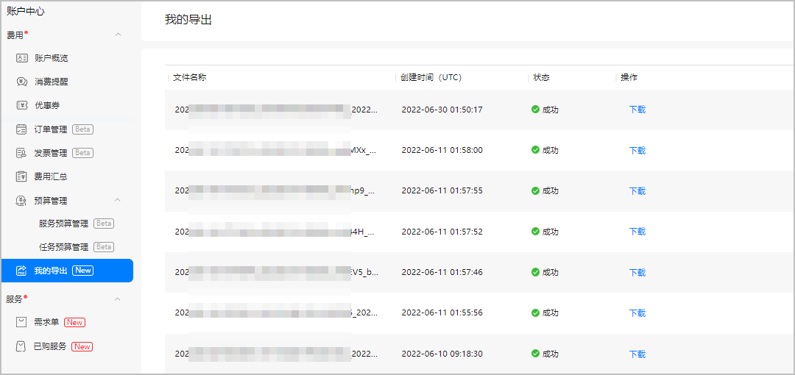
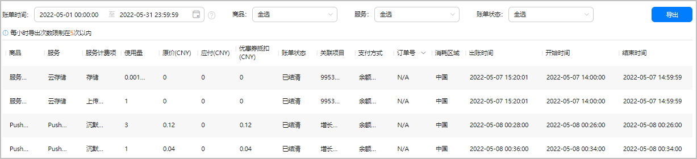
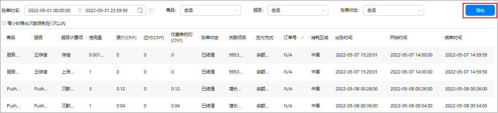

使用AppGallery Connect收费服务后，您可查看您的账户内所有服务或商品的消费情况，也可以查看名下某个项目内的消费明细，方便您随时掌握自身财务状况。

#### 前提条件

* 您已[注册华为开发者账号](https://developer.huawei.com/consumer/cn/doc/start/registration-and-verification-0000001053628148)并[实名认证](https://developer.huawei.com/consumer/cn/doc/start/itrna-0000001076878172)。
* 您已[开通付费服务](https://developer.huawei.com/consumer/cn/doc/start/payment-service-0000001052865979)。

#### 查看账户消费总览

1. 登录[AppGallery Connect](https://developer.huawei.com/consumer/cn/service/josp/agc/index.html#/)。
2. 在右上角账号旁的下拉框中选择“账户中心”。

   
3. 选择“费用 > 账户概览”，即可查看账户内的消费总览，包括：
   * [查看账户余额等基本信息](#section813072912208)。
   * [查看账单明细](#section7704736124414)。
   * [导出账单](#section146401648154317)。

   

#### [h2]查看账户余额等基本信息

在“账户概览”页面，您可：

* 查看账户基本信息，包括账户余额、账户下未被占用的可用余额、本月当前总消费金额（不含优惠券消费金额）、账户欠费金额、当月已用优惠券额度、账户下未过期的（包括已使用和未使用的）优惠券总额。

  当您因账户余额不足导致扣费失败时，系统会通过互动中心消息和邮件给您发送提醒。

  

* 点击“充值”，可前往华为开发者联盟进行[充值](/docs/distribute/agc/agc-help-account-0000002270829385/agc-help-topup-0000002277191065)。

#### [h2]查看账单明细

在“账户概览”页面，您可按“账单时间”（最大支持90天）、“商品”、“服务”和“账单状态”查询当前账户的详细账单。

账户账单列表仅展示有消费的项目。

每条消费记录包含了如下信息。

| 账单信息 | 说明 |
| --- | --- |
| 商品 | 所购商品，包含服务套餐和第三方服务商品。 |
| 服务 | 购买的商品所属的服务。 |
| 服务计费项 | 所购商品的计费因子。 |
| 使用量 | 服务使用量。  说明：  包周期、按次、一次性售卖商品的使用量展示为空。 |
| 原价 | 商品价格。 |
| 应付 | 扣除优惠后需要支付的金额。 |
| 优惠券抵扣 | 使用优惠券抵扣的金额。 |
| 账单状态 | * 已结清：当前商品费用已结清。  * 未结清：当前商品费用未结清。 * 欠费：当账户余额不足时，扣费失败的商品为“欠费”状态。账户余额充足后，会自动结清欠费账单，付款成功的商品账单状态变为“已结清”。 |
| 关联项目 | 购买商品的项目。 |
| 支付方式 | 商品的支付方式，包括余额支付、支付宝、微信、企业网银、线下支付。 |
| 订单号 | 购买商品的订单号。  支持订单号搜索（不支持模糊搜索）。 |
| 消耗区域 | 已使用所购商品的区域。 |
| 出账时间 | 账单生成时间。 |
| 开始/结束时间 | 商品消耗的开始/结束时间，为您所在国家/地区的本地计时时间。 |

#### [h2]导出账单

您可将查询到的账单报表导出至本地。

每小时成功导出账单不得超过5次，且一次最多可导出2,000,000条记录。

1. 在“账户概览”页面，点击账单列表右上方的“导出”。

   

2. 点击提示框中的“查看导出列表”，或在左侧导航栏选择“我的导出”，可查看导出结果，或下载导出文件。

   如数据量大于500,000条，导出的.zip包内会包含多个Excel文件，多个Excel按文件名的序号后缀（如“\_0.xlsx”、“\_1.xlsx”）区分排列。

   

   如导出任务失败，可能是环境异常导致超时，建议您重试。如重试仍失败，您可通过[在线工单系统](https://developer.huawei.com/consumer/cn/support/feedback/#/add/13?level2=111)与我们联系。

   

#### 查看项目费用

您还可以选择查看某个项目内的消费情况。

1. 登录[AppGallery Connect](https://developer.huawei.com/consumer/cn/service/josp/agc/index.html)，选择“开发与服务”。
2. 在项目列表中点击您的项目，进入“项目设置”页面。
3. 在“项目设置”页面，点击“项目费用”页签，可以：
   * [查看当前项目总消费金额](#section178916580233)。
   * [查看当前项目的消费账单明细](#section3617969567)。
   * [导出账单](#section9320236119)。

如果您启用了多个数据处理位置，页面展示的是当前项目在所有数据处理位置的累计消费总额。

#### [h2]查看项目消费总额

* “项目费用”页面顶端展示本项目当前总消费金额（不含优惠券消费金额）和账户欠费金额。

  当您因账户余额不足导致扣费失败时，系统会通过互动中心消息和邮件给您发送提醒。
* 点击“账户管理”，可前往“账户中心 > 费用 > 账户概览”页面查看账户下的全部消费账单等，详情请参见[查看账户消费总览](#section1526115715568)。

#### [h2]查看项目账单明细

您可按“账单时间”（最大支持90天）、“商品”、“服务”和“账单状态”查询当前项目的消费账单。

每条消费记录包含了如下信息。

| 账单信息 | 说明 |
| --- | --- |
| 商品 | 所购商品，包含服务套餐和第三方服务商品。  注意：  项目账单不展示Saas服务类包周期套餐和按次套餐的消费情况。 |
| 服务 | 购买的商品所属的服务。 |
| 服务计费项 | 所购商品的计费因子。 |
| 使用量 | 服务使用量。  说明：  一次性售卖商品的使用量展示为空。 |
| 原价 | 商品价格。 |
| 应付 | 扣除优惠后需要支付的金额。 |
| 优惠券抵扣 | 使用优惠券抵扣的金额。 |
| 账单状态 | * 已结清：当前商品费用已结清。  * 未结清：当前商品费用未结清。 * 欠费：当账户余额不足时，扣费失败的商品为“欠费”状态。账户余额充足后，会自动结清欠费账单，付款成功的商品账单状态变为“已结清”。 |
| 关联项目 | 购买商品的项目。 |
| 支付方式 | 商品的支付方式，包括余额支付、支付宝、微信、企业网银、线下支付。 |
| 订单号 | 购买商品的订单号。  支持订单号搜索（不支持模糊搜索）。 |
| 消耗区域 | 已使用所购商品的区域。 |
| 出账时间 | 账单生成时间。 |
| 开始/结束时间 | 商品消耗的开始/结束时间，为您所在国家/地区的本地计时时间。 |

#### [h2]导出账单

您可将查询到的项目账单报表导出至本地。

每小时成功导出账单不得超过5次，且一次最多可导出2,000,000条记录。

1. 在“项目费用”页面，点击账单列表右上方的“导出”。

   

2. 点击提示框中的“查看导出列表”，可进入“我的导出”页面查看导出结果，或下载导出文件。

   您也可在右上角账号旁的下拉框中点击“账户中心”，进入“我的导出”页面查看。

   如数据量大于500,000条，导出的.zip包内会包含多个Excel文件，多个Excel按文件名的序号后缀（如“\_0.xlsx”、“\_1.xlsx”）区分排列。

   

   如导出任务失败，可能是环境异常导致超时，建议您重试。如重试仍失败，您可通过[在线工单系统](https://developer.huawei.com/consumer/cn/support/feedback/#/add/13?level2=111)与我们联系。

   导出的项目账单.zip包名包含项目ID，方便您与账户级账单进行区分。

   
