若应用/元服务需使用ACL权限，需要在AGC申请权限，AGC会根据应用/元服务的使用场景审核是否可以使用对应的权限。

#### 前提条件

* ACL权限仅允许在实现特殊场景与功能时使用。申请前，请先参考[受限开放权限列表](https://developer.huawei.com/consumer/cn/doc/harmonyos-guides/restricted-permissions)，确保应用/元服务的场景与功能满足申请ACL权限的条件。

* 目前仅账号归属地为中国大陆地区的开发者支持使用ACL权限。

#### 申请ACL权限

1. 登录[AppGallery Connect](https://developer.huawei.com/consumer/cn/service/josp/agc/index.html#/)，点击“开发与服务”。
2. 在项目列表中找到您的项目，并点击选择您需要申请ACL权限的应用/元服务。
3. 在“项目设置”页面，选择“ACL权限”页签，开始为应用/元服务申请ACL权限。

   

   * 若您没有找到“ACL权限”页签，请重新创建新的HarmonyOS应用/元服务。
   * 在申请之前，请务必仔细核对当前所选的项目和应用。如有问题，可通过页面左上方的项目/应用下拉框切换至正确的项目/应用。

   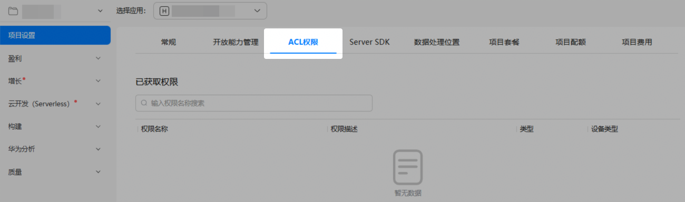
4. 在“未获取权限”区域，仔细阅读注意事项后勾选“我已知晓”，选择需申请的权限，然后点击“申请”。

   一次最多可勾选申请30条权限。并且，您必须等待上一次权限申请审批结束后，才可提交新的权限申请。

   

   * 界面可选的ACL权限因当前应用类型和开发者类型不同而存在差异，请以实际展示为准。
   * 选择权限时，请注意各权限支持的设备类型，确保软件包声明的设备类型范围不超出申请的权限支持的设备类型范围，否则将导致应用/元服务安装失败。
   * 如果应用/元服务使用的受限开放权限超出申请范围，或申请权限后使用的功能和场景超出可使用的范围，将影响应用/元服务调试或上架。

   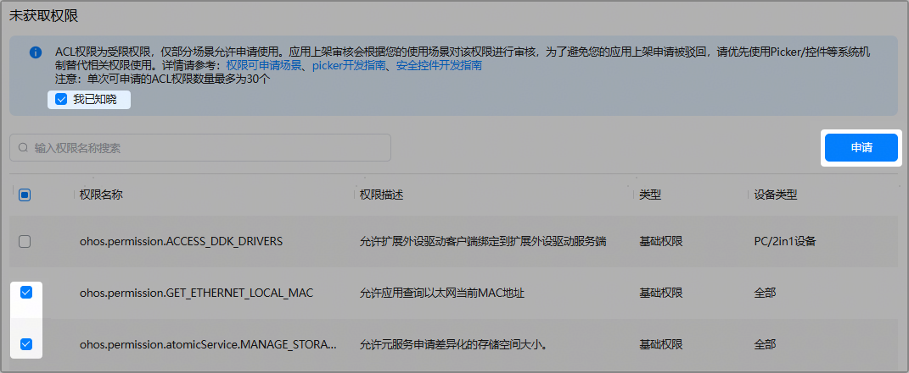

5. 在“新建业务申请”窗口填写申请信息，然后点击“提交”。申请界面因ACL权限的不同而存在差异，请以实际展示为准。
   * 部分ACL权限要求提交申请原因及附件：
     + 申请原因：必填，不超过256个字符。部分权限的申请原因需按模板填写或有特定要求，请严格按界面提示填写。
     + 上传附件：选填，仅可上传1个附件，大小不超过500MB。支持文本、表格、图片、视频、压缩包格式。

     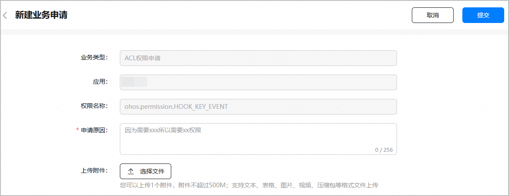
   * 部分ACL权限要求提交使用场景说明及附件。
     + 使用场景：必填。请选择符合实际的权限使用场景。

       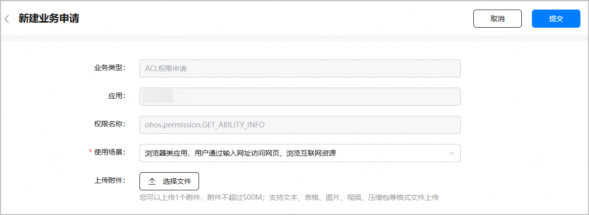

       若当前没有符合的使用场景可选，请选择“例外场景”，并在下方“申请原因”栏提供具体说明。

       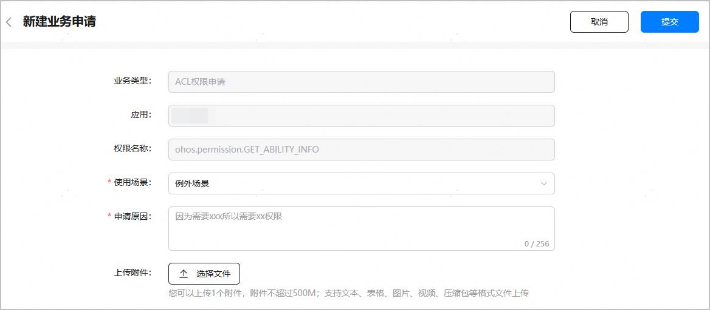
     + 上传附件：选填，仅可上传1个附件，大小不超过500MB。支持文本、表格、图片、视频、压缩包格式。
6. 弹出如下对话框，提示您可以创建试用调试Profile来提前试用申请的这些权限。

   

   如未弹出此对话框，请核实当前账号角色是否已[获取“访问调试类证书”权限](https://developer.huawei.com/consumer/cn/doc/app/agc-help-manageaccount-0000002306610129#ZH-CN_TOPIC_0000002306610129__li626645853313)。

   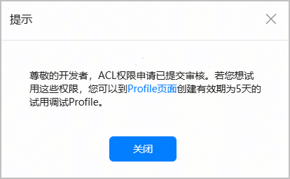

   * 如需创建，点击“Profile页面”链接，打开创建试用调试Profile窗口，具体操作可参考[创建试用调试Profile](#section1443958124819)。
   * 如无需创建，点击“关闭”，进入互动中心页面，可看到申请已提交的消息。

     

     此入口为创建试用调试Profile的唯一途径，一旦关闭则无法恢复，只能等待ACL权限申请审批通过之后再正式使用权限，请您谨慎操作。

     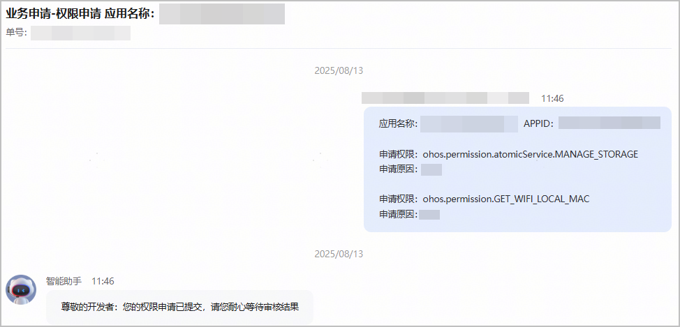
7. ACL权限申请将在限定的审核时长内处理，每个权限的审核时长可查询[受限开放权限列表](https://developer.huawei.com/consumer/cn/doc/harmonyos-guides/restricted-permissions)。审核结果将通过互动中心消息和邮件发送给您，请您耐心等待。

   审核通过后，您可前往“ACL权限”页签，在“已获取权限”区域查看获取的权限。**后续您在为应用/元服务****[创建Profile](https://developer.huawei.com/consumer/cn/doc/app/agc-help-profile-0000002270709473)时，****所有****获取的权限都将全部写入Profile内，****以****防止应用/元服务打包上架时因缺少相关配置导致被驳回。****权限全部写入不会影响后续的传包及上架流程。**

   

   * 若一次申请的权限中只有部分审核通过，该部分权限也会展示在“已获取权限”区域。
   * ACL权限信息需要添加到Profile中，建议您在创建Profile前先完成ACL权限申请。如果在创建Profile后ACL权限又有变化，需重新创建Profile。

   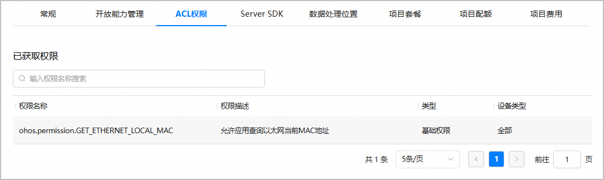

#### （可选）创建试用调试Profile

ACL权限审核等待期间，您还可以创建试用调试Profile来提前试用您申请的这些权限。试用调试Profile有效期为5天，到期即失效。一个应用/元服务最多支持创建5个试用调试Profile。

您必须先提交ACL权限申请，才能创建试用调试Profile。不支持直接创建试用调试Profile。

具体操作指导如下：

1. 在提交ACL权限申请后弹出的提示框中，点击“Profile页面”链接。

   

   如未弹出此对话框，请核实当前账号角色是否已[获取“访问调试类证书”权限](https://developer.huawei.com/consumer/cn/doc/app/agc-help-manageaccount-0000002306610129#ZH-CN_TOPIC_0000002306610129__li626645853313)。

   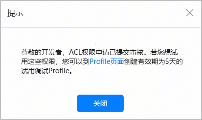

   

   提交ACL权限申请后，若界面提示当前应用/元服务的试用调试Profile数量已达到上限，您可先前往“证书、APP ID和Profile > Profile”页面删除部分试用调试Profile，下一次提交ACL权限申请时便可创建新的试用调试Profile。
2. 进入“添加试用调试Profile”页面，配置Profile信息。

   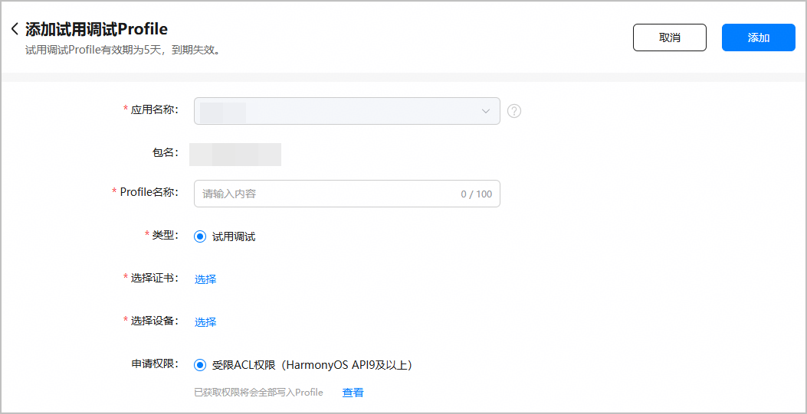

   | 参数 | 说明 |
   | --- | --- |
   | 应用名称 | 自动带入之前申请ACL权限的应用/元服务名称，不可更改。 |
   | 包名 | 自动填充，不可更改。 |
   | Profile名称 | 不超过100个字符。 |
   | 类型 | 固定为“试用调试”。 |
   | 选择证书 | 点击“选择”，选择一个[调试证书](https://developer.huawei.com/consumer/cn/doc/app/agc-help-debug-cert-0000002283256797)。  注意：  仅支持选择调试证书。 |
   | 选择设备 | 点击“选择”，选择一个或多个[调试设备](https://developer.huawei.com/consumer/cn/doc/app/agc-help-add-device-0000002283189937)。最多可选择100个设备，已删除的设备不可选。 |
   | 申请权限 | 申请中以及之前已获取的所有ACL权限将会全部写入试用调试Profile。点击“查看”，可以查看权限详情。 |
3. 核对Profile信息无误后，点击右上角“添加”，试用调试Profile创建成功。点击“下载”，将生成的Profile保存至本地，供后续签名使用。

   

   Profile创建成功即为“生效”状态。若Profile状态变为“失效”，表示当前Profile已不可用，您需要重新创建Profile。

   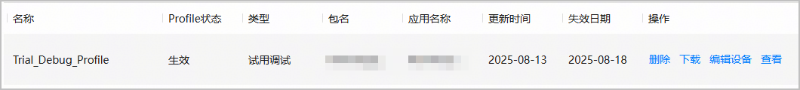
4. （可选）“生效”状态的试用调试Profile还支持修改Profile绑定的调试设备。点击“编辑设备”，重新选择调试设备即可。

   

   * 修改调试设备后，会生成新的试用调试Profile，请在生效后重新下载试用调试Profile。
   * 如后续需添加新的调试设备，请先参考[注册设备](https://developer.huawei.com/consumer/cn/doc/app/agc-help-add-device-0000002283189937)将新设备添加到AppGallery Connect设备列表，再点击“编辑设备”新增选择该设备，之后重新下载试用调试Profile即可。

   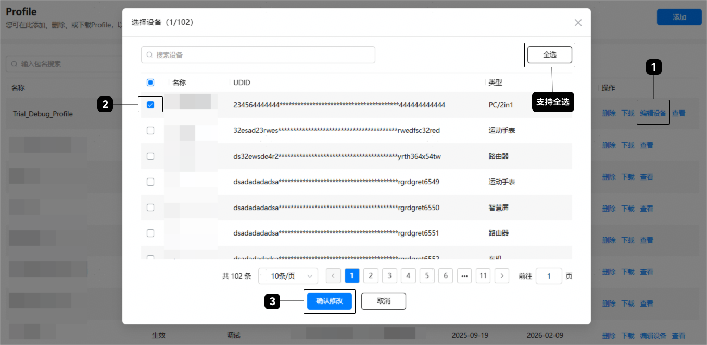
