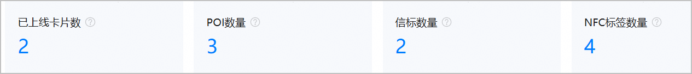
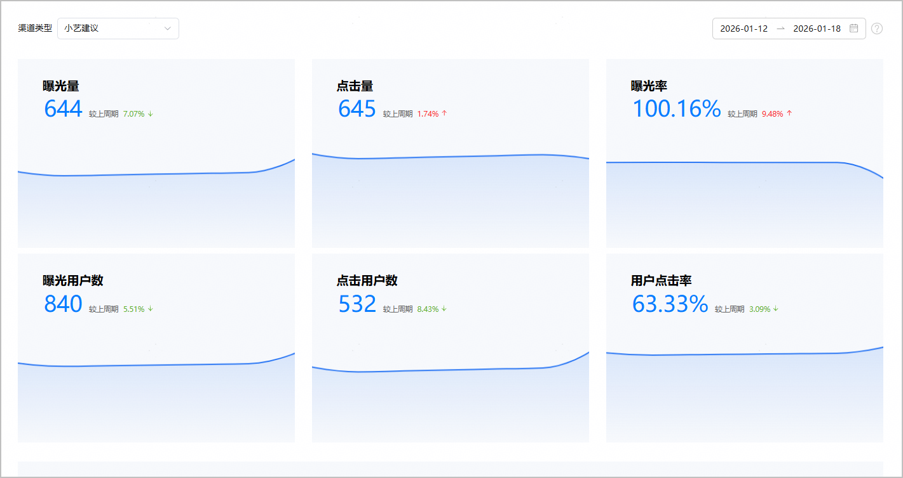
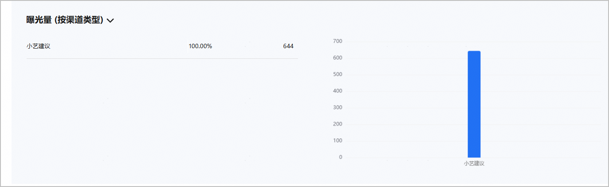
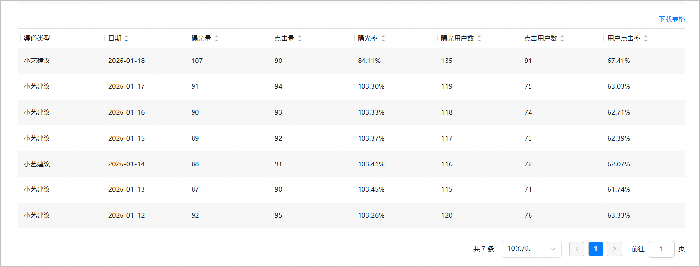

#### 近场服务分析

1. 在[AppGallery Connect](https://developer.huawei.com/consumer/cn/service/josp/agc/index.html)首页，点击“分析”。
2. 从列表中选择您的应用，点击“近场分析 > 近场服务分析”。

   “近场服务分析”报表由[核心指标](#section1943831854512)、[曝光和使用数据概览卡片](#section543922312352)、[曝光和使用数据TOP5柱状图](#section1122010155458)与[曝光和使用数据明细表格](#section1583964384714)构成，有助于您直观了解近场推荐在运营场景中的基础数据状况，评估产品价值与运营成本，实现数据驱动的精细化运营，从而促进用户流量的增长。

   

   目前近场服务处于灰度开放阶段，使用服务之前，请先发送邮件[申请开通近场服务权限](https://developer.huawei.com/consumer/cn/doc/app/agc-help-location-sense-apply-permission-0000002382902149#section1337155051819)。

#### [h2]核心指标

该模块展示应用下所有已经上线的卡片数、POI数、信标数和NFC标签数。

数据指标说明。

| 指标名称 | 指标说明 |
| --- | --- |
| 已上线卡片数 | 统计状态为“已上线”且开放范围为“全网”的卡片。 |
| POI数量 | 统计已经关联了近场服务，且关联的近场服务开放范围为“全网”的POI。 |
| 信标数量 | 统计已经关联了近场服务，且关联的近场服务开放范围为“全网”的信标。 |
| NFC标签数量 | 统计已经关联了近场服务，且关联的近场服务开放范围为“全网”的NFC标签。 |

#### [h2]曝光和使用数据概览卡片

该模块展示所选过滤条件和时间段内的“曝光量”、“点击量”、“曝光率”、“曝光用户数”、“点击用户数”、“用户点击率”指标的总数据、较上周期的环比值及数据变化趋势。

* 点击“渠道类型”，选择“小艺建议”或“花瓣地图”渠道，页面会展示对应渠道的详细数据。

  

  目前仅元服务支持“花瓣地图”渠道，HarmonyOS应用不支持。
* 点击右上角选择日期范围，时间跨度不得超过180天。您可以选择预定时间段（支持“昨天”、“过去7天”、“过去14天”、“过去30天”、“本周”、“上周”、“本月”和“上月”）或输入自定义范围，界面默认展示过去7天的时间段。日期时间为“北京时间UTC+8”。

#### [h2]曝光和使用数据TOP5柱状图

该模块默认展示所选时间段内的“曝光量”指标按照渠道类型维度降序排列的情况，包含TOP5名称、数据百分比和数量。

除了“曝光量”，还支持下拉筛选“点击量”、“曝光用户数”或“点击用户数”。

#### [h2]曝光和使用数据明细表格

该模块默认展示所选时间段内按“日期”降序排列的曝光和使用数据明细，包括渠道类型及指标数据。

* 点击表格列的正三角/倒三角按钮，可以按该指标进行升序/降序排列。
* 点击表格上方的“下载表格”按钮，可以将数据下载到本地。
