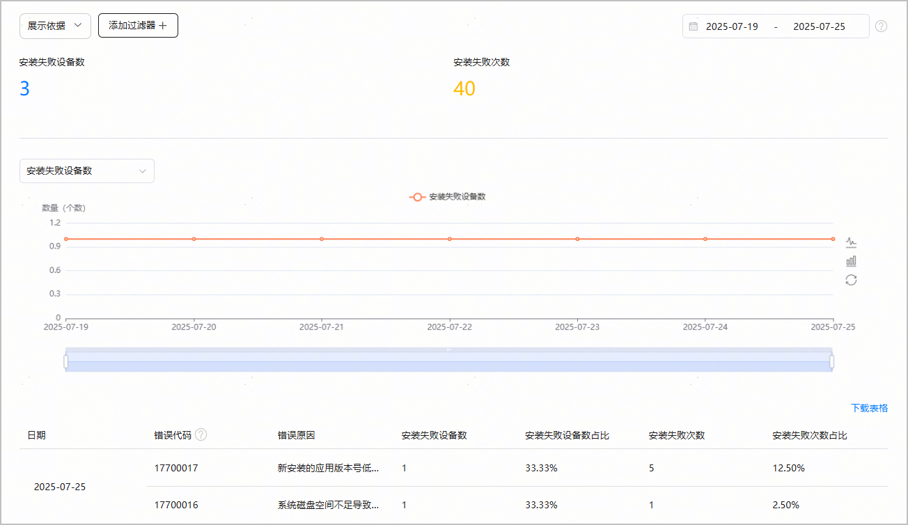

#### 安装失败

#### [h2]报表概览

1. 在[AppGallery Connect](https://developer.huawei.com/consumer/cn/service/josp/agc/index.html)首页，点击“分析”。
2. 从列表中选择您的应用，点击“质量分析 > 安装失败”。

   “安装失败”报表提供了“安装失败设备数”、“安装失败次数”及安装失败错误代码统计等数据，并提供表格下载功能。

   

   * 点击“展示依据”，选择“国家/地区”、“机型”、“下载类型”、“应用版本”，下方列表将展示对应维度的详细报表数据。
   * 在“添加过滤器”中：
     + 点击“国家/地区”，可选择不同国家或地区查看对应的数据。
     + 点击“机型”，可选择不同的设备类型及设备型号查看对应的数据。
     + 点击“下载类型”，可选择不同下载类型（“新下载”或“更新下载”）查看对应的数据。
     + 点击“应用版本”，可选择不同应用版本查看对应的数据。
   * 在右上角选择日期范围。您可以选择预定时间段（例如 “过去7天”）或输入自定义范围，时间跨度不得超过180天。
   * 点击指标下拉框，选择一项指标，如“安装失败设备数”或“安装失败次数”，可查看该指标的折线图或柱状图。
   * 点击表格上方的“下载表格”按钮，可以将数据下载到本地。

#### [h2]指标说明

| 指标 | 说明 |
| --- | --- |
| 错误代码 | 安装失败返回的错误码。 |
| 错误原因 | 安装失败的错误原因。 |
| 安装失败设备数 | 时间间隔范围内的安装失败设备数。 |
| 安装失败设备数占比 | 时间间隔范围内的安装失败设备数占比（统计日当日该错误码对应的安装失败设备数/统计周期内总安装设备数）。 |
| 安装失败次数 | 时间间隔范围内的安装失败次数。 |
| 安装失败次数占比 | 时间间隔范围内的安装失败次数占比（统计日当日该错误码对应的安装失败次数/统计周期内总安装次数）。 |
