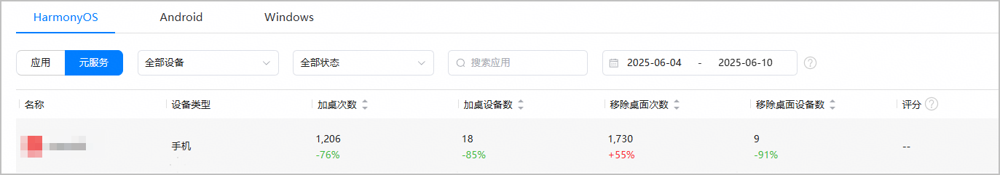
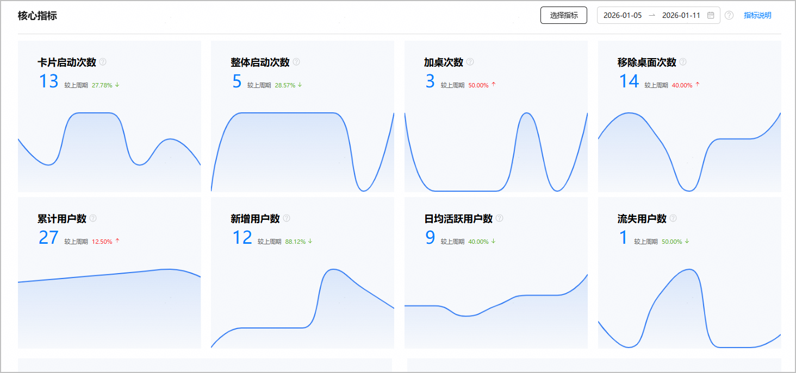
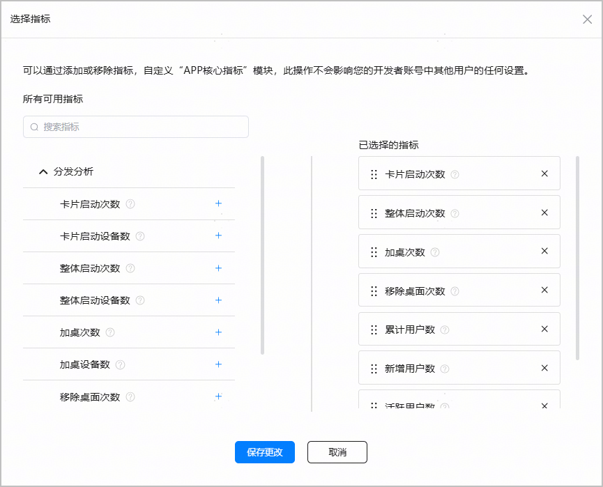
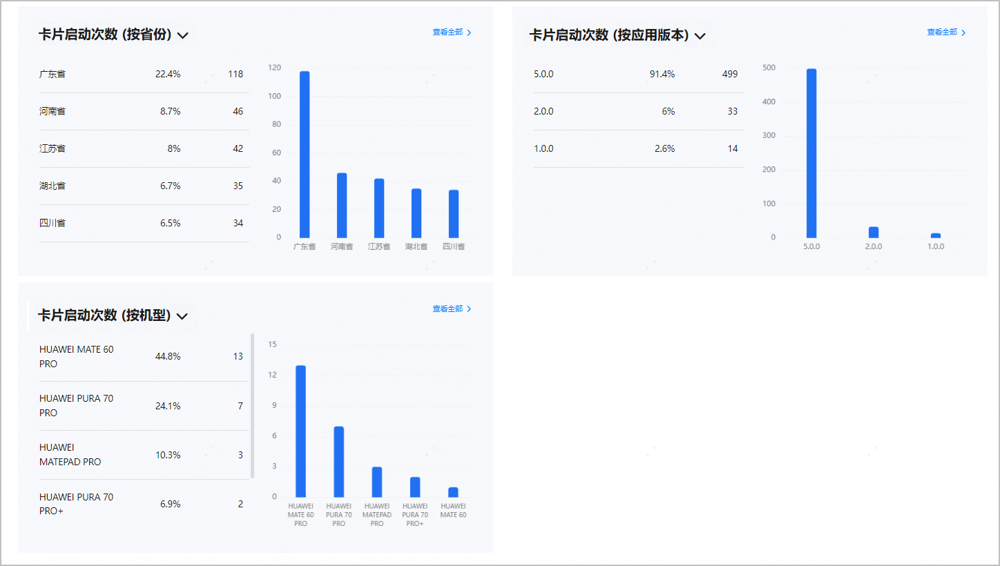
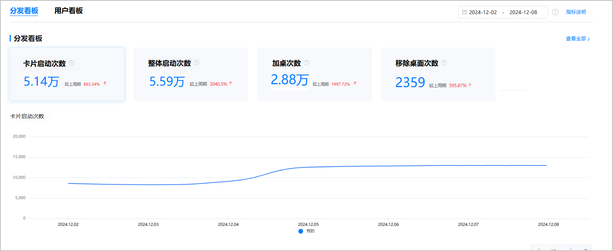
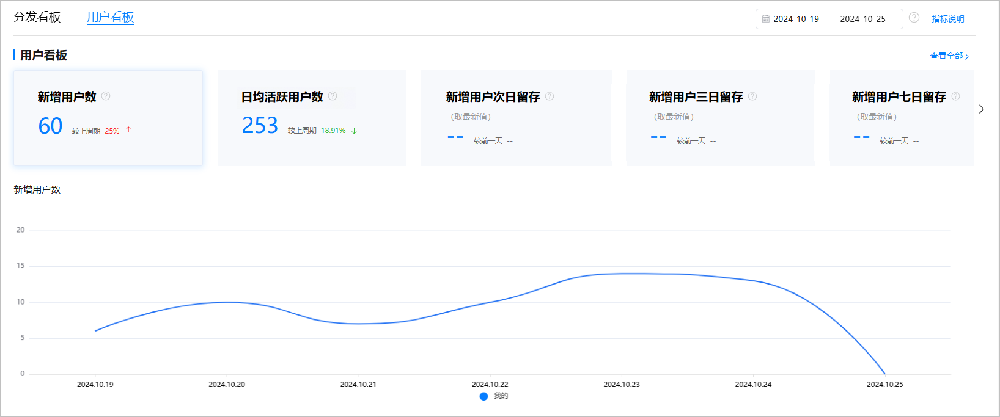

[元服务分析总览](#section106851042192815)为您提供元服务的分析总览数据；[元服务分析概览](#section17943125854315)提供单个元服务的关键KPI指标概览。

#### 元服务分析总览

1. 登录[AppGallery Connect](https://developer.huawei.com/consumer/cn/service/josp/agc/index.html)，点击“分析”。
2. 在分析总览页面选择“HarmonyOS”页签，点击“元服务”，即可展示所有元服务的分析总览数据。

   

   * 查看单个元服务数据指标。点击元服务名称，可以查看该元服务的概览页面；点击指标数据，可以查看该指标所在的报表页面。
   * 指标数据的上方显示当前时间周期的数据，下方则显示与上一个时间周期相比的数据增减百分比。

   

   “准备提交”、“正在审核”、“待修改”、“待上架”、“已撤销上架”的元服务不在“分析”总览中展示，可以在“APP与元服务”中查看。

#### 元服务分析概览

概览界面默认展示当前元服务的关键KPI表现情况，由[核心指标](#section85002014144412)、[TOP5数据](#section19526510517)和[看板模块](#section966516146443)构成。

1. 登录[AppGallery Connect](https://developer.huawei.com/consumer/cn/service/josp/agc/index.html)，点击“快速开始”中的“元服务一站式平台”卡片。

   
2. 在左上角下拉列表选择要查看的元服务。

   
3. 左侧导航选择“数据分析 > 概览”，进入元服务分析概览页面。

#### [h2]核心指标

核心指标默认展示“卡片启动次数”、“整体启动次数”、“加桌次数”、“移除桌面次数”、“累计用户数”、“新增用户数”、“日均活跃用户数”、“流失用户数”的汇总数据，以及各个数据的环比值。

* 点击右上角选择日期范围，时间跨度不得超过180天。您可以选择预定时间段（支持“昨天”、“过去7天”、“过去14天”、“过去30天”、“本周”、“上周”、“本月”和“上月”）或输入自定义范围，界面默认展示过去7天的时间段。日期时间为“北京时间UTC+8”。
* 点击“选择指标”按钮，可选择展示关键指标，必须选择8个。保存后，下次登录时，会展示上次保存的效果。

  
* 每个指标下方都会呈现对应的数据曲线图，曲线图上展示选中的时间内每天的数据，且支持展示环比值。
* 点击指标数据，可以跳转到该指标对应的报表页面，查看详细数据。

#### [h2]TOP5数据

TOP5数据支持筛选单个指标，按省份、应用版本、机型维度展示该指标TOP5名称、数据百分比（当前指标占总指标数的比例）、数据。点击“查看全部”可跳转到指标所对应的报表页面。

#### [h2]概览报表当前支持的核心指标

| 报表 | 指标名称 | 指标说明 |
| --- | --- | --- |
| 分发分析 | 卡片启动次数 | 用户元服务卡片启动的次数，含加桌卡片，负一屏卡片等卡片。 |
| 卡片启动设备数 | 用户元服务卡片启动的设备数，含加桌卡片，负一屏卡片等卡片。 |
| 整体启动次数 | 系统全局的整体元服务启动次数，含卡片、负一屏、应用市场、搜索等全部系统来源场景。 |
| 整体启动设备数 | 系统全局的整体元服务启动设备数，含卡片、负一屏、应用市场、搜索等全部系统来源场景。 |
| 加桌次数 | 用户主动添加元服务卡片到桌面行为的次数。 |
| 加桌设备数 | 用户主动添加元服务卡片到桌面行为的设备数。 |
| 移除桌面次数 | 用户主动从桌面移除元服务卡片行为的次数。 |
| 移除桌面设备数 | 用户主动从桌面移除元服务卡片行为的设备数。 |
| 用户分析 | 累计用户数 | 截止当日累计用户数。每个用户只会被记录一次，以当次的访问版本为准。 |
| 新增用户数 | 访问元服务的去重新增用户数。每个用户只会被记录一次，以初次的访问版本为准。 |
| 日均活跃用户数 | 所选时间段内每日活跃用户的累计总和/所选时间段天数。  说明：  活跃的定义：打开元服务即算，没有时长要求。 |
| 流失用户数 | 过去3个月内未使用过元服务，但过去一年内使用过元服务的用户。 |
| 累计设备数 | 从统计起始时间到当前时间点，所有访问元服务的去重设备数。 |
| 新增设备数 | 访问元服务的去重新增设备数。 |
| 日均活跃设备数 | 所选时间段内每天活跃设备的累计总和/所选时间段天数。  说明：  活跃的定义：打开元服务即算，没有时长要求。 |
| 流失设备数 | 过去3个月内未使用过元服务，但过去一年内使用过元服务的设备。 |

#### [h2]看板模块

看板模块包含“分发看板”、“用户看板”。您可通过点击看板页签直接查看对应看板数据。

* **分发看板：**为您展示“整体启动次数”、“加桌次数”等汇总数据。当您点击某个指标（如“整体启动次数”）时，下方图表中会呈现对应的数据曲线图，您可清晰掌握元服务卡片被启动、加桌等情况。

  如您要查看更详细的分发信息，点击右侧的“查看全部”，页面跳转到“[分发分析报表](https://developer.huawei.com/consumer/cn/doc/app/agc-help-anaiyze-atomic-usage-0000002271411717#section08571334172416)”页面。

  您也可以点击右上角选择预定时间段（例如，过去7天）或输入自定义范围（时间跨度不得超过180天），界面默认展示过去7天的时间段。

  

  **指标说明**

  | 指标名称 | 指标说明 |
  | --- | --- |
  | 卡片启动次数 | 用户元服务卡片启动的次数，含加桌卡片，负一屏卡片等卡片。 |
  | 整体启动次数 | 系统全局的整体元服务启动次数，含卡片、负一屏、应用市场、搜索等全部系统来源场景。 |
  | 加桌次数 | 用户主动添加元服务卡片到桌面行为的次数。 |
  | 移除桌面次数 | 用户主动从桌面移除元服务卡片行为的次数。 |

* **用户看板**：为您展示“新增用户数”、“日均活跃用户数”、“新增用户次日留存”、“新增用户三日留存”、“新增用户七日留存”的汇总数据和环比值。当您点击某个指标（如“新增用户数”）时，下方图表中会呈现对应的数据曲线图，您可清晰掌握元服务的用户使用情况。

  如您要查看更详细的用户信息，点击右侧的“查看全部”，页面跳转到“[用户分析](https://developer.huawei.com/consumer/cn/doc/app/agc-help-anaiyze-atomic-usage-0000002271411717#section058803371718)”报表页面。

  您也可以点击右上角选择预定时间段（例如，过去7天）或输入自定义范围（时间跨度不得超过180天），界面默认展示过去7天的时间段。

  

  **指标说明**

  | 指标名称 | 指标说明 |
  | --- | --- |
  | 新增用户数 | 访问元服务的去重新增用户数。 |
  | 日均活跃用户数 | 所选时间段内每天活跃用户的累计总和/所选时间段天数。  说明：  活跃的定义：打开元服务即算，没有时长要求。 |
  | 新增用户次日留存 | 统计日首次打开元服务的用户次日保持活跃的比率。 |
  | 新增用户三日留存 | 统计日首次打开元服务的用户第3天保持活跃的比率。 |
  | 新增用户七日留存 | 统计日首次打开元服务的用户第7天保持活跃的比率。 |
