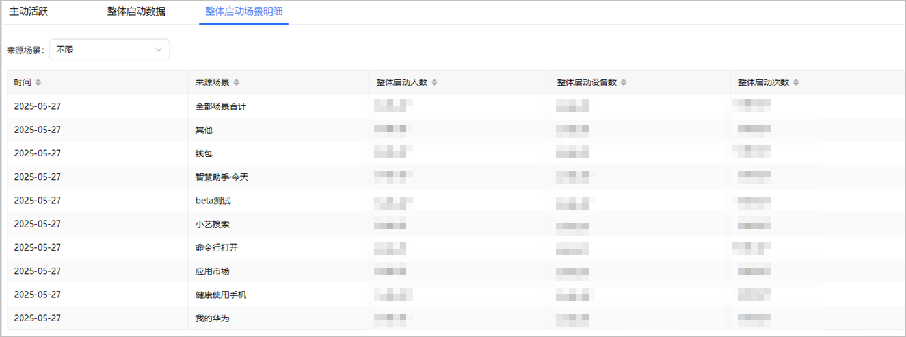
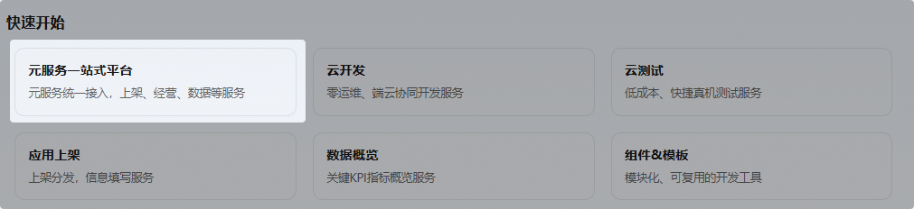
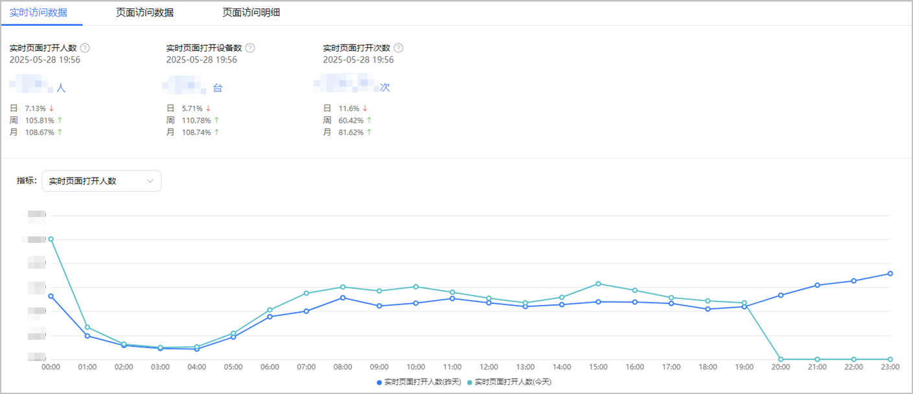
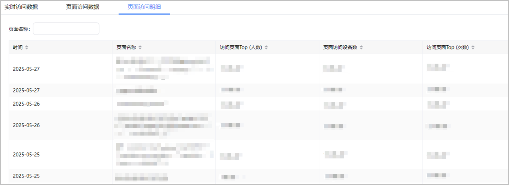
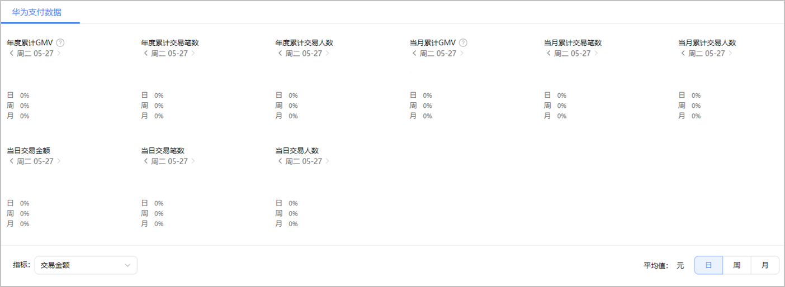

您可以在“元服务履约数据分析”页签下查看元服务的使用情况：

“元服务履约数据分析”报表包含“[访问分析](#section7346714124116)”、“[页面分析](#section15514203219411)”、“[华为支付](#section198906590417)”三个页面，便于您查看访问人数、交易金额等数据。

#### 访问分析

1. 登录[AppGallery Connect](https://developer.huawei.com/consumer/cn/service/josp/agc/index.html)，点击“快速开始”中的“元服务一站式平台”卡片。

   
2. 在左上角下拉列表选择要查看的元服务。

   
3. 左侧导航选择“数据分析 > 元服务履约数据 > 访问分析”，进入访问分析页面。

   访问分析看板分为“主动活跃”、“整体启动数据”与“整体启动场景明细”页签。

   * **主动活跃**

     主动活跃看板目前为：主动活跃人数。

     | 指标名称 | 指标说明 |
     | --- | --- |
     | 主动活跃人数 | 主动打开元服务页面的活跃用户数。 |
   * **整体启动数据**

     整体启动数据看板顶部从左到右依次为：整体启动人数、整体启动设备数、整体启动次数、新整体启动人数、累计整体启动人数、人均停留时长、次均停留时长。

     | 指标名称 | 指标说明 |
     | --- | --- |
     | 整体启动人数 | 整体启动元服务的用户数，同一用户多次启动不重复计。 |
     | 整体启动设备数 | 整体启动元服务的设备数，同一设备多次启动不重复计。 |
     | 整体启动次数 | 启动元服务的总次数，从启动元服务到主动关闭或超时退出元服务的过程，计为一次。 |
     | 新整体启动人数 | 首次启动元服务的用户数，同一用户多次启动不重复计。 |
     | 累计整体启动人数 | 历史累计启动元服务的用户数，同一用户多次启动不重复计。 |
     | 人均停留时长 | 平均每个用户停留在元服务的总时长（单位为秒），即总停留时长/启动人数。 |
     | 次均停留时长 | 平均每次启动元服务停留在元服务的总时长（单位为秒），即总停留时长/启动次数。 |

     + 点击指标1下拉框，可选：整体启动人数、整体启动设备数、整体启动次数、新整体启动人数、累计整体启动人数、人均停留时长、次均停留时长。
     + 点击指标2下拉框，可选：整体启动来源分布（人数）、整体启动来源分布（次数），可按日、周、月进行统计。

       

       整体启动来源分布（人数）与（次数）中场景来源：启动元服务后，根据上报的启动场景（英文包名）转换为中文名进行呈现。
     + 点击指标3下拉框，可选：停留时长分布（人数）、停留时长分布（次数），可按日、周、月进行统计。
   * **整体启动场景明细**

     来源场景下拉框，可查看数据明细。

     

#### 页面分析

1. 登录[AppGallery Connect](https://developer.huawei.com/consumer/cn/service/josp/agc/index.html)，点击“快速开始”中的“元服务一站式平台”卡片。

   
2. 在左上角下拉列表选择要查看的元服务。

   
3. 左侧导航选择“数据分析 > 元服务履约数据 > 页面分析”，进入页面分析页面。

   页面分析看板分为“实时访问数据”、“页面访问数据”“页面访问明细”三个页签。

   * **实时访问数据**

     实时访问数据看板顶部从左到右依次为：实时页面打开人数、实时页面打开设备数、实时页面打开次数。

     | 指标名称 | 指标说明 |
     | --- | --- |
     | 实时页面打开人数 | 截止目前访问该页面的总用户数，同一用户多次访问不重复计。 |
     | 实时页面打开设备数 | 截止目前访问该页面的总设备数，同一设备多次访问不重复计。 |
     | 实时页面打开次数 | 截止目前访问该页面的总次数。 |

     点击指标下拉框，可选：实时页面打开人数、实时页面打开设备数、实时页面打开次数。

     
   * **页面访问数据**

     看板顶部从左到右依次为：页面访问次数、页面访问人数、页面访问设备数、退出页面次数、页面退出率、人均访问深度、次均访问深度、页面次均停留时长。

     | 指标名称 | 指标说明 |
     | --- | --- |
     | 页面访问次数 | 访问该页面的总次数。 |
     | 页面访问人数 | 访问该页面的总用户数，同一用户多次访问不重复计。 |
     | 页面访问设备数 | 访问该页面的总设备数，同一设备多次访问不重复计。 |
     | 退出页面次数 | 该页面作为退出页的访问次数，例如一用户从页面B退出元服务，则页面B的退出页次数+1。 |
     | 页面退出率 | 该页面作为退出页的访问次数占比，即退出页次数/访问次数。 |
     | 人均访问深度 | 页面访问趋势图日期控件范围内，按天展示元服务每次页面打开最大深度求和/打开元服务页面的总人数(按账号id去重)。 |
     | 次均访问深度 | 页面访问趋势图日期控件范围内，按天展示每个sessionid中的访问不同页面数相加/sessionid的个数。 |
     | 页面次均停留时长 | 用户平均每次访问该页面的停留时长（单位为秒），即该页面的总停留时长/访问次数。 |
     | 访问页面TOP（次数） | 分页面的打开次数，统计日期区间内，打开元服务某个页面的次数。 |
     | 访问页面TOP（人数） | 分页面的打开人数，统计日期区间内，打开元服务某个页面的人数。 |

     + 点击指标1下拉框，可选：页面访问次数、页面访问人数、页面访问设备数、退出页面次数、页面退出率、人均访问深度、次均访问深度、页面次均停留时长。
     + 点击指标2下拉框，可选：访问页面Top（次数）、访问页面Top（人数），可按日、周、月进行统计。
     + 点击指标3下拉框，可选：访问深度分析（人数）、访问深度分析（次数），可按日、周、月进行统计。
   * **页面访问明细**

     页面名称文本框内，手动输入，可检索页面访问明细。

     

#### 华为支付

1. 登录[AppGallery Connect](https://developer.huawei.com/consumer/cn/service/josp/agc/index.html)，点击“快速开始”中的“元服务一站式平台”卡片。

   
2. 在左上角下拉列表选择要查看的元服务。

   
3. 左侧导航选择“数据分析 > 元服务履约数据 > 华为支付”，进入华为支付页面。

   华为支付数据看板顶部从左到右依次为：年度累计GMV、年度累计交易笔数、年度累计交易人数、当月累计GMV、当月累计交易笔数、当月累计交易人数、当日交易金额、当日交易笔数、当日交易人数。

   | 指标名称 | 指标说明 |
   | --- | --- |
   | 年度累计GMV | 从当年1月1号开始，累计到所选日期内所产生的累计交易金额，单位元（人民币）。 |
   | 年度累计交易笔数 | 从当年1月1号开始，累计到所选日期内所产生的在元服务内产生交易的总次数。 |
   | 年度累计交易人数 | 从当年1月1号开始，累计到所选日期内在元服务内发生交易行为的总用户数，同一用户多次交易不重复计。 |
   | 当月累计GMV | 从当月1号开始，累计到所选日期内所产生的累计交易金额，单位元（人民币）。 |
   | 当月累计交易笔数 | 从当月1号开始，累计到所选日期内所产生的在元服务内产生交易的总次数。 |
   | 当月累计交易人数 | 从当月1号开始，累计到所选日期内在元服务内发生交易行为的总用户数，同一用户多次交易不重复计。 |
   | 当日交易金额 | 单日内所产生的累计交易金额，单位元（人民币）。 |
   | 当日交易笔数 | 单日在元服务内产生交易的总次数。 |
   | 当日交易人数 | 单日在元服务内发生交易行为的总用户数，同一用户多次交易不重复计。 |

   点击指标下拉框，可选：交易金额、交易笔数、交易人数，可按日、周、月进行统计。

   
