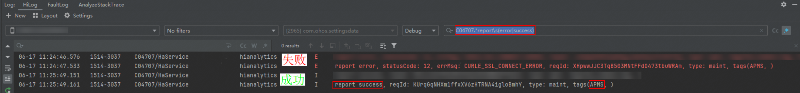
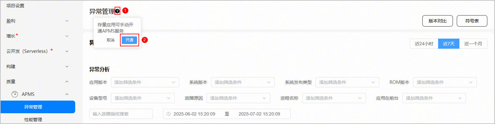

#### 应用如何接入异常管理？

HarmonyOS 5.0.0 Release及以上系统版本，支持主动采集应用的崩溃、APP FREEZE等质量指标，应用无需主动集成APMS SDK即可使用异常管理功能。

应用的崩溃、APP FREEZE等质量指标直接来源于HarmonyOS，由HarmonyOS和用户签订隐私协议，开发者无需担心采集的数据涉及用户个人隐私。

#### 应用如何接入性能管理？

HarmonyOS 5.0.0 Release及以上系统版本，支持主动采集应用的启动、Ability页面切换、Web页面加载等性能指标，应用无需主动集成APMS SDK即可使用性能管理功能。

应用的启动、Ability页面切换、Web页面加载等性能指标直接来源于HarmonyOS，由HarmonyOS和用户签订隐私协议，开发者无需担心采集的数据涉及用户个人隐私。

#### 为什么应用触发了崩溃，但是在AppGallery Connect未查询到崩溃数据

请从以下几个方面进行排查：

* 检查手机系统版本。

  当前APMS服务仅支持HarmonyOS 5.0.0 Release及以上版本。
* 发生崩溃的应用包名需要和AppGallery Connect上查看崩溃数据的应用包名保持一致。

  应用包名的查询方法，请参考[查看应用信息](https://developer.huawei.com/consumer/cn/doc/app/agc-help-view-app-info-0000002282674569)。
* 应用创建完成时间是否未达到6小时。

  如果是刚创建的应用，后台需要6小时准备资源，请等待6小时后再前往AppGallery Connect查看应用崩溃情况。后续产生的崩溃数据将可实时在AppGallery Connect查看。

如果排除了上述3个原因之后，还是未在AppGallery Connect查询到崩溃数据，则可查看Hilog日志。使用“C04707”过滤日志，搜索“report”，或直接通过正则表达式“C04707.\*report\s(error|success)”过滤日志，如下图所示。

一般崩溃发生后1分钟之内会触发日志上报，在日志中查看tags中包含“APMS”的数据是否显示report success：

* 如果显示report success，则表示崩溃数据已经成功上报。
* 如果显示report error, statusCode: 12, errMsg: Rcp error:1007900006，则表示网络连接异常，网络不通，请检查公网访问权限。
* 如果显示report error, statusCode: 12, errMsg: Rcp error:1007900028，则表示网络连接超时，网络不通，请检查公网访问权限。
* 如果AppGallery Connect上仍然没有查询到崩溃数据，可通过[在线工单系统](https://developer.huawei.com/consumer/cn/support/feedback/#/add/89?level2=9020)将日志中携带的“reqId”值反馈给华为技术人员进行问题定位。

#### 存量应用如何开通APMS服务

登录[AppGallery Connect](https://developer.huawei.com/consumer/cn/service/josp/agc/index.html)，点击“开发与服务”，在项目列表中选择您的项目，并选择需要使用APMS服务的应用/元服务。如果您在“APMS > 异常管理”页面未看到应用崩溃数据，可能是因为您的存量应用或元服务尚未开通APMS服务权限。您可以在“APMS > 异常管理”页面顶部点击“异常管理”旁边的，然后在弹出框中点击“开通”，即可开通APMS服务。

