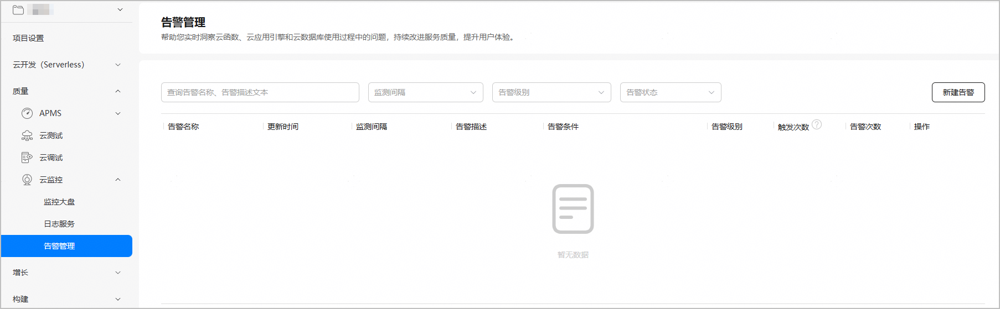
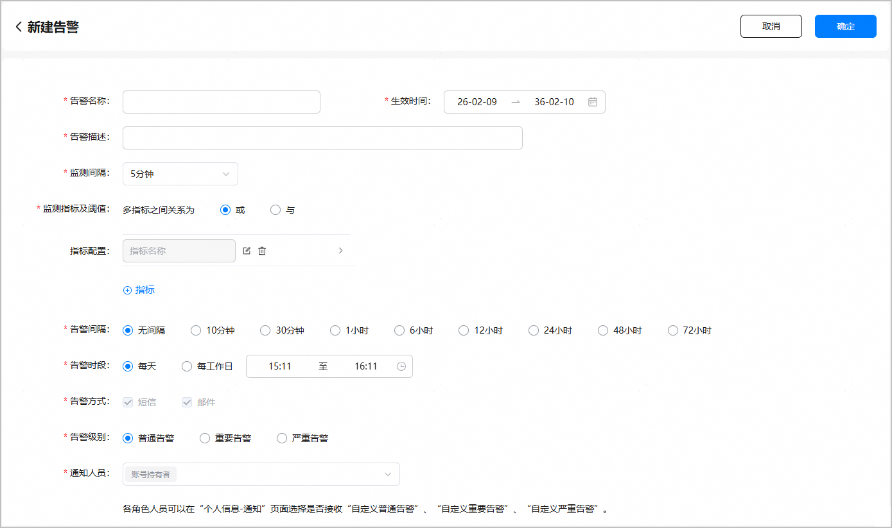

告警提醒是APMS基于云监控服务实现的异常问题告警功能，一旦系统监测到异常情况并触发预设的告警阈值，云监控将及时通过短信或邮件形式向您发送告警通知，确保您能够第一时间知晓并迅速响应，及时处理潜在问题，保障应用稳定运行。

1. 登录AppGallery Connect，点击“开发与服务”。
2. 在项目列表中找到您的项目，在项目下的应用列表中点击您的应用/元服务。
3. 左侧导航栏选择“质量 > 云监控 > 告警管理”，进入告警管理主界面，点击“新建告警”。

   
4. 在“新建告警”页面，配置各项告警参数。您可以根据重点关注的异常问题，选择相应的监测指标。

   目前支持配置的质量监测指标包括五类异常问题：Js Error、Cpp Crash、Oom、Process Kill、App Freeze，以及四个维度：崩溃次数、崩溃率、崩溃设备数、崩溃设备占比。

   
5. 配置完成后，点击页面右上角的“确定”发布配置内容。后续当配置的监测指标达到预设的告警阈值时，系统将会通过短信和邮件向您发送告警提醒。
