在发生崩溃后，异常管理模块会将崩溃数据上报到AGC，您可以在AGC中查看崩溃问题的详细信息，分析崩溃发生的原因。崩溃问题主要涉及CPP\_CRASH、JS\_ERROR、OOM三项指标，本章节将介绍它们的基本定位方法。

#### 查看崩溃基本数据

1. 登录[AppGallery Connect](https://developer.huawei.com/consumer/cn/service/josp/agc/index.html)，点击“开发与服务”。
2. 在项目列表中找到您的项目，在项目下的应用列表中点击您的应用/元服务。
3. 左侧导航栏选择“质量 > APMS > 异常管理”，进入异常管理主界面。
4. 点击“CPP\_CRASH”/“JS\_ERROR”/“OOM”卡片。

   您可以在异常管理预览页中，通过时间范围按钮（近24小时、近7天、近1个月），快速查看各指标卡片中所选时间范围内的崩溃次数。

   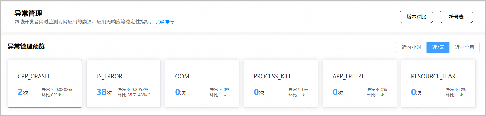

#### 筛选崩溃问题范围

选择“CPP\_CRASH”/“JS\_ERROR”/“OOM”卡片后，您可以在异常分析区域，设置不同的筛选条件对崩溃问题进行个性化分析。目前支持根据应用版本、系统版本、系统发布类型、ROM版本、设备型号、故障原因、故障指纹、时间范围等条件快速界定问题范围。

筛选条件设置完成后，点击“应用”，您将能够查看指定时间范围和指定条件下的四类指标数据，包括崩溃次数、崩溃率（即崩溃发生次数/应用启动次数）、崩溃设备数和设备总数。点击各指标卡片，可在卡片下方的图表中查看对应指标随时间的变化趋势，以及按系统版本、设备型号和应用版本的Top5排名。

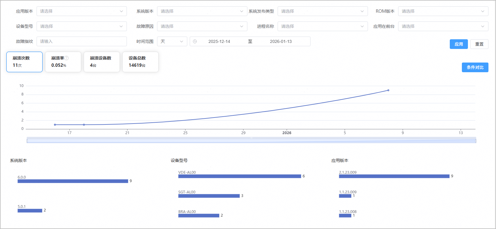


由于崩溃默认采集的均为系统数据，不包括用户个人隐私数据，因此崩溃统计的设备数为匿名化设备标识，会随设备操作系统升级/重置发生改变。

常见设备型号的公开传播名称请参考下表，未收录型号请自行查询。

| 设备型号 | **公开传播名称** |
| --- | --- |
| BRA-AL00 | HUAWEI MATE 60 |
| ALN-AL00 | HUAWEI MATE 60 PRO |
| ALN-AL10 | HUAWEI MATE 60 PRO+/ RS | ULTIMATE DESIGN |
| ALN-AL80 | HUAWEI MATE 60 PRO |
| CLS-AL00 | HUAWEI MATE 70 |
| CLS-AL30 | HUAWEI MATE 70 |
| SUP-AL90 | HUAWEI MATE 70 AIR |
| SUP-AL90A | HUAWEI MATE 70 AIR |
| PLR-L29 | HUAWEI MATE 70 PRO |
| PLR-AL00 | HUAWEI MATE 70 PRO |
| PLA-AL10 | HUAWEI MATE 70 PRO+ |
| PLR-AL30 | HUAWEI MATE 70 PRO |
| PLR-AL50 | HUAWEI MATE 70 PRO |
| PLR-AL80 | HUAWEI MATE 70 PRO |
| PLU-AL10 | HUAWEI MATE 70 RS | ULTIMATE DESIGN |
| VYG-AL00 | HUAWEI MATE 80 |
| SGT-AL00 | HUAWEI MATE 80 PRO |
| SGT-AL50 | HUAWEI MATE 80 PRO |
| SGT-AL10 | HUAWEI MATE 80 PRO MAX |
| SGU-AL10 | HUAWEI MATE 80 RS | ULTIMATE DESIGN |

#### 查看问题基本信息

在问题列表中，每个问题都是同一类问题的汇总。您可以通过左右拖动下方的滑动条来查看CPP\_CRASH/JS\_ERROR/OOM问题的基本信息（包括崩溃说明、F1NAME、F2NAME、F3NAME、崩溃类型、故障指纹、崩溃次数、发生率、崩溃设备数、首次发生时间、最近发生时间、起止版本等）。

此外，您还可以编辑问题的状态、优先级和描述，以便快速对各个问题进行分类和标注，从而提高问题管理效率。

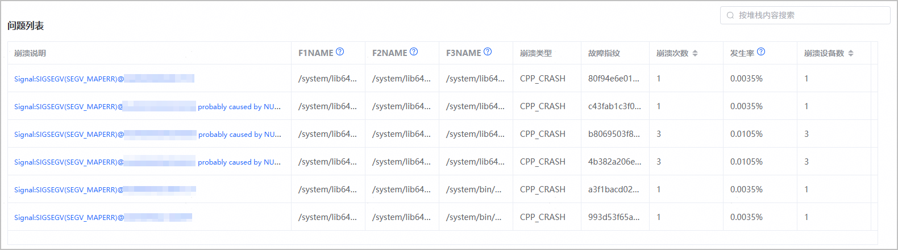

| 指标名称 | 指标说明 |
| --- | --- |
| 崩溃说明 | 发生的崩溃问题名称。 |
| F1NAME | 异常堆栈排除基础库后的第1层栈。 |
| F2NAME | 异常堆栈排除基础库后的第2层栈。 |
| F3NAME | 异常堆栈排除基础库后的第3层栈。 |
| 崩溃类型 | 崩溃类型，当前支持CPP\_CRASH/JS\_ERROR/OOM。 |
| 故障指纹 | 从崩溃堆栈中提取关键帧后计算得到，用于汇聚同类故障。 |
| 崩溃次数 | 发生此类崩溃问题的次数。 |
| 发生率 | 此类问题的发生比例，崩溃次数/同类型崩溃总次数。 |
| 崩溃设备数 | 发生此类崩溃问题的设备数。 |
| 首次发生时间 | 发生此类崩溃问题的首次时间。 |
| 最近发生时间 | 发生此类崩溃问题的最后一次时间。 |
| 起止版本 | 发生过崩溃的App版本。 |

#### 分析崩溃原因

1. 点击问题列表“崩溃说明”列的崩溃信息描述（如“Unexpected Object Prop in JSON”），进入问题详情页面。
2. 在问题详情页面，您可以看到问题编号、异常描述、首关键行、问题首次发生时间、问题最近发生时间，以及用户自定义的问题标注信息。

   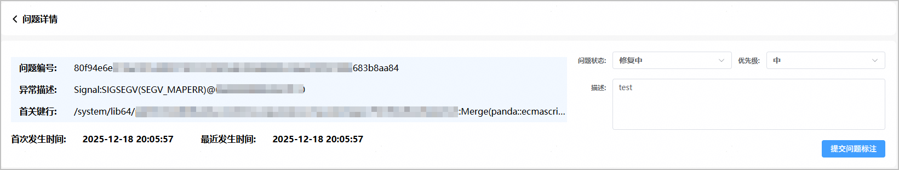
3. 您可以通过“时间分布”筛选器过滤崩溃数据，查看当前聚类下的崩溃事件详情。
   * 选择“应用版本”、“系统版本”、“设备型号”等筛选条件后，点击“应用”，下方图表将展示对应条件的详细崩溃数据及分布情况。

     时间选择器可自定义查询范围，界面默认的时间段为最近一个月。
   * 点击图表中的“崩溃次数”、“崩溃率”、“崩溃设备数”或“设备总数”，可帮助您从不同维度分析崩溃的信息分布情况。

   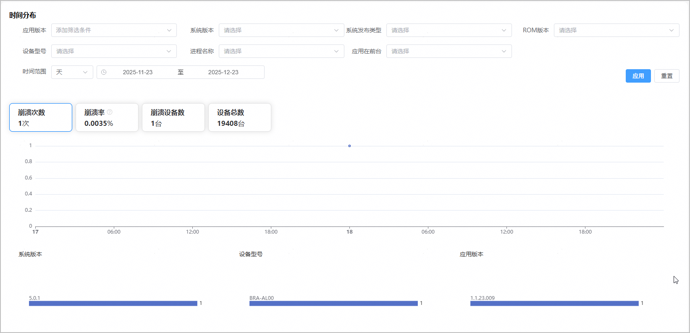
4. 在“设备信息”面板查看设备信息和堆栈信息。
   * 你可以查看指定时间范围内发生的累计崩溃次数，以及每一次的崩溃详情。例如下图中，问题累计发生过3次，依次显示为“1 2 3”。如果查看第1次发生崩溃时的信息，点击数字1即可。

     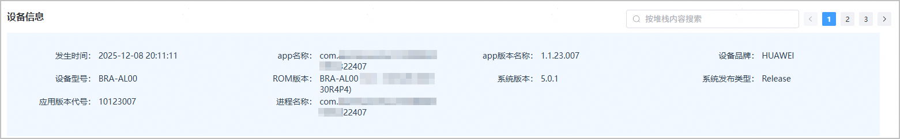
   * 点击“原始堆栈”页签，您可以通过“堆栈”信息了解崩溃发生的原因。

     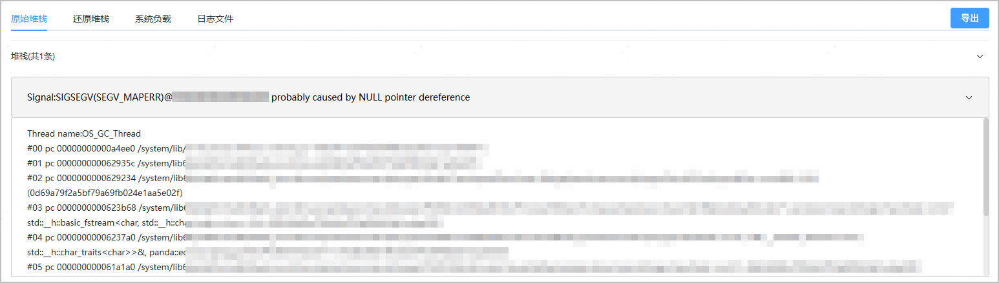
   * 点击“还原堆栈”页签，[获取符号表](#section685110167461)和[上传对应的符号表文件](#section115383286564)，可将混淆后的业务堆栈还原为可读的堆栈信息。同时，符号表也支持解析“日志文件”页签中的崩溃日志，将寄存器信息、内存地址映射到具体代码逻辑中。

     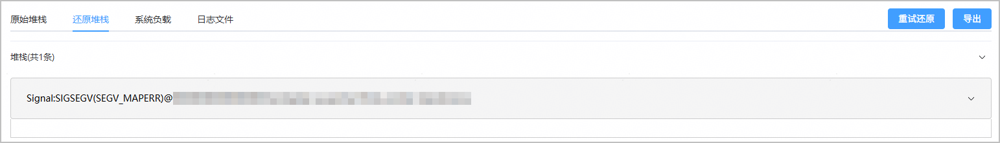
   * 点击“系统负载”页签，可以查看问题发生时系统CPU和内存资源使用情况，再结合日志和负载情况可综合判断问题原因。
     + CPU行的数值表示CPU使用率。

       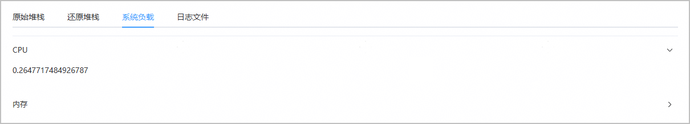

       CPU使用率 = 页面数字\*100%，例如数值为0.3，则CPU使用率为0.3 × 100% = 30%。

       CPU使用率正常参考范围：设备idle（无高负载操作）时，CPU使用率通常在10%-30%；高负载（如多任务运行）时会超过50%；满负载时为1（即100%）。
     + 内存行的数值表示内存使用量。

       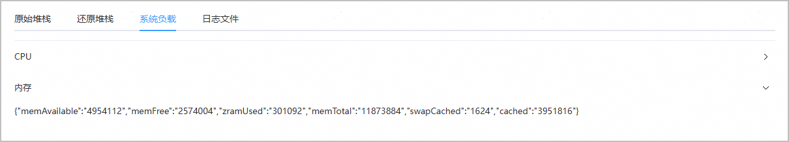

       | 内存参数名称 | 中文释义 |
       | --- | --- |
       | memAvailable | 当前可用内存（包含空闲和可回收缓存） |
       | memFree | 完全空闲的内存（未被任何进程占用） |
       | zramUsed | 压缩内存使用量（HarmonyOS通过ZRAM优化内存，该数值低说明内存压力小） |
       | memTotal | 设备总内存 |
       | swapCached | 交换缓存（可根据使用量，判断内存是否充足） |
       | cached | 缓存内存（可快速回收，用于文件、应用数据缓存） |

       下面给出内存数值换算及解读分析示例（内存单位：KB，换算公式：1GB = 1024 × 1024KB ≈ 1000000KB）。

       例如，页面显示内存数值为：`"memAvailable":"4901888","memFree":"1333348","zramUsed":"212336","memTotal":"11873884","swapCached":"1676","cached":"4720464"}`

       解读分析：

       memAvailable：4901888KB ≈ 4.7GB，当前可用内存，占总内存40%以上。

       memFree：1333348KB ≈ 1.27GB，完全空闲的内存。

       zramUsed：212336KB ≈ 207MB，压缩内存使用量。

       memTotal：11873884KB ≈ 11.3GB，设备总内存（例如华为Mate 60机型常见内存配置为12GB，属正常偏差）。

       swapCached：1676KB ≈ 1.6MB，交换缓存（几乎未使用，进一步证明内存充足）。

       cached：4720464KB ≈ 4.5GB，缓存内存。
   * 点击“日志文件”页签，可以查看问题的原始日志和还原后日志（请注意，查看还原后日志同样需要提前上传对应的符号表文件），并支持导出日志。

     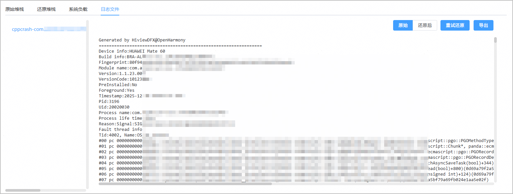

#### 崩溃问题堆栈示例及解读参考

**堆栈原文（节选）**

```
Error name:Error Error message:Internal error. UI execution context not found. Error code:100001 Stacktrace: Cannot get SourceMap info, dump raw stack: at initPrivacyAnimator (../../../foundation/arkui/advanced_ui_component/customappbar/interfaces/custom_app_bar.js:722:1) at anonymous (../../../foundation/arkui/advanced_ui_component/customappbar/interfaces/custom_app_bar.js:696:1)
```

**堆栈分析**

错误的核心在于 “未找到UI执行上下文（UI execution context not found）”，错误码100001。堆栈指向custom\_app\_bar.js文件中的initPrivacyAnimator函数和匿名函数，这属于HarmonyOS ArkUI框架层面的UI上下文异常。问题的本质是代码试图在不存在或已销毁的UI上下文中执行动画或组件初始化操作。

#### 查看版本对比数据

1. 在异常管理主界面，点击页面右上角的“版本对比”，进入版本对比页面。

   
2. 您可以通过应用版本、系统版本、设备型号、崩溃事件类型等筛选条件查看不同应用版本的崩溃分布情况。点击列表中的“应用版本”、“崩溃次数”、“崩溃设备数”或“最近发生时间”，可以按相应维度进行排序。

   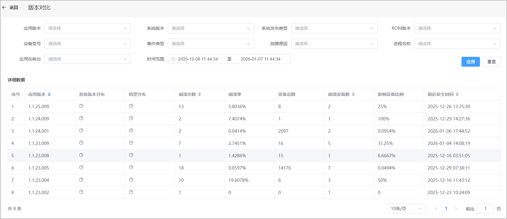

   | 指标名称 | 指标说明 |
   | --- | --- |
   | 应用版本 | 应用版本号，点击“”可切换应用版本的排序方式（升序、降序）。 |
   | 系统版本分布 | 系统版本分布情况，点击“”可查看系统版本分布的饼状图。 |
   | 机型分布 | 机型分布情况，点击“”可查看机型分布的饼状图。 |
   | 崩溃次数 | 发生崩溃的总次数，点击“”可切换崩溃次数的排序方式（升序、降序）。 |
   | 崩溃率 | 崩溃次数/App启动次数。 |
   | 设备总数 | 设备总数（崩溃采集匿名化后的设备标识，会随设备重置或操作系统升级而变化）。 |
   | 崩溃设备数 | 发生崩溃的设备总数，点击“”可切换时间的排序方式（升序、降序）。 |
   | 影响用户比例 | 发生崩溃的设备总数/设备总数。 |
   | 最近发生时间 | 最近一次发生崩溃的时间，点击“”可切换时间的排序方式（升序、降序）。 |

#### 获取符号表

您可以通过以下两种方式获取符号表：

* 方式一：通过DevEco Studio构建生成

  DevEco Studio是HarmonyOS应用的官方开发工具，在构建应用（尤其是Release包）时，会自动生成符号表文件，具体配置和路径如下。

  + 构建配置：需确保项目的build-profile.json5或模块的build.json5中“开启符号表生成”开关处于开启状态（默认已开启，无需额外配置）。
  + 生成路径：构建完成后，符号表文件会自动生成在项目的“build/outputs/hap”目录下，与HarmonyOS应用HAP安装包同级，文件命名格式通常为：`{模块名}`-`{编译类型}`-symbols.zip，例如entry-release-symbols.zip。

    解压后可获得对应架构（如arm64-v8a、armeabi-v7a）的符号表文件，文件格式通常为“.sym”或“.so”，具体取决于编译模式。
* 方式二：从HAP包中提取（适用于已完成构建的HAP）

  如果已获取构建好的HAP包（例如已发布至华为应用市场的包），可以通过解压HAP来提取符号表。

  HAP本质上是一个压缩包，将.hap后缀改为.zip后解压，在lib目录下的对应架构文件夹（如arm64-v8a）中，可能包含携带符号信息的动态库文件（.so），这些文件可作为符号表使用。请注意，Release包可能经过符号剥离，仅保留了调试符号，您需要结合构建时生成的symbols.zip进行完整还原。

#### 上传符号表

1. 在异常管理主界面，点击页面右上角的“符号表”，进入符号表页面，您可以查看、上传或下载符号表文件。

   
2. 点击“点击上传”，将符号表文件上传至系统后台，用于还原堆栈和应用日志。

   

   如果已上传过相同文件名和应用版本的符号表文件，再次上传将会覆盖之前的同名文件。

   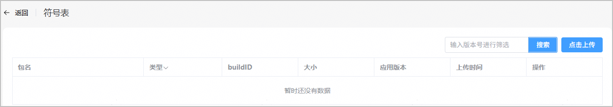
3. 在“上传文件”弹出框中，选择符号表文件对应的应用版本号，点击“确定”。异常管理模块在还原堆栈时，将根据产生崩溃堆栈的应用版本，以及崩溃堆栈中的符号表文件名选择对应的符号表文件还原异常日志。
   * so符号表文件用于还原HarmonyOS Native Crash。您可以上传单个so符号表文件，也可以将相同版本的so符号表文件打包成zip文件批量上传，但需确保所有so文件位于zip压缩包的根目录，且压缩后的zip文件小于3G。
   * json、map符号表文件用于还原异常堆栈中的TS/JS代码。

   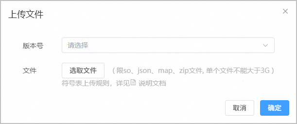
