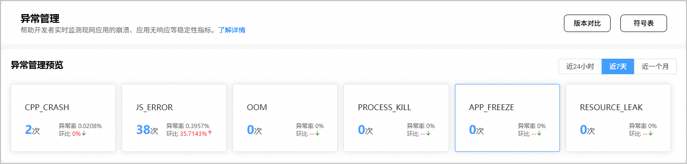
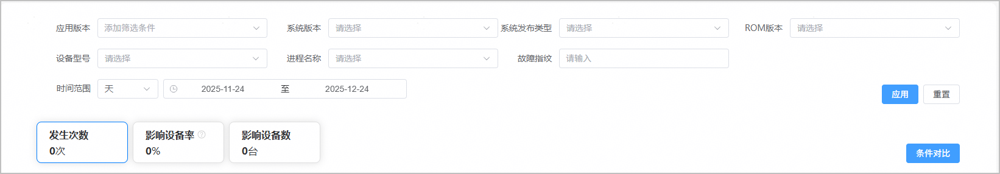
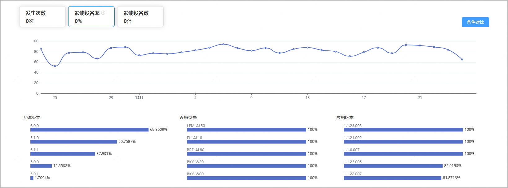
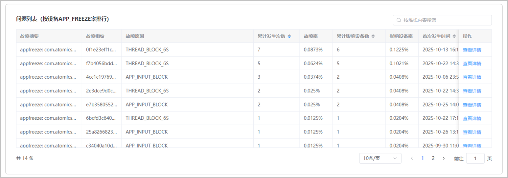
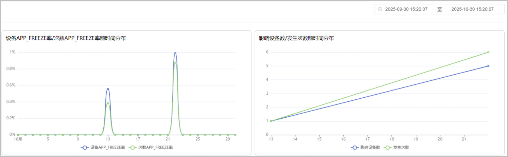
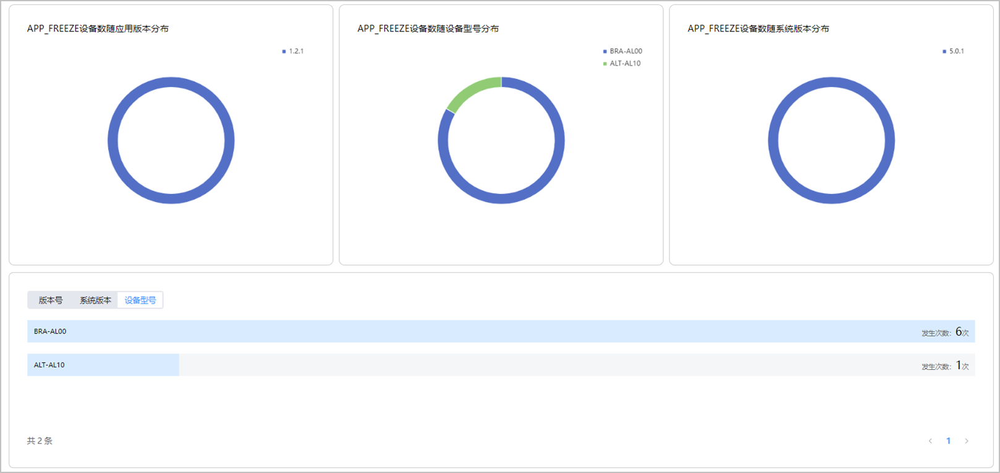
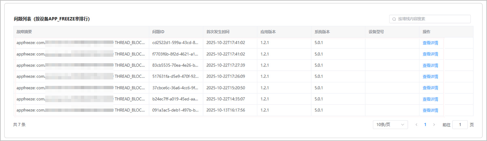
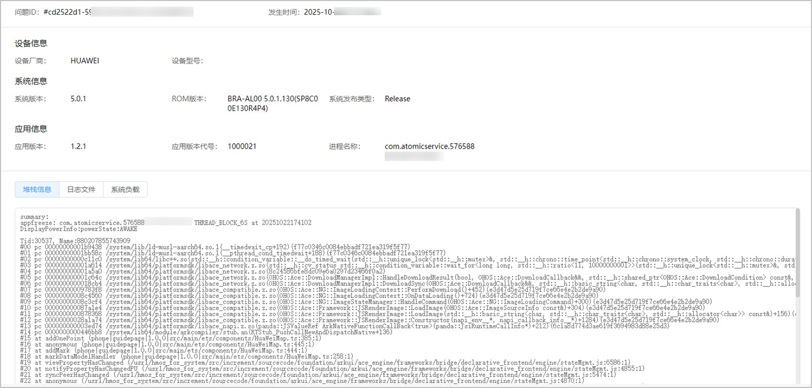

用户在使用应用时会出现点击没反应、应用无响应等情况，其超过一定时间限制后即被定义为应用无响应（APP FREEZE）。OS操作系统提供了检测应用无响应的机制，并可生成APP FREEZE日志供应用开发分析。

#### 查看APP FREEZE基本数据

1. 登录[AppGallery Connect](https://developer.huawei.com/consumer/cn/service/josp/agc/index.html)，点击“开发与服务”。
2. 在项目列表中找到您的项目，在项目下的应用列表中点击您的应用/元服务。
3. 左侧导航栏选择“质量 > APMS > 异常管理”，进入异常管理主界面。
4. 点击“APP\_FREEZE”卡片，为您展示应用程序无响应事件的出现次数及其他详细信息。点击页面右上角的时间选择器，可快速查看近24小时、近7天、近一个月的应用无响应次数。

   

#### 筛选APP FREEZE问题范围

1. 在异常分析区域，您可以通过设置应用版本、系统版本、设备型号、故障指纹、时间范围等筛选条件，查看对应的APP FREEZE数据，例如发生次数、影响设备率（受影响设备数占总设备数百分比）、影响设备数等。

   
2. 点击“影响设备率”指标卡片，您可以查看不同维度（时间、系统版本、设备型号、应用版本等）下影响设备APP FREEZE率变化趋势。

   
3. 在问题列表区域，为您呈现指定筛选条件下的所有APP FREEZE问题列表，点击“操作”列的“查看详情”可进入问题详情页面，详情请参见[查看APP FREEZE问题详情](#section21971829175417)。

   

#### 查看APP FREEZE问题详情

在问题详情页，你可以通过页面右上角的时间选择器过滤APP FREEZE数据。

* 您可以查看设备APP\_FREEZE率/次数APP\_FREEZE率、影响设备数/发生次数随时间分布的情况。

  
* 您可以查看APP FREEZE问题排名前5位的应用版本、设备型号和系统版本的分布情况。

  
* 您可以查看APP FREEZE问题的所有发生记录。记录按发生时间从晚到早排序，第一条为最近发生的问题记录。每条记录包含问题的首次发生时间、应用版本、系统版本、设备型号信息。

  

  点击问题发生记录列表中某一次问题的“查看详情”，可进入该问题发生时的具体信息页面。该页面提供了应用无响应时的具体设备信息、系统信息、应用信息、堆栈、日志和系统负载等内容，帮助您全面了解应用发生该问题时的信息。

  同时，还为您提供记录导出功能，点击“导出”，即可将该页面所有信息导出，方便您进行对比分析。

  

#### APP FREEZE堆栈示例及解读参考

**堆栈原文（节选）**

```
summary:
appfreeze: com.atomicservice.5765880207855****** THREAD_BLOCK_6S at 20251022174102
DisplayPowerInfo:powerState:AWAKE

Tid:30537, Name:880207855******
#00 pc 00000000001b9438 /system/lib/ld-musl-aarch64.so.1(__timedwait_cp+192)(f77c0346c0084ebbadf721ea319f5f77)
#01 pc 00000000001bb58c /system/lib/ld-musl-aarch64.so.1(__pthread_cond_timedwait+188)(f77c0346c0084ebbadf721ea319f5f77)
#02 pc 00000000000c11c0 /system/lib64/libc++.so(std::__h::condition_variable::__do_timed_wait(std::__h::unique_lock<std::__h::mutex>&, std::__h::chrono::time_point<std::__h::chrono::system_clock, std::__h::chrono::duration<long long, std::__h::`ratio<1l>`>>)+108)(7817a009937816a1f11f1e7673c1e796f9d24b58)
#03 pc 000000000001a614 /system/lib64/platformsdk/libace_network.z.so(std::__h::cv_status std::__h::condition_variable::wait_for<long long, std::__h::`ratio<1l>`>(std::__h::unique_lock<std::__h::mutex>&, std::__h::chrono::duration<long long, std::__h::`ratio<1l>`> const&)+92)(8c24586bfe8dc09e6a0297d23466f0a2)
#04 pc 000000000001a5a0 /system/lib64/platformsdk/libace_network.z.so(8c24586bfe8dc09e6a0297d23466f0a2)
#05 pc 000000000001c64c /system/lib64/platformsdk/libace_network.z.so(OHOS::Ace::DownloadManagerImpl::HandleDownloadResult(bool, OHOS::Ace::DownloadCallback&&, std::__h::shared_ptr<OHOS::Ace::DownloadCondition> const&, int, std::__h::basic_string<char, std::__h::char_traits<char>, std::__h::allocator<char>> const&)+248)(8c24586bfe8dc09e6a0297d23466f0a2)
#06 pc 0000000000018cb4 /system/lib64/platformsdk/libace_network.z.so(OHOS::Ace::DownloadManagerImpl::DownloadSync(OHOS::Ace::DownloadCallback&&, std::__h::basic_string<char, std::__h::char_traits<char>, std::__h::allocator<char>> const&, int, int)+1640)(8c24586bfe8dc09e6a0297d23466f0a2)
#07 pc 00000000009783f8 /system/lib64/platformsdk/libace_compatible.z.so(OHOS::Ace::NG::ImageLoadingContext::PerformDownload()+452)(e3d47d5e25d719f7ce66e4e2b2de9a90)
#08 pc 00000000008c4560 /system/lib64/platformsdk/libace_compatible.z.so(OHOS::Ace::NG::ImageLoadingContext::OnDataLoading()+724)(e3d47d5e25d719f7ce66e4e2b2de9a90)
#09 pc 00000000008c3cf4 /system/lib64/platformsdk/libace_compatible.z.so(OHOS::Ace::NG::ImageStateManager::HandleCommand(OHOS::Ace::NG::ImageLoadingCommand)+300)(e3d47d5e25d719f7ce66e4e2b2de9a90)
```

**堆栈分析**

```
# 告警类型：应用主线程6秒无响应（冻结）
appfreeze: com.atomicservice.5765880207855****** THREAD_BLOCK_6S at 20251022174102
DisplayPowerInfo:powerState:AWAKE  # 设备处于唤醒状态，排除休眠干扰
Tid:30537（主线程ID）, Name:880207855******（应用进程名）
MSG: App main thread is not response!  # 核心现象：主线程无响应

================================= 应用层触发入口（定位业务代码）=================================
# 15 at addOnePoint (phone|guidepage|1.0.0|src/main/ets/components/HuaWeiMap.ts:385:1)
# 业务触发点：地图组件添加标记点（开发者可直接跳转该文件385行排查）
# 16 at anonymous (phone|guidepage|1.0.0|src/main/ets/components/HuaWeiMap.ts:445:1)
# 17 at addMark (phone|guidepage|1.0.0|src/main/ets/components/HuaWeiMap.ts:444:1)
# 直接调用者：地图标记绘制函数
# 18 at markDataModelHandler (phone|guidepage|1.0.0|src/main/ets/components/HuaWeiMap.ts:258:1)
# 业务逻辑层：标记点数据模型回调

================================= 关键阻塞链路（定位核心问题）===================================
# 02 pc 00000000000c11c0 /system/lib64/libc++.so(std::__h::condition_variable::__do_timed_wait(...)+108)
# 主线程陷入条件变量超时等待，无法继续执行后续指令
# 05 pc 000000000001c64c /system/lib64/platformsdk/libace_network.z.so(OHOS::Ace::DownloadManagerImpl::HandleDownloadResult(...)+248)
# 下载结果处理阻塞，未及时返回
# 06 pc 0000000000018cb4 /system/lib64/platformsdk/libace_network.z.so(OHOS::Ace::DownloadManagerImpl::DownloadSync(...)+1640)
# 核心问题：主线程执行同步下载（DownloadSync），IO操作阻塞主线程
# 07 pc 00000000009783f8 /system/lib64/platformsdk/libace_compatible.z.so(OHOS::Ace::NG::ImageLoadingContext::PerformDownload()+452)
# 触发下载：地图标记点图片加载时发起同步请求

================================= 系统层关联（呼应告警触发）======================================
# 42 pc 00000000011e6fa0 /system/lib64/platformsdk/libace_compatible.z.so(OHOS::Ace::NG::PipelineContext::FlushVsync(...)+548)
# Vsync（垂直同步）任务被阻塞，系统触发THREAD_BLOCK_6S告警
```

#### APP FREEZE日志示例及解读参考

**日志原文（节选）**

```
Device info:HUAWEI Mate 60（“******”为脱敏占位符）
Build info:BRA-AL00 5.0.1.130(SP8C00E130R4P4)
Fingerprint:0f1e23eff1c401da1c815d31ac2b05c382087c33fa673078f14b6f7235a5decb
Module name:com.atomicservice.5765880207855******
Version:1.2.1
VersionCode:1000021
PreInstalled:No
Foreground:Yes
Pid:30537
Uid:20020032
Reason:THREAD_BLOCK_6S
appfreeze: com.atomicservice.5765880207855****** THREAD_BLOCK_6S at 20251022174102
DisplayPowerInfo:powerState:AWAKE
>>>>>>>>>>>>>>>>>>>>>>>>>>>>>>>>>>>>>>>>>>>
DOMAIN:AAFWK
STRINGID:THREAD_BLOCK_6S
TIMESTAMP:2025/10/22-17:41:02:271
PID:30537
UID:20020032
PACKAGE_NAME:com.atomicservice.5765880207855******
PROCESS_NAME:com.atomicservice.5765880207855******
*******************************************
start time: 2025/10/22-17:40:59:382
DOMAIN = AAFWK
EVENTNAME = THREAD_BLOCK_3S
TIMESTAMP = 2025/10/22-17:40:59:353
PID = 30537
UID = 20020032
TID = 30537
PACKAGE_NAME = com.atomicservice.5765880207855******
PROCESS_NAME = com.atomicservice.5765880207855******
eventLog_action = cmd:m,pb:1:r,t
eventLog_interval = 10
MSG =
Fault time:2025/10/22-17:40:58
App main thread is not response!
mainHandler dump is:
 EventHandler dump begin curTime: 2025-10-22 05:40:58.757
 Event runner (Thread name = , Thread ID = 30537) is running
 Current Running: start at 2025-10-22 05:40:55.692, Event { send thread = 30537, send time = 2025-10-22 05:40:55.691, handle time = 2025-10-22 05:40:55.691, trigger time = 2025-10-22 05:40:55.691, task name = vSyncTask, caller = [event_queue.cpp(HandleFileDescriptorEvent:280)] }
 History event queue information:
 No. 0 : Event { send thread = 30878, send time = 2025-10-22 05:40:52.860, handle time = 2025-10-22 05:40:52.860, trigger time = 2025-10-22 05:40:55.453, completeTime time = 2025-10-22 05:40:55.475, priority = High, task name = uv_io_cb }
 No. 1 : Event { send thread = 30807, send time = 2025-10-22 05:40:55.464, handle time = 2025-10-22 05:40:55.464, trigger time = 2025-10-22 05:40:55.475, completeTime time = 2025-10-22 05:40:55.475, priority = VIP, task name = ArkUIImageProviderSuccess }
 No. 2 : Event { send thread = 30831, send time = 2025-10-22 05:40:55.458, handle time = 2025-10-22 05:40:55.458, trigger time = 2025-10-22 05:40:55.475, completeTime time = 2025-10-22 05:40:55.475, priority = Immediate, task name = uv_io_cb }
 No. 3 : Event { send thread = 30816, send time = 2025-10-22 05:40:52.861, handle time = 2025-10-22 05:40:52.861, trigger time = 2025-10-22 05:40:55.475, completeTime time = 2025-10-22 05:40:55.476, priority = High, task name = uv_io_cb }...（节选）
```

**日志分析**

* 核心字段（仅保留定位原因相关信息）

  ```
  问题现象标识
  Reason:THREAD_BLOCK_6S
  App main thread is not response!
  EVENTNAME = THREAD_BLOCK_3S（阻塞预警）
  主线程与阻塞任务关联
  Tid:30537（主线程 ID，与 PID 一致，确认主线程阻塞）
  Current Running: task name = vSyncTask（主线程阻塞时正在执行的 UI 渲染核心任务）
  代码逻辑与根因定位
  OHOS::Ace::DownloadManagerImpl::DownloadSync（同步下载函数，非异步导致主线程等待）
  OHOS::Ace::NG::ImageLoadingContext::PerformDownload（图片加载触发下载）
  at addOnePoint (phone|guidepage|1.0.0|src/main/ets/components/HuaWeiMap.ts:385:1)
  at addMark (phone|guidepage|1.0.0|src/main/ets/components/HuaWeiMap.ts:444:1)
  at markDataModelHandler (phone|guidepage|1.0.0|src/main/ets/components/HuaWeiMap.ts:258:1)
  ```
* 字段解读

  ```
  THREAD_BLOCK_6S/THREAD_BLOCK_3S：说明主线程先出现3秒阻塞预警，后升级为6秒阻塞，超过系统阈值，直接触发 “无响应”，排除偶发短阻塞，确认问题严重且持续。
  App main thread is not response!：明确阻塞主体是 “主线程”，而非子线程，主线程阻塞会直接导致UI卡顿、操作无反馈，是问题的核心表现。
  主线程与任务关联解读
  Tid:30537（与 PID 一致）：证明阻塞的是应用唯一主线程，而非子线程（如 IPC 线程、 watchdog 线程），排除子线程异常干扰，锁定主线程资源占用问题。
  vSyncTask：该任务是 UI 垂直同步任务，负责协调界面刷新节奏，其被阻塞说明主线程资源被占用，无法正常处理 UI 渲染，进一步佐证主线程 “无响应” 的直接影响。
  代码与根因解读
  DownloadSync：关键根因字段 ——“Sync”（同步）表明下载操作未采用异步线程，而是在主线程中执行，若下载耗时（如弱网、大图片），会直接卡住主线程，导致 6 秒阻塞。
  PerformDownload：关联下载操作的触发源头是 “图片加载”，说明问题与地图组件的图片资源加载相关，而非其他业务逻辑。
  HuaWeiMap.ts路径及行号：精准定位到业务代码 —— 地图组件的markDataModelHandler（标记数据处理）→addMark（添加标记）→addOnePoint（添加单个标记点）流程中触发了图片加载，且该加载未做异步处理，是代码层面的直接问题点。
  ```

  下表列出了HarmonyOS应用常见的冻结类型及原因，供参考：

  | 冻结原因 | 关键日志标识 | 核心定义 | 典型触发场景 | 示例 |
  | --- | --- | --- | --- | --- |
  | 线程阻塞类 | + THREAD\_BLOCK\_3S + THREAD\_BLOCK\_6S + THREAD\_BLOCK\_10S + mainHandler dump | 主线程被自身任务占用，连续N秒（3S/6S/10S）无法处理其他指令 | + 主线程执行同步下载、复杂计算、死循环 + 任务无超时控制 | + 地图组件同步下载图片超时 + JS侧复杂循环未退出 |
  | 死锁类 | + Deadlock detected + LOCK\_CONTENTION + 堆栈含pthread\_mutex\_lock长期未返回 | 多线程互相持有对方所需锁，无限等待释放，导致相关线程（含主线程）卡死 | + 主线程持UI锁等待子线程，子线程持数据锁尝试访问UI + 锁获取顺序不一致 | + 主线程等子线程DB结果，子线程等主线程UI锁 + 线程A“锁A→锁B”、线程B“锁B→锁A” |
  | 资源竞争类 | + RESOURCE\_LOCK\_BLOCK + 堆栈含std::condition\_variable::wait超时 | 主线程等待被其他线程长期占用的资源（锁、文件句柄、数据库连接） | + 子线程长期占用全局锁执行耗时操作 + 主线程同步等待子线程网络请求结果 | + 子线程持锁进行大文件读写 + 主线程无限等待子线程未返回的接口响应 |
  | 生命周期超时类 | + LIFECYCLE\_TIMEOUT + LIFECYCLE\_HALF\_TIMEOUT（5秒预警） + onXXX cost XXms | Ability生命周期回调（onStart/onStop等）执行耗时超系统阈值（默认10秒） | + onStart同步加载大量数据 + onStop未及时释放数据库连接/子线程 | + 应用启动时同步读取本地大文件 + 退出时未终止后台上传线程 |
  | ArkUI渲染阻塞类 | + RENDER\_BLOCK + UI\_THREAD\_BLOCK + 堆栈含ArkUI::Render + JSView::Update | UI渲染任务（组件刷新、动画绘制）占用主线程过久，影响交互响应 | + 频繁刷新大量列表项 + 复杂动画未开硬件加速 + JS侧同步操作DOM | + 列表每秒刷新超过100项 + 3D动画未启用硬件加速 + 同步修改大量UI组件属性 |
  | IPC/跨进程调用超时类 | + IPC\_CALL\_TIMEOUT + Binder transaction failed + OHOS::IPC::Proxy::Invoke | 主线程同步调用系统服务/第三方进程，因对方未响应/通信异常导致长期等待 | + 主线程同步调用位置服务/支付服务 + 跨进程通信未设置超时时间 | + 调用系统定位服务未响应 + 跨应用数据查询无超时控制 |
  | 异步任务滥用类 | 堆栈中异步函数（PostTask/Promise.then）与主线程ID一致，耗时超3秒 | 异步任务未指定子线程，实际仍在主线程执行，占用核心资源 | + EventHandler未创建独立EventRunner + Async/Await搭配同步接口 | + 任务通过EventHandler在默认主线程上执行 + Async包裹同步下载函数 |
  | 系统资源耗尽类 | + RESOURCE\_EXHAUSTED + Too many open files + Binder thread pool full | 设备全局资源（文件句柄、Socket、Binder线程池）用尽，应用无法获取必要资源 | + 频繁创建Socket/临时文件未关闭 + 多应用同时发起大量IPC调用 | + 应用泄漏Socket连接导致系统Socket资源耗尽 + 全局Binder线程池被占满 |
