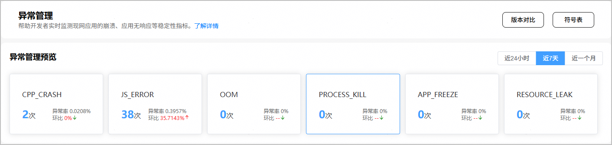

在异常管理主界面，点击“PROCESS\_KILL”卡片，即可查看PROCESS KILL类型的问题。此类问题通常是系统根据整体资源使用情况主动发起的强制终止应用进程的行为，尤其是应用在后台运行时被强制终止，往往与应用自身无关。因此，在预览页卡片中，仅展示应用在前台运行时被系统强制终止进程的次数。

PROCESS KILL类问题的常见原因如下表：

| 名称 | 查杀原因 |
| --- | --- |
| App Memory Deterioration | 应用内存超限 |
| AttachTimeoutKillSCB | 应用加载超时 |
| Background Freeze Abnormal | 后台冻结异常 |
| Bluetooth Work Time Abnormal | 蓝牙异常清理 |
| CES Register exceed limit | CES Register超出限制 |
| Continuously Binder Wakeup Abnormal | 连续Binder唤醒异常 |
| CPU Highload | CPU高负载 |
| CPU\_EXT Highload | 快速CPU负载检测 |
| Gnss Work Time Abnormal | Gnss异常清理 |
| ILLEGAL\_AUDIO\_CAPTURER\_BY\_SUSPEND | 后台非法录音查杀 |
| ILLEGAL\_AUDIO\_RENDERER\_BY\_SUSPEND | 后台非法放音查杀 |
| IO Manage Control | I/O管控 |
| KillApplicationByRecord | 应用启动超时/热启缓存清理 |
| LowFreeKill | Free内存过低查杀 |
| LowMemoryKill | 低内存查杀 |
| Memory Pressure | 低内存查杀 |
| OTHER\_CAMERA\_QUICK\_KILL | 三方相机触发快杀 |
| Running Lock Abnormal | 运行锁异常 |
| SWAP\_FULL | 虚拟内存满 |
| SYSTEM\_CAMERA\_QUICK\_KILL | 系统相机触发快杀 |
| Temperature Control | 温度管控 |
| TRANSIENT\_TASK\_TIMEOUT | 瞬时任务超时 |
| ZSWAPD\_PRESSURE | ZSWAPD压力超负载 |
