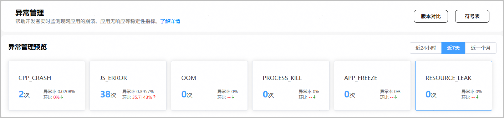
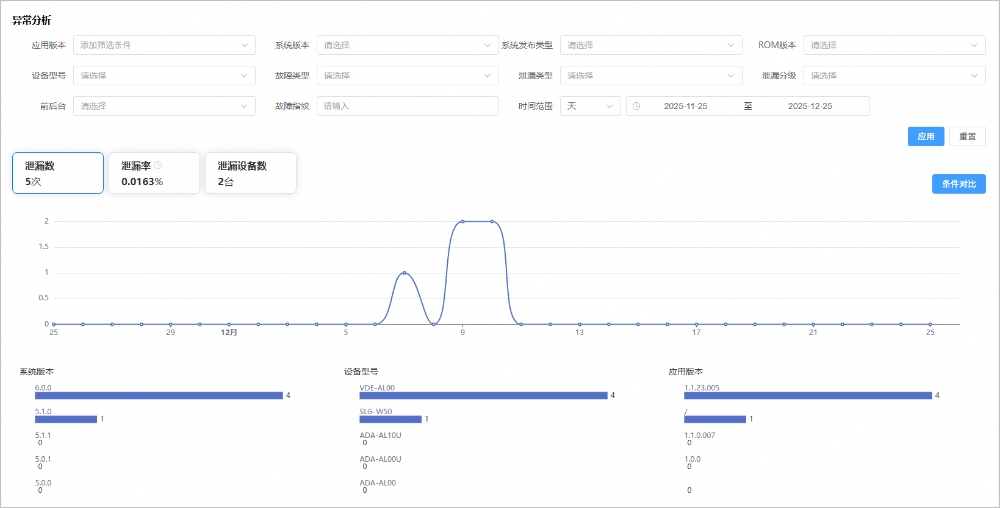
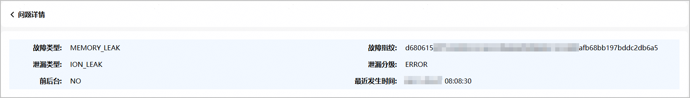
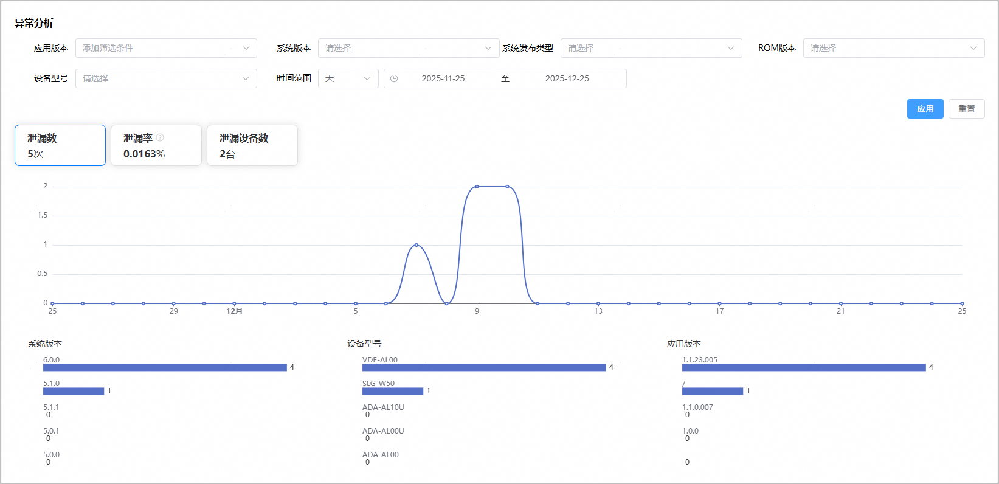
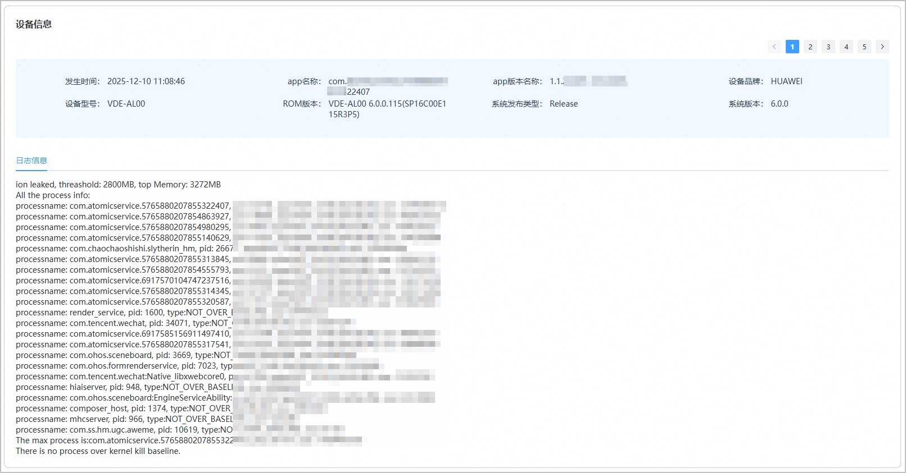

资源泄漏是指句柄、线程或内存等资源，在应用运行过程中没有被正确释放，导致资源被长期占用且无法被其他应用使用，如果某一类资源耗尽，系统可能出现卡死或重启等异常情况。为了应对资源泄漏问题，APMS会提供资源泄漏检测、判决、维测日志抓取、日志上报的能力，为开发者提供详细的维测日志以辅助故障定位。

#### 查看RESOURCE LEAK基本数据

1. 登录[AppGallery Connect](https://developer.huawei.com/consumer/cn/service/josp/agc/index.html)，点击“开发与服务”。
2. 在项目列表中找到您的项目，在项目下的应用列表中点击您的应用/元服务。
3. 左侧导航栏选择“质量 > APMS > 异常管理”，进入异常管理主界面。
4. 点击“RESOURCE\_LEAK”卡片，为您展示应用程序资源泄漏事件的出现次数及其他详细信息。点击右上角时间范围，可快速查看近24小时、近7天、近一个月的资源泄漏次数。

   

#### 筛选资源泄露问题范围

在异常分析区域，您可以通过设置不同的筛选条件对崩溃问题进行个性化分析。目前支持根据应用版本、系统版本、系统发布类型、ROM版本、设备型号、故障类型、泄漏类型、泄漏分级、前后台、时间范围等条件筛选问题，以快速定位问题边界。

筛选条件设置完成后，点击“应用”，您将能够查看指定时间范围和指定条件下的三类指标数据，包括泄漏次数、泄漏率、泄漏设备数。点击各指标卡片，可在卡片下方的图表中查看对应指标随时间的变化趋势，以及按系统版本、设备型号和应用版本的Top5排名。

下表列出了常见的泄漏类型及检测机制，供参考：

| 泄露类型 | | 检测机制 |
| --- | --- | --- |
| 句柄泄漏（FD\_LEAK） | | 每隔60s遍历一次进程，获取进程fd句柄总数，超过阈值（5000个）时抓取详细句柄信息，同步上报泄漏。 |
| 线程泄漏（THREAD\_LEAK） | | 每隔60s遍历一次进程，获取进程的总线程数，超过阈值（700个）时抓取详细线程名信息，同步上报泄漏。 |
| 内存泄漏（MEMORY\_LEAK） | JS泄漏（JS\_LEAK） | 虚拟机内部进行插桩，当堆内存的使用率超过85%或者触发OOM时会抓取heapdump，同步上报该故障。 |
| native内存泄漏（PSS\_MEMORY） | 以应用进程平均动态峰值内存作为基线，以200s作为基准，当动态内存峰值超过基线值2倍时，判定泄漏，同时触发管控。 |
| ashmem/ion/gpu等内存泄漏（KERNEL\_MEMORY） | 基于ashmem/ion/gpu的基线值，超过基线值时会判定泄漏，同步抓取维测信息。 |

#### 查看问题基本信息

在问题列表中，每个问题都是同一类问题的汇总，您可以查看资源泄露问题的基本信息（包括故障类型、故障指纹、泄漏类型、泄漏分级、前后台、发生次数、影响设备数、首次发生时间、末次发生时间）。

#### 分析泄露原因

1. 点击问题列表“操作”列的“查看详情”，进入问题详情页面。
2. 在问题详情页面，您可以看到问题更详细的信息。

   
3. 您可以通过“异常分析”区域的筛选器过滤资源泄漏数据，查看在当前聚类下的资源泄漏事件详情。
   * 选择“应用版本”、“系统版本”、“设备型号”等筛选条件后，点击“应用”，下方图表将展示对应条件的详细泄露数据及分布情况。

     时间选择器可自定义查询范围，界面默认的时间段为最近一个月。
   * 点击图表中的“泄露数”、“泄露率”、“泄露设备数”，可帮助您从不同维度分析资源泄露的信息分布情况。

   
4. 在“设备信息”面板查看资源泄露发生时的信息快照与相关日志信息。

   
