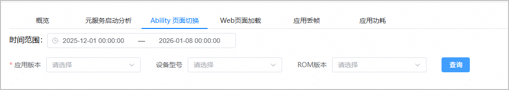
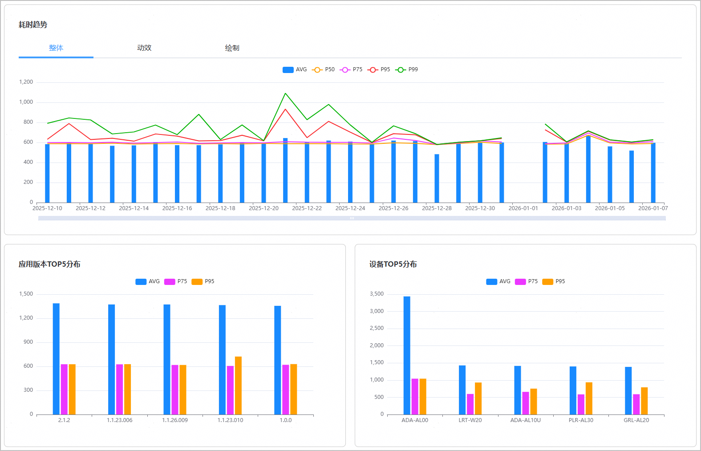
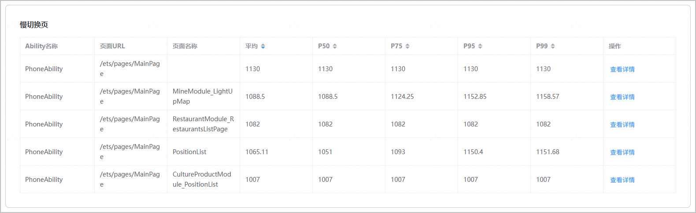
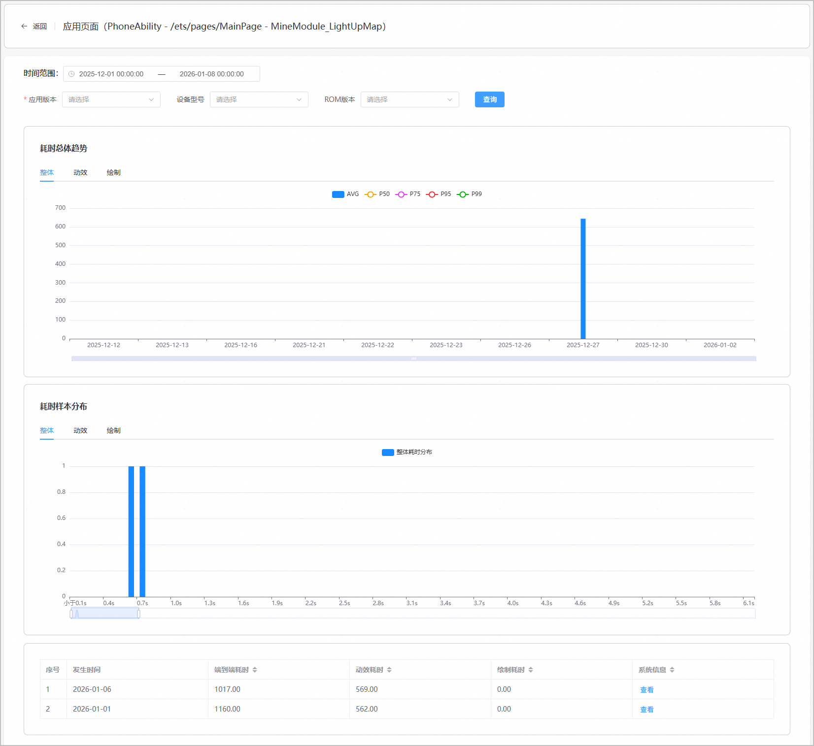

“Ability页面切换”页面为开发者提供Ability页面切换耗时的整体分布、应用版本Top5分布、设备Top5分布与出现慢切换的页面列表等指标查询能力，帮助开发者发现应用中Ability页面切换慢的问题。

1. 登录[AppGallery Connect](https://developer.huawei.com/consumer/cn/service/josp/agc/index.html)，点击“开发与服务”。
2. 在项目列表中找到您的项目，在项目下的应用列表中点击您的应用/元服务。
3. 左侧导航栏选择“质量 > APMS > 性能管理”，进入性能管理主界面。
4. 点击“Ability页面切换”页签，进入Ability页面切换页面。
   * 您可以根据时间范围、应用版本、设备型号（机型）、ROM版本维度，过滤出您的应用在指定条件下的Ability页面切换数据，方便您快速发现异常数据。

     
   * 该页面展示了您的应用在指定条件下的Ability页面切换性能指标，包括Ability页面切换的整体耗时分布、动效耗时分布、绘制耗时分布、耗时TOP5应用版本、耗时TOP5设备等性能指标，当选择的时间范围在最近一周以内时，您可以查看到小时级的指标数据。

     

     

     为保障端侧设备性能，Ability页面切换耗时趋势数据并非实时同步到AGC，您可在性能管理页面查看到前一天的Ability页面切换耗时趋势数据。
   * 该页面提供慢切换页统计列表，帮助您快速定位出现慢切换的Ability页面，其中，慢切换页列表根据“Ability名称+页面URL+页面名称”聚合得到慢切换页的耗时平均值以及P50、P75、P95、P99分布。

     

     

     出现慢切换页面可能影响用户体验，因此性能管理实时采集慢切换页事件，您可在性能管理页面查看即时、最新的慢切换页数据。
   * 点击慢切换页列表中某一条记录“操作”列的“查看详情”，您可以看到应用在该“Ability名称+页面URL+页面名称”页面下的耗时总体趋势、耗时样本分布，以及慢切换发生时的详细数据。

     

     | 指标名称 | 指标说明 |
     | --- | --- |
     | 整体耗时 | 完成一次Ability页面切换所花费的总时间。 |
     | 端到端耗时 | 从客户端发起业务请求至接收完整响应并完成结果呈现的全链路总耗时 |
     | 动效耗时 | 页面切换过程中，动画效果执行所消耗的时间。 |
     | 绘制耗时 | 页面切换后，新页面内容布局和渲染绘制所消耗的时间。 |
