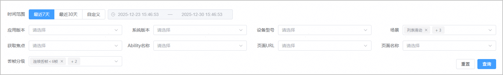
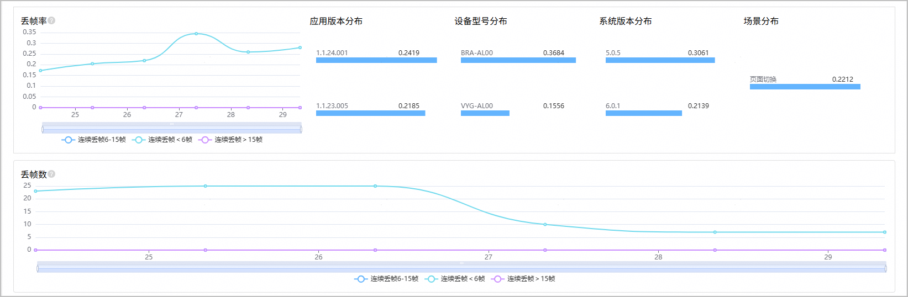
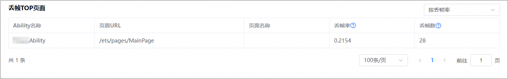

“应用丢帧”页面为开发者提供应用运行过程中的整体丢帧数据及关键维度分析，帮助开发者快速掌握应用的丢帧性能，定位因丢帧引起的应用卡顿、流畅度不足等潜在问题。

1. 登录[AppGallery Connect](https://developer.huawei.com/consumer/cn/service/josp/agc/index.html)，点击“开发与服务”。
2. 在项目列表中找到您的项目，在项目下的应用列表中点击您的应用/元服务。
3. 左侧导航栏选择“质量 > APMS > 性能管理”，进入性能管理主界面。
4. 点击“应用丢帧”页签，进入应用丢帧页面。
   * 您可以根据时间范围、应用版本、设备型号、应用场景、获取焦点、Ability名称等多个维度，过滤出您的应用在指定条件下的丢帧数据，方便您快速缩小问题范围，定位特定场景下的丢帧原因。

     
   * 该页面展示了您的应用/元服务在指定条件下的丢帧情况，包括丢帧率趋势图（显示指定时段内丢帧率变化走向）、丢帧数趋势图（显示指定时段内丢帧数量波动情况）、丢帧次数分布（统计不同丢帧次数区间的样本数据）。

     
   * 该页面还提供了应用内丢帧TOP页面展示，包括页面URL、页面名称、页面丢帧率、丢帧数等核心数据，并支持“按丢帧率”和“按丢帧数”对TOP页面进行降序排列。

     

   | 指标名称 | 指标说明 |
   | --- | --- |
   | 丢帧数 | 在统计周期内，发生丢帧的动效次数。  丢帧数与应用运行期间总帧数的比值，可以反映出界面渲染的流畅程度。 |
   | 丢帧率 | 在统计周期内，发生丢帧的动效占比。 |
