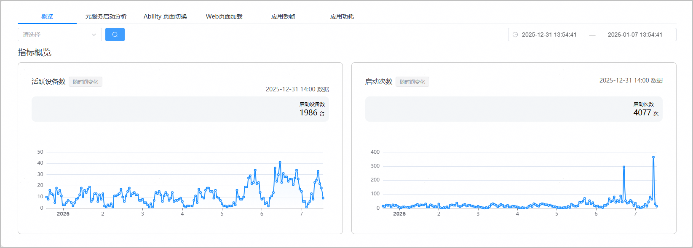

1. 登录[AppGallery Connect](https://developer.huawei.com/consumer/cn/service/josp/agc/index.html)，点击“开发与服务”。
2. 在项目列表中找到您的项目，在项目下的应用列表中点击您的应用/元服务。
3. 左侧导航栏选择“质量 > APMS > 性能管理”，进入性能管理主界面。
4. 点击“概览”页签，进入概览页面。

   “概览”页面展示应用指标概览数据，您可以通过APP版本和右上角的时间选择器筛选指标概览数据。

   指标概览包括“活跃设备数（随时间变化）”和“启动次数（随时间变化）。在概览页面，您可以快速了解应用的重要性能指标，及时识别应用是否发生问题。

   
