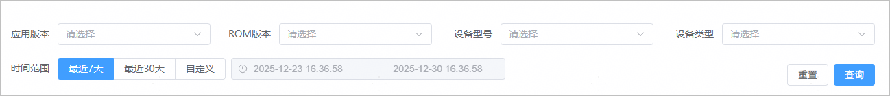
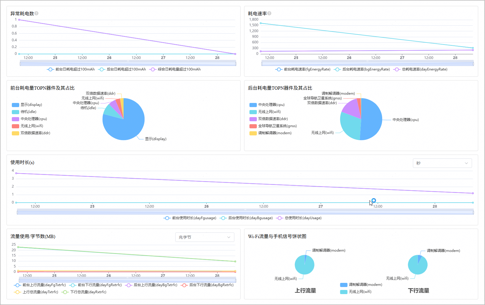

“应用功耗”页面为开发者提供应用运行过程中的整体功耗数据及多维度细分分析，帮助开发者快速掌握应用功耗表现，精准定位功耗问题。

1. 登录[AppGallery Connect](https://developer.huawei.com/consumer/cn/service/josp/agc/index.html)，点击“开发与服务”。
2. 在项目列表中找到您的项目，在项目下的应用列表中点击您的应用/元服务。
3. 左侧导航栏选择“质量 > APMS > 性能管理”，进入性能管理主界面。
4. 点击“应用功耗”页签，进入应用功耗页面。
   * 您可以根据应用版本、ROM版本、设备型号、设备类型、时间范围等多个维度，过滤出您的应用在指定条件下的功耗数据，方便您快速缩小异常范围，定位特定场景下的功耗问题。

     
   * 该页面呈现了您的应用/元服务在指定条件下的功耗情况，包括异常耗电数、耗电速率、前后台耗电量TOPN器件及其占比、前后台使用时长等。

     

   | 指标名称 | 指标说明 |
   | --- | --- |
   | 异常耗电数 | 日耗电量大于100毫安时的数量。 |
   | 耗电速率 | 耗电速率为单位时间（秒）的耗电量（毫安秒）。 |
   | 前台耗电量TOPN器件及其占比 | 分析并展示应用在前台运行期间，消耗电量最多的硬件组件（如CPU、hifi芯片、无线上网等），及其各自的耗电占比。 |
   | 后台耗电量TOPN器件及其占比 | 分析并展示应用在后台运行期间，消耗电量最多的硬件组件（如CPU、hifi芯片、无线上网等），及其各自的耗电占比。 |
   | 前台使用时长 | 应用处于前台活跃状态的总时间。 |
   | 后台使用时长 | 应用进程在后台存活的总时间。 |
   | 总使用时长 | 前后台使用时长的总和。 |
   | 前台上行流量 | 应用在前台运行时产生的数据发送量。 |
   | 前台下行流量 | 应用在前台运行时产生的数据接收量。 |
   | 后台上行流量 | 应用在后台运行时产生的数据发送量。 |
   | 后台下行流量 | 应用在后台运行时产生的数据接收量。 |
   | Wi-Fi流量与手机信号饼状图 | 统计周期内，应用通过Wi-Fi和移动数据网络（如4G/5G）产生的数据流量，各自占总体流量的比例。 |
