#### 元服务启动分析

“元服务启动分析”页面为开发者提供元服务启动的整体耗时及启动阶段耗时，帮助开发者快速了解元服务启动性能，并发现潜在的启动问题。

1. 登录[AppGallery Connect](https://developer.huawei.com/consumer/cn/service/josp/agc/index.html)，点击“开发与服务”。
2. 在项目列表中找到您的项目，在项目下的应用列表中点击您的元服务。
3. 左侧导航栏选择“质量 > APMS > 性能管理”，进入性能管理主界面。
4. 点击“元服务启动分析”页签，进入元服务启动分析页面。
   * 您可以根据时间范围、系统版本、设备型号、应用版本、启动类型、模块名等多个维度，过滤出您的元服务在指定条件下的启动性能数据，方便您快速发现性能瓶颈。

     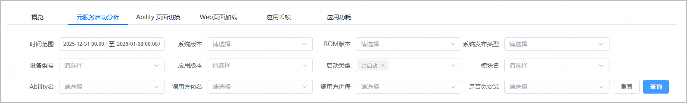
   * 该页面展示了您的元服务在指定条件下的启动性能指标，包括启动整体耗时的分位数分布（P50、P75、P90、P99）、上报量、平均整体耗时、启动次数分布、启动设备数，支持查看分钟级的指标数据，同时可以按照系统版本（TOP5分布）、设备型号（TOP5分布）、应用版本（TOP5分布）、ROM版本（TOP5分布）分类展示平均整体耗时、启动次数、启动设备数等数据。

     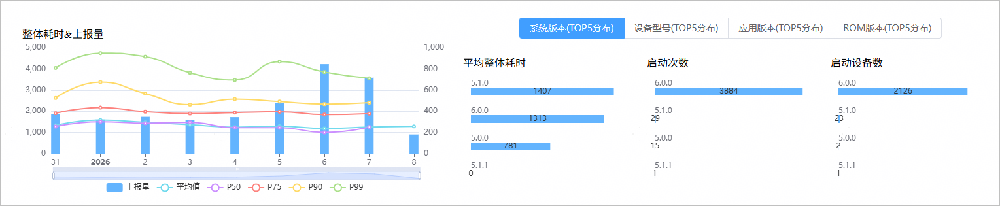
   * 该页面还提供了元服务启动过程中各阶段的耗时情况。

     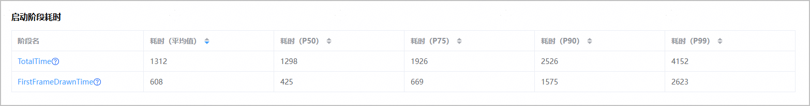

     点击“阶段名”可以查看更详细的耗时分布。

     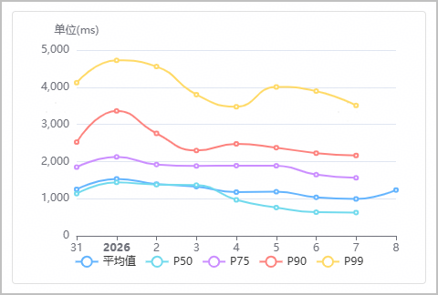

   | 指标名称 | 指标说明 |
   | --- | --- |
   | P50、P75、P90、P99 | 假如，A应用的某次运行，用户体验了10个场景，产生10条记录上报到服务器。共有10个用户上报，总共产生了100条记录。每条记录都有耗时数据，APMS将这100条记录按耗时长短排序，从大到小排序。已排序数据中的第50个，即这批数据中的P50。已排序数据中的第75个，即为这批数据中的P75，以此类推。 |
   | 阶段名 | 用于标识应用或元服务启动过程中的关键阶段，例如：整体耗时、界面第一帧绘制完成时间、启动Ability到应用进程创建等。 |
   | 上报量 | 在指定时间段内，成功上报的启动事件总数。 |

#### 应用启动分析

应用启动分析包含“启动分析”和“慢启动分析”两部分数据：

* [启动分析](#section186956502158)：提供应用启动的整体耗时及各阶段耗时，涵盖所有用户、所有场景下的启动数据统计与趋势分析，为应用启动性能的整体表现建立量化标准。
* [慢启动分析](#section79182310439)：针对应用启动耗时超出预设阈值的慢启动事件进行分析，例如冷启动整体耗时 ≥1.5s、热启动整体耗时 ≥ 1.5s，以及启动整体耗时在1.2s ~ 1.5s之间。

#### [h2]启动分析

1. 登录[AppGallery Connect](https://developer.huawei.com/consumer/cn/service/josp/agc/index.html)，点击“开发与服务”。
2. 在项目列表中找到您的项目，在项目下的应用列表中点击您的应用。
3. 左侧导航栏选择“质量 > APMS > 性能管理”，进入性能管理主界面。
4. 点击“启动分析”页签，进入启动分析页面。
   * 您可以根据系统版本、设备型号、应用版本、启动方式、启动场景等多个维度，过滤出您的应用在指定条件下的启动性能数据，方便您快速发现性能瓶颈。

     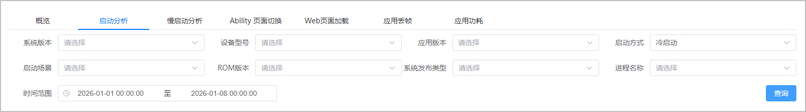
   * 该页面展示了您的应用在指定条件下的启动性能指标，包括启动整体耗时的分位数分布（P50、P75、P90、P99）、上报量、慢上报量（其数值与“慢启动分析”页签展示的上报量对应）、平均整体耗时、启动次数分布、启动设备数，支持查看分钟级的指标数据，同时可以按照系统版本（TOP5分布）、设备型号（TOP5分布）、应用版本（TOP5分布）分类展示平均整体耗时、启动次数、启动设备数等数据。

     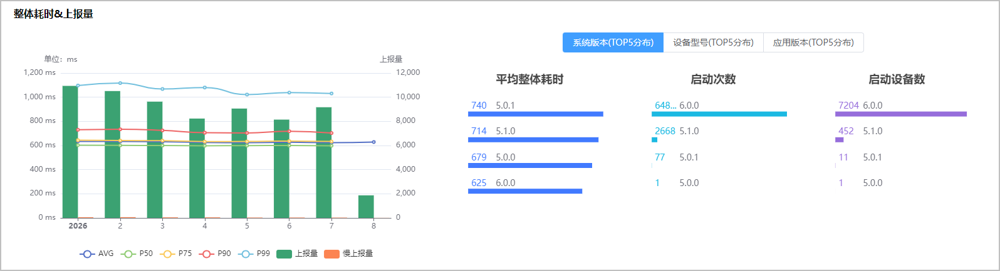
   * 该页面还提供了应用/元服务启动过程中各阶段的耗时情况，点击“阶段名”可以查看更详细的耗时分布。

     

   | 指标名称 | 指标说明 |
   | --- | --- |
   | P50、P75、P90、P99 | 假如，A应用的某次运行，用户体验了10个场景，产生10条记录上报到服务器。共有10个用户上报，总共产生了100条记录。每条记录都有耗时数据，APMS将这100条记录按耗时长短排序，从大到小排序。已排序数据中的第50个，即这批数据中的P50。已排序数据中的第75个，即为这批数据中的P75，以此类推。 |
   | 阶段名 | 用于标识应用或元服务启动过程中的关键阶段，例如：整体耗时、界面第一帧绘制完成时间、启动Ability到应用进程创建等。 |
   | 上报量 | 在指定时间段内，成功上报的启动事件总数。 |

#### [h2]慢启动分析

1. 登录[AppGallery Connect](https://developer.huawei.com/consumer/cn/service/josp/agc/index.html)，点击“开发与服务”。
2. 在项目列表中找到您的项目，在项目下的应用列表中点击您的应用/元服务。
3. 左侧导航栏选择“质量 > APMS > 性能管理”，进入性能管理主界面。
4. 点击“慢启动分析”页签，进入慢启动分析页面。
   * 您可以根据系统版本、设备型号、应用版本、启动方式、启动场景、时间范围等多个维度，过滤出您的应用在指定条件下的慢启动性能数据，方便您快速定位慢启动问题。

     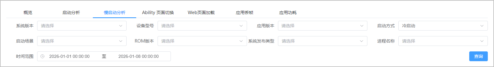
   * 该页面展示了您的应用在指定条件下的慢启动性能指标，包括启动整体耗时的分位数分布（P50、P75、P90、P99）、慢上报量、平均整体耗时、启动次数分布、启动设备数，支持查看分钟级的指标数据，同时可以按照系统版本（TOP5分布）、设备型号（TOP5分布）、应用版本（TOP5分布）分类展示平均整体耗时、启动次数、启动设备数等数据。

     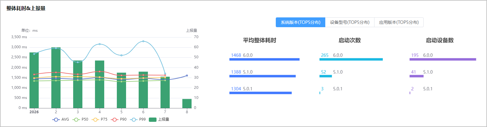
   * 慢启动分布图展示区域时间内，启动总数和各级慢启动事件的启动次数分布情况，可用于定位性能瓶颈。

     启动总数 = 启动整体耗时1.2s~1.5s + 启动整体耗时1.5s~4s/3s + 冷启动整体耗时≥4s

     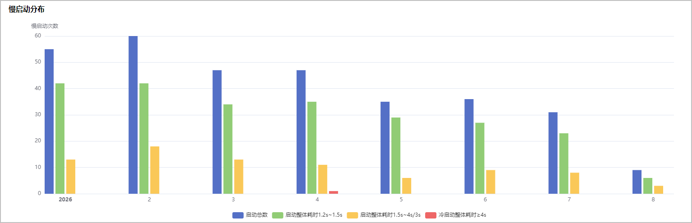
   * 慢启动分析根据应用慢启动情况分为A、B、C三个等级。

     A级慢启动（冷启动整体耗时≥4s或热启动整体耗时≥3s)

     B级慢启动（冷启动整体耗时1.5s~4s或热启动整体耗时1.5s~3s)

     C级慢启动（启动整体耗时1.2s~1.5s)

     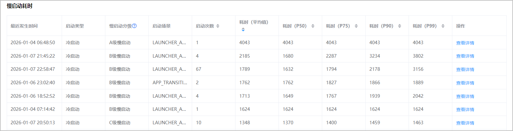

   | 指标名称 | 指标说明 |
   | --- | --- |
   | 上报量 | 此页面即慢上报量，表示在指定时间段内，被判定为“慢启动”（即启动耗时超过设定阈值）的启动事件总数。 |
   | 冷启动（全新初始化启动） | 指应用/元服务进程未在系统后台存活（如设备刚启动、应用/元服务进程被系统回收或主动关闭后），启动时需从代码加载、资源初始化（如界面渲染、配置读取）到进程创建完整执行。  例：设备重启后首次启动某应用，或应用被手动清理后台后再次启动。 |
   | 热启动（后台唤醒启动） | 指应用/元服务进程已在系统后台保留（仅界面被切换隐藏，核心进程未关闭），启动时无需重复加载资源与创建进程，仅需唤醒后台进程并恢复界面显示。  例：切换到其他应用 / 元服务操作后，返回此前使用过且未被清理后台的应用/元服务。 |
5. 点击“慢启动耗时”记录表“操作”列的“查看详情”可以查看应用启动过程中各阶段的耗时情况，点击“阶段名”可以查看更详细的耗时分布。

   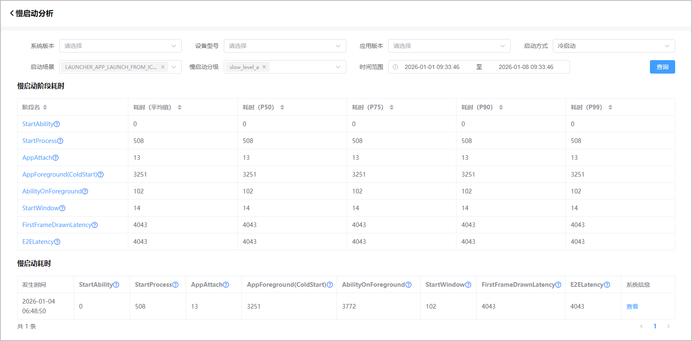

   点击“慢启动耗时”记录“系统信息”列的“查看”，可以查看详细的系统信息。

   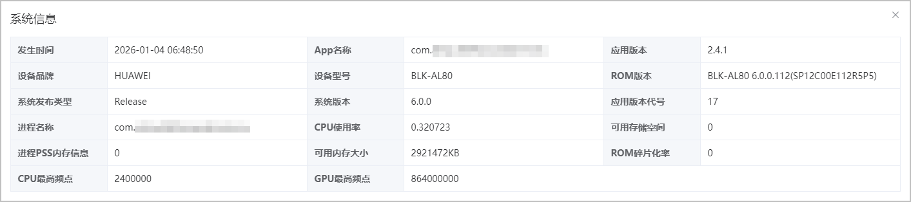
