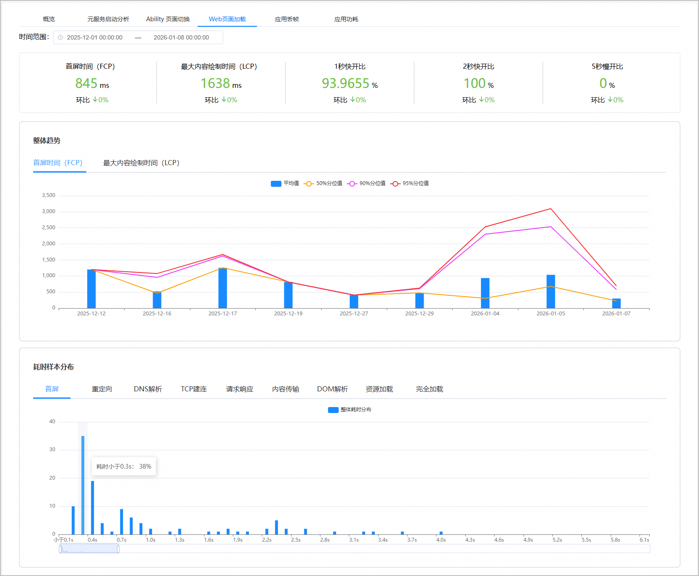

“Web页面加载”页面为开发者提供应用内Web页面加载耗时情况，帮助开发者快速掌握应用内Web页面的加载性能数据。

1. 登录[AppGallery Connect](https://developer.huawei.com/consumer/cn/service/josp/agc/index.html)，点击“开发与服务”。
2. 在项目列表中找到您的项目，在项目下的应用列表中点击您的应用/元服务。
3. 左侧导航栏选择“质量 > APMS > 性能管理”，进入性能管理主界面。
4. 点击“Web页面加载”页签，进入Web页面加载页面。
5. 根据时间范围过滤，可以查看应用在指定时间内的平均首屏时间、最大内容绘制时间、1秒快开比、2秒快开比、5秒慢开比、整体耗时趋势以及耗时样本分布。

   

   | 指标名称 | 指标说明 |
   | --- | --- |
   | 首屏时间（FCP） | FCP全称为First Contentful Paint，表示用户感知到的页面首屏内容完整呈现的时间。 |
   | 最大内容绘制时间（LCP） | LCP全称为Largest Contentful Paint，表示页面中最大可见内容元素完成渲染的时间点，是衡量视觉加载速度的关键指标。 |
   | 1秒快开比 | 2秒快开比 | 5秒慢开比 | 页面加载时间分别在1秒、2秒、5秒以内的会话次数占总会话次数的比例。 |
   | 重定向耗时 | 从发起页面请求到开始接收页面内容之间，所有HTTP重定向步骤消耗的总时间。 |
   | DNS解析耗时 | 将域名解析为IP地址所消耗的时间。 |
   | TCP建连耗时 | 客户端与服务器通过TCP三次握手成功建立网络连接所花费的时间。 |
   | DOM解析耗时 | 浏览器接收HTML文档后，将其解析并构建成内存中的文档对象模型树结构所花费的时间。 |
   | 资源加载时间 | 页面中引用的外部资源（如图片、样式表、脚本文件等）从发起请求到完全下载完成所耗费的时间。 |
   | 完全加载时间 | 从页面导航开始直到页面及其所有依赖资源（包括异步加载的内容）完全加载完毕，达到可稳定交互状态所消耗的总时间。 |
