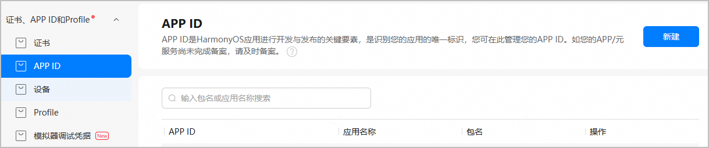
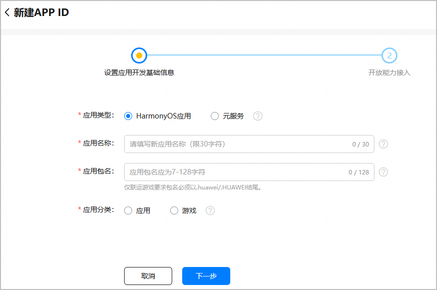
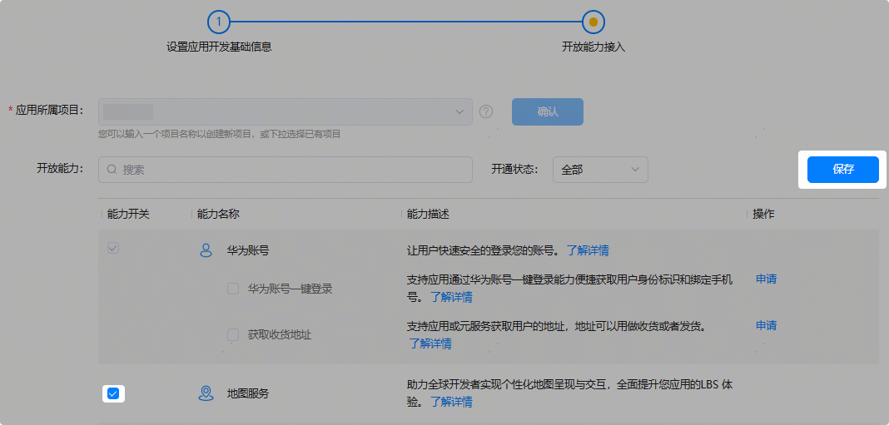
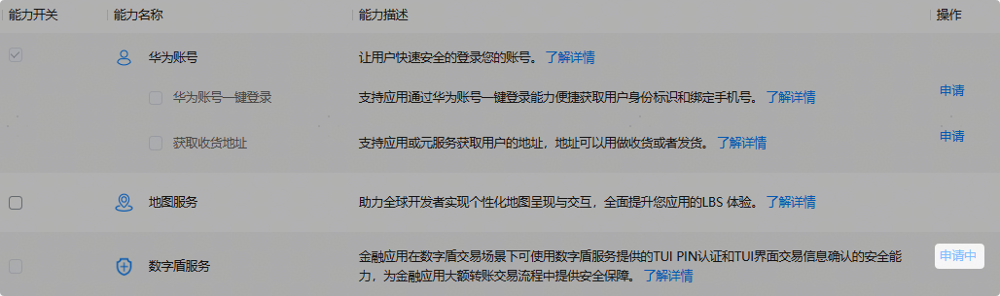
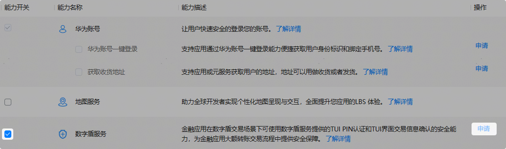
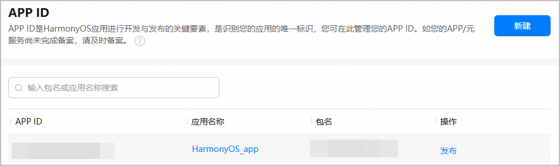
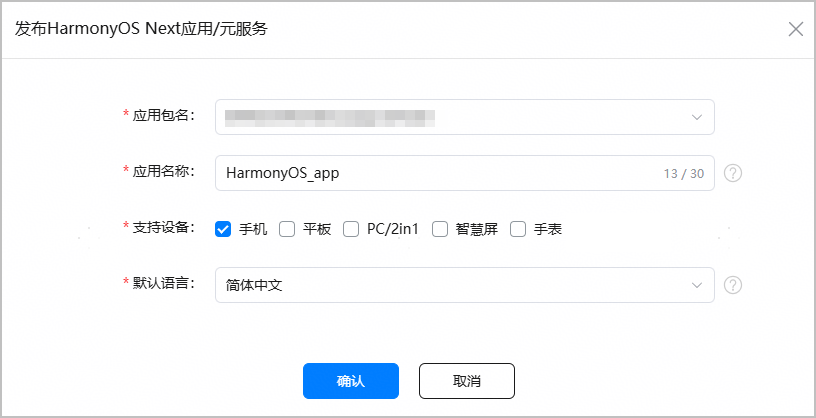
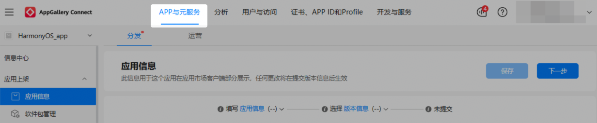
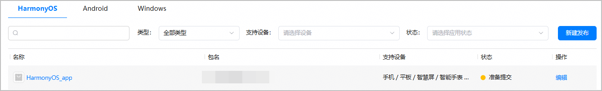

APP ID是应用开发与发布的关键要素，是识别应用的唯一标识。如需在华为应用市场发布应用，或者使用AppGallery Connect提供的各类服务，首先要在AppGallery Connect为您的软件包创建对应的HarmonyOS应用，从而为HarmonyOS应用生成一个独一无二的APP ID。

每个软件包需要创建一个HarmonyOS应用。如需将一个软件包分发至多个设备类型，可在配置支持设备时勾选多个设备类型，无需创建多个应用。

#### 前提条件

您已[注册华为开发者账号](https://developer.huawei.com/consumer/cn/doc/start/registration-and-verification-0000001053628148)并[实名认证](https://developer.huawei.com/consumer/cn/doc/start/itrna-0000001076878172)。

#### 操作步骤

**第一步：****[为HarmonyOS应用创建APP ID](#section16423184171915)**

首先需要为应用生成一个独一无二的APP ID。

**第二步：[（可选）为HarmonyOS应用开启华为开放能力](#section1817619495251)**

如果您的HarmonyOS应用需要使用华为开放能力，则必须在AppGallery Connect打开对应能力的开关。

**第三步：[为APP ID关联创建待发布的HarmonyOS应用](#section1502161513011)**

APP ID生成后，您还需为APP ID创建待发布的应用。此步骤完成后，创建的应用才会展示在“APP与元服务”列表内。

#### [h2]为HarmonyOS应用创建APP ID

1. 登录[AppGallery Connect](https://developer.huawei.com/consumer/cn/service/josp/agc/index.html)，选择“证书、APP ID和Profile”。
2. 在左侧导航栏选择“证书、APP ID和Profile > APP ID”，进入“APP ID”页面，点击右上角“新建”。

   
3. 进入“设置应用开发基础信息”页面，填写应用基础信息，完成后点击“下一步”。

   

   | 参数 | 说明 |
   | --- | --- |
   | 应用类型 | 选择“HarmonyOS应用”。 |
   | 应用名称 | 应用在华为应用市场详情页展示的名称。  应用名称中不能含有“黄赌毒”等低俗敏感字样，且不能与其他开发者的在架HarmonyOS NEXT应用/元服务相同。如提示名称已被占用，请更换新的名称。如果发现有人侵权盗版，可通过[互动中心](https://developer.huawei.com/consumer/cn/doc/app/agc-help-interaction-center-0000002276985946)提起申诉。  关于应用名称的更多要求，请参考[应用信息审核规范](https://developer.huawei.com/consumer/cn/doc/app/50104-01)。 |
   | 应用包名 | 说明：  应用包名必须与您DevEco Studio工程中配置的Bundle name一致。  HarmonyOS应用包名需遵守如下规范：  * 包名必须唯一，不能与其他应用包名相同。 * 必须为以点号（.）分隔的字符串，且至少包含三段，每段中仅允许使用英文字母、数字、下划线（\_），如“harmony\_11.huawei.com”。 首段以英文字母开头，非首段以数字或英文字母开头，每一段以数字或者英文字母结尾，如“harmony99.huawei.11\_com”。  不允许多个点号（.）连续出现，如“harmony..huawei.com”。 * 长度为7~128个字符，且不可包含敏感词，不能将保留字符作为独立段呈现。以保留字符harmony为例，包名不能为harmony.huawei.com、com.harmony.huawei、com.huawei.harmony。 保留字符包括如下：    + oh   + ohos   + harmony   + harmonyos   + openharmony   + system |
   | 应用分类 | 说明：  应用分类设置后不支持修改，请谨慎选择。  选择“应用”或“游戏”。 |
4. 在“开放能力接入”页面，为应用选择所属的项目，完成后点击“确认”，应用APP ID即成功创建。
   * 如需将应用添加到已有项目，点击下拉框进行选择。
   * 如需将应用添加到新项目，直接在框中填写新项目名称。

   

#### [h2]（可选）为HarmonyOS应用开启华为开放能力

华为为HarmonyOS应用提供了众多开放能力，如果HarmonyOS应用需要使用华为开放能力，则必须在AGC开启对应的能力开关。如无需接入开放能力，直接点击最下方“确认”，返回APP ID页面。

当前开启开放能力有两种方式：

* [直接开启](#ZH-CN_TOPIC_0000002247955506__li2499164993616)：若开放能力支持勾选，表示该能力可直接开启，无需申请。
* [申请开启](#ZH-CN_TOPIC_0000002247955506__li15500194915363)：若开放能力不可勾选，表示该能力暂未完全开放，需要申请通过才可开启。

* 开放能力开关分为应用级别和项目级别两种。应用级别的开关仅对当前应用生效，项目级别的开关对当前整个项目生效。
* 开放能力配置信息会写入Profile，建议您在申请Profile前完成所需开放能力的配置。如果您在申请Profile后修改了开放能力配置，请重新下载Profile。
* 应用创建完成后，若需新添加或修改开放能力，可前往“APP ID”菜单，点击应用名称，进入“应用详情”页操作。

* **若开放能力支持勾选，表示该能力可直接开启**。

  在“开放能力”栏勾选您想要开启的开放能力开关，点击右上角“保存”即可。支持多选，一次操作（勾选或者取消勾选）的能力开关不得超过10个。

  
* **若开放能力不可勾选，表示该能力暂未完全开放，需申请通过才可开启。**

  下文以数字盾服务为例，介绍开放能力申请的大致流程。各开放能力申请流程和具体要求可能存在一定差异，请以实际界面为准。

  1. 点击对应能力的“申请”按钮。

     
  2. 在“新建业务申请”窗口填写申请原因，必要时可上传附件，然后点击“提交”。

     各能力对申请原因与附件的要求可能存在差异，请按实际界面要求操作。

     
  3. 进入互动中心页面，可看到申请已提交的消息。

     

     返回“开放能力接入”页面，原“申请”按钮变为“申请中”。

     

     申请审批通过后，互动中心会发送通知消息给您，同时您也会收到邮件通知。“申请中”按钮会变为置灰显示的“申请”，同时对应的能力开关会为您自动开启。

     

  

  + 后续如需关闭开放能力，可取消勾选对应的能力开关，点击“保存”。一次操作的能力开关不得超过10个。修改能力开关状态后，请务必重新下载Profile。
  + 若开放能力包含主能力和子能力，需参考以上步骤分别申请主能力和子能力。以华为账号服务为例，“华为账号”为主能力，其下包含“获取收货地址”等多个子能力。当前AGC已默认为应用开启“华为账号”主能力，子能力则需分别自行申请开启。

#### [h2]为APP ID关联创建待发布的HarmonyOS应用

APP ID生成后，您还需为其关联创建待发布的应用，完成后应用才会展示在“APP与元服务”列表内。

1. 在“APP ID”页面，找到创建的APP ID，点击“操作”列“发布”前往创建。

   

   在“APP与元服务 > HarmonyOS”页签，点击应用列表右侧“新建发布”，也可以为APP ID关联创建应用。

   
2. 在弹出的“发布HarmonyOS Next应用/元服务”窗口，将应用信息补充完整。点击“确认”，进入“应用信息”界面。

   

   | 参数 | 说明 |
   | --- | --- |
   | 应用包名 | 自动填充您创建的应用包名。 |
   | 应用名称 | 自动填充您创建的应用名称，支持修改，但需满足如下条件：  * 不能与本账号下、同一语言、同一设备类型、且发布地区包含中国大陆的公开发布在架、上架审核中（提交审核1个月内）、已下架（审批完成不超过180天）HarmonyOS NEXT应用的名称相同。 * 不能与其他开发者名下、同一语言、且发布地区包含中国大陆的公开发布在架、上架审核中（提交审核1个月内）、已下架（审批完成不超过180天）HarmonyOS NEXT应用/元服务的名称相同。 如提示名称已被占用，请更换新的名称。如果发现有人侵权盗版，可通过[互动中心](https://developer.huawei.com/consumer/cn/doc/app/agc-help-interaction-center-0000002276985946)提起申诉。 |
   | 支持设备 | 选择应用发布后运行的设备。  * 应用分发至中国大陆地区时：   + 支持选择手机、平板、PC/2in1、智慧屏、手表设备。其中，“手表”指代运动手表和/或智能手表。若勾选“手表”，应用创建完成后，应用信息页面“支持设备”栏将默认勾选智能手表，您可继续添加或切换成运动手表，详见[配置支持设备](https://developer.huawei.com/consumer/cn/doc/app/agc-help-release-app-devicetype-0000002271592112)。   + 在应用提交上架前，您可随时[在应用信息页面修改支持设备](https://developer.huawei.com/consumer/cn/doc/app/agc-help-release-app-devicetype-0000002271592112)，支持由单设备改为多设备，或多设备改为单设备。但是应用一旦发布，升级版本只支持增加设备，无法删除已选择的设备。 * 应用分发至中国大陆以外的国家或地区时：   + 当前仅智能手表和运动手表应用支持分发至中国大陆以外的国家或地区，因此请勾选“手表”。应用创建完成后，应用信息页面“支持设备”栏将默认勾选智能手表，您可继续添加或切换成运动手表，详见[配置支持设备](https://developer.huawei.com/consumer/cn/doc/app/agc-help-release-app-devicetype-0000002271592112)。   + 在应用提交上架前，您可随时[在应用信息页面修改支持设备](https://developer.huawei.com/consumer/cn/doc/app/agc-help-release-app-devicetype-0000002271592112)，支持由单设备改为多设备，或多设备改为单设备。但是应用一旦发布，升级版本只支持增加设备，无法删除已选择的设备。 |
   | 默认语言 | 华为应用市场客户端应用详情页中应用相关描述的默认语言，请您根据实际情况选择。如果该应用没有提供本地化语言的应用信息，则应用信息将以默认语言显示。 |
3. 点击“确认”，进入“应用信息”界面。您可点击顶部“APP与元服务”页签，返回应用列表。

   
4. 在应用列表“HarmonyOS”页签，可查看已创建的应用。

   
