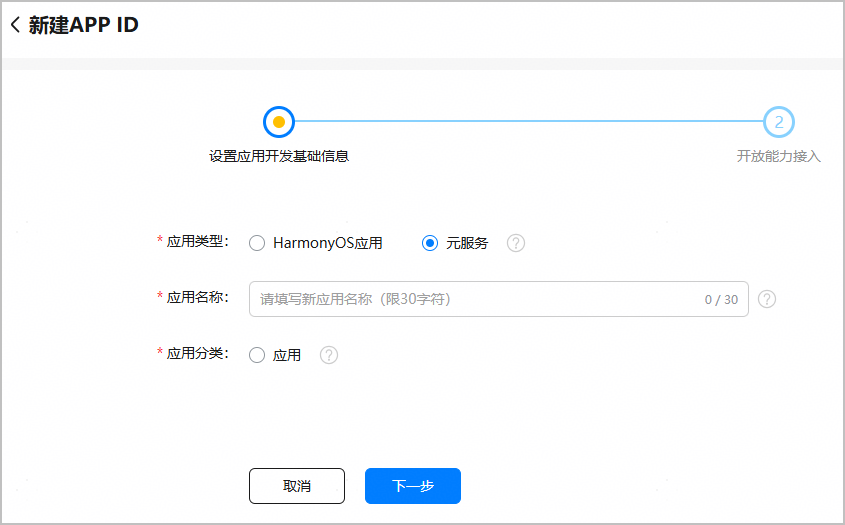
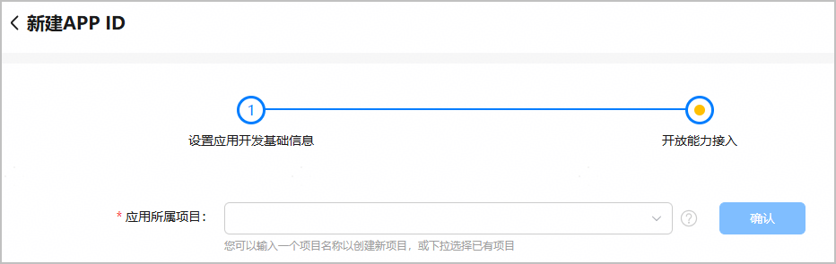
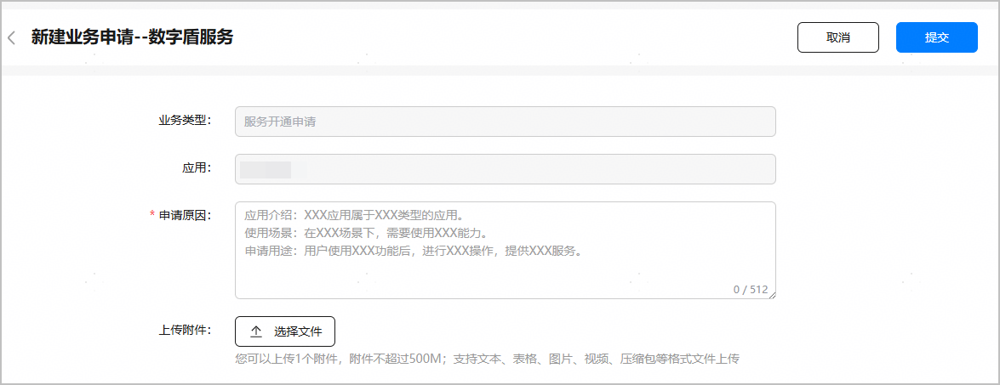
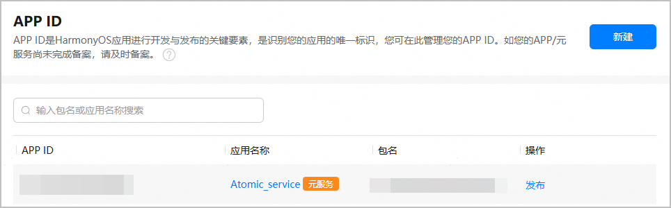
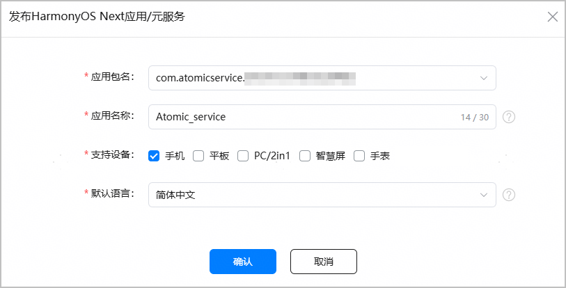
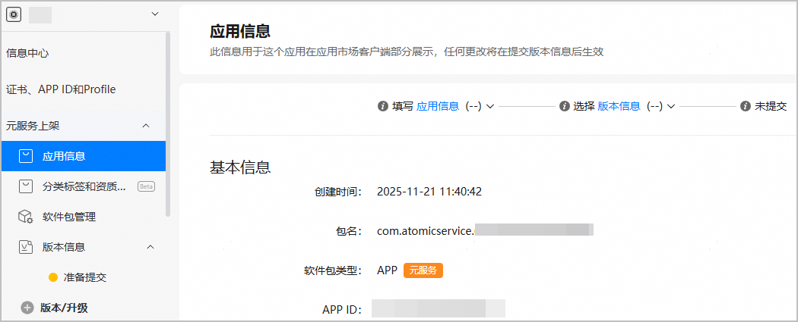

APP ID是应用开发与发布的关键要素，是识别应用的唯一标识。如需在华为应用市场发布元服务，或者使用AppGallery Connect提供的各类服务，首先要在AppGallery Connect为您的软件包创建对应的元服务，从而为元服务生成一个独一无二的APP ID。

每个软件包需要创建一个元服务。如需将一个软件包分发至多个设备类型，可在配置支持设备时勾选多个设备类型，无需创建多个元服务。

#### 前提条件

您已[注册华为开发者账号](https://developer.huawei.com/consumer/cn/doc/start/registration-and-verification-0000001053628148)并[实名认证](https://developer.huawei.com/consumer/cn/doc/start/itrna-0000001076878172)。

#### 操作步骤

**第一步：****[为元服务创建APP ID](#section16423184171915)**

首先需要为元服务生成一个独一无二的APP ID。

**第二步：[（可选）为元服务开启华为开放能力](#section1817619495251)**

如果您的元服务需要使用华为开放能力，则必须在AppGallery Connect打开对应能力的开关。

**第三步：[为APP ID关联创建待发布的元服务](#section1502161513011)**

APP ID生成后，您还需为APP ID创建待发布的元服务。此步骤完成后，创建的元服务才会展示在“APP与元服务”列表内。

#### [h2]为元服务创建APP ID

1. 登录[AppGallery Connect](https://developer.huawei.com/consumer/cn/service/josp/agc/index.html)，选择“证书、APP ID和Profile”。
2. 在左侧导航栏选择“证书、APP ID和Profile > APP ID”，进入“APP ID”页面，点击右上角“新建”。

   
3. 进入“设置应用开发基础信息”页面，填写元服务基础信息，完成后点击“下一步”。

   

   | 参数 | 说明 |
   | --- | --- |
   | 应用类型 | 选择“元服务”。 |
   | 应用名称 | 元服务在华为应用市场详情页展示的名称。  元服务名称中不能含有“黄赌毒”等低俗敏感字样，且不能与其他开发者的在架HarmonyOS NEXT应用/元服务相同。如提示名称已被占用，请更换新的名称。如果发现有人侵权盗版，可通过[互动中心](https://developer.huawei.com/consumer/cn/doc/app/agc-help-interaction-center-0000002276985946)提起申诉。  关于元服务名称的更多要求，请参考[元服务信息审核规范](https://developer.huawei.com/consumer/cn/doc/app/50129-01)。 |
   | 应用分类 | 说明：  应用分类设置后不支持修改，请谨慎选择。  元服务暂不支持游戏，仅支持选择“应用”。 |
4. 在“开放能力接入”页面，为元服务选择所属的项目，完成后点击“确认”，元服务APP ID即成功创建。
   * 如需将元服务添加到已有项目，点击下拉框进行选择。
   * 如需将元服务添加到新项目，直接在框中填写新项目名称。

   

#### [h2]（可选）为元服务开启华为开放能力

华为为元服务提供了众多开放能力，如果元服务需要使用华为开放能力，则必须在AGC打开对应的能力开关。如无需接入开放能力，直接点击最下方“确认”，返回APP ID页面。

当前开启开放能力有两种方式：

* [直接开启](#ZH-CN_TOPIC_0000002247795706__li2499164993616)：若开放能力支持勾选，表示该能力可直接开启，无需申请。
* [申请开启](#ZH-CN_TOPIC_0000002247795706__li15500194915363)：若开放能力不可勾选，表示该能力暂未完全开放，需要申请通过才可开启。

* 开放能力开关分为应用级别和项目级别两种。应用级别的开关仅对当前元服务生效，项目级别的开关对当前整个项目生效。
* 开放能力配置信息会写入Profile，建议您在申请Profile前完成所需开放能力的配置。如果您在申请Profile后修改了开放能力配置，请重新下载Profile。
* 元服务创建完成后，若需新添加或修改开放能力，可前往“APP ID”菜单，点击元服务名称，进入“应用详情”页操作。

* **若开放能力支持勾选，表示该能力可直接开启**。

  在“开放能力”栏勾选您想要开启的开放能力开关，点击右上角“保存”即可。支持多选，一次操作（勾选或者取消勾选）的能力开关不得超过10个。

  
* **若开放能力不可勾选，表示该能力暂未完全开放，需申请通过才可开启。**

  下文以数字盾服务为例，介绍开放能力申请的大致流程。各开放能力申请流程和具体要求可能存在一定差异，请以实际界面为准。

  1. 点击对应能力的“申请”按钮。

     
  2. 在“新建业务申请”窗口填写申请原因，必要时可上传附件，然后点击“提交”。

     各能力对申请原因与附件的要求可能存在差异，请按实际界面要求操作。

     
  3. 进入互动中心页面，可看到申请已提交的消息。

     

     返回“开放能力接入”页面，原“申请”按钮变为“申请中”。

     

     申请审批通过后，互动中心会发送通知消息给您，同时您也会收到邮件通知。“申请中”按钮会变为置灰显示的“申请”，同时对应的能力开关会为您自动开启。

     

  

  + 后续如需关闭开放能力，可取消勾选对应的能力开关，点击“保存”。一次操作的能力开关不得超过10个。修改能力开关状态后，请务必重新下载Profile。
  + 若开放能力包含主能力和子能力，需参考以上步骤分别申请主能力和子能力。以华为账号服务为例，“华为账号”为主能力，其下包含“获取收货地址”等多个子能力。当前AGC已默认为元服务开启“华为账号”主能力，子能力则需分别自行申请开启。

#### [h2]为APP ID关联创建待发布的元服务

APP ID生成后，您还需为其关联创建待发布的元服务，完成后元服务才会展示在“APP与元服务”列表内。

1. 在“APP ID”页面，找到创建的APP ID，点击“操作”列“发布”前往创建。

   

   在“APP与元服务 > HarmonyOS”页签，点击应用列表右侧“新建发布”，也可以为APP ID关联创建元服务。

   
2. 在弹出的“发布HarmonyOS Next应用/元服务”窗口，将元服务信息补充完整。

   

   | 参数 | 说明 |
   | --- | --- |
   | 应用包名 | 自动填充您创建的元服务包名。 |
   | 应用名称 | 自动填充您创建的元服务名称，支持修改，但需满足如下条件：  * 不能与本账号下、同一语言、同一设备类型的公开发布在架、上架审核中（提交审核1个月内）、已下架（审批完成不超过180天）的元服务（API level ≥ 10）的名称相同。 * 不能与其他开发者名下、同一语言的公开发布在架、上架审核中（提交审核1个月内）、已下架（审批完成不超过180天）的HarmonyOS NEXT应用/元服务的名称相同。 如提示名称已被占用，请更换新的名称。如果发现有人侵权盗版，可通过[互动中心](https://developer.huawei.com/consumer/cn/doc/app/agc-help-interaction-center-0000002276985946)提起申诉。 |
   | 支持设备 | 选择元服务发布后运行的设备，默认选择手机。  说明：  * 支持设备中的“手表”指代运动手表和/或智能手表。若勾选“手表”，元服务创建完成后，应用信息页面“支持设备”栏将默认勾选智能手表，您可继续添加或切换成运动手表，详见[配置支持设备](https://developer.huawei.com/consumer/cn/doc/app/agc-help-release-atomic-devicetype-0000002293811138)。 * 请根据您软件包里声明的设备（即module.json5配置文件中[“deviceTypes”标签](https://developer.huawei.com/consumer/cn/doc/harmonyos-guides/module-configuration-file#devicetypes标 签)的枚举值）勾选对应的支持设备，确保软件包里声明的设备范围大于等于AppGallery Connect上勾选的支持设备范围。 * 在元服务提交上架前，您可随时[在应用信息页面修改支持设备](https://developer.huawei.com/consumer/cn/doc/app/agc-help-release-atomic-devicetype-0000002293811138)，支持由单设备改为多设备，或多设备改为单设备。但是元服务一旦发布，升级版本只支持增加设备，无法删除已选择的设备。 |
   | 默认语言 | 华为应用市场客户端应用详情页中应用相关描述的默认语言，请您根据实际情况选择。如果该应用没有提供本地化语言的应用信息，则应用信息将以默认语言显示。 |
3. 点击“确认”，进入“应用信息”界面，可查看元服务的包名、APP ID等基本信息。

   

   元服务创建成功后，AppGallery Connect会为您自动生成包名，格式为“com.atomicservice.*[appid]*”，不支持手动修改。

   
4. 按照法律法规要求，元服务上架需要根据元服务所提供的内容决定是否需要资质。建议您在元服务创建完成后，尽早将资质文件提交给华为运营人员审核，资质文件不规范将影响您发布的进度。具体操作可参见[配置应用分类、标签和资质信息](https://developer.huawei.com/consumer/cn/doc/app/agc-help-release-atomic-class-tag-0000002293651518)。
