APP ID是应用开发与发布的关键要素，是识别应用的唯一标识。如需在华为应用市场发布小游戏，或者使用AppGallery Connect提供的各类服务，首先要创建小游戏，从而为小游戏生成一个独一无二的APP ID。

#### 前提条件

您已[注册华为开发者账号](https://developer.huawei.com/consumer/cn/doc/start/registration-and-verification-0000001053628148)并[实名认证](https://developer.huawei.com/consumer/cn/doc/start/itrna-0000001076878172)。

#### 操作步骤

**第一步：****[为小游戏创建APP ID](#section16423184171915)**

首先需要为小游戏生成一个独一无二的APP ID。

**第二步：[为小游戏开启存储空间管理能力](#section1817619495251)**

小游戏必须申请存储空间管理能力。

**第三步：[为APP ID关联创建待发布的小游戏](#section1502161513011)**

APP ID生成后，您还需为APP ID创建待发布的小游戏。此步骤完成后，创建的小游戏才会展示在“APP与元服务”列表内。

#### [h2]为小游戏创建APP ID

1. 登录[AppGallery Connect](https://developer.huawei.com/consumer/cn/service/josp/agc/index.html)，选择“证书、APP ID和Profile”。
2. 在左侧导航栏选择“证书、APP ID和Profile > APP ID”，进入“APP ID”页面，点击右上角“新建”。

   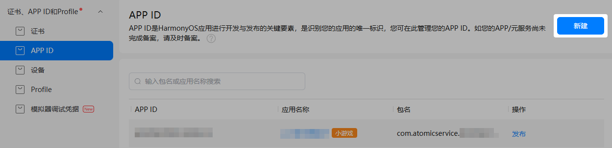
3. 进入“设置应用开发基础信息”页面，填写小游戏基础信息，完成后点击“下一步”。

   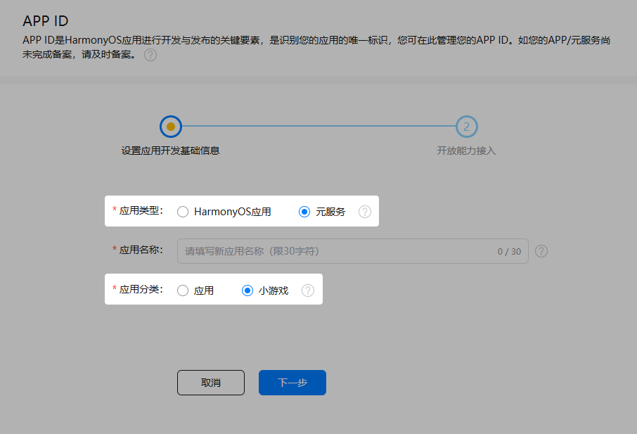

   | 参数 | 说明 |
   | --- | --- |
   | 应用类型 | 选择“元服务”。 |
   | 应用名称 | 小游戏在华为应用市场详情页展示的名称。  名称中不能含有“黄赌毒”等低俗敏感字样，且不能与其他开发者的在架HarmonyOS NEXT应用/元服务/小游戏相同。如提示名称已被占用，请更换新的名称。如果发现有人侵权盗版，可通过[互动中心](/docs/distribute/agc/agc-help-interaction-center-0000002276985946)提起申诉。  关于小游戏名称的更多要求，请参考[元服务信息审核规范](https://developer.huawei.com/consumer/cn/doc/app/50129-01)。 |
   | 应用分类 | 选择“小游戏”。  说明：  应用分类设置后不支持修改，请谨慎选择。 |
4. 在“开放能力接入”页面，为小游戏选择所属的项目，完成后点击“确认”，小游戏APP ID即成功创建。
   * 如需将小游戏添加到已有项目，点击下拉框进行选择。
   * 如需将小游戏添加到新项目，直接在框中填写新项目名称。

   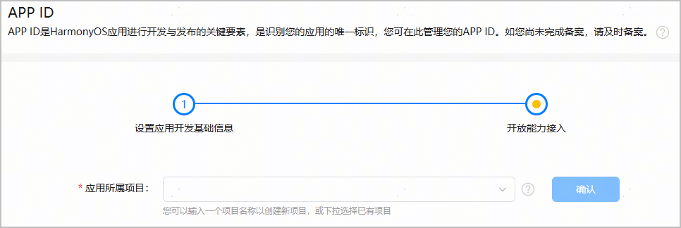

#### [h2]为小游戏开启存储空间管理能力

* 小游戏必须申请“存储空间管理”服务，若未申请该服务会导致小游戏运行出现问题。
* 您也可以选择在创建完成小游戏后在“开发与服务 > 项目设置 > 开放能力管理”处申请存储空间管理能力，申请方式请参见[存储空间管理服务](/docs/distribute/agc/agc-help-release-minigame-0000002424923330/agc-help-release-minigame-acl-and-ability-0000002425276004#section17374114165216)。
* 如需开通其他华为开放能力，具体操作请参考[为元服务开启华为开放能力](/docs/distribute/agc/agc-help-app-0000002235710234/agc-help-create-atomic-service-0000002247795706#section1817619495251)。

1. 点击对应能力的“申请”按钮。

   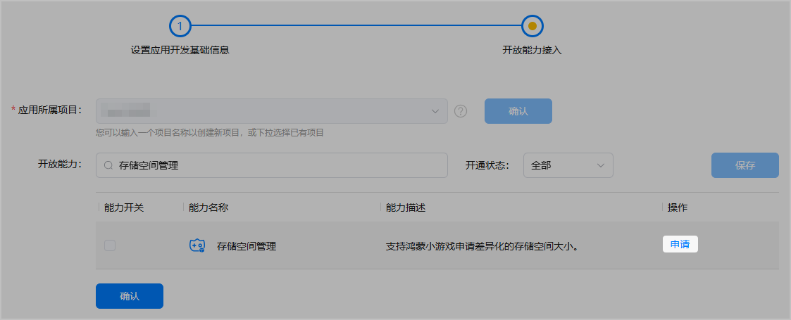
2. 在“新建业务申请”窗口填写申请原因，然后点击“提交”。

   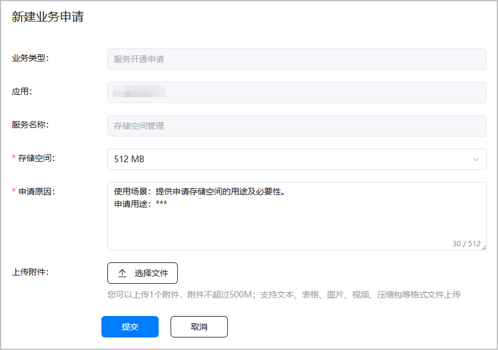

   | 配置项 | 必填/选填 | 说明 |
   | --- | --- | --- |
   | 存储空间 | 必填 | 请选择所需的存储空间大小。可选择大小为512MB、1GB、1.5GB和2GB，默认选择512MB。 |
   | 申请原因 | 必填 | 申请存储空间管理的原因，请按照模板填写相关信息，字数不超过512个字符。 |
   | 上传附件 | 选填 | 仅可上传1个附件，大小不超过500MB。支持文本、表格、图片、视频、压缩包格式。 |

   

   大部分游戏当前推荐申请1GB的存储空间。如果您需要申请更大的存储空间，请提供合理的申请原因，运营将会对您提供的申请原因进行严格的审核。

3. 进入互动中心页面，可看到申请已提交的消息。

   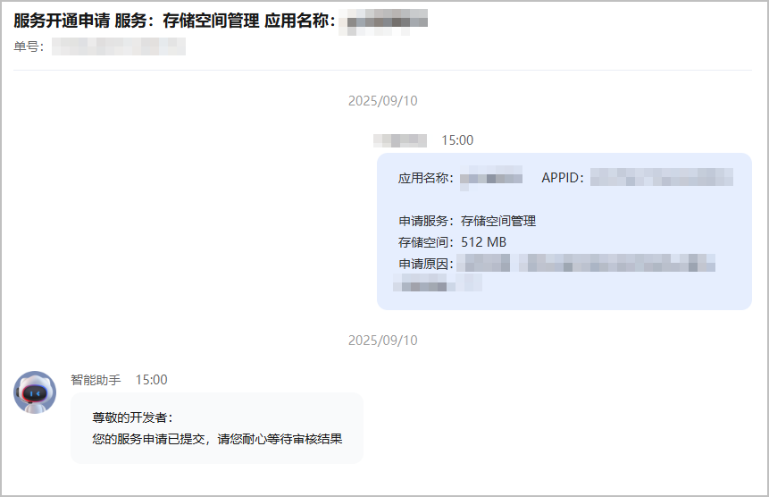
4. 返回“开放能力接入”页面，原“申请”按钮变为“申请中”。

   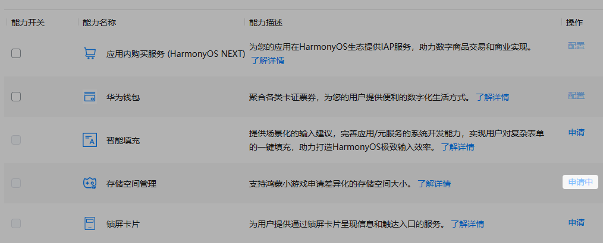
5. 申请审批通过后，互动中心将会发送通知给您，同时存储空间管理的能力开关会为您自动开启。如需更改存储空间大小，请点击“申请”重新提交申请。

   

   存储空间管理能力不可关闭。

   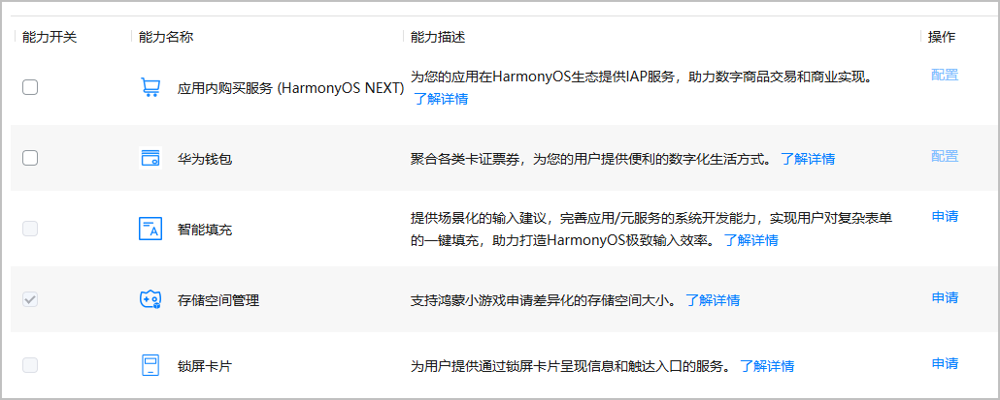

#### [h2]为APP ID关联创建待发布的小游戏

APP ID生成后，您还需为其关联创建待发布的小游戏，完成后小游戏才会展示在“APP与元服务”列表内。

1. 在“证书、APP ID和Profile > APP ID”页面，找到创建的APP ID，点击“操作”列“发布”前往创建。也可以在“APP与元服务 > HarmonyOS”页签，点击应用列表右侧“新建发布”，为APP ID关联创建小游戏。

   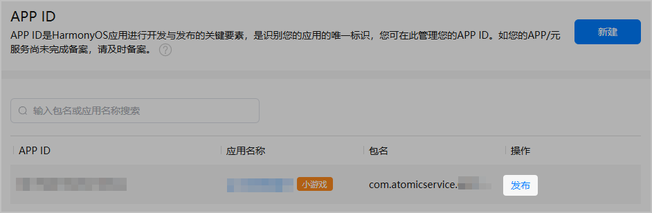
2. 在弹出的“发布HarmonyOS Next应用/元服务”窗口，将小游戏信息补充完整。

   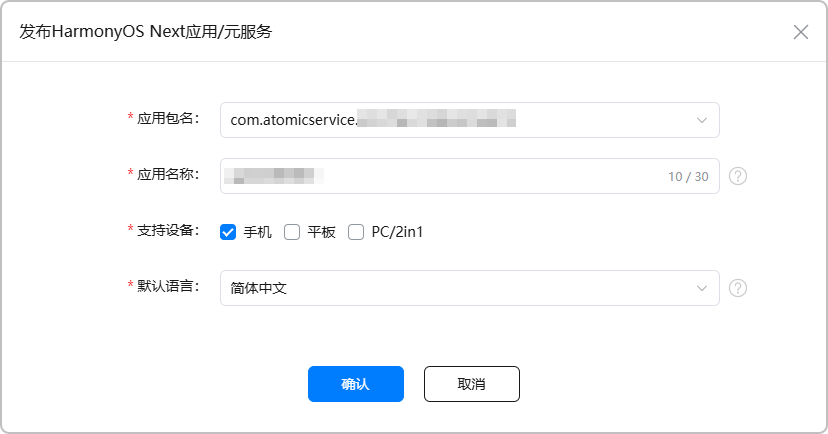

   | 参数 | 说明 |
   | --- | --- |
   | 应用包名 | 自动填充您创建的小游戏包名。 |
   | 应用名称 | 自动填充您创建的小游戏名称，支持修改，但需满足如下条件：  * 不能与本账号下、同一语言、同一设备类型、且发布地区包含中国大陆的在架小游戏（API level ≥ 10）的名称相同。当前，语言检测范围包含以下五种：简体中文、繁体中文（中国台湾）、繁体中文（中国香港特别行政区）、美式英语、英式英语。 * 不能与其他开发者名下、同一语言、且发布地区包含中国大陆的在架HarmonyOS 5.0及以上应用/元服务/小游戏的名称相同。当前，语言检测范围包含以下五种：简体中文、繁体中文（中国台湾）、繁体中文（中国香港特别行政区）、美式英语、英式英语。 * 应用名称必须与软件包中的名称一致，且需符合[元服务信息审核规范](https://developer.huawei.com/consumer/cn/doc/app/50129-01)。 如提示名称已被占用，请更换新的名称。如果发现有人侵权盗版，可通过[互动中心](/docs/distribute/agc/agc-help-interaction-center-0000002276985946)提起申诉。 |
   | 支持设备 | 选择小游戏发布后运行的设备，默认选择手机。  说明：  * 小游戏只支持手机、平板和PC/2in1设备。 * 请根据您软件包里声明的设备（即module.json5配置文件中[“deviceTypes”标签](/docs/dev/app-dev/getting-started/dev-fundamentals/module-configuration-file#devicetypes标 签)的枚举值）勾选对应的支持设备，确保软件包里声明的设备范围大于等于AppGallery Connect上勾选的支持设备范围。 * 在小游戏发布前，您都可以在应用信息页面修改支持设备，支持由单设备改为多设备，或多设备改为单设备。但是小游戏一旦发布，升级时仅允许增加设备类型，不支持删除原有在架小游戏已选择的设备类型。例如，在架小游戏支持的设备类型为“手机”，升级应用时您无法取消勾选“手机”选项。 |
   | 默认语言 | 华为应用市场客户端应用详情页中应用相关描述的默认语言，请您根据实际情况选择。如果该应用没有提供本地化语言的应用信息，则应用信息将以默认语言显示。 |
3. 点击“确认”，进入“应用信息”界面。您可点击顶部“APP与元服务”页签，返回应用列表。

   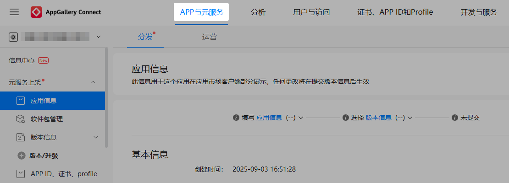
4. 在应用列表“HarmonyOS”页签，可查看已创建的小游戏。小游戏创建成功后，AppGallery Connect会为您自动生成包名，格式为“com.atomicservice.*[appid]*”，不支持手动修改。

   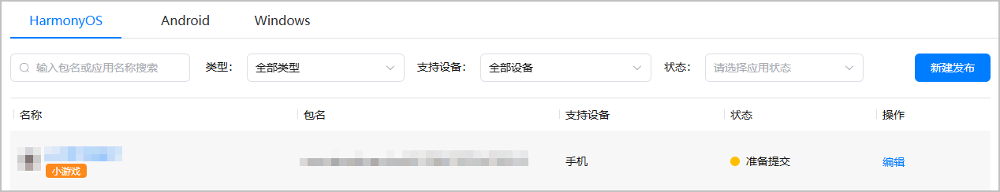
