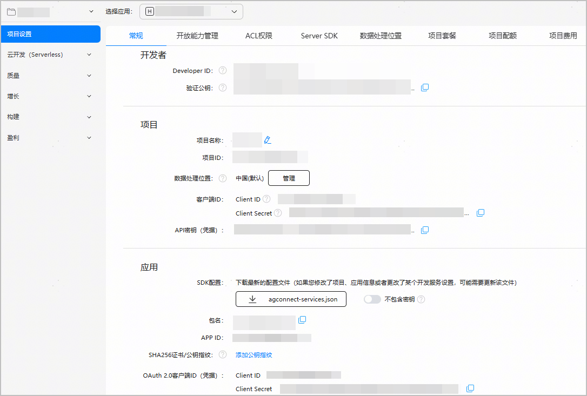

创建HarmonyOS应用/元服务后，您可以查看其相关信息，如Developer ID、Client ID、APP ID等。

1. 登录[AppGallery Connect](https://developer.huawei.com/consumer/cn/service/josp/agc/index.html#/)，点击“开发与服务”。
2. 在项目列表中找到您的项目，点击待查看的应用/元服务，进入“项目设置 > 常规”页面，可查看如下信息。

   | 所属级别 | 参数 | 说明 |
   | --- | --- | --- |
   | 开发者 | Developer ID | 开发者账号的唯一标识。 |
   | 验证公钥 | AppGallery Connect的服务器给您的服务器发送请求时，使用该公钥验证您的服务器签名。 |
   | 项目 | 项目ID | 项目的唯一标识。 |
   | 客户端ID-Client ID | 集成项目级SDK鉴权时的唯一标识。 |
   | 客户端ID-Client Secret | 集成项目级SDK鉴权时的密钥。 |
   | API密钥（凭据） | 一种访问华为服务的简单凭证，在您的服务端和华为服务端认证授权时使用。 |
   | 应用 | 包名 | 软件包的唯一标识。 |
   | APP ID | 应用的唯一标识。 |
   | SHA256证书/公钥指纹 | 应用签名证书（.cer文件）的摘要信息，主要用于校验应用的真实性。 |
   | OAuth 2.0客户端ID(凭据)-Client ID | 集成应用级SDK鉴权时的唯一标识。 |
   | OAuth 2.0客户端ID(凭据)-Client Secret | 在创建应用后由华为开发者联盟为应用分配密钥，用于OAuth鉴权。 |

   

   
