| 错误码 | 错误详情 |
| --- | --- |
| [4](#section41711618142212) | 未知异常导致软件包解析失败。 |
| [5](#section136994103916) | 软件包无效，默认卡片不满足要求。 |
| [6](#section6553743182616) | 软件包无效，缺少预加载模块。 |
| [7](#section1871213181318) | 软件包无效，单模块超过2MB限制。 |
| [8](#section7164134210176) | 软件包整体超过10MB限制。 |
| [9](#section148217589452) | 软件包无效，缺少依赖的包。 |
| [10](#section2086842812912) | 当前元服务为FA模型，该模型的同一设备类型不能有非entry模块。 |
| [11](#section547210454590) | 当前元服务一个设备下有多个entry包，而上限是一个。 |
| [12](#section107311321314) | 设备类型default和phone不能同时存在。 |
| [13](#section18620175313118) | 软件包中卡片与快照不符合要求。 |
| [991](#section522814356119) | 非法软件包。 |
| [992](#section442713131409) | 软件包中解析出来的包名与创建应用时包名不一致或内部不同hap包名不一致。 |
| [993](#section411361491513) | Profile文件非法。 |
| [994](#section55571444111815) | 软件包不存在。 |
| [995](#section28731916131914) | 您所上传的软件包不是HarmonyOS应用后缀.app。 |
| [996](#section451313022017) | 未知异常导致软件包解析失败。 |
| [997](#section1540918345214) | 包名与应用不匹配。 |
| [998](#section119539282225) | 您所上传的软件包不支持所选设备。 |
| [999](#section1070911435820) | 您上传的HarmonyOS应用软件包使用的Profile类型错误。 |
| [1000](#section398483472215) | 您上传的HarmonyOS应用软件包使用的Profile文件已过期。 |
| [1001](#section978083841415) | 您上传的HarmonyOS应用软件包使用的Profile和证书不匹配。 |
| [1002](#section19581135113242) | 您上传的HarmonyOS应用软件包使用的证书文件已过期。 |
| [1003](#section10481327162515) | 您上传的HarmonyOS应用软件包使用的证书文件未生效。 |
| [1004](#section171765268175) | 此包名的应用已经创建。 |
| [1005](#section18930122814159) | 证书文件非法。 |
| [1006](#section198611418596) | HAP包过大。 |
| [1007](#section1952518372219) | 提交的HarmonyOS应用版本号没有大于或者等于软件包中shell.apk的版本号。 |
| [1008](#section18456115412192) | 关联Android应用有误。 |
| [1009](#section987716513309) | 元服务绑定的Android应用的appId和packageName二者缺一。 |
| [1010](#section173771558696) | 当前软件包非元服务软件包。 |
| [1011](#section155891636152314) | 当前软件包非HarmonyOS应用软件包。 |
| [1012](#section29751125115) | 软件包内HAP包类型不一致。 |
| [1014](#section10817404215) | HAP包未签名。 |
| [1015](#section1861774891113) | 压缩包格式安全检查失败。 |
| [1016](#section58261174417) | 依赖的共享库包名不存在。 |
| [1017](#section156342411413) | 依赖的共享库包名不存在。 |
| [1018](#section1520316291044) | 依赖的共享库包名不存在。 |
| [1019](#section5342331541) | 依赖的共享库版本与当前在架共享库版本不匹配。 |
| [1020](#section987048121817) | 非共享库应用上传了共享库应用包。 |
| [1021](#section1085811317811) | 上传的测试包API级别低于10。 |
| [1023](#section175895334146) | 暂不支持软件包的自定义加密配置。 |
| [1026](#section2411121513314) | 软件包与App类型不一致。 |
| [7011](#section2358106152115) | 缺少shell.apk。 |
| [7012](#section1052452141510) | shell.apk读取失败。 |
| [7013](#section7101234183312) | shell.apk的权限列表超过上限。 |
| [7014](#section9225124218158) | 软件包内配置的权限与Profile申请的权限不一致。 |
| [7015](#section181164618193) | 软件包不支持上架。 |
| [7017](#section154421017114817) | 软件包Profile版本不符合要求。 |
| [7019](#section14575111134518) | Profile非法。 |
| [7020](#section797482755011) | 软件包内包含非HSP包。 |
| [7021](#section17113329141212) | 系统异常。 |
| [7022](#section1936943132217) | 当前软件包不支持上架到应用市场。 |
| [7023](#section198231451111115) | 当前软件包不支持上架到应用市场。 |
| [7024](#section18589194601117) | 当前软件包不支持上架到应用市场。 |
| [7025](#section114444379357) | 当前软件包不支持上架到应用市场。 |
| [9999](#section182629567266) | 元服务API调用检测失败。 |
| [205389875](#section17549193542712) | 上传的CSR文件无效。 |

#### 错误码：4，表示：未知异常导致软件包解析失败

出现此错误，表示未知异常导致软件包解析失败，请稍后重试。如问题仍未解决，请通过[提交工单](https://developer.huawei.com/consumer/cn/support/feedback/#/add/89?level2=101594901521145579)的方式联系华为技术支持解决。

#### 错误码：5，表示：软件包无效，默认卡片不满足要求

元服务同一设备类型下有且仅有一张默认卡片，默认卡片只能位于entry包中。

请检查软件包下每个设备的“isDefault”字段是否符合如下规范。若不符合，请修改合规后重新打包。

* 对于Stage模型元服务，entry包的src/main/resources/base/profile/form\_config.json文件中有且仅有一个“isDefault”字段为“true”，其他module的src/main/resources/base/profile/form\_config.json文件中“isDefault”字段必须均为“false”。

  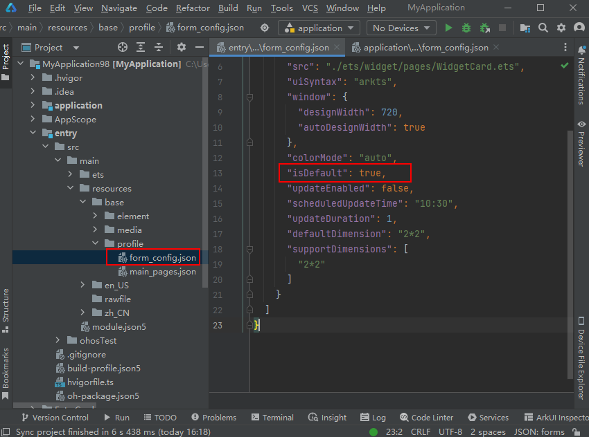
* 对于FA模型元服务，任意module的src/main/config.json文件中有且仅有一个“isDefault”字段为“true”。

  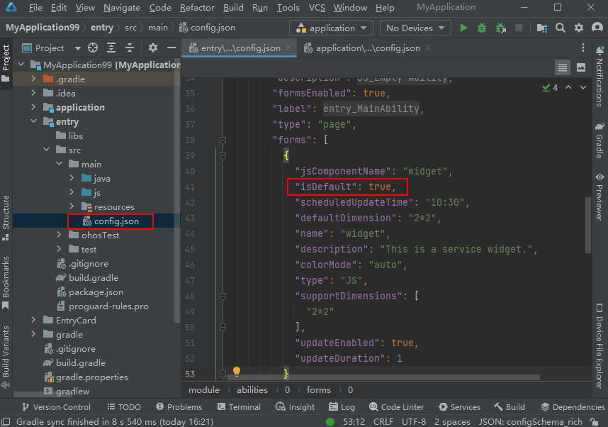
* 如果以上文件中不存在“isDefault”字段，说明未创建默认卡片。在entry上右键选择“New > Service Widget”，补充创建一张默认卡片，具体操作请参见[创建服务卡片](https://developer.huawei.com/consumer/cn/doc/harmonyos-guides/ide-service-widget)。

#### 错误码：6，表示：软件包无效，缺少预加载模块

出现此错误，原因是软件包缺少预加载模块。请参考[预加载](https://developer.huawei.com/consumer/cn/doc/atomic-guides/atomic-preparing-for-loading)添加预加载模块后重新打包上传。

#### 错误码：7，表示：软件包无效，单模块超过2MB限制

Stage模型元服务软件包需满足如下要求：

* 一个APP包中任意类型的单个包大小都不超过2MB。
* 单个包加上其采用dependency方式依赖的[动态共享包（Harmony Shared Package, HSP）](https://developer.huawei.com/consumer/cn/doc/harmonyos-guides/ide-hsp)，总大小不超过2MB。

  

  **若一个HSP包同时被entry包和分包依赖，则该HSP包仅计入entry包大小，不再重复计入分包大小。**例如，元服务包含entry包和分包1，entry包依赖HSP包1和HSP包2，而分包1依赖HSP包1和HSP包3，则：entry包大小 = entry包本身 + 依赖的HSP包1 + 依赖的HSP包2；分包1大小 = 分包1本身 + 依赖的HSP包3。

请检查您的软件包是否符合上述要求。如不符合，请精简软件包，删除无效资源后重新打包上传。

#### 错误码：8，表示：软件包整体超过10MB限制

请检查您的软件包是否符合如下要求：

* FA模型元服务：单个HAP包不得超过10MB。
* Stage模型元服务：同一设备类型下所有包大小总和不得超过10MB。

如不符合要求，请精简软件包，删除无效资源后重新打包上传。

#### 错误码：9，表示：软件包无效，缺少依赖的包

出现此错误，原因是元服务配置了包依赖，但是AGC找不到依赖的包。请添加依赖包后再重新打包上传。

#### 错误码：10，表示：当前元服务为FA模型，该模型的同一设备类型不能有非entry模块

对于FA模型的元服务，同设备类型下仅允许有一个entry包。请删除非entry的module后重新打包。

#### 错误码：11，表示：当前元服务一个设备下有多个entry包，而上限是一个

元服务同一设备类型下仅允许有一个entry包，请删除多余的entry包后重新打包。

#### 错误码：12，表示：设备类型default和phone不能同时存在

出现此错误，表示软件包有模块将“module.json5”文件内“deviceTypes”字段同时配置为“default”和“phone”。AGC不允许值“default”和“phone”同时存在，请删除“default”后重新打包上传。

#### 错误码：13，表示：软件包中卡片与快照不符合要求

对于API 11及以上的元服务，如软件包中含有卡片，则必须包含与卡片对应的等尺寸快照，且卡片与快照数量比例为1:1。例如，软件包中含有3张尺寸分别为1\*2、2\*2、2\*4的卡片，那么必须同时提供3张尺寸分别为1\*2、2\*2、2\*4的快照。

出现此错误，表示软件包中卡片与快照不符合上述要求，请前往存放快照的EntryCard目录修改后重新打包上传。关于创建元服务卡片的更多信息，请参见[新建元服务卡片](https://developer.huawei.com/consumer/cn/doc/atomic-guides/atomic-service-create-page)。

#### 错误码：991，表示：非法软件包

出现此错误，可能是软件包未签名，请检查编译环境，确认是否使用了签名文件。或者是否有进行拆包再手动打包，导致未正确签名。

#### 错误码：992，表示：软件包中解析出来的包名与创建应用时包名不一致，或内部不同hap包名不一致

出现此错误，说明您的应用软件包可能存在以下错误。请按以下方法排查原因，修改后进行重试。

* 软件包中的包名与传包的AGC应用包名不一致。
  + Stage模型：查看软件包工程AppScope/app.json5文件中“bundleName”值是否与AGC应用信息中的“包名”值不一致。

    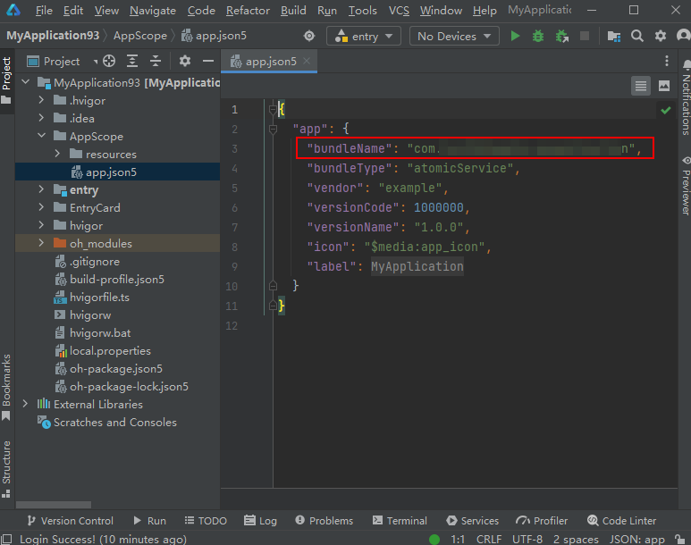

    
  + FA模型：查看软件包工程下是否有HAP包的src/main/config.json文件的“bundleName”值与AGC应用信息中的“包名”值不一致。

    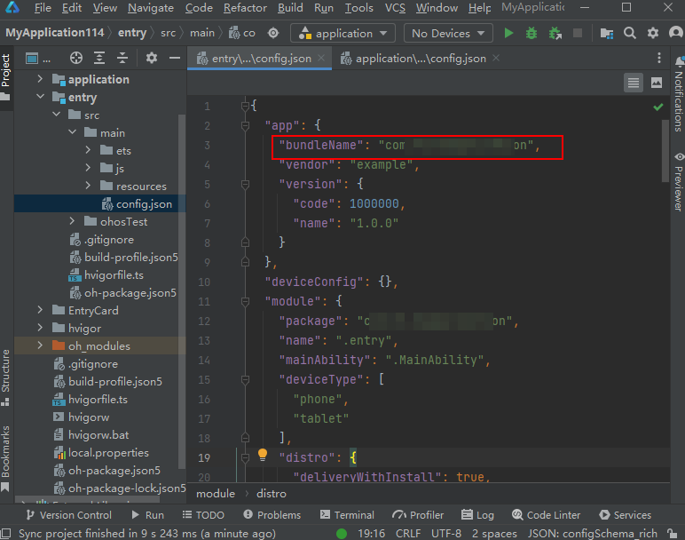

    
* 软件包中内不同HAP包名不一致。**只有FA模型工程可能存在该问题。**

  查看每个HAP包的src/main/config.json文件中“bundleName”值是否一致。

  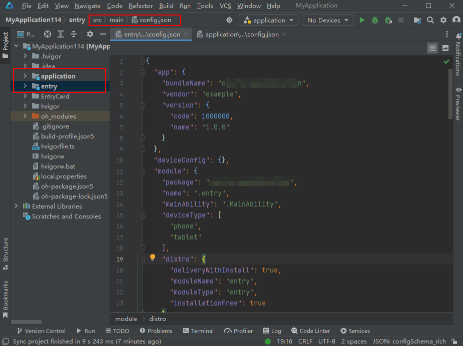

#### 错误码：993，表示：Profile文件非法

出现此错误，原因可能有以下几种。

* 原因一：软件包使用的Profile已被删除，即“证书、APP ID和Profile > Profile”页面没有对应应用的Profile。您需要[重新申请发布Profile](https://developer.huawei.com/consumer/cn/doc/app/agc-help-release-profile-0000002248341090)，然后重新打包上传。

  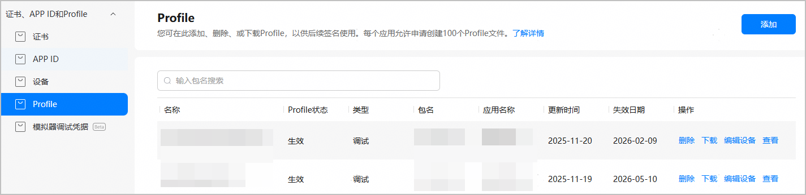
* 原因二：软件包中使用的发布Profile文件并非当前待发布应用的，常见的错误是下载、使用了其他应用的Profile文件。

  例如：下载了“HarmonyA”应用的Profile文件，却将此Profile文件打入“HarmonyB”应用包中。那么在发布“HarmonyB”应用时，上传软件包就会出现此错误。

* 原因三：软件包使用的Profile已失效。
  1. 在“证书、APP ID和Profile > Profile”页面找到您的应用Profile，查看Profile状态列是否显示“失效”。

     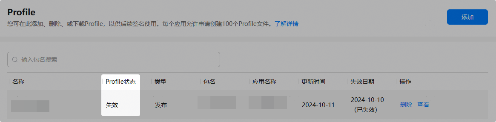
  2. 如显示“失效”，请点击“操作”列“查看”按钮，查看Profile归属的证书状态。
     + 如果“归属证书状态”栏显示“已删除”，表示证书文件已被删除，导致Profile同步失效。请删除当前失效Profile，申请[新的发布证书](https://developer.huawei.com/consumer/cn/doc/app/agc-help-release-cert-0000002283336729)和[新的发布Profile](https://developer.huawei.com/consumer/cn/doc/app/agc-help-release-profile-0000002248341090)，然后重新打包上传。

       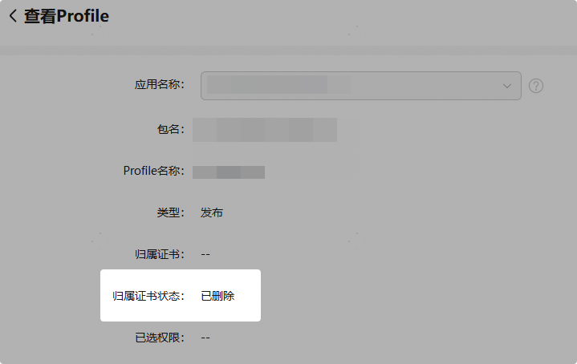
     + 如果“归属证书状态”栏显示“失效”，表示证书文件已失效，导致Profile同步失效。请分别删除已失效的证书和Profile，申请[新的发布证书](https://developer.huawei.com/consumer/cn/doc/app/agc-help-release-cert-0000002283336729)和[新的发布Profile](https://developer.huawei.com/consumer/cn/doc/app/agc-help-release-profile-0000002248341090)，然后重新打包上传。

       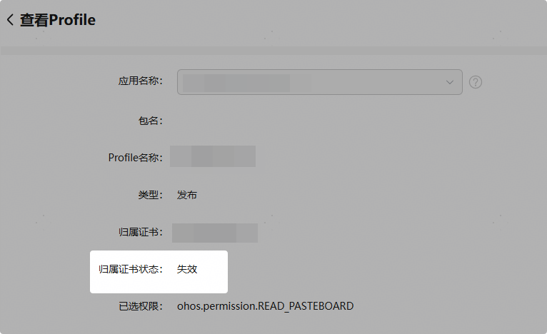
* 原因四：软件包使用的是自动签名，请使用[发布Profile](https://developer.huawei.com/consumer/cn/doc/app/agc-help-release-profile-0000002248341090)进行[手动签名](https://developer.huawei.com/consumer/cn/doc/harmonyos-guides/ide-publish-app#section280162182818)。

#### 错误码：994，表示：软件包不存在

出现此错误，原因是包解析过程中系统下载包出现异常，请稍后重试。如问题仍未解决，请通过[提交工单](https://developer.huawei.com/consumer/cn/support/feedback/#/add/89?level2=101594901521145579)的方式联系华为技术支持解决。

#### 错误码：995，表示：您所上传的软件包不是HarmonyOS应用后缀.app

出现此错误，说明您上传了错误类型的软件包。HarmonyOS应用或元服务软件包后缀为“.app”，请重新打包上传。

#### 错误码：996，表示：未知异常导致软件包解析失败

出现此错误，原因是未知异常导致软件包解析失败，请稍后重试。如问题仍未解决，请通过[提交工单](https://developer.huawei.com/consumer/cn/support/feedback/#/add/89?level2=101594901521145579)的方式联系华为技术支持解决。

#### 错误码：997，表示：包名与应用不匹配

出现此错误，说明您的软件包中的包名与传包的AGC应用包名不一致。请按以下方法排查原因，修改后进行重试。

* Stage模型：查看软件包工程AppScope/app.json5文件中“bundleName”值是否与AGC应用信息中的“包名”值不一致。

  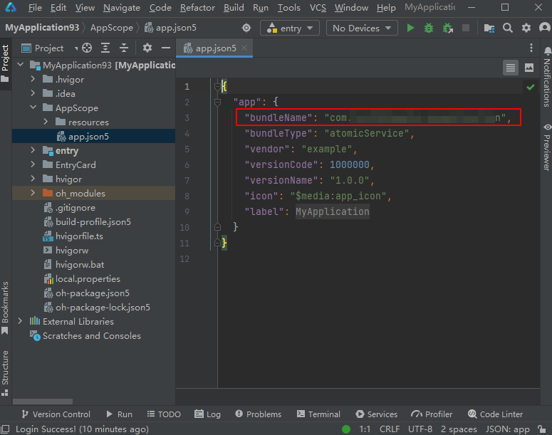

  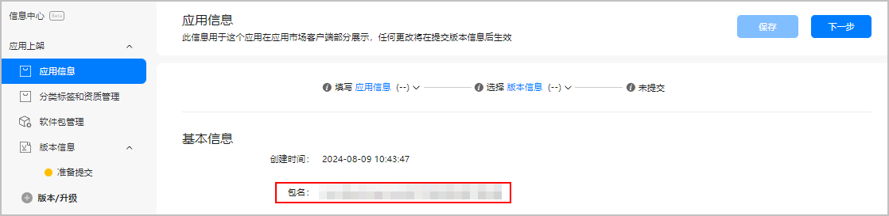
* FA模型：查看软件包工程下是否有HAP包的src/main/config.json文件的“bundleName”值与AGC应用信息中的“包名”值不一致。

  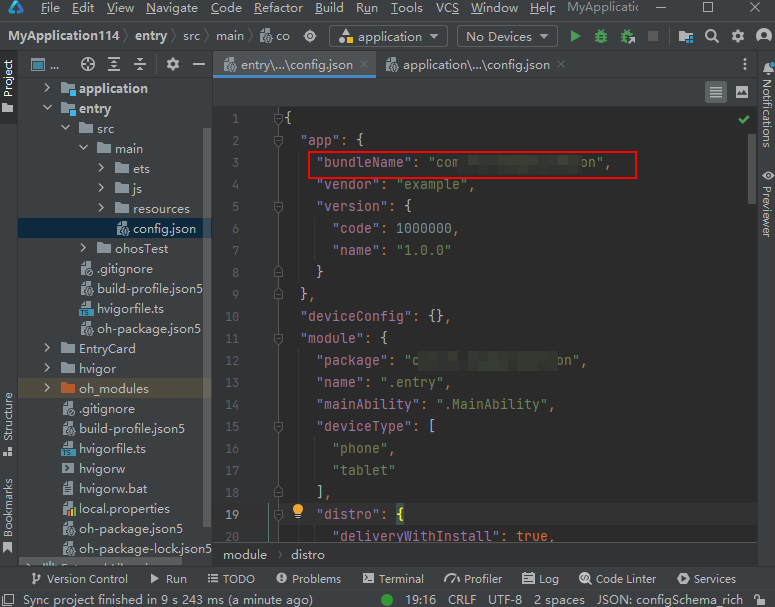

  

#### 错误码：998，表示：您所上传的软件包不支持所选设备

出现此错误，说明您上传的软件包不支持AGC上应用所选的分发设备。请修改软件包配置的设备类型，或修改AGC上应用信息页所选的分发设备。

#### 错误码：999，表示：您上传的HarmonyOS应用软件包使用的Profile类型错误

出现此错误，可能您的软件包使用的是调试证书和调试Profile，正式上架应用市场时，需使用[发布证书](https://developer.huawei.com/consumer/cn/doc/app/agc-help-release-cert-0000002283336729)和[发布Profile](https://developer.huawei.com/consumer/cn/doc/app/agc-help-release-profile-0000002248341090)。请更换正确的证书和Profile后重新上传。

#### 错误码：1000，表示：您上传的HarmonyOS应用软件包使用的Profile文件已过期

出现此错误，说明您在AGC申请的发布Profile已过期。您需要在申请新的Profile后，重新编译软件包。

1. 登录[AppGallery Connect](https://developer.huawei.com/consumer/cn/service/josp/agc/index.html)，选择**“**证书、APP ID和Profile**”**。
2. 在左侧导航栏选择“证书、APP ID和Profile > Profile”，进入“Profile”页面。
3. 找到您应用下已过期的发布Profile，点击“删除”。

   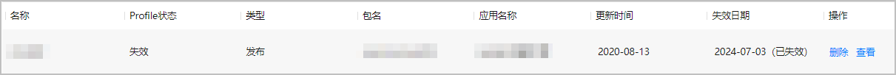
4. 申请[新的发布Profile](https://developer.huawei.com/consumer/cn/doc/app/agc-help-release-profile-0000002248341090)。
5. 在DevEco Studio中[配置新的签名信息](https://developer.huawei.com/consumer/cn/doc/harmonyos-guides/ide-publish-app#section280162182818)，编译新的应用包。
6. 在AGC上传新的软件包。

#### 错误码：1001，表示：您上传的HarmonyOS应用软件包使用的Profile和证书不匹配

HarmonyOS应用软件包中的发布证书与发布Profile文件中的发布证书不匹配。请排查确认DevEco Studio打包时上传的发布证书是否与您申请发布Profile所使用的发布证书一致。

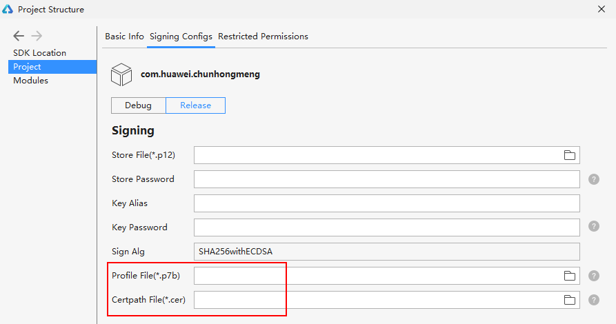

#### 错误码：1002，表示：您上传的HarmonyOS应用软件包使用的证书文件已过期

出现此错误，说明您在AGC申请的发布证书已过期。您需要在申请新的证书和Profile后，重新编译软件包。

1. 登录[AppGallery Connect](https://developer.huawei.com/consumer/cn/service/josp/agc/index.html)，选择“证书、APP ID和Profile”。
2. 在左侧导航栏选择“证书、APP ID和Profile > 证书”，选择已过期的证书，点击“废除”。

   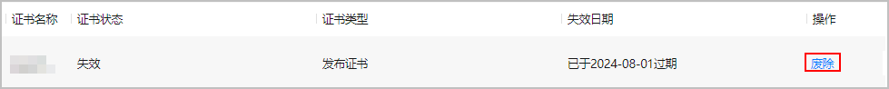
3. 申请[新的发布证书](https://developer.huawei.com/consumer/cn/doc/app/agc-help-release-cert-0000002283336729)和[新的发布Profile](https://developer.huawei.com/consumer/cn/doc/app/agc-help-release-profile-0000002248341090)。
4. 在DevEco Studio中[配置新的签名信息](https://developer.huawei.com/consumer/cn/doc/harmonyos-guides/ide-publish-app#section280162182818)，编译新的应用包。
5. 在AGC上传新的软件包。

#### 错误码：1003，表示：您上传的HarmonyOS应用软件包使用的证书文件未生效

出现此错误，说明软件包使用的证书文件尚未生效。请检查当前时间是否在证书生效期内。

1. 登录[AppGallery Connect](https://developer.huawei.com/consumer/cn/service/josp/agc/index.html)，选择“证书、APP ID和Profile”。
2. 在左侧导航栏选择“证书、APP ID和Profile > 证书”，下载您当前使用的证书。

   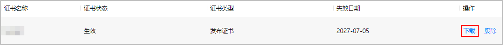
3. 打开证书，查看证书有效期。

   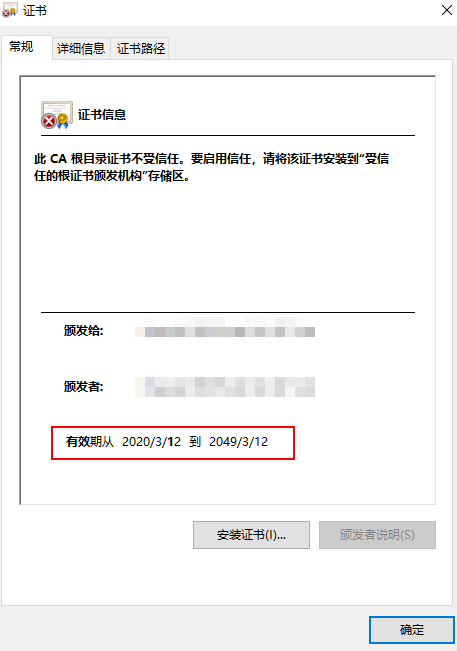

#### 错误码：1004，表示：此包名的应用已经创建

出现此错误，说明您提交的软件包内置包名已被其他应用使用，请更换新的包名。如果发现有人侵权盗版，请通过[提交工单](https://developer.huawei.com/consumer/cn/support/feedback/#/)或[互动中心](https://developer.huawei.com/consumer/cn/service/josp/agc/index.html#/interactive)提起申诉。API level 10以下的应用还可通过[申请应用认领](https://developer.huawei.com/consumer/cn/doc/distribution/app/agc-help-app-claiming-0000001146518767)来获取该应用的归属权。

#### 错误码：1005，表示：证书文件非法

出现此错误，可能有如下原因：

* 原因一：软件包使用的证书文件已被删除。

  请在“证书、APP ID和Profile > Profile”页面找到您的应用Profile，点击“操作”列“查看”按钮查看Profile归属的证书状态。如果“归属证书状态”栏显示“已删除”，表示证书文件已被删除，Profile也同步失效。

  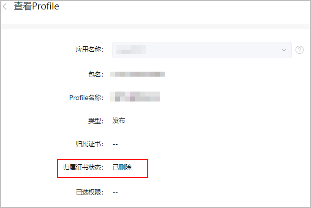

  请删除当前失效的Profile后，申请[新的发布证书](https://developer.huawei.com/consumer/cn/doc/app/agc-help-release-cert-0000002283336729)和[新的发布Profile](https://developer.huawei.com/consumer/cn/doc/app/agc-help-release-profile-0000002248341090)，然后重新打包上传。
* 原因二：软件包使用的证书文件已被吊销。
  1. 在“证书、APP ID和Profile > Profile”页面找到您的应用Profile，查看Profile状态列是否显示“已吊销”。如显示“已吊销”，请点击“操作”列“查看”按钮查看并记住Profile关联的证书名称。

     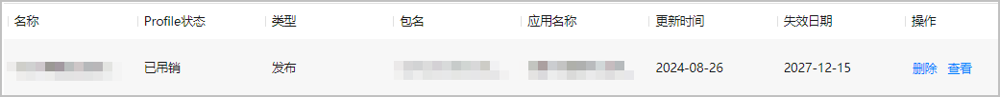
  2. 前往“证书、APP ID和Profile > 证书”页面，找到Profile关联的证书，查看“证书状态”列。如显示“已吊销”，表示证书文件被吊销导致Profile被同步吊销。

     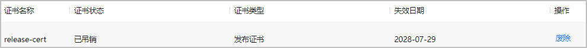
  3. 分别删除当前已吊销的证书和Profile，申请[新的发布证书](https://developer.huawei.com/consumer/cn/doc/app/agc-help-release-cert-0000002283336729)和[新的发布Profile](https://developer.huawei.com/consumer/cn/doc/app/agc-help-release-profile-0000002248341090)，然后重新打包上传。

#### 错误码：1006，表示：HAP包过大

出现此错误，说明软件包内有HAP包大小不符合如下规范。请按规范修改软件包后重新打包上传。

* 不同设备类型的HAP包大小限制：手机、平板、PC/2in1设备不能超过4GB，智能手表、智慧屏不能超过2GB，运动手表不能超过20MB。
* 对于支持单设备的HarmonyOS应用软件包，HAP包大小不能超过对应设备类型的上限。例如，HarmonyOS应用软件包仅支持运动手表，则HAP包不能超过20MB。
* 对于支持多设备的HarmonyOS应用软件包，如果APP包中的单个HAP包支持单个设备，则HAP包大小不能超过对应设备类型的上限。如果APP包中的单个HAP包支持多个设备，则HAP包大小不能超过这多个设备类型上限的最小值。

#### 错误码：1007，表示：提交的HarmonyOS应用版本号没有大于或者等于软件包中shell.apk的版本号

HarmonyOS应用（混合型）的HarmonyOS包版本号不得低于包中的shell.apk版本号，否则软件包将上传失败。请按要求修改后重新打包上传。

#### 错误码：1008，表示：关联Android应用有误

出现此错误，说明软件包中绑定的Android应用appid和AGC上申请Profile时绑定的Android应用appid不一致。请修改一致后重新打包上传。

#### 错误码：1009，表示：元服务绑定的Android应用的appId和packageName二者缺一

在独立元服务关联Android应用的场景下，元服务绑定的Android应用的appId和packageName必须同时存在。请按要求修改后重新打包上传。

#### 错误码：1010，表示：当前软件包非元服务软件包

出现此错误，说明您上传了错误类型的软件包。元服务必须上传元服务的软件包，不可上传HarmonyOS应用的包。

请您按如下方法进行排查：

* SDK为API9以下的软件包：查看每个module下的src/main/config.json文件中“installationFree”字段值是否均为“true”。

  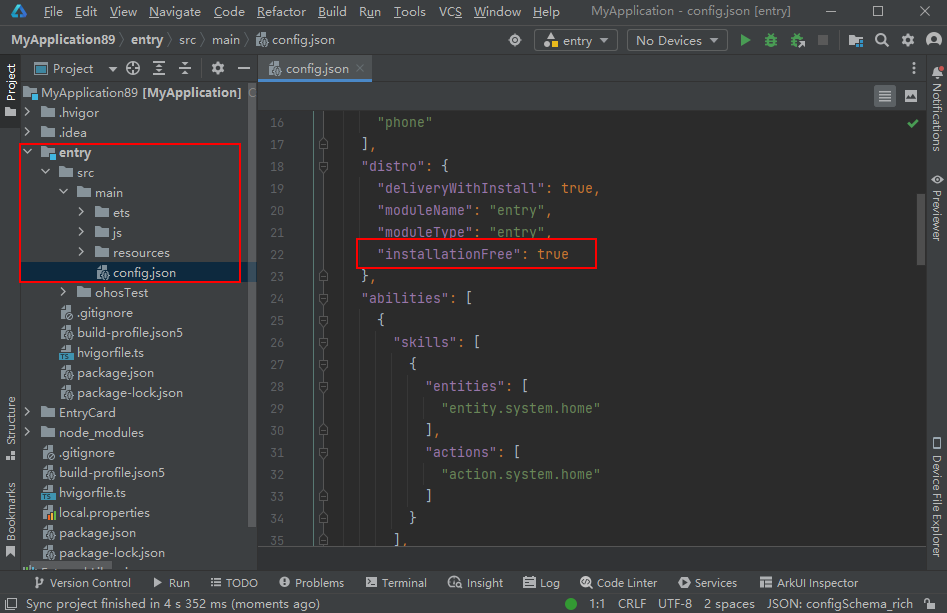
* SDK为API9及以上的软件包：
  + FA模型：查看每个module下的src/main/config.json文件中“installationFree”字段值是否均为“true”。

    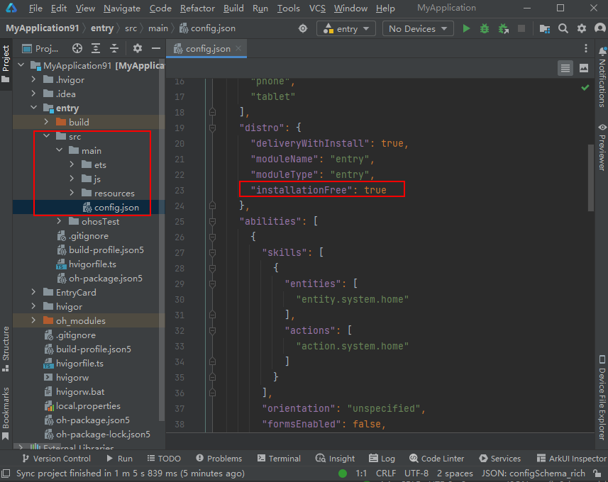
  + Stage模型：查看AppScope/app.json5文件中“bundleType”字段值是否为“atomicService”（无“bundleType”字段则默认为“app”类型）。

    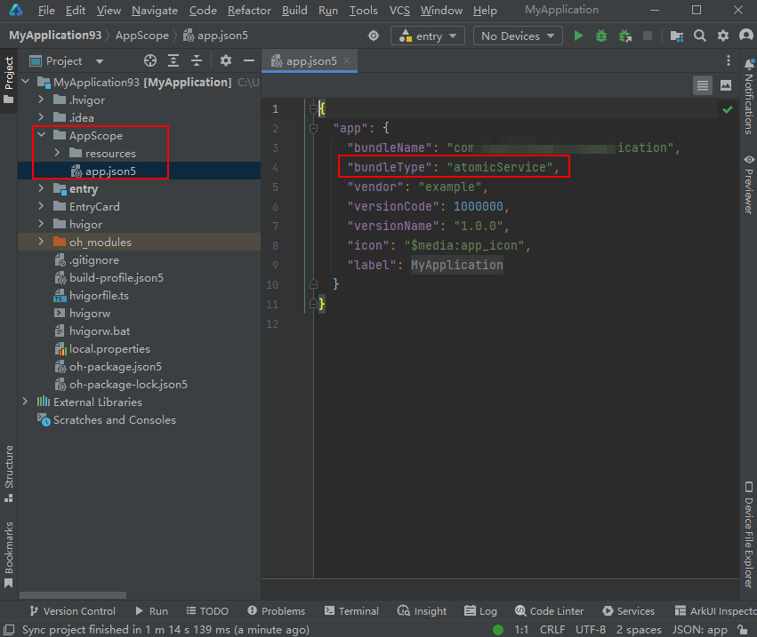

#### 错误码：1011，表示：当前软件包非HarmonyOS应用软件包

出现此错误，说明您上传了错误类型的软件包。HarmonyOS应用必须上传HarmonyOS应用的软件包，不可上传元服务的包。

请您按如下方法进行排查：

* SDK为API9以下的软件包：查看每个module下的src/main/config.json文件中“installationFree”字段值是否均为“false”。

  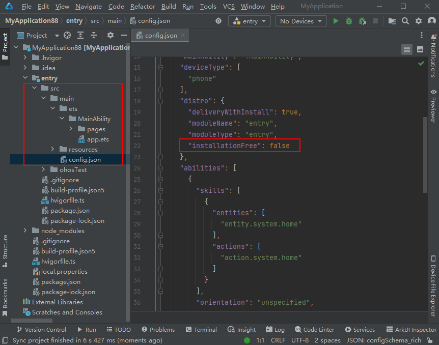
* SDK为API9及以上的软件包：
  + FA模型：查看每个module下的src/main/config.json文件中“installationFree”字段值是否均为“false”。

    
  + Stage模型：查看AppScope/app.json5文件中“bundleType”字段值是否为“app”（无“bundleType”字段则默认为“app”类型）。

    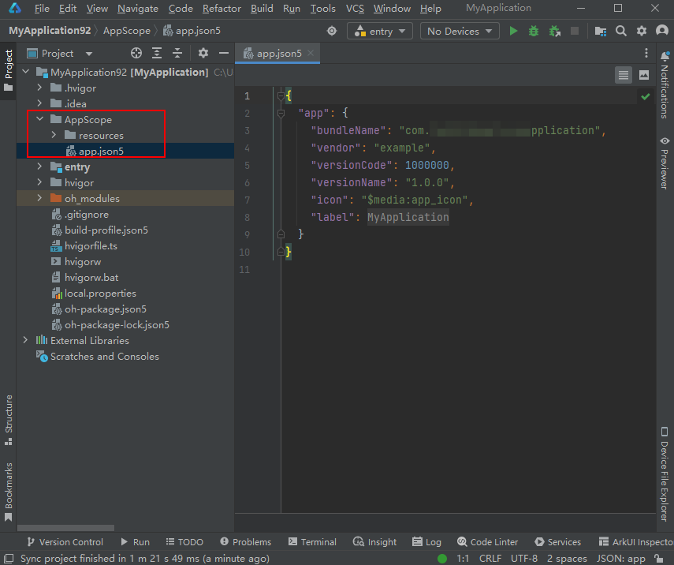

#### 错误码：1012，表示：软件包内HAP包类型不一致

出现此错误，可能是您的软件包内HAP包类型不一致。

一个软件包内的所有HAP包类型必须保持一致：全部为免安装类型（即元服务），或者全部为非免安装类型（即HarmonyOS应用）。

请您按如下方法进行排查：

* SDK为API9以下软件包：查看每个module下的src/main/config.json文件中“installationFree”字段值是否一致。HarmonyOS应用都为“false”，元服务都为“true”。

  
* SDK为API9及以上的软件包
  + FA模型：查看每个module下的src/main/config.json文件中“installationFree”字段值是否一致。HarmonyOS应用都为“false”，元服务都为“true”。

    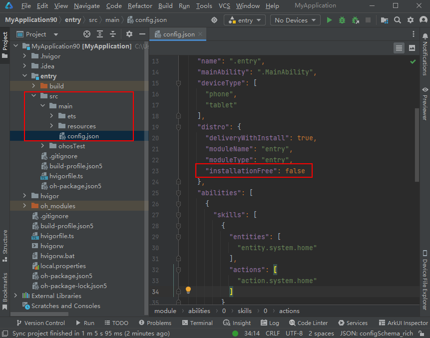
  + Stage模型：应用工程类型取决于AppScope/app.json5文件中“bundleType”字段值（HarmonyOS应用为“app”，元服务为“atomicService”），因此不存在HAP包类型不一致的问题。

    

#### 错误码：1014，表示：HAP包未签名

出现此错误，原因是HAP包未签名，请检查编译环境，确认是否使用了签名文件。

#### 错误码：1015，表示：压缩包格式安全检查失败

出现此错误，原因是压缩包格式未通过安全检查。建议您检查软件包，确认无误后重新上传。如问题仍未解决，请通过[提交工单](https://developer.huawei.com/consumer/cn/support/feedback/#/add/89?level2=101594901521145579)的方式联系华为技术支持解决。

#### 错误码：1016，表示：依赖的共享库包名不存在

出现此错误，原因是软件包依赖的共享库包名不存在。请检查共享库包名。

#### 错误码：1017，表示：依赖的共享库包名不存在

出现此错误，原因是软件包依赖的共享库包名不存在。请检查共享库包名。

#### 错误码：1018，表示：依赖的共享库包名不存在

出现此错误，原因是软件包依赖的共享库包名不存在。请检查共享库包名。

#### 错误码：1019，表示：依赖的共享库版本与当前在架共享库版本不匹配

出现此错误，原因是软件包中配置的共享库应用版本号大于当前在架共享库的版本号。

软件包中配置的共享库应用版本号不得大于当前在架共享库的版本号，请修改后重新打包上传。

#### 错误码：1020，表示：非共享库应用上传了共享库应用包

出现此错误，原因是您在非共享库应用下上传了共享库应用包，请重新上传。

#### 错误码：1021，表示：上传的测试包API级别低于10

出现此错误，原因是当前测试版本发布仅支持API≥10的软件包，请修改后重新打包上传。

如您需要发布API&lt;10的HarmonyOS应用测试版本，可前往“应用上架 > 版本信息 > 开放式测试”路径下，[配置开放式测试版本并发布](https://developer.huawei.com/consumer/cn/doc/AppGallery-connect-Guides/agc-betatest-introduction-0000001071477284)。

#### 错误码：1023，表示：暂不支持软件包的自定义加密配置

出现此错误，原因是使用了暂未开放的自定义加密能力。请检查工程根目录下是否包含“encrypt.json”文件，如有则删除，然后重新打包上传。如还有疑问，请通过[提交工单](https://developer.huawei.com/consumer/cn/support/feedback/#/)的方式联系华为技术支持解决。

#### 错误码：1026，表示：软件包与App类型不一致

出现此错误，原因是当前上传的软件包与填写的App类型不一致。

小游戏要求module.json5文件中“module”字段下metadata的is\_hmos\_minigame需要为true。

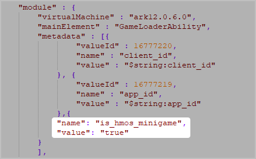

#### 错误码：7011，表示：缺少shell.apk

出现此错误，原因是HarmonyOS应用（混合型）软件包里缺少shell.apk，请修改后重新打包上传。

#### 错误码：7012，表示：shell.apk读取失败

出现此错误，原因是未知异常导致读取HarmonyOS应用（混合型）软件包里的shell.apk失败。请仔细检查软件包，确认无误后重新上传。如问题仍未解决，请通过[提交工单](https://developer.huawei.com/consumer/cn/support/feedback/#/)的方式联系华为技术支持解决。

#### 错误码：7013，表示：shell.apk的权限列表超过上限

出现此表示，原因是HarmonyOS应用（混合型）软件包的shell.apk的权限列表超过了20000行的上限，请修改后重新打包上传。

#### 错误码：7014，表示：软件包内配置的权限与Profile申请的权限不一致

出现此错误，原因是软件包内配置的权限与Profile申请的权限不一致。

请分别查看Profile申请的权限与软件包配置文件中声明的权限，确保Profile中申请的权限包含了软件包中配置的所有权限，即包内权限是Profile申请权限的子集。

#### 错误码：7015，表示：软件包不支持上架

出现此错误，原因是您提交的是包含.sec文件的可信应用（TA）软件包，目前AGC暂不支持发布TA。

#### 错误码：7017，表示：软件包Profile版本不符合要求

对于API9及以上的应用/元服务，AGC将签发新版本Profile文件，已申请的Profile也会自动升级为新版本。使用旧版本Profile的应用/元服务不允许上架。

出现此错误，表示软件包内的Profile版本不符合要求，请前往“证书、APP ID和Profile > Profile”页面重新下载Profile，然后重新打包上传。

#### 错误码：7019，表示：Profile非法

出现此错误，原因是当前共享库软件包内的Profile文件未申请AllowAppShareLibrary权限。请更换正确的Profile文件后重新打包上传。

#### 错误码：7020，表示：软件包内包含非HSP包

应用间共享库软件包内必须全部为HSP包。请修改后重新打包上传。

#### 错误码：7021，表示：系统异常

系统异常，请稍后重试。如问题仍未解决，请通过[提交工单](https://developer.huawei.com/consumer/cn/support/feedback/#/add/89?level2=101594901521145579)的方式联系华为技术支持解决。

#### 错误码：7022，表示：当前软件包不支持上架到应用市场

In-house应用不支持上架到应用市场，请您确认软件包类型无误。如还有疑问，请通过[提交工单](https://developer.huawei.com/consumer/cn/support/feedback/#/)的方式联系华为技术支持解决。

#### 错误码：7023，表示：当前软件包不支持上架到应用市场

企业MDM应用不支持上架到应用市场，请您确认软件包类型无误。如还有疑问，请通过[提交工单](https://developer.huawei.com/consumer/cn/support/feedback/#/)的方式联系华为技术支持解决。

#### 错误码：7024，表示：当前软件包不支持上架到应用市场

企业应用不支持上架到应用市场，请您确认软件包类型无误。如还有疑问，请通过[提交工单](https://developer.huawei.com/consumer/cn/support/feedback/#/)的方式联系华为技术支持解决。

#### 错误码：7025，表示：当前软件包不支持上架到应用市场

出现此错误，原因是使用了指定设备发布Profile打包。指定设备发布Profile专用于指定设备发布，不支持上架到应用市场。如您需要将软件包上架到应用市场，请使用[发布证书](https://developer.huawei.com/consumer/cn/doc/app/agc-help-release-cert-0000002283336729)和[发布Profile](https://developer.huawei.com/consumer/cn/doc/app/agc-help-release-profile-0000002248341090)打包。如还有疑问，请通过[提交工单](https://developer.huawei.com/consumer/cn/support/feedback/#/)的方式联系华为技术支持解决。

#### 错误码：9999，表示：元服务API调用检测失败

出现此错误，原因是元服务API调用检测失败。使用API11及以上开发的元服务，只能调用[“元服务API集”](https://developer.huawei.com/consumer/cn/doc/atomic-references/atomic-apis-intro)内的API。请检查您的元服务包内是否调用了“元服务API集”以外的API，修改后重新打包上传。

#### 错误码：205389875，表示：上传的CSR文件无效

请确认在[生成证书请求文件](https://developer.huawei.com/consumer/cn/doc/harmonyos-guides/ide-command-line-building-app#section6103553181714)时-keyalg参数是否设置为“EC”，如设置错误请重新生成CSR文件后上传。如问题仍未解决，请通过[提交工单](https://developer.huawei.com/consumer/cn/support/feedback/#/)的方式联系华为技术支持解决。

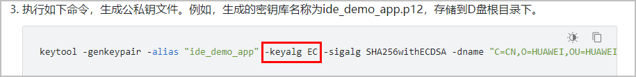
