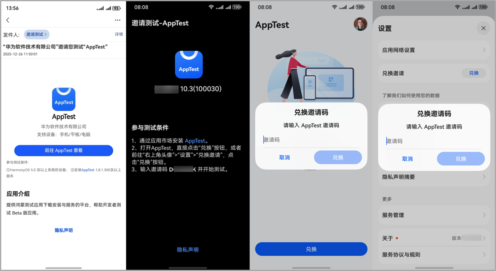
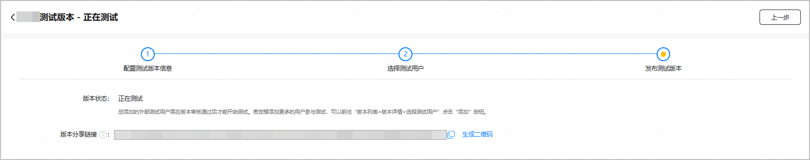
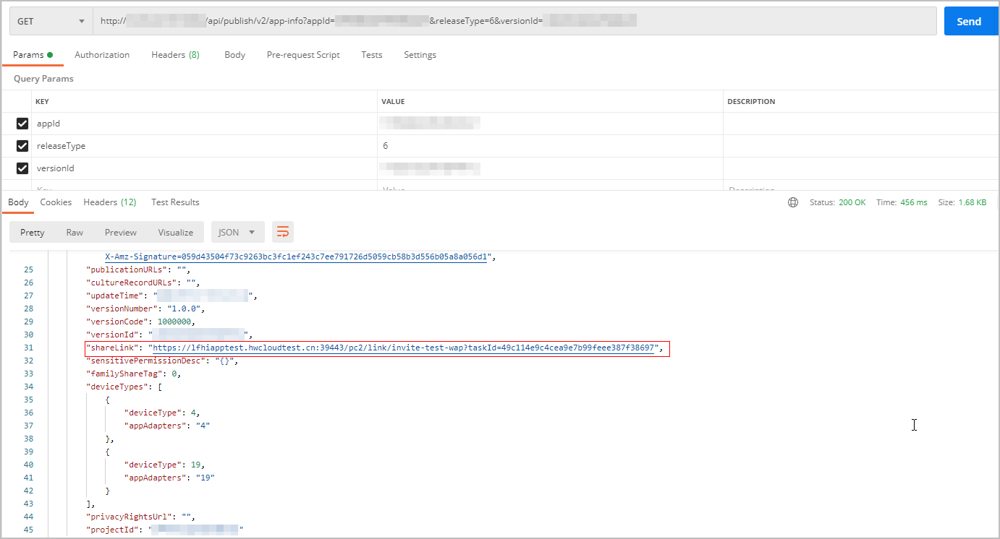
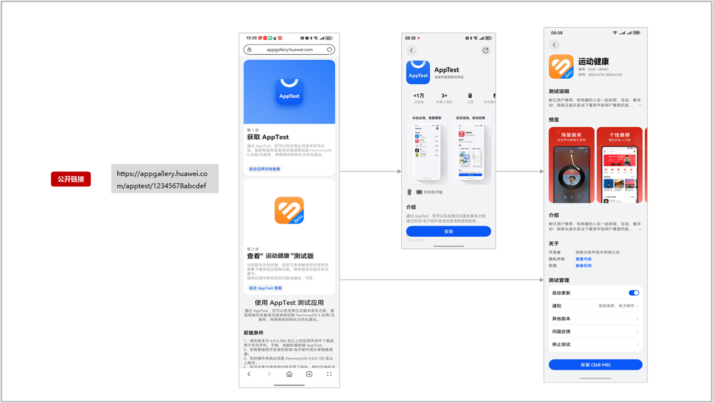
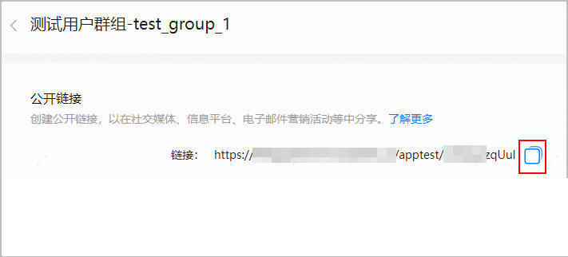

测试版本发布、且到达测试时间后，您便可以邀请用户参与测试。AGC提供了多种邀请方式：

* [通过邮件邀请用户](#section15888113814417)：测试任务开始，被邀请的用户会收到邮件通知，用户获取邮件中的邀请码前往AppTest兑换测试任务。
* [通过“分享链接+邀请码”邀请用户](#section021284361715)：如果没有获取测试用户的华为账号，在审核通过后可以将拼接邀请码的邀请链接分享给用户，点击链接同样可以参与测试。不推荐使用拼接邀请码方式邀请用户，目前公开链接功能已上线，无需拼接邀请码，使用更便捷，更推荐您使用公开链接邀请测试用户。
* [通过公开链接邀请用户](#section11447163533618)：如果没有获取测试用户的华为账号，可以创建群组级公开链接分享给用户，无需拼接邀请码，用户点击链接即可查看测试任务。

  

  AppTest邀请测试功能目前为受限开放，用户无法直接在应用市场搜索AppTest。若未安装AppTest客户端，用户通过以上方式获得测试资格后，可点击对应链接/按钮跳转至应用市场的AppTest详情页下载AppTest客户端。

#### 通过邮件邀请用户

测试任务开始后，AGC会自动给测试版本选定的测试用户发送邮件，用户获取邮件中的邀请码前往AppTest客户端兑换测试任务后，即可参与测试。

**【邮件参与】**

* 点击邮件中的“前往AppTest查看”。
* 进入“参与测试步骤”页面获取邀请码。
* 若未安装AppTest，需要点击页面步骤1中的“AppTest”跳转至应用市场安装AppTest客户端。
* 打开AppTest客户端，点击首页“兑换”按钮或点击右上角头像进入“设置”>“兑换邀请”，输入邀请码兑换测试任务后即可安装测试应用。

首次参与测试，必须先通过邮件通知接受测试任务加入群组，后续才可直接在AppTest客户端查找应用。

如果测试群组在邀请测试任务开始后又添加了新的测试用户，新加入的测试用户不会自动收到邀请测试邮件。您可以通过分享链接邀请已录入测试群组的用户参与测试。

分享链接获取方式如下：

* 在AGC发布测试版本页面获取

  

* 使用[查询应用信息接口](https://developer.huawei.com/consumer/cn/doc/app/agc-help-publish-api-appinfo-query-0000002236041422)获取

  

#### 通过“分享链接+群组邀请码”邀请用户

若选定的测试群组中有“生效中”状态的邀请码，则可以将测试版本分享链接拼接邀请码后，提供给用户。此方式无需提前收集用户的华为账号，但仅限于分享给您非常信任的、不会将邀请码链接外泄的用户群体，否则可能导致邀请范围之外的用户加入您的测试群组。

* 邀请码链接中的是群组级邀请码，用户通过邮件收到的是个人邀请码，个人邀请码无法直接拼接分享链接使用。
* 公开链接功能已上线，无需拼接邀请码，使用更便捷，更推荐您使用公开链接邀请测试用户。

链接拼接方式如下：

1. 测试版本提交审核后，复制生成的分享链接，如：https://appgallery.huawei.com/apptest/join/123456
2. 在上述链接的末尾，拼接上?invitationCode=*邀请码*
3. 获取拼接后的完整链接：https://appgallery.huawei.com/apptest/join/123456?invitationCode=*邀请 码*

#### 通过公开链接邀请用户

若创建测试群组时创建了公开链接，且配置测试版本选择测试用户时勾选了该群组，则可以将该群组的公开链接提供给用户。此方式无需提前收集用户的华为账号，亦无需每次单独拼接邀请码，使用更方便。

用户通过公开链接参与测试的方式如下：

1. 开发者在AGC添加测试用户页面获取公开链接，提供给用户。请注意，任何人都可以分享此链接。因此，未经您直接邀请的用户也可能会加入您的测试群组。

   
2. 用户使用系统浏览器打开分享链接，基于AppTest安装情况，进行测试。
   * 已安装AppTest：用户可以直接点击“前往AppTest查看”，进入测试应用详情页接受并安装。
   * 未安装AppTest：点击“前往应用市场查看”，进入华为应用市场的AppTest应用详情页，先下载AppTest，安装AppTest后即可下载测试应用。
