#### 版本号规范

* 测试版本的VersionCode必须高于发布过的全网版本的VersionCode。
* 测试版本的VersionCode不能低于发布过的测试版本的VersionCode。
* 不允许两个在架测试版本的VersionName、VersionCode和构建版本完全一致。

  

  若用户已安装测试版本，支持直接安装更低VersionCode的测试版本与正式版本，无需卸载高版本后重新安装，应用数据亦不会被清除。因此，请您确保用户在降级安装时，不同版本数据相互兼容。

#### 发布测试版本

您可创建并发布测试版本，并选择您要分发的测试群组。邀请测试最多允许100个版本同时在架，邀请测试和公开测试的总计版本数量不超过100个。

1. 在左侧导航栏选择“应用测试/元服务测试 > 版本列表”，进入“版本列表”页面，点击右上角“创建测试版本”。

   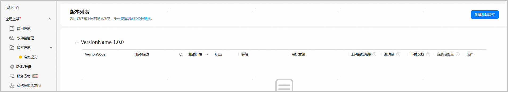
2. 在弹出的“创建测试版本”窗口，选择“邀请测试”，填写“版本描述”，点击“确定”。

   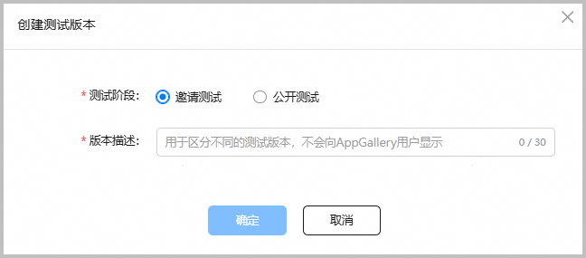

   | 参数 | 说明 |
   | --- | --- |
   | 版本描述 | 自定义测试版本描述，以便于您区分不同的测试版本，不会向AppTest用户展示。不超过30个字符。 |
3. 系统自动进入“版本信息配置”页面，您可以开始配置版本基础信息。

   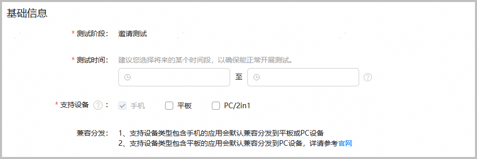

   | 参数 | 说明 |
   | --- | --- |
   | 测试阶段 | 创建版本时选择，不可修改。 |
   | 测试时间 | 邀请测试版本的开始时间和结束时间，只有当前时间到达开始时间时，测试用户才能使用邀请测试版本。测试时间到期后，测试用户将无法使用邀请测试版本。  邀请测试的测试时间当前最大有效期为90天。 |
   | 支持设备 | 默认勾选创建应用时选择的设备类型，支持在此处增加设备类型。  选择“手机”时，即便包里未声明平板或PC设备，测试版本也会默认兼容分发到平板或PC设备。  选择“平板”时，即便包里未声明PC设备，测试版本也会默认兼容分发到PC设备。 |
4. 配置软件版本。

   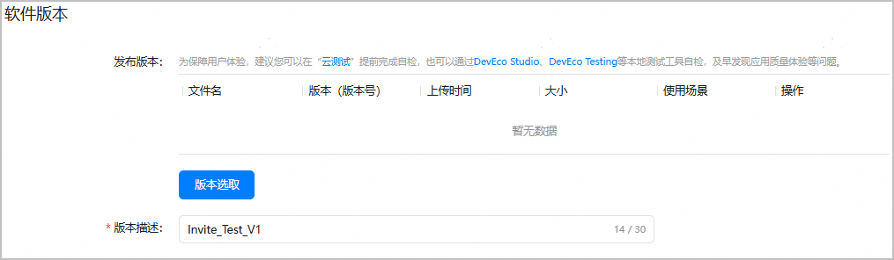

   | 参数 | 说明 |
   | --- | --- |
   | 发布版本 | 点击“版本选取”，选择您之前在“软件包管理”菜单上传的软件包，点击“选取”。一个测试版本只允许选取一个软件包。具体操作可参考[选择待发布软件包](https://developer.huawei.com/consumer/cn/doc/app/agc-help-release-app-choose-pkg-0000002278981434)。 |
   | 版本描述 | 创建测试版本时自定义的版本描述，支持修改。不超过30个字符。 |
5. 配置测试信息。

   测试信息默认继承全网版本信息或最近一个测试版本填写的信息。如需调整，请在当前测试版本提交前重新审视并修改，测试信息配置不影响全网版本的应用信息。

   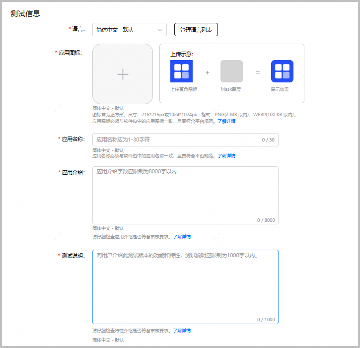

   | 参数 | 说明 |
   | --- | --- |
   | 语言 | 配置语言信息，支持5种语言。 |
   | 应用图标 | 上传应用图标，各设备类型的图标规范请参见[素材规范](https://developer.huawei.com/consumer/cn/doc/app/agc-help-app-visual-asset-spec-0000002277607976)。 |
   | 应用名称 | 创建应用时填写的名称，支持更改。 |
   | 应用介绍 | 简单描述该应用的功能、产品定位等，不超过8000字符。 |
   | 测试说明 | 介绍此测试版本的功能和特性，不超过1000字符。  可在此预留您的联系方式，用于收集用户测试过程中发现的相关问题。 |
6. 配置隐私声明。

   HarmonyOS应用支持选择自定义隐私政策或者使用隐私声明托管服务生成隐私声明，元服务仅支持使用隐私声明托管服务生成隐私声明。
   * 自定义隐私政策

     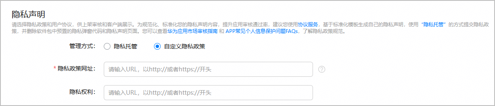

     + 隐私政策网址：该网站将供用户访问，从而了解服务是如何处理敏感的用户数据和设备数据。
     + 隐私权利：提供用户实施其权利的相关网站，例如：删除、修改、导出个人数据的入口。
   * 使用隐私声明托管服务生成隐私声明

     使用隐私声明托管服务，可基于AGC提供的标准化模板生成隐私政策和用户协议。请先点击“协议服务”前往对应菜单生成隐私政策或者用户协议，具体操作可参见[管理隐私声明](https://developer.huawei.com/consumer/cn/doc/app/agc-help-privacy-policy-0000002316794885)。隐私政策或者用户协议生成后，您才可在“隐私政策”或者“用户协议”下拉框中选择到。

     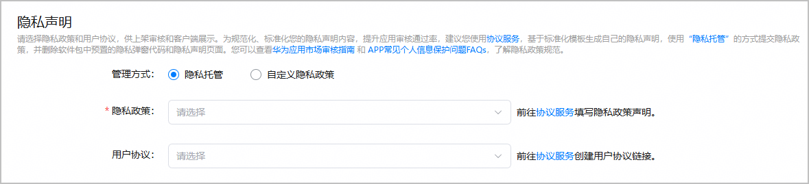
7. 配置是否向测试用户展示当前最新在架版本的应用截图。

   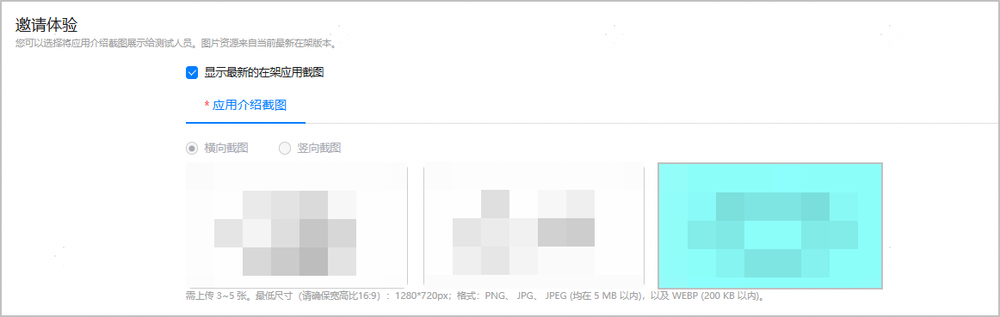
8. 填写联系方式。

   账号归属地为中国大陆地区的开发者，还需预留应用负责人的姓名和联系方式，以便于华为审核人员与您联系沟通。我们将通过电话、邮箱、企业微信等渠道，为您解答应用审核问题、告知上架审核结果、通知应用整改或下架事宜。

   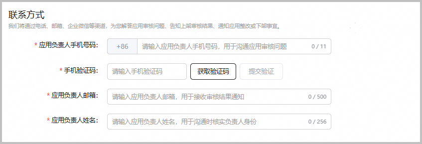
9. 补充应用审核信息。

   如果您的应用需要对用户进行身份验证，请提供测试账号信息，以便华为审核人员可以使用该账号完成相关功能的审核。

   * 需要登录进行审核：如果存在需要登录后才可使用的功能，需要勾选，并提供测试账号和密码。
   * 备注：提供有助于审核人员更准确、高效测试您应用的额外信息，比如在审核时需要的特别设置等。

   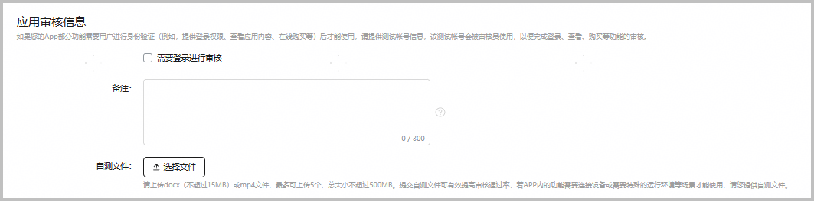
10. 配置是否上架自检信息。

    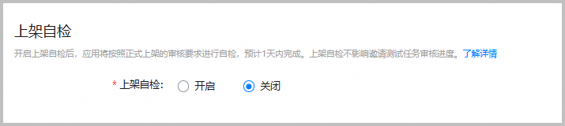

    若您具有自检报告通知功能，可勾选发送自检报告通知，若自检不通过将通过邮件和互动中心向您发送自检报告。

    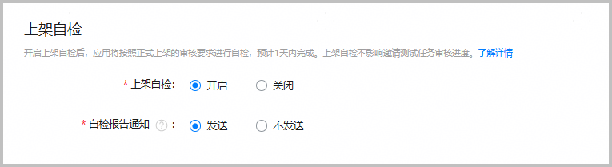

    | 参数 | 说明 |
    | --- | --- |
    | 上架自检 | * 选择“是”，将提交邀请测试并按照正式上架的审核要求自检，上架自检预计1天完成。 * 选择“否”，将仅提交邀请测试审核，不进行上架自检。 * 上架自检不影响您邀请测试的上架结果。 * 一个应用仅支持同时存在一个上架自检中的任务，已存在上架自检任务时，再次创建邀请测试将不会展示上架自检选项。 |
    | 自检报告通知 | 仅自检不通过时有报告。 |
11. “配置测试版本信息”完成，点击右上角“下一步”进入“选择测试用户”步骤。

    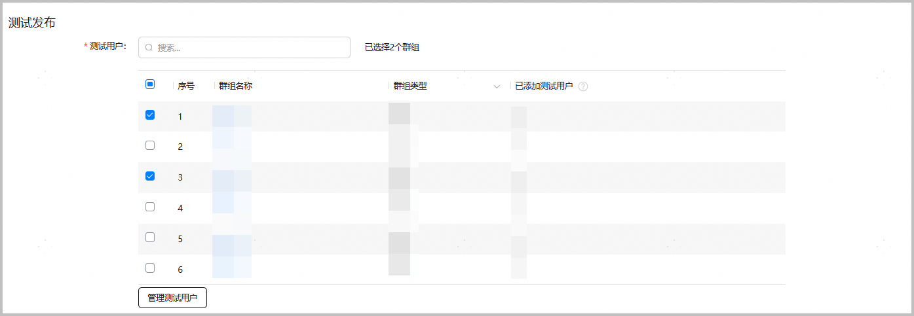

    | 参数 | 说明 |
    | --- | --- |
    | 测试用户 | 选择需要参加邀请测试的测试群组。内部测试群组不超过100个，外部测试群组不超过300个，参与的测试用户不超过10000个。  点击“管理测试用户”，还可快捷前往“测试用户”菜单新增、修改或删除测试群组。 |
12. 选择外部群组，点击“提交审核”进入“发布测试版本”页面。若您为企业开发者，首个构建版本需要经过全面审核，后续的构建版本通常只需经过基本审核。构建版本通过审核后即可开始测试。（目前仅面向部分开发者开放）

    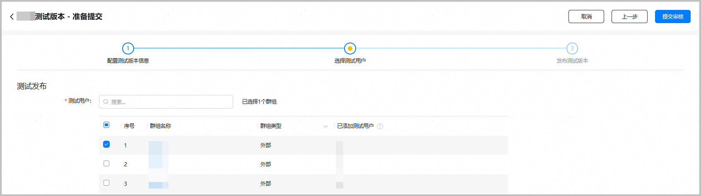

    

    若仅选择了内部群组，点击“保存”进入“发布测试版本”页面。

    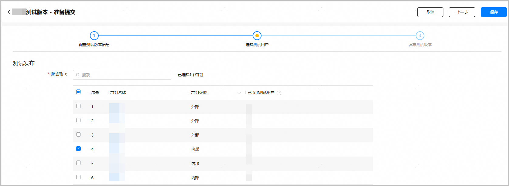

    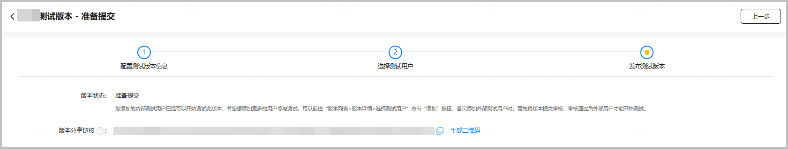

    | 参数 | 说明 |
    | --- | --- |
    | 版本状态 | 显示当前版本状态。 |
    | 版本分享链接 | 测试版本提交审核后，分享链接会显示在此处，该链接可直接打开AppTest客户端的测试应用详情页。您可以通过分享链接邀请已录入测试群组的用户参与测试。测试版本审核通过后，支持通过分享链接拼接邀请码，邀请外部测试用户参与测试。 |
13. 提交成功后，可在“版本列表”页面查看版本审核状态和上架自检结果。

    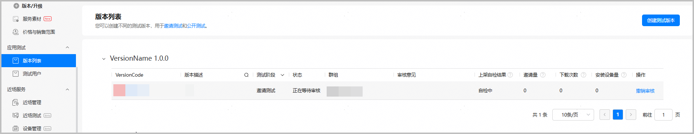

    版本状态共包含以下几种：
    * 正在审核：测试版本提交成功之后的状态。您可以撤销审核，撤销审核后，版本状态变为“准备提交”。
    * 等待生效：审核通过后，还没到测试时间，状态为“等待生效”，下方展示测试时间。您可以手动停止测试，停止测试后，状态变为“已失效”。
    * 正在测试：审核通过后，到达测试时间，状态为“正在测试”，下方展示测试时间。您可以主动停止测试，停止测试后，状态变为“已失效”。
    * 审核不通过：测试版本审核驳回后，状态为“审核不通过”，状态旁会显示审核不通过的原因。
    * 已失效：开发者手动停止测试、复测不通过、或者到达测试截止时间时，状态会变为“已失效”，状态旁会显示已失效的原因。

    上架自检结果共包含以下几种：

    * 自检中
    * 测试完成：自检存在中等问题，可能影响正式上架，建议修改
    * 上架自检不通过：自检存在严重问题，影响正式上架，必须修改
    * 上架自检通过

    当上架自检结果为“测试完成”或“上架自检不通过”时，您可点击“上架报告”按钮，查看详细自检报告。（只提交预审检测的报告按钮为“查看报告”）

    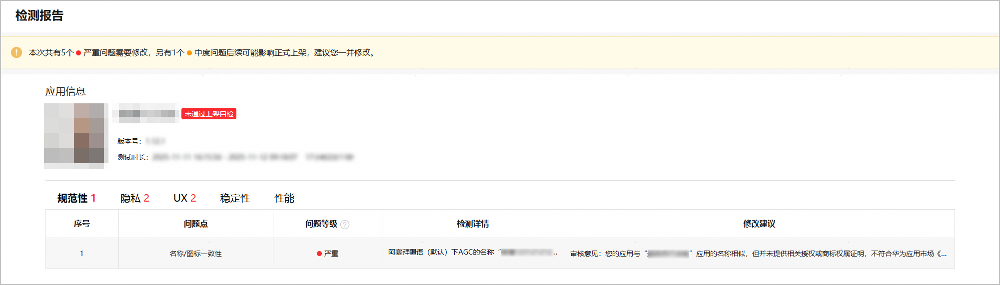

    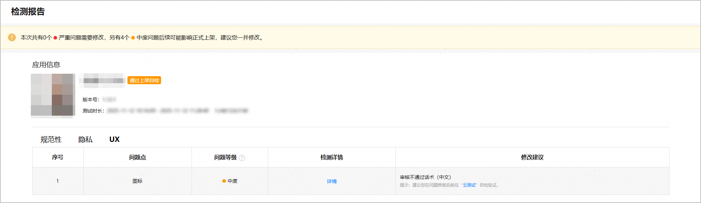

    当创建了多个测试版本时，“版本列表”页面会将各测试版本按VersionName归类展示。

    * 未上传软件包的测试版本全部归类在“VersionName 未知”栏。
    * 上传软件包之后，AGC根据包VersionName将测试版本归类到对应的“VersionName”栏。例如，包VersionName为3.0.0的测试版本展示在“VersionName 3.0.0”栏。
    * 每个“VersionName”栏下展示各个测试版本的VersionCode和构建版本。**不允许两个在架测试版本的VersionName、VersionCode和构建版本完全一致。**

    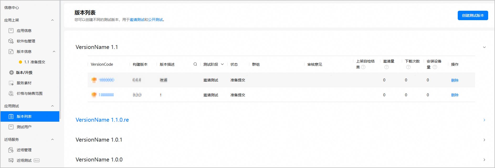

    已失效状态的测试版本可批量删除，勾选需要删除的邀请测试版本后点击“批量删除”。

    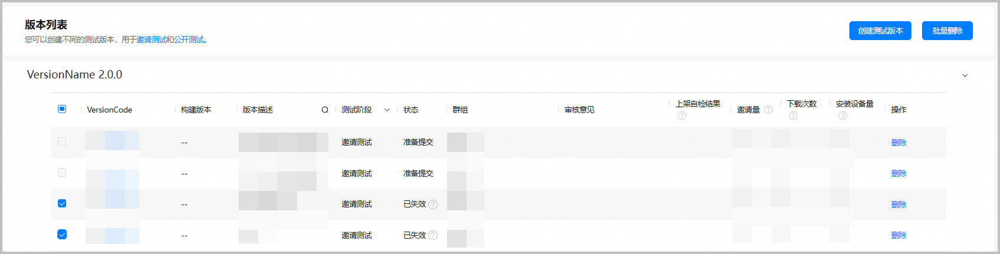

#### （可选）修改测试时间

当您的测试版本的状态为“等待生效”或“正在测试”时，您还可修改测试时间，如提前启动测试，延长测试时间等。

1. 在左侧导航栏选择“应用测试/元服务测试 > 版本列表”，进入“版本列表”页面，点击需要修改测试时间的测试版本。
2. 在“基础信息”栏，点击“测试时间”后的“修改”。

   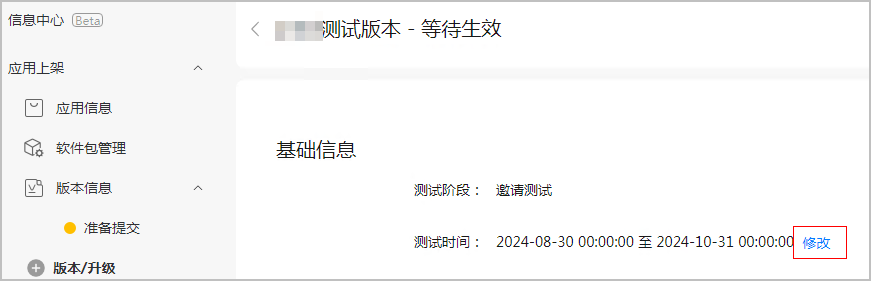
3. 在弹出的“修改测试时间”窗口，选择新的测试开始时间和测试结束时间，点击“保存”。

   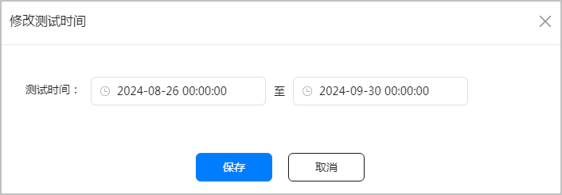

   

   * “正在测试”状态的测试版本不支持修改测试开始时间。
   * 若将“等待生效”状态的测试版本的测试开始时间修改为当前时间之前，点击“保存”后，测试版本的状态会立即变为“正在测试”。

#### （可选）增加测试群组

在左侧导航栏选择“应用测试/元服务测试 > 版本列表”，进入“版本列表”页面，进入对应测试版本“选择测试用户”页，点击添加按钮选择新增群组。

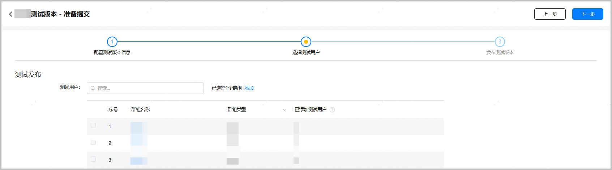

* “审核不通过”和“已失效”状态的测试版本不允许添加测试群组。
* 群组只支持新增，不支持去除。
